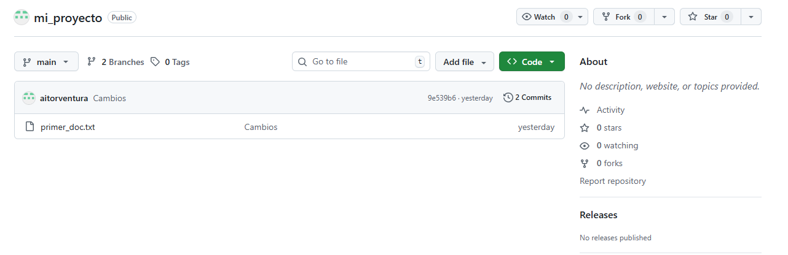
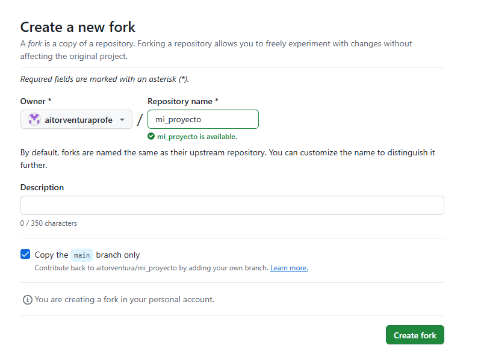
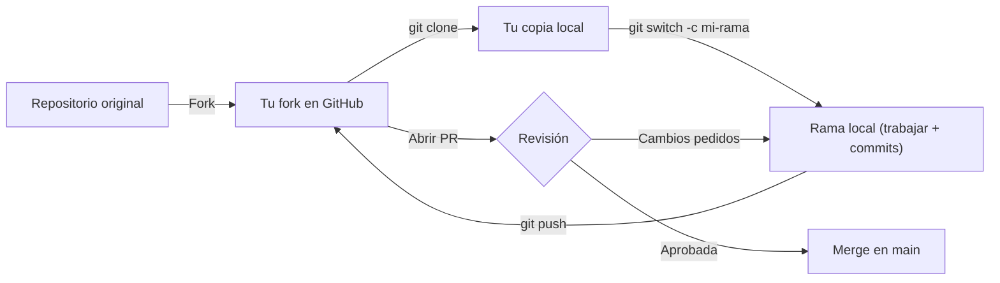
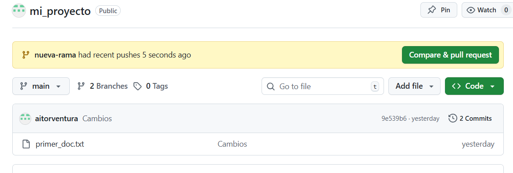
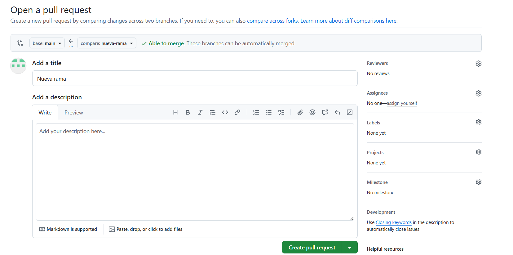
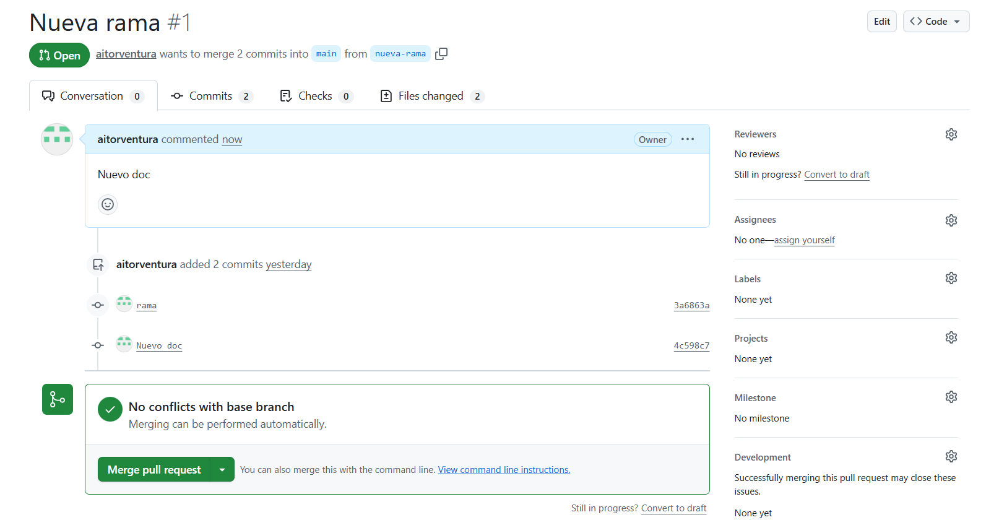
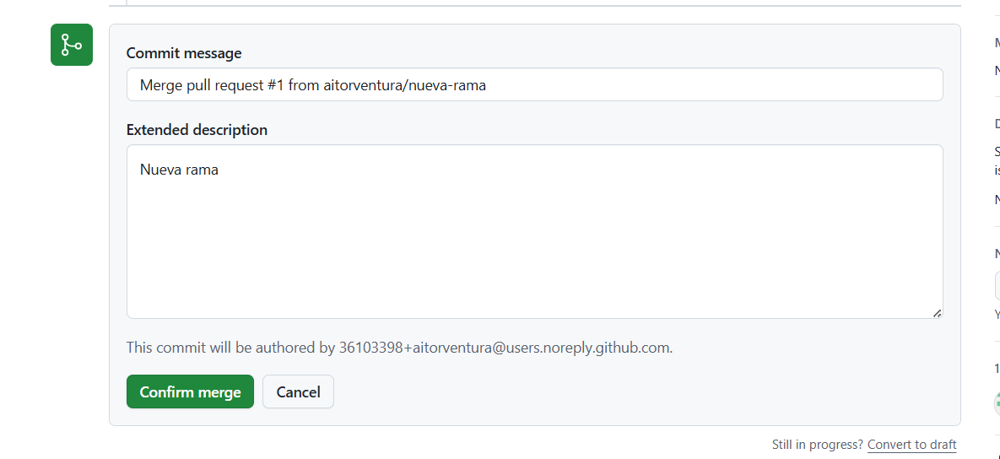
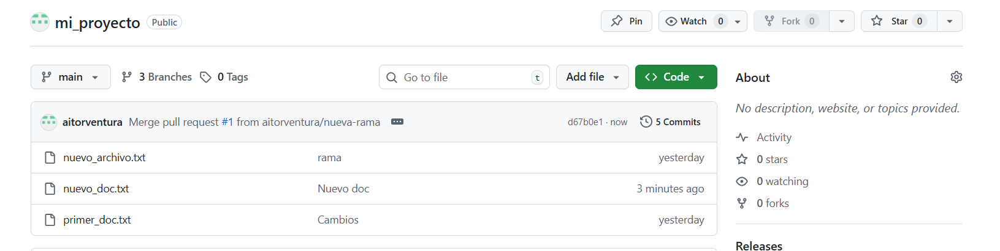

# 🤝 4. Colaboración y Gestión de Proyectos en GitHub

{ type=application/pdf style="width:100%;min-height:80vh" }

!!!info "Descarga de diapositivas"
    [Descarga las diapositivas](diapositivas/colaboracion.pdf){target="_blank" rel="noopener"}

---

Git y GitHub no son solo una herramienta para guardar código: son la base sobre la que se organiza el trabajo en equipo en la mayoría de empresas de software. En este apartado veremos cómo contribuir a proyectos ajenos y cómo gestionar el trabajo dentro de un equipo usando las herramientas que GitHub pone a disposición.

---

## 🍴 Forks (Bifurcaciones)

Un **Fork** es una copia de un repositorio ajeno que GitHub crea dentro de tu propia cuenta. La diferencia respecto a un clon normal es que el fork vive en el servidor, bajo tu usuario, y tú tienes control total sobre él.

El caso típico: encuentras un proyecto en GitHub que te interesa mejorar, pero no eres colaborador del repositorio original y no puedes hacer `push` directamente. La solución es hacer un fork: pulsas el botón "Fork" en la esquina superior derecha y GitHub copia todo el repositorio bajo tu cuenta en cuestión de segundos.

A partir de ahí puedes clonar tu copia, crear ramas, modificar lo que quieras y hacer push sin afectar en absoluto al proyecto original. GitHub mantiene internamente la referencia al repositorio de origen, lo que facilita después proponer tus cambios de vuelta al autor mediante una Pull Request.

!!! tip "¿Fork o clone directo?"
    Clona directamente si ya eres colaborador del repositorio y tienes permisos de escritura. Haz un fork cuando quieras contribuir a un proyecto ajeno donde no tienes permisos: tu fork actúa como puerta de entrada para proponer cambios mediante Pull Request.

**Qué estás viendo en la captura:** el botón Fork en la esquina superior derecha de un repositorio ajeno.

**Qué estás viendo en la captura:** la pantalla de creación del fork, donde se elige bajo qué cuenta o organización se crea la copia.

### Sincronización del Fork

Con el tiempo, el repositorio original seguirá recibiendo commits. Para poner tu fork al día sin tener que hacerlo a mano, GitHub ofrece el botón **Sync fork** en la página principal de tu repositorio bifurcado.

!!! tip "¿Qué es upstream?"
    En el contexto de los forks, **upstream** es el nombre que se le da al repositorio original del que proviene tu fork. Tu copia es `origin`; el proyecto del que la hiciste es `upstream`. Cuando sincronizas el fork, estás trayendo los cambios de `upstream` a tu `origin`.

Si el repositorio original y el tuyo han avanzado por separado, la sincronización puede generar conflictos que tendrás que resolver igual que harías con un `git pull` con cambios divergentes. Por eso conviene sincronizar antes de empezar a trabajar en una nueva funcionalidad, no después.

---

## 📩 Pull Requests (PRs)

Una **Pull Request** es una propuesta formal para integrar los commits de una rama en otra. Le estás diciendo a los responsables del repositorio: "He hecho estos cambios en esta rama; ¿los revisáis y los integráis en `main`?"

Es el mecanismo estándar en la industria tanto para contribuir a proyectos de terceros (desde un fork) como para trabajar en equipo dentro del mismo repositorio (desde una rama propia hacia `main`).

El flujo completo, desde el fork hasta el merge, tiene este aspecto:

### Abrir una Pull Request

Cuando subes una rama nueva con `git push`, GitHub muestra automáticamente un aviso con el botón **"Compare & pull request"**. Al pulsarlo, llegas al formulario de creación de la PR, donde tienes que configurar cuatro selectores:

| Selector | Qué indica | Ejemplo |
|---|---|---|
| **Base repository** | Dónde va a ir el código | `torvalds/linux` |
| **Base** | La rama de destino | `main` |
| **Head repository** | Desde dónde ofreces los cambios | `tu-usuario/linux` |
| **Compare** | La rama con tus commits | `arreglo-bug-red` |

Si la PR es dentro del mismo repositorio (sin fork), base y head son el mismo repositorio y solo cambian las ramas.

Además de los selectores, escribe un **título claro** y una **descripción** que explique qué problema resuelve el cambio y cómo funciona. Eso facilita la revisión y queda como documentación permanente del proyecto.

**Qué estás viendo en la captura:** el aviso que aparece en el repositorio justo después de hacer push de una rama nueva, con el botón para crear la PR directamente.

**Qué estás viendo en la captura:** el formulario de apertura de la Pull Request con los selectores de rama y el campo de descripción.

**Qué estás viendo en la captura:** la PR ya abierta, donde el equipo puede revisar el código línea a línea, comentar y aprobar los cambios.

**Qué estás viendo en la captura:** el botón Merge pull request que activa el administrador una vez el equipo ha dado el visto bueno.

**Qué estás viendo en la captura:** la PR en estado "Merged" (etiqueta morada), confirmando que los cambios han pasado a la rama principal.

!!! info "PR desde el mismo repositorio vs desde un Fork"
    En las capturas anteriores la PR se hace desde una rama propia del mismo repositorio. Si contribuyes desde un fork, los selectores "Base repository" y "Head repository" apuntarán a repositorios distintos: el del autor original y el tuyo respectivamente.

### Enlazar PRs con Issues

En proyectos con muchos colaboradores el trabajo se organiza con **Issues** (veremos su funcionamiento completo en la sección siguiente) — tareas o errores documentados con un número. Si en la descripción de tu PR escribes `Closes #10`, GitHub cierra automáticamente el Issue #10 en el momento en que se aprueba el merge. Esto evita trabajo de gestión manual y deja un historial claro de qué PR resolvió qué problema.

Las palabras que activan el cierre automático son: `Closes`, `Fixes` y `Resolves` (cualquiera de las tres, seguida del número con `#`).

---

## 🎫 Gestión del proyecto: Issues y Projects

Además del código, GitHub ofrece herramientas integradas para organizar el trabajo del equipo.

| | Issues | Projects |
|---|---|---|
| **Para qué sirve** | Registrar tareas, errores o propuestas de mejora | Visualizar y priorizar el trabajo del equipo |
| **Unidad de trabajo** | Un ticket por tarea o bug, con su hilo de conversación | Tablero con columnas (`To Do`, `In Progress`, `Done`) |
| **Integración** | Se cierran automáticamente con palabras clave en PRs | Las tarjetas enlazan a Issues y PRs; se mueven solas al fusionar |
| **Cuándo usarlo** | Siempre que hay algo por hacer o un bug que reportar | Cuando el equipo necesita ver el estado global del proyecto |

Cada Issue puede tener asignados responsables (*Assignees*), etiquetas de colores (*Labels* como `bug`, `enhancement`, `documentation`) y fechas de entrega (*Milestones*).

---

## 📚 Otras herramientas del repositorio

**Wiki** — Espacio de documentación con estructura de páginas. Ideal para manuales de uso, guías para nuevos colaboradores o FAQs. Mantiene el `README.md` limpio y navegable.

**Actions** — Permite automatizar tareas que se ejecutan en respuesta a eventos del repositorio: pasar tests cuando alguien abre una PR, desplegar la aplicación cuando se fusiona en `main`, generar documentación automáticamente... Lo veremos con detalle en la [sección siguiente](github-actions.md).

---

## 🔒 Protecciones de ramas

Cuando varias personas hacen PRs hacia `main`, conviene blindar esa rama para evitar que alguien suba código directamente sin revisión. En **Settings → Rules** los administradores pueden exigir que:

- Todo el código entre por PR, bloqueando el `push` directo a `main`.
- Al menos un compañero haya revisado y aprobado el código antes del merge.
- Los tests automatizados pasen antes de que el botón de merge se active.

Esto no es burocracia: es lo que impide que un error de un miembro del equipo rompa el proyecto para todos los demás.

---

## ✅ Ideas clave

!!! tip "Resumen"
    - **Fork**: copia de un repositorio ajeno bajo tu cuenta. Tú tienes control total; el original no se toca.
    - **Sync fork**: sincroniza tu fork con los nuevos commits del repositorio original (`upstream`).
    - **Pull Request**: propuesta formal para integrar una rama en otra. Pasa por revisión del equipo antes del merge.
    - `Closes #10` en la descripción de una PR cierra el Issue #10 automáticamente al hacer merge.
    - **Issues**: sistema de seguimiento de tareas y errores. Cada tarea es un ticket numerado.
    - **Projects**: tablero visual que agrupa Issues y PRs por estado.
    - **Branch protection**: reglas que obligan a usar PRs y pasar tests antes de tocar `main`.
