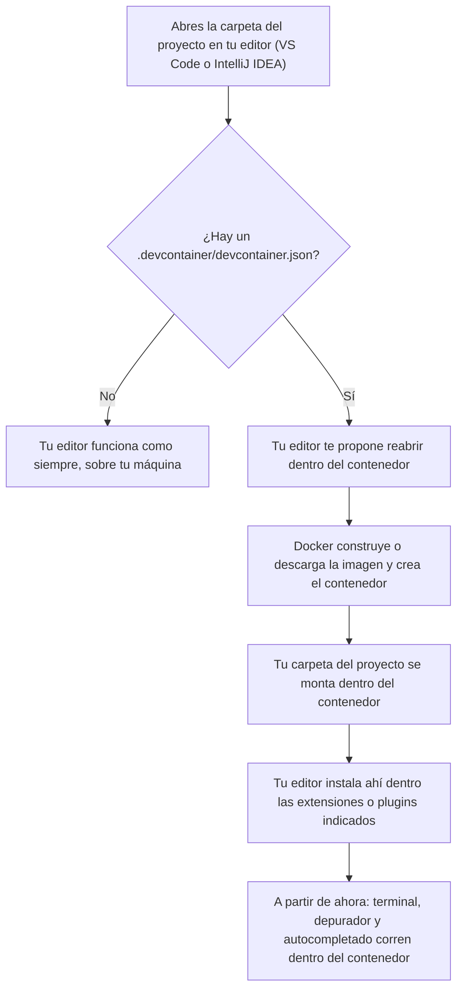

# 🧑‍💻 2. Dev Containers: tu propio entorno de trabajo

{ type=application/pdf style="width:100%;min-height:80vh" }

!!!info "Descarga de diapositivas"
    [Descarga las diapositivas](diapositivas/dev-containers.pdf){target="_blank" rel="noopener"}

---

Instalar Java, Node o cualquier herramienta del curso directamente en tu ordenador tiene los mismos problemas que ya has visto con Docker: una versión distinta a la de tu compañero, un sistema operativo distinto, media mañana perdida configurando un portátil nuevo. Hasta ahora has usado Docker para meter un **servicio** dentro de un contenedor, como una base de datos. Un **Dev Container** aplica la misma idea a otra cosa: mete dentro del contenedor tu propio entorno de programación, y tu editor se conecta ahí para trabajar como si ese contenedor fuera tu ordenador.

---

## La parte que cuesta entender la primera vez

"¿Cómo que mi editor está dentro de un contenedor, si lo sigo viendo en mi propia pantalla?" Es la duda razonable, y la respuesta está en separar dos cosas. La ventana que ves —los menús, las pestañas, el propio VS Code o IntelliJ IDEA— se queda en tu ordenador, exactamente igual que siempre. Pero todo lo que hace falta para trabajar de verdad (la terminal que abres, los comandos que ejecutas, el compilador o intérprete que usa el editor para subrayarte errores, las extensiones o plugins instalados) corre **dentro** del contenedor.

!!! example "Como un escritorio remoto"
    Es la misma idea que conectarte por escritorio remoto a otro ordenador: la pantalla, el ratón y el teclado son tuyos, pero el trabajo de verdad —los programas ejecutándose, los archivos que se procesan— ocurre en la máquina remota. Con Dev Containers pasa lo mismo, solo que la "máquina remota" es un contenedor Docker en tu propio ordenador, no otro equipo.

---

## Qué ocurre paso a paso



La ventana de tu editor no cambia de aspecto en ningún momento de este proceso — por eso cuesta notar la diferencia a simple vista. Lo único que delata que estás dentro de un contenedor es algún indicativo de conexión remota (en VS Code, una etiqueta en la esquina inferior izquierda con el nombre del Dev Container activo). Lo vas a comprobar tú mismo en la Actividad 0.7.

!!! info "VS Code o IntelliJ IDEA: el mismo fichero, dos editores posibles"
    Todo lo que ves en esta página funciona igual sea cual sea tu editor, porque el contrato es el propio `.devcontainer/devcontainer.json`: no es un fichero de configuración de VS Code, sino un estándar abierto ([containers.dev](https://containers.dev)) que distintos editores saben leer.

    - **VS Code** necesita la extensión **Dev Containers** (la que instalaste en la Actividad 0.7). Al abrir una carpeta con `.devcontainer/`, te propone directamente **"Reopen in Container"**.
    - **IntelliJ IDEA Ultimate** (2023.2 o posterior) trae soporte nativo para Dev Containers, sin instalar nada aparte. Abre el proyecto, abre el propio fichero `devcontainer.json` en el editor, y usa el icono **"Create Dev Container"** que aparece en el margen izquierdo de esa línea — elige **"Create Dev Container and Mount Sources…"**. La ventana **Services** muestra el progreso de construcción; cuando termine, pulsa **Connect** y el proyecto se reabre conectado al contenedor a través de un *JetBrains Client*. La **Community Edition** no trae esto integrado de serie — para este curso usa Ultimate (gratuita con la licencia educativa de JetBrains si aún no la tienes).

    A partir de aquí, cuando esta guía diga "VS Code te propone Reopen in Container" o mencione la paleta de comandos, aplica el equivalente de IntelliJ que acabas de ver.

---

## El fichero que lo describe todo

Todo lo anterior lo define un único fichero, `.devcontainer/devcontainer.json`, en la raíz del proyecto:

```json
{
  "name": "Entorno del curso",
  "image": "mcr.microsoft.com/devcontainers/base:debian-12",
  "forwardPorts": [5432],
  "postCreateCommand": "echo 'Entorno listo'",
  "customizations": {
    "vscode": {
      "extensions": ["ms-python.python"]
    }
  }
}
```

`image` es la imagen que se usa para construir el contenedor donde vas a trabajar — el mismo concepto de imagen que ya conoces, solo que aquí no aloja una base de datos sino un sistema base para programar. `forwardPorts` te deja ver desde tu navegador algo que corre dentro del contenedor, por ejemplo el puerto de una base de datos que arranques ahí dentro mientras programas. `postCreateCommand` es un comando que se ejecuta una única vez, justo tras crear el contenedor por primera vez — el sitio típico para instalar las dependencias del proyecto. Y `customizations.vscode.extensions` evita que tengas que instalar a mano, cada vez, las mismas extensiones: se instalan solas dentro del contenedor la primera vez que lo abres.

!!! tip "Esa clave `customizations.vscode` solo la lee VS Code"
    Si trabajas con IntelliJ IDEA, este bloque concreto se ignora sin más — no da error, simplemente no le dice nada a IntelliJ. No pasa nada: el soporte de Java, Maven o Spring que en VS Code hay que traer con una extensión, en IntelliJ ya viene integrado en el propio editor, así que no necesitas ningún equivalente a esa lista.

!!! tip "También puede apoyarse en un docker-compose.yml"
    En vez de `image`, un `devcontainer.json` puede usar `dockerComposeFile` y `service` para decir "mi entorno de desarrollo es este servicio concreto de este `docker-compose.yml`". Así, el mismo fichero de Compose que levanta tu base de datos puede levantar, en otro de sus servicios, el contenedor donde vive tu editor — los dos usos de Docker conviven en el mismo fichero.

---

## La relación con Docker, en una frase

Dev Containers no sustituye a Docker: se apoya en él. Docker es quien realmente crea y ejecuta el contenedor; Dev Containers es la capa que le dice a tu editor cómo conectarse a ese contenedor y usarlo como si fuera tu ordenador de toda la vida.

| | Contenedor de servicio (p. ej. una base de datos) | Dev Container |
|---|---|---|
| ¿Qué hace? | Ejecuta un programa al que tu código se conecta desde fuera | Aloja tu propio entorno de programación |
| ¿Quién se conecta? | Tu aplicación, por red y puerto | Tu editor, directamente desde dentro |
| Ejemplo de imagen | `postgres:18-alpine` | `mcr.microsoft.com/devcontainers/base:debian-12` |

---

## ✅ Ideas clave

??? tip "Abrir resumen"

    - Un **Dev Container** usa Docker para alojar tu propio entorno de programación, no un servicio: tu editor se conecta directamente dentro, guiado por un fichero `.devcontainer/devcontainer.json`.
    - La ventana del editor no cambia de aspecto; lo que cambia es dónde corren de verdad la terminal, el depurador y el autocompletado — dentro del contenedor, no en tu máquina.
    - El `devcontainer.json` puede construir el entorno a partir de una `image` suelta, o de un servicio concreto dentro de un `docker-compose.yml` ya existente (`dockerComposeFile` + `service`).
