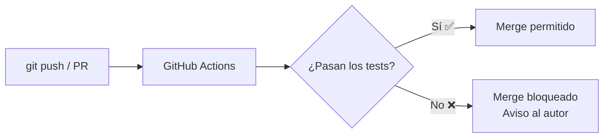
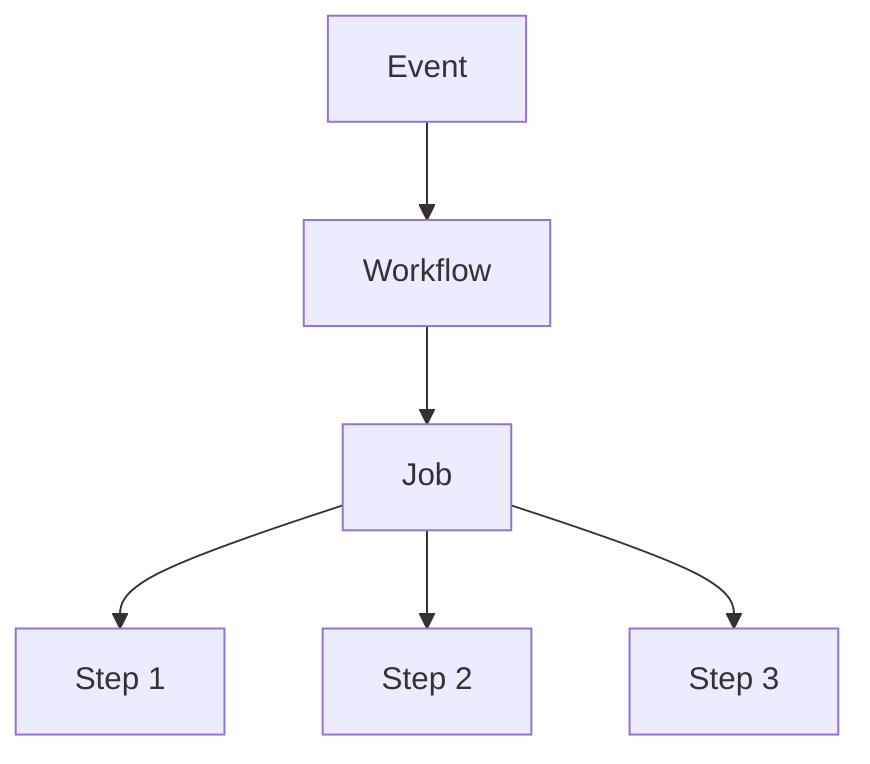
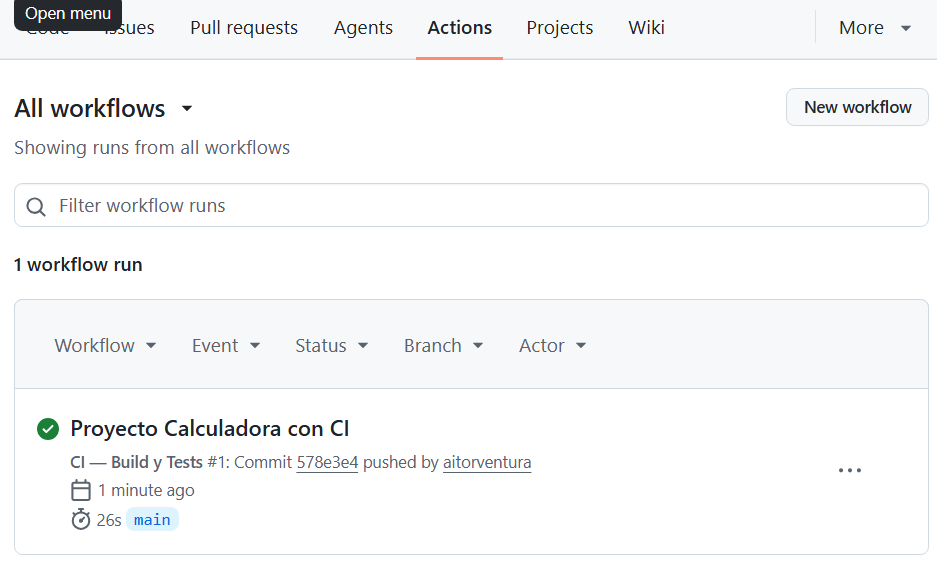
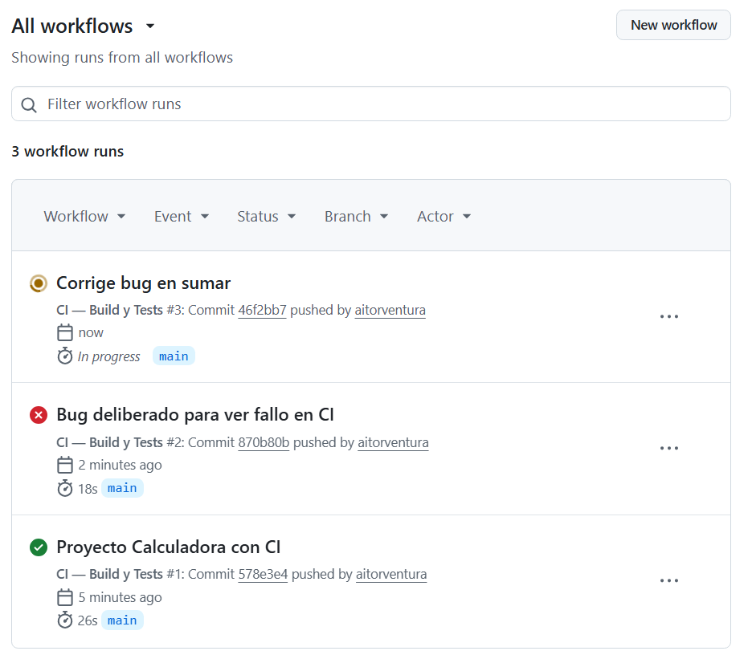
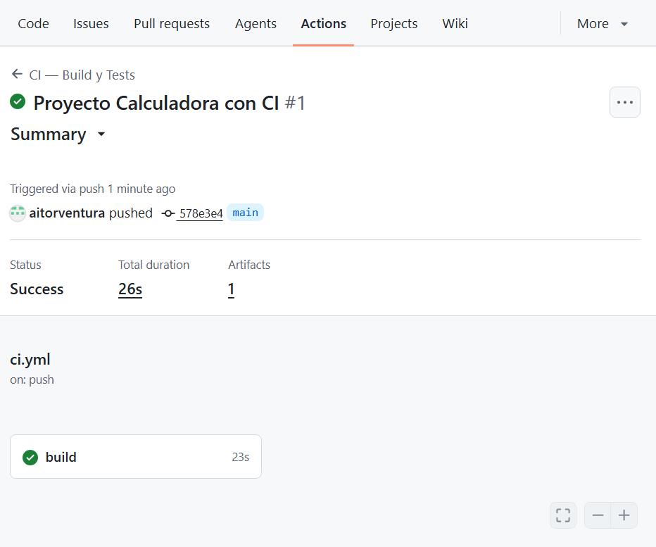
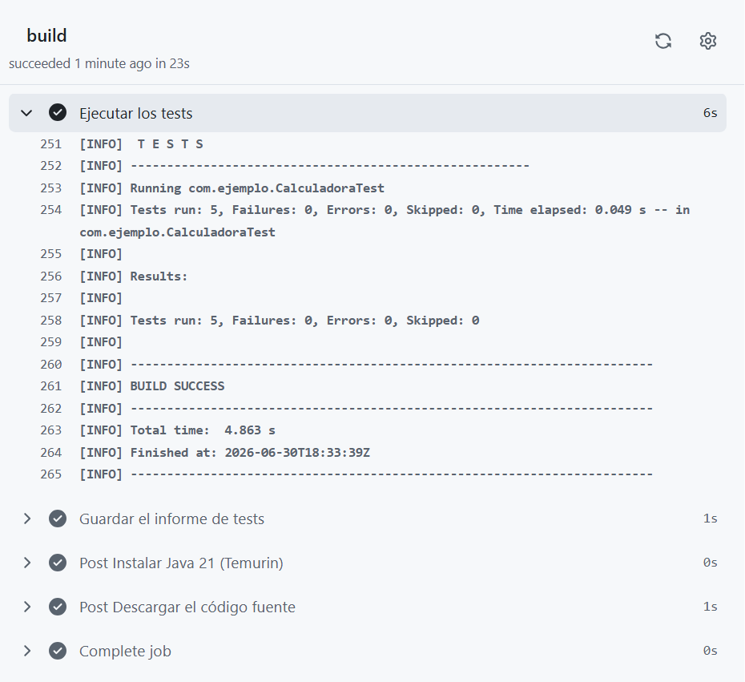
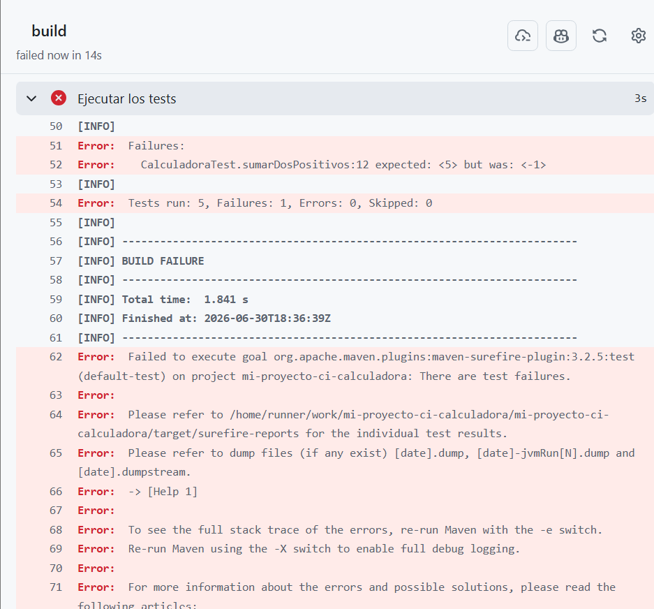
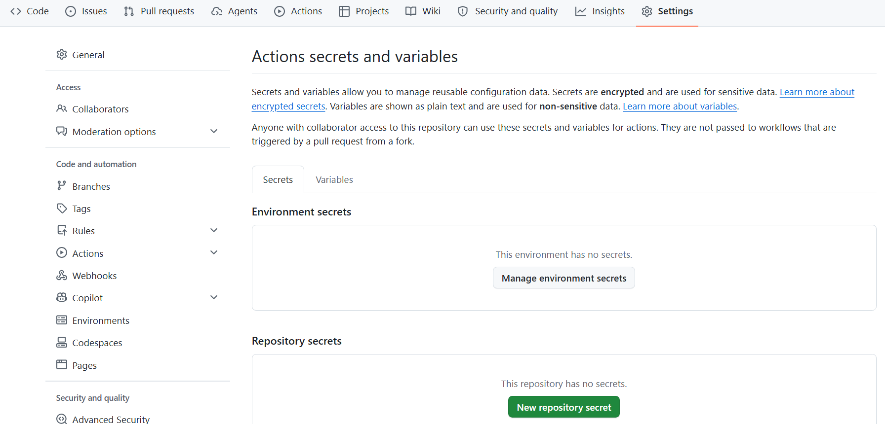

# ⚙️ 5. Integración Continua con GitHub Actions

{ type=application/pdf style="width:100%;min-height:80vh" }

!!!info "Descarga de diapositivas"
    [Descarga las diapositivas](diapositivas/github-actions.pdf){target="_blank" rel="noopener"}

---

## 5.1 ¿Qué problema resuelve la integración continua?

Imagina que un equipo de cuatro personas trabaja en el mismo repositorio. Cada una desarrolla su parte en su rama y cuando termina hace merge en `main`. El problema: en el momento del merge nadie sabe si el código del compañero rompe los tests que otra persona escribió la semana pasada. Descubrirlo tres días después —o peor, en producción— cuesta mucho más que haberlo detectado en el acto.

La **integración continua** (CI, de *Continuous Integration*) es la práctica de ejecutar comprobaciones automáticas sobre el código **cada vez que alguien propone un cambio**. Compilar, pasar los tests, revisar el estilo... todo de forma automática y en segundos. Si algo falla, el sistema avisa antes de que el código llegue a `main`.



A lo largo de este apartado trabajaremos con un ejemplo real: una clase `Calculadora` con cinco tests unitarios y un workflow de CI que los ejecuta automáticamente en cada push.

La ventaja no es solo técnica: **el equipo puede trabajar más rápido** porque confía en que si el pipeline es verde, el código funciona. Sin CI, cada merge es un riesgo; con CI, es una rutina segura.

---

## 5.2 GitHub Actions

**GitHub Actions** es el sistema de automatización integrado en GitHub. Permite definir flujos de trabajo (*workflows*) que se ejecutan en respuesta a eventos del repositorio, directamente en la nube de GitHub, sin instalar nada en tu máquina.

Los eventos más habituales que disparan un workflow son:

| Evento | Cuándo ocurre |
|---|---|
| `push` | Alguien sube commits a una rama |
| `pull_request` | Se abre, actualiza o cierra una PR |
| `schedule` | Un temporizador (como un cron job) |
| `workflow_dispatch` | El usuario lo activa manualmente desde la web |
| `release` | Se publica una nueva versión del proyecto |

### Conceptos clave

Antes de ver código, conviene tener claro el vocabulario. GitHub Actions tiene cinco piezas que encajan entre sí:

| Concepto | Qué es |
|---|---|
| **Workflow** | El fichero YAML que describe qué hacer y cuándo. Vive en `.github/workflows/`. |
| **Event** | El disparador que pone en marcha el workflow (`push`, `pull_request`...). |
| **Job** | Un bloque de pasos que se ejecuta en una máquina virtual. |
| **Step** | Una acción concreta dentro de un job: ejecutar un comando de shell o llamar a una Action. |
| **Runner** | La máquina virtual donde corre el job. GitHub ofrece Ubuntu, Windows y macOS. |
| **Action** | Una tarea reutilizable publicada en el Marketplace. Se invoca con `uses:`. |



---

## 5.3 Estructura de un workflow

Los workflows son ficheros YAML que se guardan en la carpeta `.github/workflows/` de tu repositorio. Puedes tener tantos ficheros como quieras; cada uno define un workflow independiente.

```
mi-proyecto-ci/
├── .github/
│   └── workflows/
│       └── ci.yml        ← se ejecuta en cada push a main
├── src/
│   ├── main/java/com/ejemplo/
│   │   └── Calculadora.java
│   └── test/java/com/ejemplo/
│       └── CalculadoraTest.java
└── pom.xml
```

### Anatomía de un workflow YAML

```yaml
# .github/workflows/ci.yml
name: CI — Build y Tests               # Nombre que aparece en el panel Actions

on:                                    # Eventos que disparan este workflow
  push:
    branches: [main]                   # Solo en push a main
  pull_request:                        # En cualquier PR hacia main
    branches: [main]

jobs:                                  # Conjunto de jobs del workflow
  build:                               # Nombre del job (lo eliges tú)
    runs-on: ubuntu-latest             # Máquina virtual donde corre

    steps:                             # Pasos del job, en orden
      - name: Descargar el código fuente
        uses: actions/checkout@v4      # Action oficial: clona el repo en el runner

      - name: Instalar Java 21 (Temurin)
        uses: actions/setup-java@v4    # Action oficial: instala el JDK
        with:
          java-version: '21'
          distribution: 'temurin'
          cache: 'maven'               # cachea ~/.m2 entre ejecuciones

      - name: Compilar el proyecto
        run: mvn compile -B            # Comando de shell normal

      - name: Ejecutar los tests
        run: mvn test -B

      - name: Guardar el informe de tests
        if: always()                   # se ejecuta aunque los tests fallen
        uses: actions/upload-artifact@v4
        with:
          name: informe-tests
          path: target/surefire-reports/
```

Cada sección tiene su función:

- **`name`** — el nombre que verás en la interfaz de GitHub. Ponlo descriptivo.
- **`on`** — define qué eventos activan el workflow. Puedes listar varios.
- **`jobs`** — aquí defines uno o más jobs. Por defecto se ejecutan en paralelo.
- **`runs-on`** — el tipo de runner. `ubuntu-latest` es el más común y el más rápido.
- **`steps`** — lista de pasos. Se ejecutan en orden, uno tras otro. Si uno falla, el job se detiene.
- **`uses`** — invoca una Action del Marketplace (código reutilizable de otro repositorio).
- **`run`** — ejecuta un comando de shell directamente en el runner.

!!! tip "¿Qué versión de Action usar?"
    Fíjate en el `@v4` de `actions/checkout@v4`. Indica la versión de la Action. Siempre fija una versión concreta; si escribes `@main` usarías siempre la última versión y un cambio incompatible podría romper tu workflow sin que hayas tocado nada.

---

## 5.4 El proyecto Calculadora: código y tests

Para que el workflow de CI tenga algo que comprobar, el proyecto tiene una clase `Calculadora` con cuatro operaciones y cinco tests que las verifican.

**`src/main/java/com/ejemplo/Calculadora.java`**

```java
package com.ejemplo;

public class Calculadora {

    public int sumar(int a, int b) {
        return a + b;
    }

    public int restar(int a, int b) {
        return a - b;
    }

    public int multiplicar(int a, int b) {
        return a * b;
    }

    public double dividir(double a, double b) {
        if (b == 0) {
            throw new IllegalArgumentException("No se puede dividir por cero");
        }
        return a / b;
    }
}
```

**`src/test/java/com/ejemplo/CalculadoraTest.java`**

```java
package com.ejemplo;

import org.junit.jupiter.api.Test;
import static org.junit.jupiter.api.Assertions.*;

class CalculadoraTest {

    private final Calculadora calc = new Calculadora();

    @Test
    void sumarDosPositivos() {
        assertEquals(5, calc.sumar(2, 3));
    }

    @Test
    void restarResultadoNegativo() {
        assertEquals(-1, calc.restar(2, 3));
    }

    @Test
    void multiplicarPorCero() {
        assertEquals(0, calc.multiplicar(7, 0));
    }

    @Test
    void dividirNormal() {
        assertEquals(2.5, calc.dividir(5, 2));
    }

    @Test
    void dividirPorCeroLanzaExcepcion() {
        assertThrows(IllegalArgumentException.class, () -> calc.dividir(10, 0));
    }
}
```

Cuando se hace `push` de este proyecto a GitHub con el fichero `ci.yml` en su sitio, GitHub Actions ejecuta automáticamente todos los pasos que hay definidos en el workflow. Veamos qué hace cada uno con este proyecto concreto:

### Qué hace cada step con la Calculadora

**Step 1 — `actions/checkout@v4`**

El runner arranca como una máquina virtual vacía: no tiene ni el código del proyecto. Este step clona el repositorio dentro del runner, igual que harías tú con `git clone`. Sin él, los pasos siguientes no encontrarían ni el `pom.xml` ni las clases Java.

**Step 2 — `actions/setup-java@v4`**

Una vez que el código está descargado, el runner necesita Java para poder compilar y ejecutar los tests. Este step instala el JDK 21 de Temurin (la distribución de Adoptium). El parámetro `cache: 'maven'` guarda la carpeta `~/.m2` entre ejecuciones para que Maven no tenga que descargar JUnit y el resto de dependencias cada vez desde cero.

**Step 3 — `mvn compile -B`**

Compila todas las clases Java del proyecto: `Calculadora.java` y `CalculadoraTest.java`. Si hay un error de sintaxis o un método que no existe, este step falla aquí y el workflow se detiene sin llegar a los tests. El flag `-B` activa el modo *batch*: Maven no muestra barras de progreso interactivas, lo que hace que los logs sean más limpios.

**Step 4 — `mvn test -B`**

Ejecuta los cinco tests de `CalculadoraTest`. Maven lanza JUnit, que a su vez llama a cada método anotado con `@Test` y comprueba que el resultado es el esperado. Si todos pasan, el step termina en verde. Si alguno falla —por ejemplo porque `sumar` devuelve el valor equivocado— Maven termina con error y el workflow se marca como fallido.

**Step 5 — `actions/upload-artifact@v4` con `if: always()`**

Surefire (el plugin de Maven que ejecuta los tests) genera un informe XML en `target/surefire-reports/` con el detalle de cada test: cuántos han pasado, cuántos han fallado y el tiempo de cada uno. Este step guarda ese informe como un *artifact* descargable desde el panel de GitHub. El `if: always()` es importante: sin él, si el step de tests falla, este step no se ejecutaría y perderías el informe justo cuando más lo necesitas.

!!! example "Resumen del flujo"
    Cada vez que haces `push` a `main` o abres una PR, el runner hace exactamente esto en orden:

    1. Descarga tu código → 2. Instala Java 21 → 3. Compila → 4. Ejecuta los 5 tests de la Calculadora → 5. Guarda el informe

    Si el paso 3 o el 4 fallan, GitHub bloquea el merge de la PR hasta que se corrija.

En la pestaña **Actions** del repositorio verás el workflow aparecer en segundos tras el push.



---

## 5.5 El panel Actions de GitHub

Una vez que el workflow se ha ejecutado, toda la información está disponible en la pestaña **Actions** del repositorio.

**Vista general** — lista todos los runs que han ocurrido. El icono de estado indica en qué punto está cada uno:

- 🟠 **Naranja (girando)** — el workflow está en ejecución en ese momento.
- ✅ **Verde** — todos los steps han pasado correctamente.
- ❌ **Rojo** — algún step ha fallado.

Cada fila corresponde a un push o una PR, e indica el nombre del commit que lo disparó y el tiempo transcurrido.



**Vista de un run** — al hacer clic en una ejecución concreta, ves todos los jobs. En nuestro proyecto hay un solo job llamado `build`, que agrupa todos los steps.



**Vista de un job** — al hacer clic en el job, se despliegan los steps. Cada step muestra su log completo: los comandos ejecutados y su salida. El step **"Ejecutar los tests"** muestra la salida de Maven con el resultado de los cinco tests de la `Calculadora`.



```
[INFO] Running com.ejemplo.CalculadoraTest
[INFO] Tests run: 5, Failures: 0, Errors: 0, Skipped: 0
[INFO] BUILD SUCCESS
```

!!! example "Cómo leer un log de error"
    Si un step falla, su fondo se vuelve rojo y aparece una `✕`. El log muestra la salida del comando justo antes del error. Busca la última línea antes de `Process completed with exit code 1` — ahí está el problema.

---

## 5.6 Cuando el workflow falla

Los fallos de un workflow tienen dos orígenes distintos, y conviene distinguirlos:

<div class="tabs-colored" markdown>

=== "Error en el código (lo más frecuente)"

    El workflow funciona correctamente, pero los tests detectan un bug. Por ejemplo: si en `Calculadora.java` se cambia `sumar` para que devuelva `a - b` en lugar de `a + b`, el test `sumarDosPositivos` fallará.

    

    ```
    [ERROR] com.ejemplo.CalculadoraTest.sumarDosPositivos
    org.opentest4j.AssertionFailedError: expected: <5> but was: <-1>
            at com.ejemplo.CalculadoraTest.sumarDosPositivos(CalculadoraTest.java:13)

    [ERROR] Tests run: 1, Failures: 1, Errors: 0, Skipped: 0
    [INFO] BUILD FAILURE
    ```

    **Solución:** corrige el código, haz commit y push. El workflow volverá a ejecutarse.

=== "Error en el workflow"

    El fichero YAML tiene un problema de sintaxis o una Action no existe.

    ```
    Error: Unable to resolve action `actions/setup-java@v99`,
    the action does not exist or its metadata is invalid
    ```

    **Solución:** corrige el fichero `.yml` y vuelve a hacer push.

=== "Error de entorno"

    El runner no tiene lo que necesita (una variable de entorno que falta, un servicio caído…).

    ```
    Error: JAVA_HOME is not set and 'java' is not in PATH
    ```

    **Solución:** añade el step de instalación que falta antes del step que falla. En nuestro proyecto, el step `actions/setup-java@v4` se encarga de esto.

</div>

!!! warning "El workflow falla pero el código está bien en tu máquina"
    Si los tests pasan en local pero fallan en el runner, la causa más frecuente es una diferencia de entorno: versión de Java distinta, dependencia que no se instala, o un test que depende de un fichero local que no está en el repositorio. El runner parte de cero cada vez.

---

## 5.7 El Marketplace de Actions

No tienes que escribir todo desde cero. El **Marketplace de GitHub Actions** contiene miles de Actions reutilizables publicadas por la comunidad y por empresas.

En el proyecto de la Calculadora ya usamos tres de las más habituales:

| Action | Para qué sirve |
|---|---|
| `actions/checkout@v4` | Clona el repositorio en el runner. Siempre el primer step. |
| `actions/setup-java@v4` | Instala un JDK concreto (Temurin, Zulu, Corretto…). |
| `actions/setup-node@v4` | Instala Node.js y npm. |
| `actions/cache@v4` | Guarda en caché dependencias (Maven, npm…) para acelerar los builds. |
| `actions/upload-artifact@v4` | Guarda ficheros del runner (JARs, informes de tests) para descargarlos después. |

Usar una Action es tan sencillo como referenciarla con `uses:` y pasarle parámetros con `with:`:

```yaml
- name: Instalar Java 21
  uses: actions/setup-java@v4
  with:
    java-version: '21'
    distribution: 'temurin'
    cache: 'maven'          # activa la caché de ~/.m2 automáticamente
```

!!! tip "Verifica las Actions de terceros"
    Las Actions oficiales de GitHub (`actions/...`) son de confianza. Las de terceros (`empresa/action-name`) conviene revisarlas antes de usarlas: ejecutan código en tu runner con acceso a tus secrets. Comprueba que el repositorio de la Action es conocido y tiene buena reputación.

---

## 5.8 Secretos: credenciales sin exponer

Nunca escribas contraseñas, tokens o claves API directamente en el fichero YAML. Ese fichero vive en el repositorio y cualquiera que lo clone lo verá.

GitHub ofrece los **Secrets**: variables cifradas que se almacenan en la configuración del repositorio y que el workflow puede usar sin que su valor aparezca en ningún log.

### Crear un secret

1. En tu repositorio, ve a **Settings → Secrets and variables → Actions**.
2. Pulsa **New repository secret**.
3. Dale un nombre en mayúsculas (convenio): `MAVEN_PASSWORD`, `DEPLOY_TOKEN`...
4. Pega el valor. A partir de ese momento GitHub lo cifra y nadie puede leerlo, ni tú.



### Usar un secret en un workflow

```yaml
- name: Publicar en el registro
  run: mvn deploy
  env:
    MAVEN_USERNAME: ${{ secrets.MAVEN_USERNAME }}   # se sustituye en tiempo de ejecución
    MAVEN_PASSWORD: ${{ secrets.MAVEN_PASSWORD }}   # nunca aparece en el log
```

La sintaxis `${{ secrets.NOMBRE }}` le indica a GitHub Actions que sustituya ese valor por el secret almacenado. En los logs, ese valor aparece como `***` aunque alguien intente imprimirlo con `echo`.

!!! warning "Los secrets no están disponibles en PRs de forks"
    Por seguridad, los secrets no se pasan a workflows disparados por PRs que vienen de un fork externo. Esto evita que alguien cree un fork, añada `echo ${{ secrets.TOKEN }}` al workflow y extraiga tus credenciales. En PRs de tu propio repositorio, sí funcionan.

---

## ✅ Ideas clave

!!! tip "Resumen"
    - **CI**: ejecutar comprobaciones automáticas en cada cambio para detectar errores cuanto antes, antes de que lleguen a `main`.
    - **GitHub Actions**: el sistema de CI/CD integrado en GitHub. Se configura con ficheros YAML en `.github/workflows/`.
    - Un **workflow** se activa con un **event** (`push`, `pull_request`...), contiene **jobs** que corren en un **runner**, y cada job tiene **steps** que ejecutan comandos o **Actions** del Marketplace.
    - Si un workflow falla, el log indica exactamente qué test ha fallado y con qué valores — en nuestro ejemplo, `expected: <5> but was: <-1>` apuntaba directamente al bug en `sumar()`.
    - Los **secrets** almacenan credenciales de forma segura: nunca escribas contraseñas directamente en el YAML.
    - `if: always()` en un step garantiza que se ejecute aunque los anteriores fallen — útil para guardar informes de tests.
