# 🌐 3. Introducción a GitHub y Repositorios Remotos

{ type=application/pdf style="width:100%;min-height:80vh" }

!!!info "Descarga de diapositivas"
    [Descarga las diapositivas](diapositivas/github.pdf){target="_blank" rel="noopener"}

---

En esta sección nos centraremos en los **repositorios remotos**: repositorios alojados en un servidor externo que permiten a otros usuarios acceder al proyecto y colaborar en él. Utilizaremos **GitHub** como servidor principal durante el curso.

---

## ☁️ ¿Qué es un Repositorio Remoto?

Un repositorio remoto es una copia de tu repositorio de Git alojada en un servidor de internet. Contiene una réplica completa de la historia del proyecto: commits, ramas y etiquetas. Sus principales utilidades son:

- **Colaboración**: varios desarrolladores pueden trabajar sobre el mismo proyecto y compartir sus cambios.
- **Copia de seguridad**: si tu ordenador falla, el código sigue estando en la nube.
- **Distribución**: puedes mostrar tu trabajo como portafolio o conectarlo a servidores de despliegue.

El diagrama siguiente muestra cómo se relacionan tu máquina local y el servidor remoto, y qué comando actúa en cada paso:

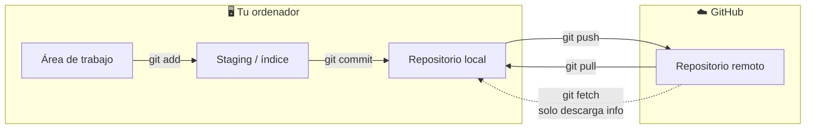

!!! info "Alternativas a GitHub"
    Además de [GitHub](https://github.com/), existen otros servicios para alojar repositorios remotos:

    - **[GitLab](https://gitlab.com/)**: plataforma open source muy usada en entornos empresariales y DevOps.
    - **[Bitbucket](https://bitbucket.org/)**: propiedad de Atlassian, se integra bien con Jira y Trello.

---

## 📝 Registro en GitHub

Antes de crear repositorios remotos o colaborar en proyectos, necesitas una cuenta. El proceso es gratuito:

1. Visita [https://github.com/](https://github.com/).
2. Haz clic en **"Sign up"** (arriba a la derecha).
3. Introduce tu correo electrónico, elige una contraseña y un nombre de usuario.
4. Resuelve el puzzle de verificación.
5. GitHub te enviará un código numérico al correo. Introdúcelo en la pantalla de confirmación.
6. Ya tienes acceso a tu panel de control (*dashboard*) desde donde puedes crear y explorar repositorios.

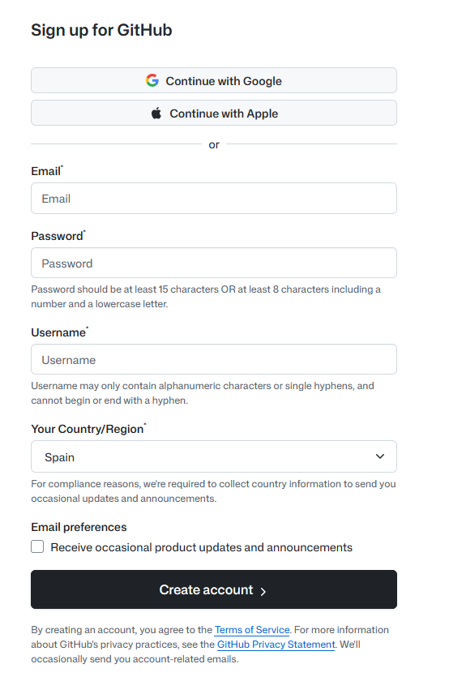

**Qué estás viendo en la captura:** la página inicial de GitHub donde se introduce el nombre de usuario, contraseña y correo para crear una cuenta nueva.

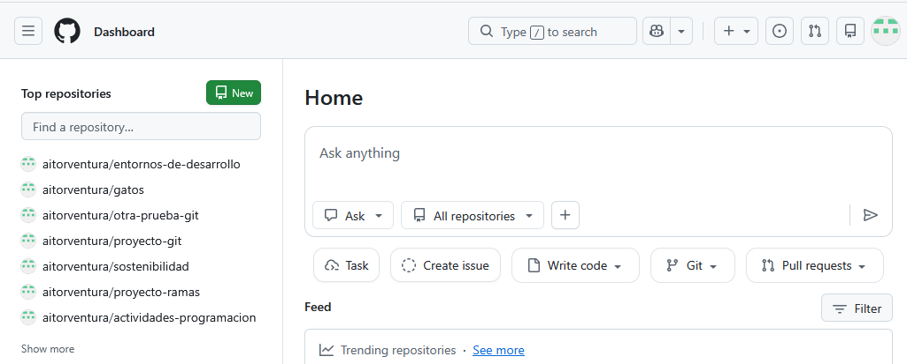

**Qué estás viendo en la captura:** el panel de control de GitHub una vez iniciada sesión. A la izquierda verás el listado de repositorios (vacío si acabas de registrarte) y el botón verde "New" para crear uno nuevo.

---

## 🔐 Autenticación y Conexión en GitHub

Para subir código o modificar proyectos privados, GitHub necesita verificar tu identidad. Antiguamente se usaba la contraseña de la cuenta, pero por seguridad ya no está permitido desde la terminal. Hoy existen tres formas:

1. **Token de acceso personal (PAT)**: generas una "contraseña larga" específica para repositorios, revocable en cualquier momento. Es el método más habitual al empezar.
2. **Claves SSH**: generas un par de claves criptográficas en tu ordenador. Es el método más profesional y cómodo a largo plazo.
3. **GitHub CLI (`gh`)**: herramienta oficial de consola que permite autenticarte a través del navegador.

!!! tip "Recomendación: SSH vs PAT"
    El PAT es más rápido de configurar al principio. Las claves SSH son más seguras y no requieren pegar ningún token cada vez que haces `push`. En un entorno profesional, SSH es el estándar.

### Generando un Token de Acceso Personal (PAT)

1. En GitHub, haz clic en tu foto de perfil (arriba a la derecha) → **Settings**.
2. Baja por el menú lateral hasta **`< >` Developer settings**.
3. Ve a **Personal access tokens** → **Tokens (classic)**.
4. Pulsa **Generate new token** → **Generate new token (classic)**.

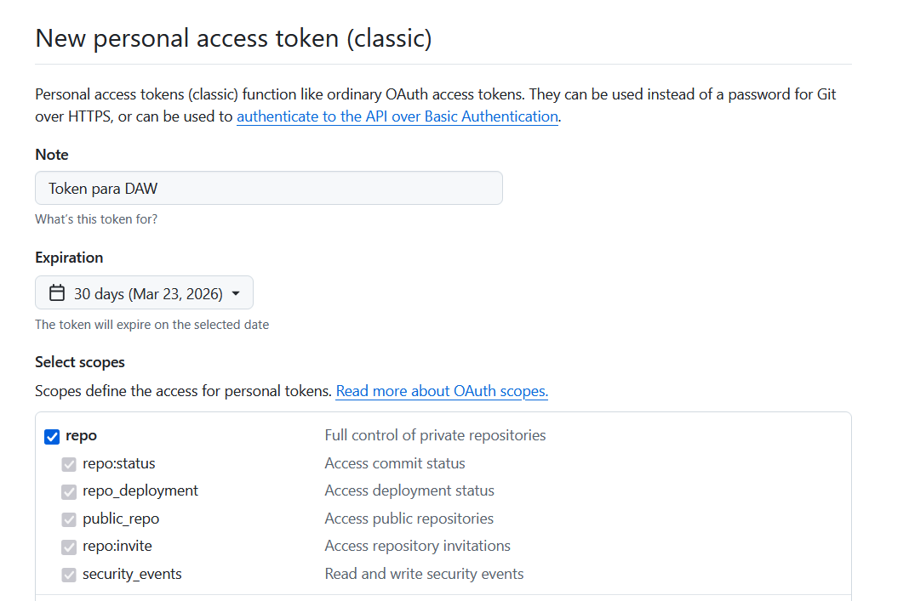

**Qué estás viendo en la captura:** el formulario para configurar un nuevo token clásico. Se ha asignado un nombre descriptivo y se ha marcado la casilla **`repo`** para dar permisos de lectura y escritura sobre repositorios.

5. Baja al final de la página y haz clic en **Generate token**.

6. GitHub te mostrará el token generado (una cadena larga que empieza por `ghp_...`).

!!! warning "Cópialo ahora"
    Esta es la **única vez** que GitHub te lo muestra. Si cierras la pestaña sin copiarlo, tendrás que generar uno nuevo.

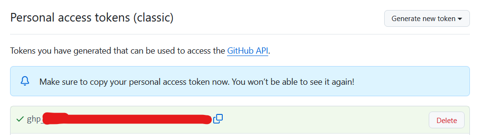

**Qué estás viendo en la captura:** el mensaje de éxito y el token generado (parte censurada por seguridad). Copia el tuyo completo usando el icono de copiar.

Cuando Git te pida contraseña al hacer `git push`, pega este token en lugar de tu contraseña de GitHub.

---

### Configurando la Autenticación por SSH (Recomendado)

Si no quieres pegar el token cada vez que subes código, configura una clave SSH entre tu equipo y GitHub. El proceso es de una sola vez.

#### 1. Generar la clave SSH local

Abre Git Bash y ejecuta el siguiente comando con tu correo de GitHub:

```bash
ssh-keygen -t ed25519 -C "tu_correo@ejemplo.com"
```

La terminal te preguntará dónde guardar la clave y si quieres añadir una contraseña (*passphrase*). Puedes pulsar `Enter` varias veces para aceptar los valores por defecto.

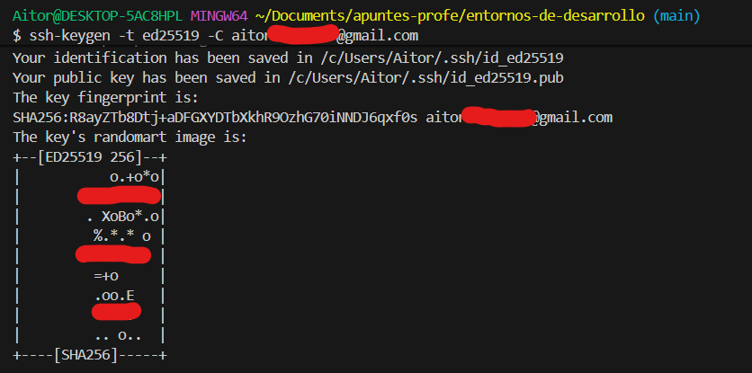

**Qué estás viendo en la captura:** Git Bash ejecutando el comando. Las preguntas de ruta y passphrase se han respondido pulsando Intro. El dibujo ASCII al final confirma que la clave se ha generado correctamente en la carpeta `.ssh` de tu ordenador.

#### 2. Copiar la clave pública

El proceso ha generado dos archivos: la clave **privada** (nunca la compartas) y la clave **pública** (la que le damos a GitHub). Copia la pública así:

```bash
# Windows (Git Bash)
clip < ~/.ssh/id_ed25519.pub

# Mac
pbcopy < ~/.ssh/id_ed25519.pub

# O muéstrala en pantalla y cópiala manualmente:
cat ~/.ssh/id_ed25519.pub
```

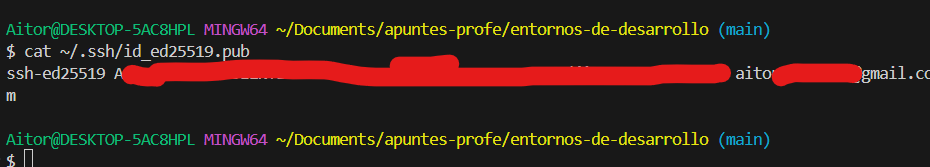

**Qué estás viendo en la captura:** el contenido de la clave pública mostrado con `cat`. Siempre empieza por `ssh-ed25519`.

#### 3. Añadir la clave a GitHub

1. Ve a GitHub → tu foto de perfil → **Settings** → **SSH and GPG keys**.
2. Pulsa **New SSH key**.
3. Escribe un título (ej. "Portátil clase") y pega la clave pública en el campo de texto.
4. Haz clic en **Add SSH key**.

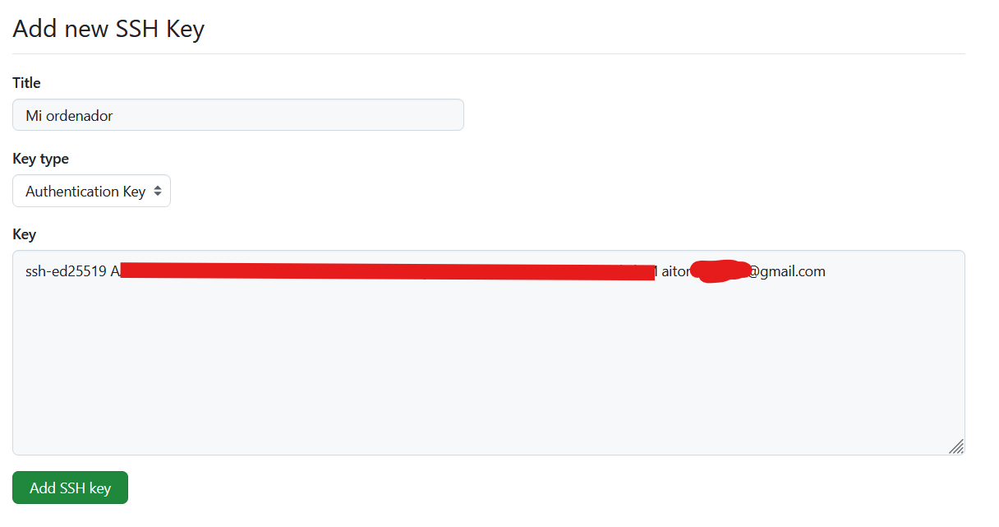

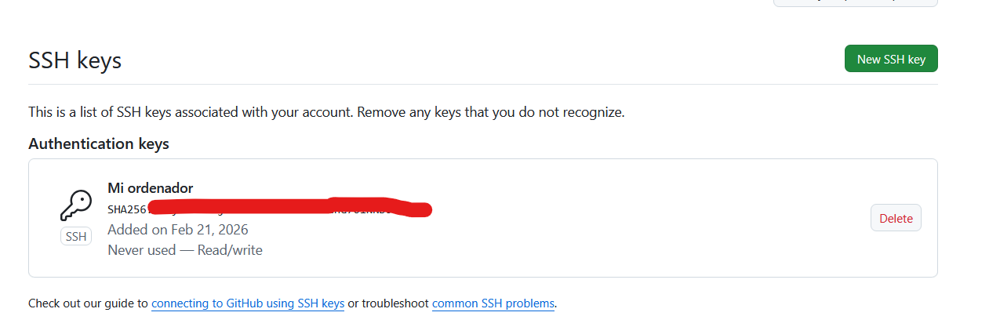

**Qué estás viendo en las capturas:** la primera muestra el formulario para pegar la clave; la segunda confirma que la clave ha quedado vinculada a tu cuenta.

A partir de ahora, cuando clones un proyecto usa la URL **SSH** (empieza por `git@github.com:...`) en lugar de HTTPS. Cualquier `push` o `pull` funcionará sin pedirte credenciales.

---

## 🚀 Paso a Paso: Subiendo tu proyecto a la nube

Imagina que has estado trabajando en local con `git init`, `git add` y `git commit`. Ahora quieres subirlo a GitHub.

### 1. Creando el repositorio en GitHub

Entra en tu cuenta de GitHub y pulsa el botón **New** para crear un nuevo repositorio. Dale un nombre y decide si será público o privado.

Si ya tienes un repositorio local listo, **no marques** las opciones de añadir `README`, `.gitignore` ni licencia desde la web — necesitas que GitHub te dé un repositorio completamente vacío.

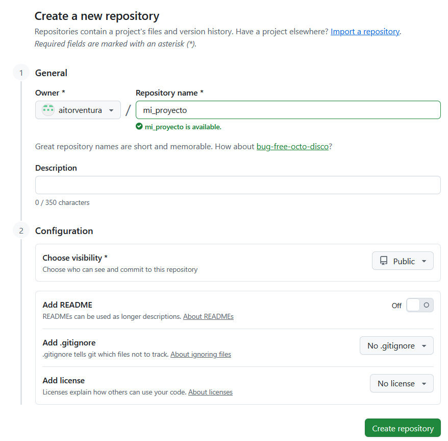

**Qué estás viendo en la captura:** el formulario "Create a new repository" con el nombre `mi_proyecto`. Las opciones de README y .gitignore se han dejado desmarcadas para obtener un repositorio vacío.

### 2. Enlazando el local con el remoto (`git remote add`)

Una vez creado el repositorio vacío, GitHub te mostrará las instrucciones de subida. El comando que conecta tu repositorio local con el remoto es `git remote add`.

El alias **`origin`** es simplemente un apodo que le damos a la URL del servidor remoto — podría llamarse de cualquier manera, pero por convención siempre se llama `origin`. Así no tienes que escribir la URL completa cada vez.

Dependiendo del protocolo que hayas configurado:

<div class="tabs-colored" markdown>

=== "HTTPS"
    ```bash
    git remote add origin https://github.com/tu-usuario/tu-repositorio.git
    ```
    Git te pedirá el Token PAT la primera vez que subas código (salvo que tu sistema tenga el *Git Credential Manager* activado, lo habitual en Windows).

=== "SSH"
    ```bash
    git remote add origin git@github.com:tu-usuario/tu-repositorio.git
    ```
    Si has configurado las claves SSH, no te pedirá ninguna credencial.

</div>

Para comprobar que el enlace se ha creado correctamente:

```bash
git remote -v
```

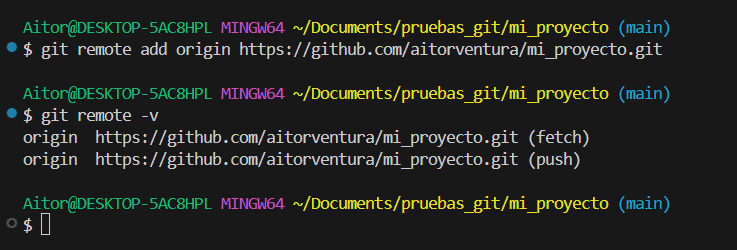

**Qué estás viendo en la captura:** el comando `git remote add origin` (que no produce salida visible) y a continuación `git remote -v`, que confirma que `origin` apunta a la URL correcta tanto para `push` como para `fetch`.

### 3. El primer push (`git push`)

Tu PC y GitHub están enlazados, pero los datos todavía no han viajado. La primera vez añade `-u` (`--set-upstream`) para vincular tu rama local con la rama remota: a partir de ahí, Git sabe adónde ir cuando ejecutas `git push` o `git pull` a secas, sin tener que escribir `origin main` cada vez.

```bash
git push -u origin main
```

!!! info "¿Por qué me pide (o no me pide) contraseña?"
    - **Si pide usuario y contraseña:** pega el **Token PAT** como contraseña. Tu contraseña de GitHub no funcionará.
    - **Si no pide nada:** o tienes SSH configurado, o el *Git Credential Manager* de Windows ha guardado tus credenciales de una sesión anterior.

!!! warning "Conflicto al hacer push"
    Si Git te avisa de que el remoto tiene cambios que tú no tienes en local, **no uses `git push --force`** salvo que estés seguro de lo que haces. `--force` sobreescribe el historial del servidor y puede borrar el trabajo de tus compañeros. La solución habitual es hacer primero `git pull` para integrar los cambios remotos, y luego volver a hacer `push`.

    La única situación en que `--force` es aceptable es en una rama propia que nadie más usa.

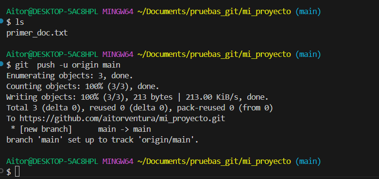

**Qué estás viendo en la captura:** primero un `ls` para ver el contenido local antes del envío, y luego `git push -u origin main` con las estadísticas de éxito (`Writing objects: 100%`) y el aviso de que la rama remota queda enlazada.

### 4. Visualizando el resultado

Actualiza la página del repositorio en el navegador. Verás tus archivos con el historial y los mensajes de commit exactos que tenías en local.

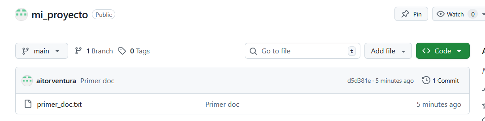

**Qué estás viendo en la captura:** el repositorio en GitHub mostrando los archivos locales (`primer_doc.txt`) junto al mensaje y la fecha de cada commit.

---

## 🔄 Descargando y sincronizando el código

### Clonar un repositorio desde cero (`git clone`)

Llegas a un ordenador donde no tienes nada del proyecto. En lugar de `git init`, usas `git clone` con la URL del repositorio:

```bash
git clone https://github.com/tu-usuario/tu-repositorio.git
# O con SSH si lo tienes configurado:
git clone git@github.com:tu-usuario/tu-repositorio.git
```

Para obtener la URL, entra en el repositorio de GitHub y haz clic en el botón verde **"<> Code"**.

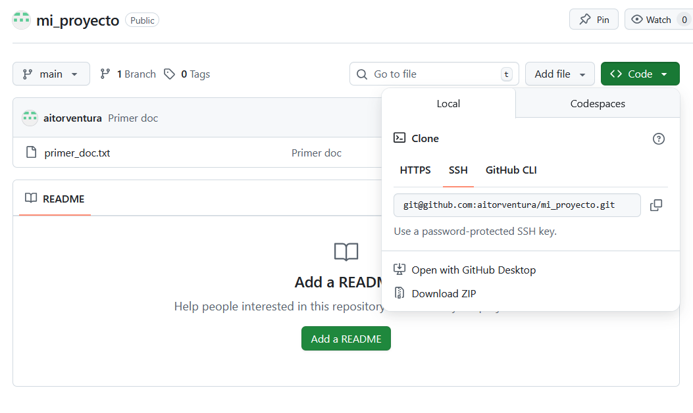

**Qué estás viendo en la captura:** el menú desplegable del botón "Code" con la URL de clonación en HTTPS y el botón para copiarla al portapapeles.

`git clone` hace tres cosas de golpe:

1. Crea una carpeta con el nombre del repositorio.
2. Descarga todos los commits, ramas y archivos.
3. Configura `origin` apuntando al remoto automáticamente.

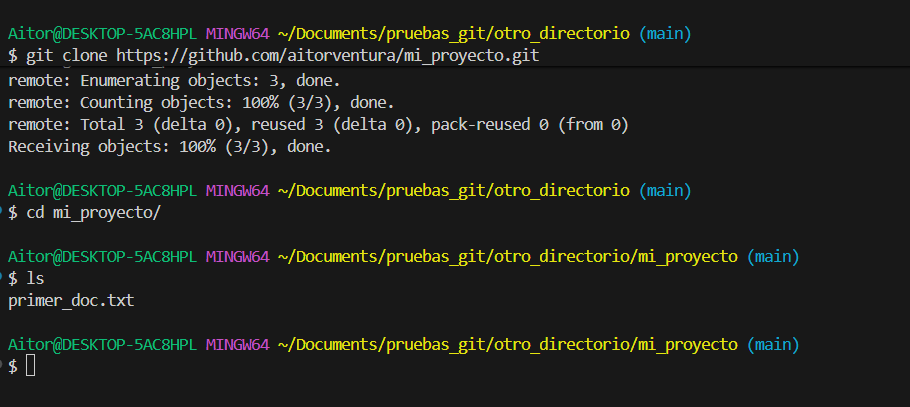

**Qué estás viendo en la captura:** `git clone` descargando el repositorio, y después `cd mi_proyecto` + `ls` confirmando que los archivos ya están en local.

### Comprobar si hay cambios sin descargarlos (`git fetch`)

`git fetch` se conecta al remoto y trae información sobre los cambios disponibles, pero **no modifica tus archivos locales**. Te permite ver qué hay nuevo antes de decidir si integrarlo.

```bash
git fetch
```

### Descargar e integrar actualizaciones (`git pull`)

`git pull` es la combinación de `git fetch` + merge automático: descarga los cambios del remoto y los aplica en tu rama actual.

```bash
git pull
```

La diferencia entre los dos comandos en un vistazo:

| | `git fetch` | `git pull` |
|---|---|---|
| Conecta al remoto | ✓ | ✓ |
| Descarga cambios | ✓ | ✓ |
| Modifica tus archivos | ✗ | ✓ |
| Cuándo usarlo | Cuando quieres revisar antes de integrar | Cuando quieres actualizar directamente |

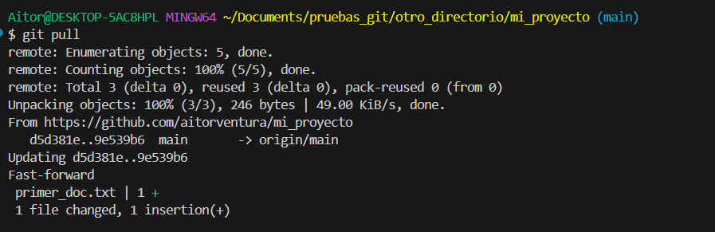

**Qué estás viendo en la captura:** `git pull` integrando un cambio hecho desde la web de GitHub. La salida muestra el fast-forward y las estadísticas del archivo modificado (`1 insertion(+)`).

!!! warning "¿Y si `git pull` genera un conflicto?"
    Si tú has modificado un archivo en local y mientras tanto alguien (o tú mismo desde la web) ha modificado el mismo archivo en el remoto, `git pull` no puede fusionarlos automáticamente y para con un error de conflicto.

    El proceso para resolverlo es el mismo que viste en la sección de ramas: abre el archivo, edita las marcas `<<<<<<<` / `=======` / `>>>>>>>`, guarda, haz `git add` del archivo resuelto y cierra con `git commit`.

---

## 🌳 Las ramas en el repositorio remoto

Todo lo que aprendiste sobre ramas funciona igual en el remoto. Cuando creas una rama local y haces commits en ella, esos cambios solo existen en tu ordenador hasta que los subes explícitamente.

Para publicar una rama en GitHub:

```bash
git switch -c nueva-funcionalidad   # crea la rama y cambia a ella
# ... trabajas, haces commits ...
git push -u origin nueva-funcionalidad  # la primera vez
git push                                # las siguientes veces
```

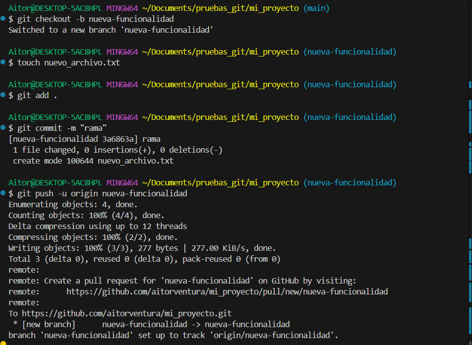

**Qué estás viendo en la captura:** creación de la rama con `git switch -c`, commits locales, y finalmente `git push -u origin nueva-funcionalidad` con el aviso `[new branch]` confirmando que ha llegado al servidor.

En la web de GitHub, el selector de ramas (arriba a la izquierda del código) mostrará todas las ramas subidas. Puedes navegar por ellas para ver su historial o iniciar una Pull Request.

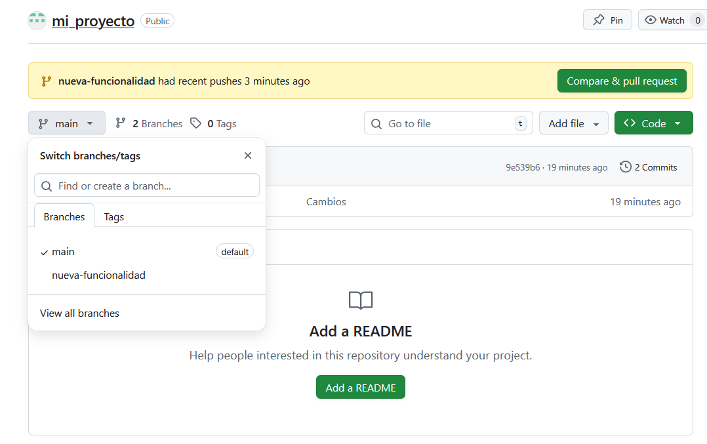

**Qué estás viendo en la captura:** el selector de ramas de GitHub mostrando `main` y `nueva-funcionalidad` disponibles.

### Borrar ramas en remoto

Una vez que la rama está fusionada en `main` y la has borrado en local, es buena práctica borrarla también del servidor:

```bash
git push origin --delete nueva-funcionalidad
```

También puedes hacerlo desde la web de GitHub en la sección *Branches* → icono de papelera.

---

## 📬 Pull Requests: proponer cambios para revisión

Una **Pull Request** (PR) es una petición que abres en GitHub para que alguien revise tu rama antes de fusionarla en `main`. Es el mecanismo central del trabajo colaborativo: en lugar de fusionar directamente, propones los cambios y el equipo los discute, comenta y aprueba antes de integrarlos.

El flujo habitual con PRs es:

1. Subes tu rama al remoto con `git push -u origin mi-rama`.
2. En GitHub aparece un aviso automático con el botón **"Compare & pull request"**. Haz clic ahí.
3. Escribe un título y una descripción explicando qué has cambiado y por qué.
4. Tu compañero (o tú mismo en proyectos personales) revisa los cambios en la pestaña **"Files changed"**, donde se ven las líneas añadidas en verde y las borradas en rojo.
5. Si todo está bien, se pulsa **"Merge pull request"** y los cambios pasan a `main`.
6. La rama puede borrarse automáticamente después del merge.

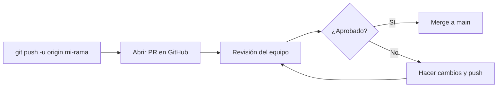

!!! tip "Recuerda"
    Las PRs no son solo para equipos grandes. Usarlas en proyectos propios te da historial de decisiones, revisión antes de integrar y una forma ordenada de trabajar por funcionalidades.

---

## 📋 Flujo de trabajo habitual

Este es el ciclo típico de un día de trabajo:

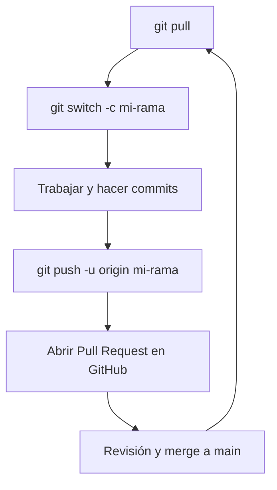

1. **Actualizarte** antes de empezar:
   ```bash
   git pull
   ```
2. **Crear una rama** para el cambio que vas a hacer:
   ```bash
   git switch -c mi-rama
   ```
3. **Trabajar y commitear** con frecuencia:
   ```bash
   git add .
   git commit -m "Añade pantalla de login"
   ```
4. **Publicar la rama** en GitHub:
   ```bash
   git push -u origin mi-rama
   ```
5. **Abrir una Pull Request** en GitHub y esperar revisión antes de fusionar en `main`.

---

## 💻 Integración de Git y GitHub en IntelliJ IDEA

IntelliJ IDEA incorpora soporte nativo para Git y GitHub, lo que permite hacer la mayoría de operaciones desde la interfaz sin usar la terminal.

### Enlazando tu cuenta

1. Abre **File → Settings** (o **Edit → Preferences** en Mac).
2. Ve a **Version Control → GitHub**.
3. Pulsa `+` → **Log in via GitHub** (abre el navegador para autorizar) o introduce tu Token PAT.

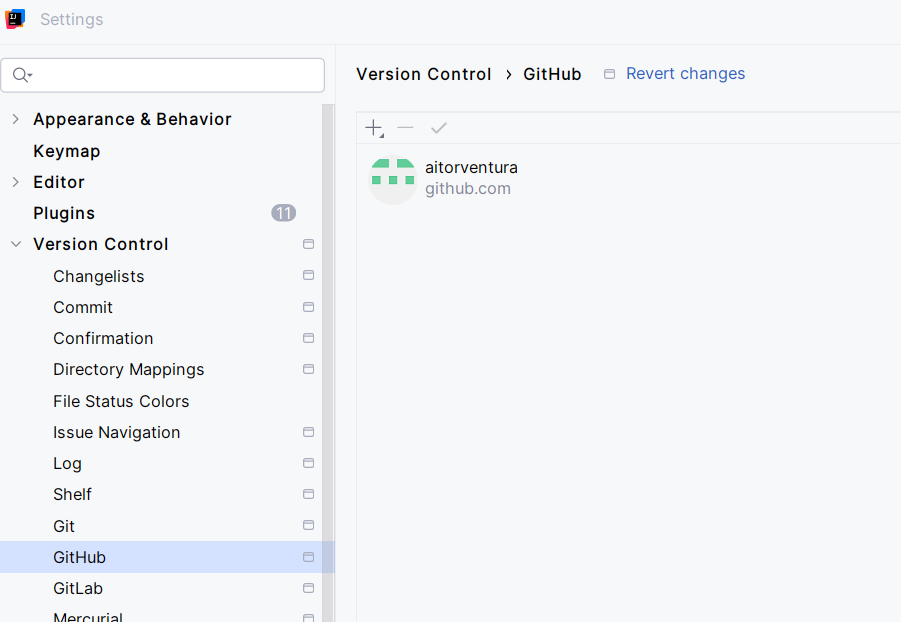

**Qué estás viendo en la captura:** la pantalla de ajustes con la cuenta de GitHub ya vinculada al IDE.

### El menú Git

Con un proyecto abierto que tenga `git init`, verás el menú **Git** en la barra superior. Desde ahí tienes acceso a las operaciones principales:

**A) Commit** — Abre un panel donde puedes marcar los archivos a añadir al staging y escribir el mensaje del commit. A la derecha se muestra el diff visual con las líneas añadidas y borradas.

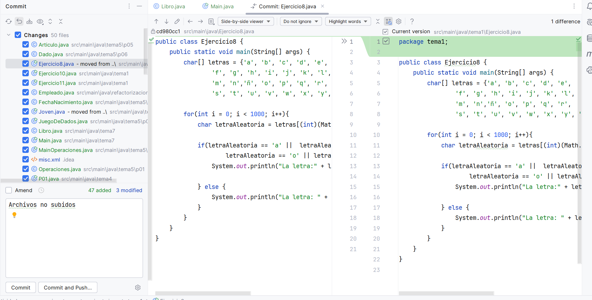

**Qué estás viendo en la captura:** el panel de Commit con los archivos seleccionados para el staging, el campo del mensaje y el visor de diferencias a la derecha.

**B) Push** (`Ctrl+Shift+K`) — Muestra los commits pendientes de subir y hacia qué rama de `origin` van. Confirma antes de enviar.

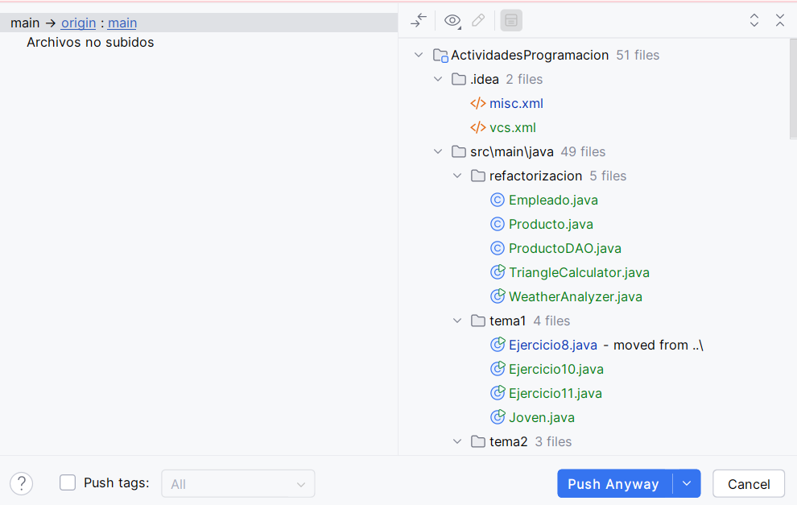

**Qué estás viendo en la captura:** el diálogo de Push indicando la rama origen, la rama destino en `origin` y los commits que van a enviarse.

**C) Pull / Fetch** — Descarga e integra los cambios del remoto en tu rama actual.

### Gestión de ramas en IntelliJ

Desde **Git → Branches** puedes ver todas las ramas locales y remotas, crear una nueva rama (`New Branch`, equivale a `git switch -c`), y cambiar entre ellas.

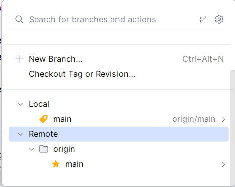

**Qué estás viendo en la captura:** el panel de ramas con las secciones Local y Remote, y el botón `+ New Branch` para crear una rama directamente desde el IDE.

La terminal y el IDE son complementarios: la terminal da control total; el IDE acelera las operaciones del día a día.

---

## ✅ Ideas clave (muy resumidas)

!!! tip "Resumen"
    - `git remote add origin <url>` — vincula tu repositorio local con el remoto. `origin` es el alias que le damos a la URL.
    - `git remote -v` — comprueba a qué dirección remota apunta tu proyecto.
    - `git push -u origin <rama>` — sube la rama por primera vez y la vincula para futuros pushes.
    - `git push` — sube los commits de la rama actual al remoto.
    - `git clone <url>` — descarga un repositorio completo en una carpeta nueva.
    - `git fetch` — descarga el estado del remoto sin modificar tus archivos locales.
    - `git pull` — descarga y aplica los cambios del remoto en tu rama actual.
    - `git push origin --delete <rama>` — borra una rama del repositorio remoto.
    - Una **Pull Request** es una propuesta de fusión que el equipo revisa antes de integrar en `main`.
