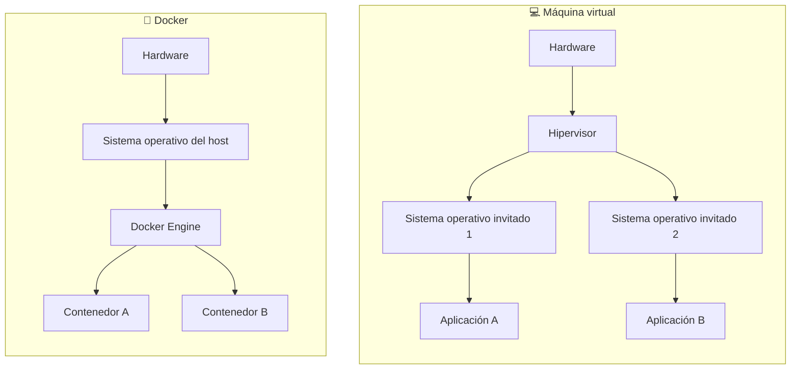
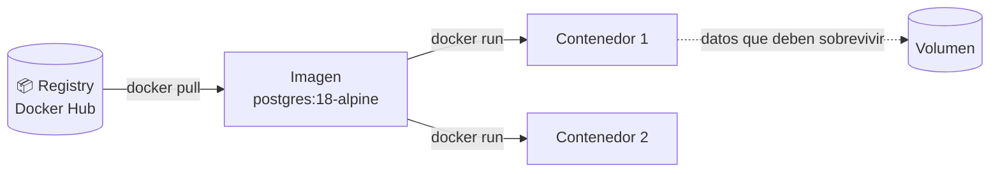

# 🐳 1. Introducción a Docker

{ type=application/pdf style="width:100%;min-height:80vh" }

!!!info "Descarga de diapositivas"
    [Descarga las diapositivas](diapositivas/introduccion-docker.pdf){target="_blank" rel="noopener"}

---

Durante el curso vas a trabajar con varios motores de bases de datos a la vez (relacional, documental, en memoria...) y con herramientas auxiliares que necesitan su propio servidor. Instalar todo eso directamente en tu ordenador —con las versiones correctas, sin que choquen entre sí, e igual en el instituto que en casa— es un dolor de cabeza. **Docker** resuelve exactamente ese problema, y lo vamos a usar durante todo el módulo para levantar y gestionar el proyecto del curso.

---

## 🧠 ¿Qué es Docker?

**Docker** es una herramienta que permite ejecutar aplicaciones dentro de **contenedores**: entornos aislados y ligeros que incluyen todo lo que la aplicación necesita para funcionar (código, dependencias, configuración) sin tocar el sistema operativo de tu máquina.

!!! tip "Metáfora: una caja estanca"
    Piensa en un contenedor como una caja sellada que lleva dentro exactamente lo que necesita para funcionar. No importa si tu ordenador tiene Windows, macOS o Linux, ni qué versión de Python o de PostgreSQL tengas instalada: dentro de la caja siempre es el mismo entorno.

### El problema que resuelve

Sin Docker, instalar el entorno de un proyecto suele terminar así:

- "En mi ordenador funciona, en el tuyo no" — porque tenéis versiones distintas de la base de datos.
- Necesitas PostgreSQL para un proyecto y MongoDB para otro, con versiones incompatibles entre sí.
- Desinstalar un servicio deja archivos de configuración y datos sueltos por todo el sistema.
- Configurar un ordenador nuevo (o el del instituto) desde cero lleva media mañana.

Con Docker, cada servicio vive en su propio contenedor: se instala con un comando, se borra con otro, y no deja rastro en tu sistema si no quieres.

---

## 🆚 Docker vs. máquina virtual

Es habitual confundir contenedores con máquinas virtuales, pero no comparten recursos de la misma forma:



Cada máquina virtual carga un sistema operativo completo propio, lo que la hace pesada y lenta de arrancar. Los contenedores comparten el kernel del sistema operativo del host y solo empaquetan la aplicación y sus dependencias: por eso arrancan en segundos y pesan una fracción de una máquina virtual equivalente.

Ojo con una idea equivocada bastante común: Docker no sustituye a tu sistema operativo, ni monta una máquina virtual completa por debajo. Sigues teniendo un único Windows, macOS o Linux instalado; lo único que hace Docker es añadir una capa para ejecutar aplicaciones aisladas dentro de ese sistema. Lo que sustituye, en realidad, es la costumbre de instalar el programa directamente en tu máquina.

---

## 🧩 Conceptos clave

Antes de tocar un solo comando, conviene tener claras cinco palabras que vas a ver todo el rato: imagen, contenedor, registry, volumen y puerto mapeado.

### Imagen: la plantilla que no cambia

Una **imagen** es un paquete de solo lectura con todo lo necesario para arrancar un programa: el sistema base, el software instalado y la configuración de fábrica. `postgres:18-alpine` es una imagen: PostgreSQL en su versión 18, construida sobre una base Linux minimalista (`alpine`). Una imagen no se modifica una vez creada — si necesitas cambiar algo, construyes una imagen nueva, no editas la que ya existe. Por eso se dice que es **inmutable**.

### Contenedor: la imagen puesta en marcha

Un **contenedor** es lo que resulta de arrancar una imagen: un proceso en ejecución, aislado del resto de tu sistema, con su propio sistema de archivos y su propia red. Puedes arrancar varios contenedores a partir de la misma imagen — por ejemplo, dos contenedores de `postgres:18-alpine` con datos completamente distintos — y no se pisarán entre sí porque cada uno vive en su burbuja.

!!! example "La imagen es la receta; el contenedor, el pastel horneado"
    La **imagen** es como la receta de un pastel: un documento fijo que no cambia. El **contenedor** es el pastel que sale del horno al seguir esa receta. Con la misma receta puedes hornear tantos pasteles como quieras, y cada uno es un pastel independiente — si te comes uno, los demás siguen intactos.

Esta es la relación entre los cuatro conceptos, de dónde sale una imagen a dónde van a parar sus datos:



### Volumen: lo único que sobrevive al contenedor

Un contenedor está pensado para poder borrarse y recrearse sin drama, y ahí está la trampa: si una base de datos guarda sus ficheros solo dentro del contenedor, al eliminarlo pierdes todos los datos con él. Un **volumen** es justo lo contrario: un espacio de almacenamiento que Docker gestiona por fuera del contenedor, así que sobrevive aunque el contenedor se borre y se vuelva a crear desde cero. Es como guardar tus fotos en una nube en vez de en el propio ordenador: si el ordenador se estropea, las fotos siguen ahí.

### Registry: de dónde salen las imágenes

Un **registry** es un servidor donde la gente publica imágenes para que otros las descarguen, algo parecido a una tienda de aplicaciones pero para contenedores. **Docker Hub** es el registry público más usado, y ahí es donde viven las imágenes oficiales que vas a usar en este módulo (`postgres`, `mongo`, `redis`...). Cuando ejecutas `docker pull postgres:18-alpine`, le estás pidiendo a Docker Hub exactamente esa imagen.

### Puerto mapeado: cómo entrar en algo que está aislado

Por defecto, un contenedor está aislado de la red de tu ordenador — nada de fuera puede hablar con lo que hay dentro, ni falta que hace la mayoría de las veces. El problema es que sí necesitas conectarte tú, desde tu máquina, a la base de datos que corre ahí dentro. Un **puerto mapeado** abre una puerta concreta entre los dos: asocia un puerto de tu máquina con el puerto en el que escucha el servicio dentro del contenedor, para que puedas llegar hasta él desde fuera.

Resumen en una frase por concepto, para consulta rápida:

| Concepto | En una frase |
|---|---|
| **Imagen** | Plantilla inmutable de la que se crean contenedores. |
| **Contenedor** | Una imagen puesta en marcha; puede haber varios a la vez. |
| **Registry** | Servidor donde se publican y descargan imágenes (Docker Hub). |
| **Volumen** | Almacenamiento fuera del contenedor que sobrevive a su borrado. |
| **Puerto mapeado** | Puerta entre un puerto de tu máquina y uno del contenedor. |

---

## ⚙️ Comandos básicos de Docker

No hace falta memorizarlos, pero conviene reconocerlos:

| Comando | Qué hace |
|---|---|
| `docker pull <imagen>` | Descarga una imagen desde un registry (Docker Hub por defecto). |
| `docker images` | Lista las imágenes descargadas en tu máquina. |
| `docker run <imagen>` | Crea y arranca un contenedor a partir de una imagen. |
| `docker ps` | Lista los contenedores en ejecución. `docker ps -a` incluye también los detenidos. |
| `docker stop <contenedor>` | Detiene un contenedor en ejecución sin borrarlo. |
| `docker rm <contenedor>` | Elimina un contenedor detenido. |
| `docker logs <contenedor>` | Muestra la salida (logs) de un contenedor. |

---

## 🧵 Docker Compose: orquestar varios contenedores a la vez

Un proyecto real casi nunca necesita un único contenedor: necesita una base de datos relacional, quizás una documental, una caché en memoria, un gestor de colas... Arrancar cada uno a mano con `docker run` y recordar todas sus opciones (puertos, variables de entorno, volúmenes) no escala.

**Docker Compose** resuelve esto con un fichero `docker-compose.yml`: describes todos los servicios que tu proyecto necesita, en un único fichero declarativo, y Docker se encarga de crearlos, conectarlos y arrancarlos juntos con un solo comando.

---

## Un `docker-compose.yml` sencillo: una sola base de datos

Para practicar no hace falta arrancar cinco servicios a la vez. El caso más simple posible tiene uno solo — una base de datos PostgreSQL con sus datos guardados en un volumen:

```yaml
services:
  db:
    image: postgres:18-alpine
    environment:
      POSTGRES_USER: alumno
      POSTGRES_PASSWORD: alumno123
      POSTGRES_DB: prueba
    ports:
      - "5432:5432"
    volumes:
      - db_data:/var/lib/postgresql/data

volumes:
  db_data:
```

Con esto guardado como `docker-compose.yml` y ejecutando `docker compose up -d`, Docker descarga la imagen `postgres:18-alpine` si no la tienes ya, crea el contenedor `db`, le pasa usuario, contraseña y nombre de base de datos por `environment`, abre el puerto `5432` de tu máquina hacia el `5432` del contenedor, y guarda los datos en el volumen `db_data` para que sobrevivan aunque el contenedor se recree. Te conectarías desde cualquier cliente (DBeaver, `psql`, tu propio código) a `localhost:5432` con esas credenciales.

!!! tip "Si ya tienes PostgreSQL instalado en tu máquina"
    Aquí el puerto no se ha remapeado (`5432:5432`, el mismo número a los dos lados). Si tu ordenador ya tiene un PostgreSQL local escuchando ahí, este contenedor chocará con él — en ese caso, cambia el primer número, por ejemplo a `"5444:5432"`, y conéctate a `localhost:5444`.

Este ejemplo tiene un único servicio, así que no hace falta que hable con nadie más. En cuanto un proyecto necesita dos o más —por ejemplo, una aplicación web y su propia base de datos—, entran en juego dos cosas que aquí no se ven: los contenedores se dirigen unos a otros por red usando el **nombre del servicio** como si fuera una dirección, y `depends_on` decide en qué orden arrancan. Vas a practicar exactamente esto en la Actividad 0.6, montando un WordPress completo con su base de datos.

---

## 🚀 Comandos básicos de Docker Compose

Con el fichero `docker-compose.yml` en la raíz del proyecto:

| Comando | Qué hace |
|---|---|
| `docker compose up -d` | Crea y arranca todos los servicios definidos. `-d` los deja corriendo en segundo plano (*detached*). |
| `docker compose ps` | Lista los servicios del proyecto y su estado. |
| `docker compose logs -f <servicio>` | Muestra los logs de un servicio en tiempo real (`-f` de *follow*). |
| `docker compose stop` | Detiene todos los servicios sin eliminarlos. |
| `docker compose down` | Detiene y elimina los contenedores y la red creada. Los volúmenes con nombre **no** se borran. |
| `docker compose down -v` | Igual que `down`, pero además elimina los volúmenes — borra también los datos. Úsalo solo si quieres empezar de cero. |

!!! danger "`down -v` borra los datos de verdad"
    Si tienes datos importantes en tus bases de datos de desarrollo, `docker compose down -v` los elimina sin posibilidad de recuperarlos. Para un reinicio normal, usa `docker compose down` (sin `-v`) o `docker compose stop`.

---

## ✅ Ideas clave

??? tip "Abrir resumen"

    - **Docker** ejecuta aplicaciones en **contenedores**: entornos aislados y ligeros, más rápidos y baratos que una máquina virtual porque comparten el kernel del sistema operativo del host.
    - Una **imagen** es la plantilla inmutable (la receta); un **contenedor** es una instancia en ejecución de esa imagen (el pastel horneado).
    - Un **volumen** guarda datos fuera del contenedor para que sobrevivan a su borrado; sin volumen, los datos de una base de datos desaparecen si el contenedor se elimina.
    - **Docker Compose** describe varios contenedores relacionados en un único `docker-compose.yml` y los levanta todos juntos con `docker compose up -d`.
    - En un `docker-compose.yml`, cada entrada bajo `services:` es un contenedor; `ports` mapea `host:contenedor`; `volumes` puede montar una carpeta local (bind mount) o un volumen con nombre gestionado por Docker; `environment` pasa variables de configuración; `depends_on` fija el orden de arranque (no espera a que el servicio esté listo, solo a que arranque).
    - `docker compose down` para y elimina contenedores pero conserva los volúmenes; `docker compose down -v` también borra los datos.
