<a id="intro-git"></a>

# 🧩 1. Introducción a Git (local): control de versiones desde cero

{ type=application/pdf style="width:100%;min-height:80vh" }

!!!info "Descarga de diapositivas"
    [Descarga las diapositivas](diapositivas/introduccion-git.pdf){target="_blank" rel="noopener"}

---

## 🧠 ¿Qué es Git?

**Git** es un **sistema de control de versiones**.

Eso significa que Git sirve para:

- llevar el **historial** de un proyecto (qué cambios se han hecho),
- saber **cuándo** se hicieron y **quién** los hizo,
- y poder **volver atrás** si algo se rompe.

!!! tip "Metáfora: máquina del tiempo"
    Git es como una máquina del tiempo para tu proyecto: puedes guardar "puntos" y viajar a versiones anteriores.

---

## 🧯 ¿Por qué necesitamos control de versiones?

Sin Git, cuando programamos suele pasar esto:

- "Antes funcionaba… ¿qué he tocado?"
- "Voy a guardar una copia por si acaso" → `final.zip`, `final_final.zip`, `ahora_si.zip`
- "He mezclado cambios de varias cosas y ya no sé separar lo que hice"
- "He borrado algo importante sin querer"

Git resuelve todo eso porque crea un historial **ordenado** y **recuperable**.

---

## 🕹️ Qué es un commit (y por qué es tan importante)

Un **commit** es un **punto de guardado** del proyecto.

### Metáfora: "guardar partida"
Como en un videojuego:

- estás jugando (programando),
- llegas a un punto estable,
- guardas la partida → haces un **commit**,
- si luego la lías, vuelves a esa partida.

### ¿Qué lleva un commit?
- una "foto" del estado de los archivos,
- el **autor** (tu nombre/email),
- la **fecha**,
- y un **mensaje**.

!!! tip "Mensajes de commit"
    Un mensaje debe decir **qué** has hecho y **para qué**.  
    Ejemplos buenos:

    - "Añade lista inicial de libros"
    - "Corrige cálculo del total con descuento"
    - "Añade validación de email en registro"

---

## 🧺 La idea que más cuesta: *staging* (la bandeja)

Cuando trabajas con Git, no guardas cambios "a lo bruto". Git te obliga (para bien) a pasar por un paso intermedio antes del commit: el **staging**.

Piensa que Git no funciona como un "guardar" de Word. Funciona más como:

1) **trabajo y ensayo** (cambio cosas),

2) **selecciono lo que quiero guardar como versión**,

3) **guardo esa versión** con un mensaje.

Ese paso 2 es el *staging*.

---

### 🧠 ¿Qué es exactamente el *staging*?

El **staging area** (también llamado **index**) es una especie de **lista de cambios seleccionados** que van a entrar en el **próximo commit**.

- Todo lo que está en *staging* = "esto sí lo voy a guardar ahora".
- Todo lo que NO está en *staging* = "esto todavía no".

!!! warning "Recordatorio"
    El commit no guarda "lo que tengas en la carpeta", guarda **lo que hayas puesto en staging**.

---

### 🧾 Metáfora: escritorio, bandeja y álbum

- **Escritorio** (*working directory*): donde editas, pruebas y rompes cosas.
- **Bandeja** (*staging area*): donde colocas lo que ya está listo para quedar "registrado".
- **Álbum** (*historial*): donde quedan guardadas las versiones (commits).

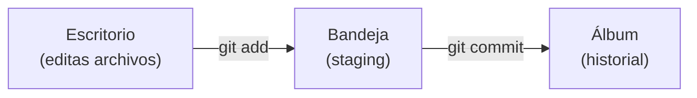

!!! tip "Traducción a comandos"
    - `git add` = "pon esto en la bandeja"
    - `git commit` = "pega lo de la bandeja en el álbum"

---

### 🤔 ¿Por qué existe la bandeja?

Porque en la vida real **los cambios se mezclan**.

Imagina que, mientras arreglas una cosa, también tocas otras:

- arreglas un bug en `Pedido.java`,
- cambias un texto del `README.md`,
- retocas un CSS porque lo ves feo.

Si haces un commit con TODO mezclado, el historial se vuelve difícil de usar:

- no se entiende qué se hizo,
- si un día quieres deshacer "solo el bug", arrastras lo demás,
- y revisar cambios en equipo se vuelve un lío.

Con staging puedes separar el trabajo en commits con sentido:

!!! info "Ejemplo"
    "Ahora guardo el bug. Después guardo el README. Después el CSS."

---

### ✅ Ejemplo práctico: commits limpios (uno por idea)

Supón que has tocado 3 archivos:

- `Pedido.java` (bug)
- `README.md` (texto)
- `styles.css` (estilo)

#### ❌ Lo típico que NO interesa
```bash
git add .
git commit -m "Cambios"
```

Este commit es un "batiburrillo": mezcla cosas y luego cuesta entenderlo o deshacerlo.

!!! warning "git add ."
    `git add .` añade al área de staging TODOS los documentos nuevos o modificados desde el último commit.

#### ✅ Lo recomendable con staging

**1) Guardas solo el bug**
```bash
git add Pedido.java
git commit -m "Corrige bug en cálculo de pedido"
```

**2) Guardas el README**
```bash
git add README.md
git commit -m "Actualiza instrucciones del proyecto"
```

**3) Guardas el CSS**
```bash
git add styles.css
git commit -m "Mejora estilos del layout"
```

!!! tip "Qué ganas con esto"
    - Historial claro (se entiende de un vistazo).
    - Más fácil deshacer cambios "por partes".
    - Revisiones más rápidas y seguras.

---

### 🔍 ¿Cómo sé qué está en la bandeja y qué no?

Usa `git status`.

- **Changes to be committed** → está en staging (bandeja).
- **Changes not staged for commit** → está modificado, pero fuera de staging (escritorio).

```bash
git status
```

!!! warning "Regla de oro"
    Antes de commitear, mira `git status` para comprobar qué vas a guardar.

---

### 🎯 Idea final para que se te quede

**Staging = elegir.**

Git te da un botón mental de:

- "esto sí entra en el próximo commit"
- "esto todavía no"

Y esa es la razón por la que Git ayuda a trabajar **ordenado** incluso cuando tú vas tocando cosas sobre la marcha.


---

## 🧩 Estados de un archivo (lo que te cuenta `git status`)

Los archivos en Git suelen estar en estos estados:

- **Untracked**: Git ve el archivo, pero aún no lo sigue (es nuevo).
- **Modified**: lo has cambiado desde el último commit.
- **Staged**: lo has puesto en la bandeja para el próximo commit.
- **Committed**: ya está guardado en el historial.

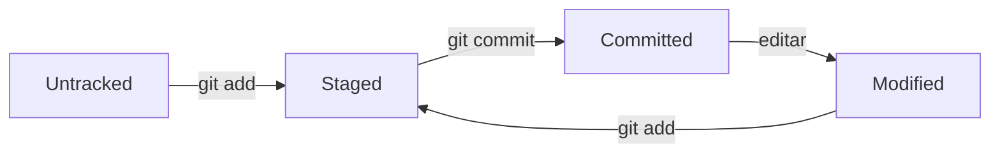

!!! example "Ejemplo rápido"
    - Creas `hola.txt` → **untracked**
    - `git add hola.txt` → **staged**
    - `git commit ...` → **committed**
    - Editas `hola.txt` → **modified**

---

## 🧰 Instalación de Git (si no lo tienes)

Antes de hacer nada, necesitamos que el comando `git` exista en tu ordenador.

### 1) Comprobar si ya está instalado

Abre una terminal y ejecuta:

```bash
git --version
```

- ✅ Si te devuelve algo tipo `git version 2.4x.x`, **ya lo tienes**.
- ❌ Si sale un error tipo "command not found", "no se reconoce…", etc., **hay que instalarlo**.

!!! tip "¿Qué significa la versión?"
    No necesitas la última. Si te funciona `git --version`, para clase te vale.

---

### 🪟 Windows 

La opción más sencilla es **Git for Windows** (incluye **Git Bash**).

Instala **Git for Windows** desde aquí:  
[Git for Windows (instalación oficial)](https://git-scm.com/install/windows)

**Qué instalar y qué te aporta**

- Instalas Git.
- Te aparece **Git Bash**, una terminal "tipo Linux" que va genial para empezar.

**Después de instalar**

1. Abre **Git Bash** (mejor que PowerShell al principio).
2. Comprueba:

```bash
git --version
```

**Si en PowerShell no funciona**

A veces Git está instalado, pero la terminal no lo encuentra por el PATH. La prueba rápida:

- Si en Git Bash funciona y en PowerShell no, para el curso usa Git Bash.
- Si quieres arreglarlo, revisa el instalador y asegúrate de seleccionar que Git se añada al PATH.

!!! warning "Carpetas sincronizadas"
    Evita crear repositorios dentro de OneDrive/Google Drive/iCloud: pueden aparecer cambios "fantasma" al cambiar de versión.

---

### 🍎 macOS

En macOS, a menudo Git viene "a medio instalar".

Prueba:

```bash
git --version
```

- Si macOS te pide instalar **Command Line Tools**, acepta.  
- Cuando termine, vuelve a ejecutar `git --version`.

---

### 🐧 Linux (Debian/Ubuntu)

```bash
sudo apt update
sudo apt install git
git --version
```

---

## ⚙️ Configuración básica (una vez)

Git guarda en cada commit quién lo hizo. Para eso necesita tu nombre y email.

### 👤 1) Nombre y email (global)

```bash
git config --global user.name "Tu Nombre"
git config --global user.email "tuemail@ejemplo.com"
```

Comprueba la configuración:

```bash
git config --global --list
```

!!! warning "Muy típico"
    Si Git te dice "Please tell me who you are…", es que falta `user.name` o `user.email`.

---

### 🌿 2) Rama por defecto: `main`

Hoy lo más común es usar `main` como rama principal (en vez de `master`).

```bash
git config --global init.defaultBranch main
```

Esto afecta a repos nuevos que crees a partir de ahora.

---

### 🧾 3) Editor por defecto (opcional, recomendado)

A veces Git necesita que escribas un mensaje (por ejemplo, en operaciones que verás más adelante).  
Para que no se abra un editor raro, puedes fijar uno. Con VS Code:

```bash
git config --global core.editor "code --wait"
```

---

## 🧱 Crear un repositorio: `git init` 

Para que Git empiece a guardar el historial de un proyecto, primero necesitas un **repositorio**: una carpeta "con Git activado".

### ✅ Paso 1) Entra en la carpeta del proyecto
```bash
cd ~/Documents/pruebas_git
```

### ✅ Paso 2) Inicializa Git
```bash
git init
```

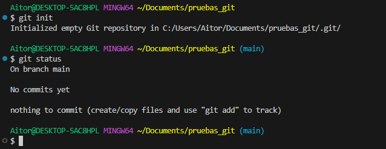

**Qué estás viendo en la captura**

- Git confirma que ha creado un repositorio vacío en la carpeta `.git/`.
- A continuación se ejecuta `git status` y aparece:

    - `On branch main` → estás en la rama `main`.
    - `No commits yet` → todavía no has hecho ningún commit.
    - `nothing to commit (create/copy files and use "git add" to track)` → aún no hay archivos preparados para guardar.

!!! info "¿Qué es la carpeta .git?"
    Es la "memoria" del repositorio: ahí Git guarda historial, ramas y metadatos.

!!! warning
    - No borres ni edites `.git` a mano.
    - Si eliminas `.git`, el proyecto pierde el historial (aunque los archivos sigan).

---

## 🧭 Los comandos esenciales 

La idea no es memorizar, sino **entender** qué hace cada comando y qué deberías ver en pantalla.

---

### 1) `git status` — el "¿qué está pasando?"

`git status` te dice **en qué situación está tu repo** y **en qué estado están tus archivos**.

```bash
git status
```

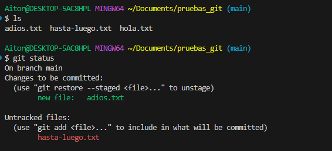

**Qué estás viendo en la captura**

- Se ejecuta `ls` y aparecen 3 archivos: `adios.txt`, `hasta-luego.txt`, `hola.txt`.
- Luego, `git status` muestra dos bloques importantes:

1) **Changes to be committed** (en staging / bandeja)  

   - `new file: adios.txt` → `adios.txt` está preparado para el próximo commit.

2) **Untracked files** (Git los ve, pero todavía NO los sigue)  

   - `hasta-luego.txt` aparece como untracked: existe en la carpeta, pero **aún no lo has añadido** con `git add`.

!!! tip "Regla de oro"
    Antes de hacer `git add` o `git commit`, mira `git status` para confirmar **qué vas a guardar**.

---

### 2) `git diff` — el "¿qué ha cambiado exactamente?"

`git diff` muestra cambios **línea a línea** respecto al último commit (o respecto al staging, según el caso).

```bash
git diff
```

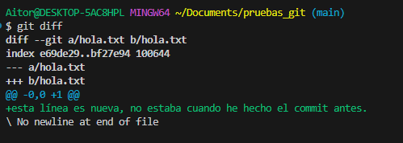

**Qué estás viendo en la captura**

- Git te enseña el archivo que cambió: `hola.txt`.
- La línea que empieza por `+` es lo nuevo que has añadido, por ejemplo:

    - `+esta linea es nueva, no estaba cuando he hecho el commit antes.`

!!! tip "¿Por qué usar diff?"
    - Para revisar cambios antes de guardarlos.
    - Para comprobar que no has tocado algo "sin querer".

---

### 3) `git add` — "pongo esto en la bandeja (staging)"

`git add` no guarda nada todavía: solo **prepara** archivos para el próximo commit.

Ejemplo (lo típico en tu caso):
```bash
git add adios.txt hola.txt
```

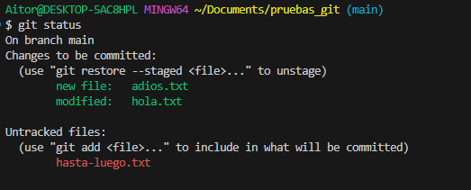

**Qué estás viendo en la captura (después del add)**

- En **Changes to be committed** aparecen:

    - `new file: adios.txt` → `adios.txt` está en staging.
    - `modified: hola.txt` → los cambios de `hola.txt` también están en staging.

- En **Untracked files** sigue apareciendo:
    - `hasta-luego.txt` → sigue sin estar "bajo control" porque no lo has añadido.

!!! warning "Cuidado con git add ."
    `git add .` mete en staging **todo** lo nuevo/modificado.  
    Al principio, es mejor añadir **archivo a archivo** para no llevarte cosas sin querer.

---

### 4) `git commit` — "guardo la partida"

`git commit` guarda en el historial **lo que esté en staging**.

```bash
git commit -m "Añado los archivos hola y adios"
```

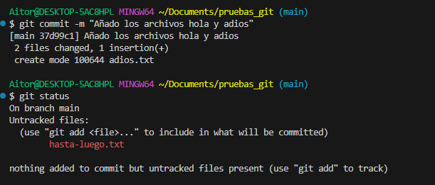

**Qué estás viendo en la captura**

- Git confirma el commit:
  
    - aparece el id (hash corto) del commit, y el mensaje.
    - `2 files changed...` y `create mode ... adios.txt` → creó `adios.txt` en el historial.
    
- Luego se ejecuta `git status` y ocurre algo clave:
  
    - `hasta-luego.txt` sigue en **Untracked files** → no se ha guardado porque **no estaba en staging**.

!!! tip "Idea clave"
    Un commit guarda **solo** lo que tú has puesto en staging con `git add`.

---

### 5) `git log` — "muéstrame el historial"

Para ver los commits que has hecho:

```bash
git log
```

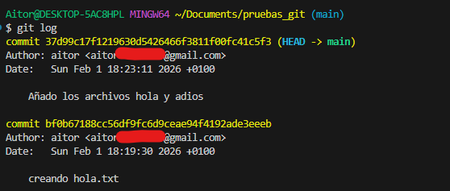

**Qué estás viendo en la captura**

- Los commits aparecen en orden, el más reciente arriba.
- `HEAD -> main` indica que estás en la rama `main` y que `HEAD` apunta al último commit.

Cada commit tiene un identificador único llamado **hash** — una cadena larga de letras y números como `a3f8c21d9e4b...`. No hace falta usarlo entero; con los 7 primeros caracteres es suficiente.

La versión más usada en el día a día es con `--oneline`, que muestra una sola línea por commit:

```bash
git log --oneline
```

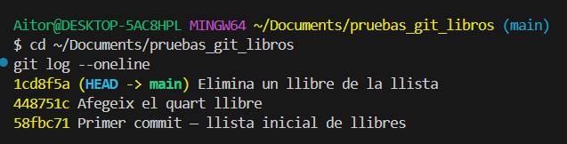

!!! tip "El hash abreviado"
    Los 7 caracteres del inicio de cada línea (`1cd8f5a`, `448751c`…) son los que usarás después en comandos como `git show` o `git revert`.

---

## ♻️ "Me he equivocado": descartar cambios (`git restore`)


### A) Descartar cambios de un archivo (volver al último commit)

Si modificas `hola.txt` y no quieres esos cambios:

```bash
git restore hola.txt
```

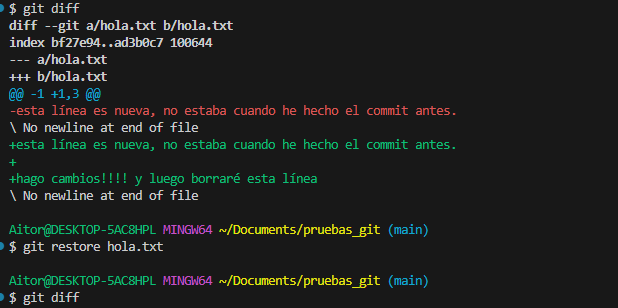

**Qué estás viendo en la captura**

1) Primero se ejecuta `git diff` y se ven varias líneas nuevas (`+...`) en `hola.txt`.

2) Luego se ejecuta `git restore hola.txt`.

3) Al volver a ejecutar `git diff`, **no sale nada** → significa que el archivo ha vuelto al estado del último commit.

!!! danger
    `git restore` borra cambios **no guardados** en commits.  
    Si esos cambios te importan, guarda antes (commit) o copia el archivo.

---

### B) Quitar un archivo del staging (sin borrar sus cambios): `git restore --staged`

Esto sirve cuando has hecho `git add` por error (lo metiste en staging), pero aún no has hecho commit.

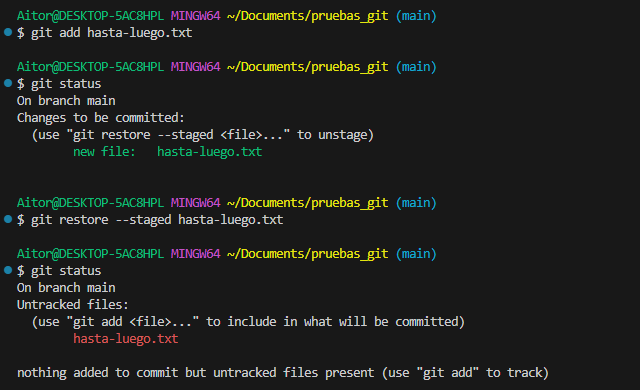

**Qué estás viendo en la captura**

1) `git add hasta-luego.txt` → lo mete en staging.  

2) `git status` muestra:

- `new file: hasta-luego.txt` en **Changes to be committed**.

3) `git restore --staged hasta-luego.txt` → lo saca del staging.

4) `git status` vuelve a mostrarlo como **Untracked files**.

!!! tip "Truco mental"
    - `restore --staged` = "saca de la bandeja"
    - `restore` (sin `--staged`) = "deshaz cambios del archivo"

---

## ⏪ Volver a una versión anterior

Esta es una de las razones principales por las que existe Git: poder recuperar el estado del proyecto en cualquier punto del historial. La pregunta clave antes de actuar es: **¿qué quiero exactamente?**

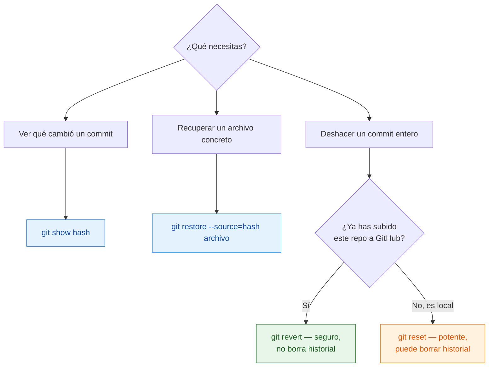

---

### Paso previo: ver el historial

Antes de hacer cualquier cosa, necesitas saber **qué commits tienes y cuáles son sus hashes**:

```bash
git log --oneline
```


Esos 7 caracteres al inicio de cada línea (`1cd8f5a`, `448751c`…) son el **hash abreviado** — el identificador único de cada commit. Los vas a necesitar para todos los comandos que siguen.

!!! info "¿Qué es HEAD?"
    `HEAD` es una etiqueta que señala el commit en el que estás ahora — normalmente el último. `HEAD~1` es el anterior, `HEAD~2` es dos atrás. Es una forma de referirse a commits sin escribir el hash exacto.

---

### Ver qué cambió en un commit concreto

Antes de deshacer nada, conviene ver exactamente qué hizo ese commit:

```bash
git show 58fbc71
```

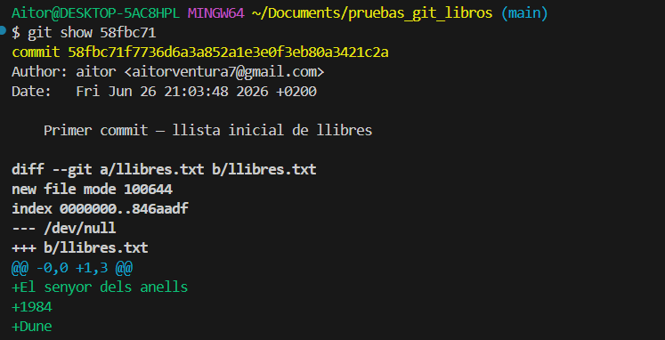

Las líneas con `+` son lo que ese commit añadió. Las líneas con `-` son lo que eliminó. Mientras solo ejecutas `git show`, **no cambias nada** en el proyecto.

---

### Opción A — Recuperar un archivo a como estaba antes

Esto es útil cuando **un archivo concreto** ha empeorado y quieres recuperarlo a una versión anterior, sin tocar el resto del proyecto.

```bash
git restore --source=58fbc71 llibres.txt
```

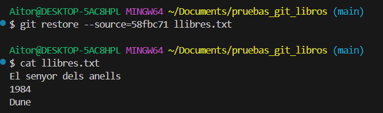

El archivo queda exactamente como estaba en el commit `58fbc71`. Aparece como **modified** en `git status` — los cambios están en tu carpeta de trabajo, pero el historial no ha cambiado. Puedes revisarlo y hacer un `git commit` si quieres guardar esa recuperación.

!!! warning "Esto no deshace el commit"
    Solo trae una versión antigua del archivo a tu carpeta. El historial no cambia. Para guardarlo definitivamente, tienes que hacer `git add` y `git commit` después.

---

### Opción B — Deshacer un commit completo (`git revert`)

`git revert` **crea un commit nuevo** que deshace exactamente los cambios de un commit anterior. Es la opción más segura: no borra nada del historial, solo añade un paso nuevo que revierte lo que se hizo.

```bash
git revert 1cd8f5a
```

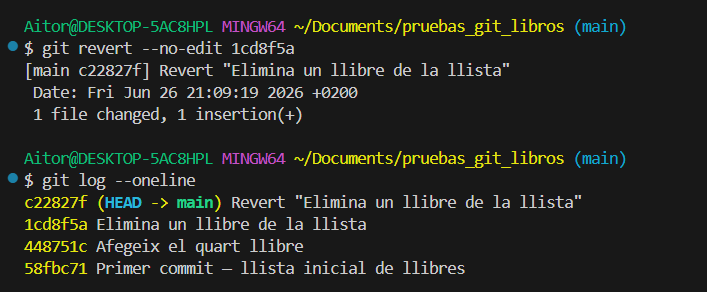

Git genera el mensaje del commit de reversión automáticamente. El historial queda así — el commit original sigue ahí, pero neutralizado:

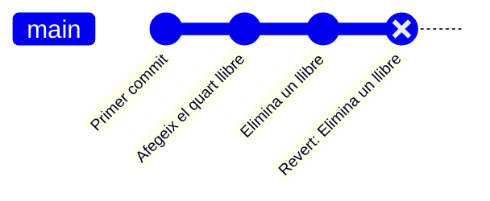

!!! tip "Cuándo usar revert"
    Siempre que hayas subido el repo a GitHub o trabajado con otras personas. Al no reescribir el historial, no crea conflictos con el trabajo de los demás.

---

### Opción C — Mover el repo a un commit anterior (`git reset`)

`git reset` mueve `HEAD` hacia atrás en el historial. Es más potente que `revert` porque **borra commits** — como si nunca hubieran existido. Solo se recomienda cuando el repo es estrictamente local y no lo ha visto nadie más.

**Situación de partida** — los tres ejemplos usan un repo con estos 3 commits:

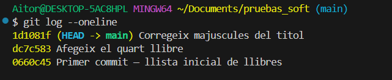

El commit más reciente ("Corregeix majuscules del titol") es el que va a desaparecer con el reset. Lo que cambia entre variantes es **adónde van sus cambios**.

<div class="tabs-colored" markdown>

=== "--soft — cambios en staging"

    El commit desaparece, pero Git deja los cambios **ya preparados para el siguiente commit** — como si ya hubieras hecho `git add`. Solo te faltaría escribir `git commit`.

    Caso típico: has hecho un commit con un mensaje mal escrito. Con `--soft` deshaces el commit, el archivo queda listo para commit y puedes volver a hacer `git commit -m "mensaje correcto"` sin tocar nada más.

    ```bash
    git reset --soft HEAD~1
    # A continuación puedes hacer directamente:
    git commit -m "mensaje correcto"
    ```

    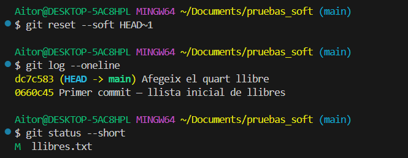

    `git status --short` muestra `M  llibres.txt` — la M está en la zona de **staging**. No hace falta `git add`.

=== "--mixed — cambios en el escritorio"

    El commit desaparece y los cambios vuelven al archivo, pero Git **no los prepara** para el siguiente commit. Es como si nunca hubieras hecho `git add`.

    Caso típico: quieres deshacer el commit y revisitar los cambios desde cero — decidiendo qué añadir y qué dejar fuera. Necesitas hacer `git add` de nuevo antes de poder hacer commit.

    ```bash
    git reset HEAD~1
    # A continuación necesitas:
    git add llibres.txt
    git commit -m "mensaje"
    ```

    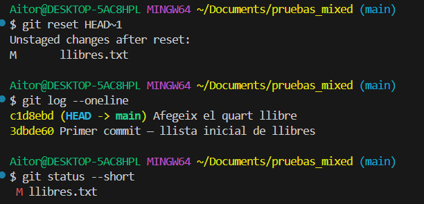

    Git avisa: `Unstaged changes after reset`. `git status --short` muestra ` M llibres.txt` — la M está en la zona de **trabajo** (fuera de staging). Necesitas `git add` antes de poder hacer commit.

=== "--hard — cambios borrados"

    El commit desaparece **y los cambios se borran definitivamente**. El proyecto vuelve exactamente al estado del commit anterior.

    ```bash
    git reset --hard HEAD~1
    ```

    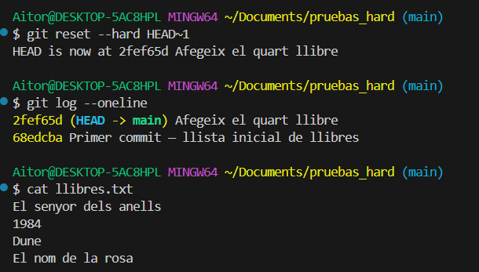

    Git confirma con `HEAD is now at ...`. El log pasa a 2 commits. `cat llibres.txt` muestra el archivo **sin la corrección de mayúsculas** — ese cambio ha desaparecido para siempre.

    !!! danger "Sin vuelta atrás"
        Con `--hard` los cambios del commit eliminado se pierden para siempre. No hay papelera ni deshacer. Úsalo solo si estás completamente seguro.

</div>

La diferencia entre las tres variantes se resume en una sola pregunta: **¿adónde van los cambios del commit eliminado?**

| Variante | ¿Adónde van los cambios? | `git status` muestra | ¿Recuperable? |
|---|---|---|---|
| `--soft` | Staging | `M  archivo` (M en zona staging) | Sí |
| `--mixed` | Escritorio de trabajo | ` M archivo` (M en zona trabajo) | Sí |
| `--hard` | Se borran | *(nada)* | No |

---

### ¿Cuál uso?

| Situación | Comando recomendado |
|---|---|
| Quiero ver qué cambió en un commit concreto | `git show <hash>` |
| Quiero recuperar un archivo a una versión anterior | `git restore --source=<hash> <archivo>` |
| Quiero deshacer un commit sin borrar historial | `git revert <hash>` |
| Quiero rehacer el último commit (solo local) | `git reset --soft HEAD~1` |
| Quiero borrar el último commit y sus cambios (solo local) | `git reset --hard HEAD~1` |

---

## 🚫 `.gitignore`: cosas que NO queremos guardar en el historial

El archivo `.gitignore` sirve para decirle a Git qué archivos o carpetas debe ignorar — aunque estén en la carpeta del proyecto, Git actuará como si no existieran.

Esto es útil para no incluir en el historial cosas que no tienen sentido versionar: archivos generados automáticamente, credenciales, binarios compilados o carpetas temporales.

Para crearlo, simplemente crea un archivo llamado `.gitignore` en la raíz del repositorio y añade reglas:

```gitignore
# Archivos de log
*.log

# Carpeta de archivos temporales
/tmp/

# Carpeta de compilación de Java
/target/
/out/
*.class

# Archivos de configuración del IDE (IntelliJ)
.idea/
*.iml

# Variables de entorno y credenciales — NUNCA deben subirse
.env
secrets.txt
```

Cada línea es un patrón:
- `*.log` → ignora cualquier archivo que acabe en `.log`
- `/tmp/` → ignora la carpeta `tmp` en la raíz del repo
- `.idea/` → ignora la carpeta de configuración de IntelliJ

!!! warning "Solo afecta a lo que aún no está en el historial"
    Si un archivo ya ha sido commiteado, añadirlo al `.gitignore` no lo elimina del historial. Para eso habría que usar `git rm --cached <archivo>` — un paso extra que veremos más adelante.

!!! tip "Plantillas listas para usar"
    En [gitignore.io](https://www.toptal.com/developers/gitignore) puedes generar un `.gitignore` completo para tu tipo de proyecto (Java, Node, Python…) con un solo clic.

---

## ✅ Ideas clave (muy resumidas)

??? tip "Abrir resumen"

    **Flujo habitual**

    - `git init` — crea un repositorio local (aparece `.git/`).
    - `git status` — qué está en staging, qué modificado y qué untracked.
    - `git diff` — qué cambió exactamente, línea a línea.
    - `git add <archivo>` — mete archivos en staging (bandeja).
    - `git commit -m "mensaje"` — guarda solo lo que esté en staging.
    - `git log` / `git log --oneline` — historial de commits.

    **Descartar cambios**

    - `git restore <archivo>` — deshace cambios del escritorio (vuelve al último commit).
    - `git restore --staged <archivo>` — saca del staging sin borrar los cambios.

    **Volver a una versión anterior**

    - `git show <hash>` — ver qué cambió en un commit concreto.
    - `git restore --source=<hash> <archivo>` — recuperar un archivo a una versión anterior.
    - `git revert <hash>` — deshacer un commit creando uno nuevo (seguro, no borra historial).
    - `git reset --soft HEAD~1` — deshacer el último commit, cambios en staging.
    - `git reset --hard <hash>` — volver a un punto borrando todo lo posterior (⚠ irreversible).

    **Ignorar archivos**

    - `.gitignore` — lista de archivos/carpetas que Git debe ignorar.


