# 🌿 2. Ramas en Git

{ type=application/pdf style="width:100%;min-height:80vh" }

!!!info "Descarga de diapositivas"
    [Descarga las diapositivas](diapositivas/ramas.pdf){target="_blank" rel="noopener"}

Las **ramas** son una de las características más útiles de Git. Permiten trabajar en una nueva funcionalidad, arreglar un error o hacer un experimento sin tocar el código que ya funciona. Cuando terminas, decides si integras ese trabajo o lo descartas.

Sin ramas, cualquier cambio a medias quedaría mezclado con el código estable. Con ramas, tienes tu propio espacio de trabajo aislado.

---

## 🌳 ¿Qué es una rama?

Piensa en el historial de commits como una línea de tiempo. Una rama es simplemente una **etiqueta que apunta a un commit concreto** y que avanza automáticamente cada vez que haces un nuevo commit estando en ella.

La rama por defecto se llama `main` (o `master` en repositorios más antiguos). Cuando creas una rama nueva, Git pone otra etiqueta en el mismo sitio donde estás tú en ese momento. A partir de ahí, cada rama puede avanzar de forma independiente.

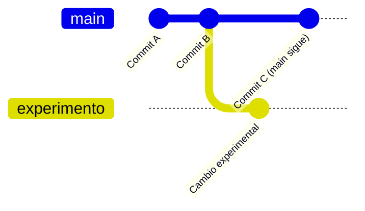

Lo que ves arriba: `main` y `experimento` parten del mismo punto (Commit B) y cada una avanza por su lado sin pisarse.

---

## 🔖 ¿Qué es HEAD?

`HEAD` es un puntero especial que indica **en qué rama (y commit) estás trabajando ahora mismo**. Lo verás constantemente en la salida de `git log`, `git status` y `git lga`.

!!! info "Idea clave"
    `HEAD -> main` significa: *"Estoy en la rama main, y el commit actual es este."*  
    Cuando cambias de rama con `git switch`, HEAD se mueve contigo.

---

## 🛠️ Comandos básicos

### Ver ramas

Para ver qué ramas tienes y en cuál estás (marcada con `*`):

```bash
git branch
```

### Crear una rama

Crea una nueva etiqueta en el commit actual, pero **no te mueves** a ella:

```bash
git branch nombre-de-la-rama
```

### Cambiar de rama

Para moverte a una rama existente:

```bash
git switch nombre-de-la-rama      # sintaxis moderna (recomendada)
git checkout nombre-de-la-rama    # sintaxis clásica, también funciona
```

!!! tip "¿Por qué existe git switch?"
    `git checkout` hacía demasiadas cosas distintas: cambiar de rama, recuperar archivos, moverse a un commit suelto… Era confuso. Git 2.23 introdujo `git switch` (solo para ramas) y `git restore` (solo para archivos) para separar responsabilidades. Ambas sintaxis funcionan, pero `switch` es más clara.

Para crear una rama y moverte a ella en un solo paso:

```bash
git switch -c nueva-rama        # moderno
git checkout -b nueva-rama      # clásico
```

### Borrar una rama

Cuando has terminado con una rama y ya has fusionado su trabajo:

```bash
git branch -d nombre-de-la-rama
```

!!! warning "git branch -d vs -D"
    Con `-d` (minúscula), Git **se niega a borrar** la rama si detecta que tiene commits que no están en ninguna otra rama — te está protegiendo de perder trabajo.  
    Con `-D` (mayúscula), borra sin preguntar aunque haya commits sin fusionar. Úsala solo cuando estás seguro de que quieres descartar ese trabajo.

### Tabla resumen

| Comando | Qué hace | Cuándo usarlo |
|---|---|---|
| `git branch` | Lista ramas | Para ver en cuál estás |
| `git branch <nombre>` | Crea rama | Antes de empezar algo nuevo |
| `git switch <nombre>` | Cambia de rama | Para moverte a otro contexto |
| `git switch -c <nombre>` | Crea y cambia | Atajo para los dos pasos anteriores |
| `git branch -d <nombre>` | Borra rama (seguro) | Tras fusionar |
| `git branch -D <nombre>` | Borra rama (forzado) | Para descartar trabajo intencionalmente |

---

## 👁️ Visualizando el historial (Alias `git lga`)

Para entender qué está pasando con las ramas, es vital ver el grafo de commits. El comando completo es largo:

```bash
git log --graph --oneline --all --decorate
```

Lo más práctico es crear un **alias** llamado `lga`. Ejecútalo una sola vez:

```bash
git config --global alias.lga "log --graph --oneline --all --decorate"
```

A partir de ahí, `git lga` te muestra un mapa visual de todas las ramas en cualquier repositorio.

---

## 🚀 Historia de una rama: el ciclo completo

Para ver cómo encaja todo, vamos a seguir un ejemplo paso a paso. Estás desarrollando una web y quieres experimentar con el color de fondo sin romper lo que ya funciona.

### 1. El punto de partida

Estás en `main`. Todo funciona. Compruebas dónde estás con `git status` y ves el historial con `git lga`.


**Qué estás viendo en la captura**

- Estás en `main` (`On branch main`).
- `HEAD -> main` en el log indica que es donde estás ahora mismo.

### 2. Creando la rama

Creas una rama para el experimento. Git pone una nueva etiqueta en el commit actual.

```bash
git branch experimento-fondo
```

Si miras el historial ahora, `main` y `experimento-fondo` apuntan al mismo commit. El asterisco (o el color) te recuerda que **todavía estás en main**.


**Qué estás viendo en la captura**

- Ambas etiquetas (`main` y `experimento-fondo`) están en el mismo punto.
- `HEAD -> main` confirma que aún no te has movido.

### 3. Moviéndote a la nueva rama

Ahora sí te mudas:

```bash
git switch experimento-fondo
```

Git te confirma el cambio con `Switched to branch 'experimento-fondo'`.


**Qué estás viendo en la captura**

- El mensaje `Switched to branch 'experimento-fondo'`.
- `git status` muestra `On branch experimento-fondo`.

### 4. Trabajando en la rama

Ahora cualquier commit que hagas afectará solo a esta rama. Modificas `estilos.css` y haces commit:

```bash
git add estilos.css
git commit -m "Fondo cambiado a rojo"
```

En este momento, `experimento-fondo` ha avanzado un commit. `main` no se ha movido.


**Qué estás viendo en la captura**

- `experimento-fondo` (donde está tu `HEAD`) aparece un nivel por delante.
- `main` se ha quedado en el commit anterior, intacta.

### 5. Volviendo a main

El experimento ha ido bien. Para fusionarlo, primero tienes que volver al destino:

```bash
git switch main
```

Si abres `estilos.css`, el fondo rojo ha desaparecido. No te asustes: tus cambios están seguros en `experimento-fondo`, Git simplemente ha restaurado los archivos al estado de `main`.

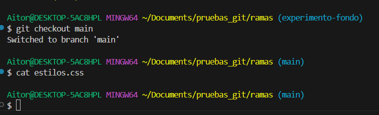

**Qué estás viendo en la captura**

- Has vuelto a `main`.
- El código de los archivos está exactamente como antes del experimento.

### 6. La fusión (`git merge`)

Estando en `main`, traes los cambios de la otra rama:

```bash
git merge experimento-fondo
```

Como `main` no ha avanzado mientras trabajabas, Git hace un **Fast-forward**: simplemente mueve la etiqueta `main` hasta donde está `experimento-fondo`. No crea ningún commit extra.


**Qué estás viendo en la captura**

- Git usa la estrategia **Fast-forward** porque no ha habido commits en `main` mientras tanto.
- Con `git lga` verás que `main` y `experimento-fondo` apuntan al mismo commit.

### 7. Limpieza

La rama ha cumplido su función. Su trabajo ya está en `main`. La borras:

```bash
git branch -d experimento-fondo
```


**Qué estás viendo en la captura**

- `Deleted branch experimento-fondo...` confirma el borrado.
- `git lga` muestra un solo flujo limpio en `main`.

---

## 🔗 Fusiones (Merges)

Cuando has terminado de trabajar en una rama, llega el momento de incorporar esos cambios a `main`. Eso es una fusión: le dices a Git "trae lo que hay en esta rama y mézclalo con lo que tengo aquí".

El comando siempre es el mismo — primero te sitúas en la rama destino, luego fusionas:

```bash
git switch main
git merge nombre-de-la-rama
```

Lo que cambia es cómo Git resuelve la fusión por dentro. Dependiendo de lo que haya ocurrido mientras trabajabas, Git puede encontrarse en dos situaciones muy distintas.

<div class="tabs-colored" markdown>

=== "Fast-forward — historial lineal"

    Ocurre cuando `main` **no ha avanzado** desde que creaste tu rama. Git simplemente mueve el puntero hacia adelante. El historial queda lineal y limpio, como si hubieras trabajado directamente en `main`.

    ```mermaid
    gitGraph
       commit id: "A"
       commit id: "B"
       branch feature
       checkout feature
       commit id: "C"
       commit id: "D"
       checkout main
       merge feature
    ```

    Es el caso más sencillo. No hace falta hacer nada especial: `git merge <rama>` lo detecta solo y no crea ningún commit extra.

=== "3-way merge — commit de unión"

    Ocurre cuando `main` **sí ha avanzado** mientras trabajabas en tu rama. Las dos líneas han divergido y Git no puede simplemente mover un puntero. Tiene que crear un **commit de merge** que une ambas historias.

    ```mermaid
    gitGraph
       commit id: "A"
       commit id: "B"
       branch feature
       checkout feature
       commit id: "C (feature)"
       checkout main
       commit id: "D (main)"
       merge feature id: "Merge commit"
    ```

    Git busca el ancestro común de ambas ramas (punto B), compara los cambios de cada lado y los une. Si no hay líneas en conflicto, lo hace automáticamente y crea el merge commit.

</div>

### El merge commit y el editor

Cuando Git necesita crear un merge commit (caso 3-way), **abre tu editor de terminal** para que confirmes el mensaje. Suele ser Vim o Nano.

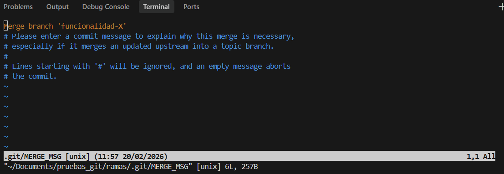

**Qué estás viendo en la captura**

- Un editor de texto pidiéndote confirmar o modificar el mensaje del merge commit.
- Las líneas con `#` son comentarios que Git ignorará.

!!! question "¿Cómo salgo del editor?"
    - **Vim (lo más habitual):** pulsa `Esc`, luego escribe `:wq` y pulsa `Enter`.
    - **Nano:** `Ctrl + O` para guardar, `Enter` para confirmar, `Ctrl + X` para salir.

Antes y después del merge con ramas divergidas:


**Qué estás viendo en la captura**

- El historial antes de fusionar: `main` y `funcionalidad-X` se han separado. Cada una tiene commits que la otra no tiene.


**Qué estás viendo en la captura**

- El nuevo merge commit une las dos líneas. El grafo muestra el bucle cerrado: los dos caminos vuelven a converger en `main`.

---

## ⚔️ Conflictos

Un conflicto ocurre cuando Git intenta fusionar dos ramas y encuentra que **las mismas líneas de un mismo archivo han sido modificadas de forma diferente en cada una**. Git no sabe cuál de las dos versiones quedarse, así que para y te pide que decidas tú.

!!! warning "Cuándo ocurre un conflicto"
    Si tú has cambiado la línea 5 de `estilos.css` en tu rama, y tu compañero también ha cambiado la línea 5 de `estilos.css` en `main`, Git no puede elegir por ti. Tendrás que resolver el conflicto a mano.  
    Si cada uno ha tocado **líneas distintas**, Git las combina sin problema y no hay conflicto.

Cuando ocurre un conflicto, Git detiene el merge y marca los archivos afectados. El proceso para resolverlo es siempre el mismo:

1. Git detiene la operación y te avisa del conflicto.
2. Abres el archivo. Dentro verás marcas como estas:

    ```text
    <<<<<<< HEAD
    Cambios en tu rama actual (main)
    =======
    Cambios en la rama que entra (nueva-rama)
    >>>>>>> nueva-rama
    ```

3. Editas el archivo: borras las marcas (`<<<`, `===`, `>>>`) y dejas solo la versión final que quieres.
4. Añades el archivo resuelto al staging: `git add archivo.txt`
5. Cierras el merge con un commit: `git commit`

**Ejemplo paso a paso:**

!!! warning "Sobre las capturas siguientes"
    Nos centramos en el proceso de resolución. Algunos comandos básicos (como `git branch` o `git status`) se omiten visualmente para ir al grano.

1. En `main`, creas `titulo.txt` con el texto `Hola Mundo` y haces commit.

    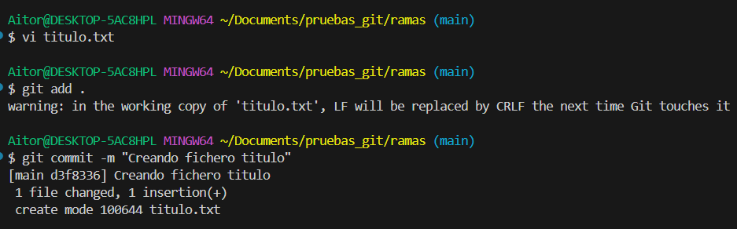

    **Qué estás viendo en la captura**
    - La creación del archivo y el primer commit en `main`.

2. Creas la rama `cambio-titulo`, cambias la línea a `Hola Universo` y haces commit.

    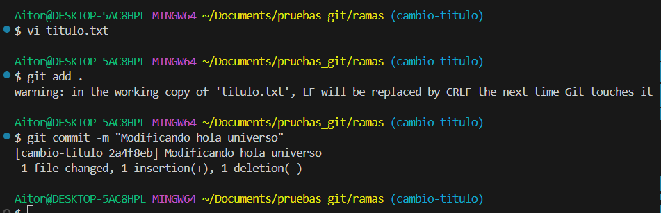

    **Qué estás viendo en la captura**
    - La modificación y su commit en la nueva rama.

    !!! tip "Recuerda"
        Aunque la captura no muestre el comando de cambio de rama, la terminal suele indicar en qué rama estás entre paréntesis: `(cambio-titulo)`. Puedes usar cualquier editor para modificar el archivo — no es obligatorio usar `vi`.

3. Vuelves a `main` y cambias **la misma línea** a `Hola Planeta`. Haces commit.

    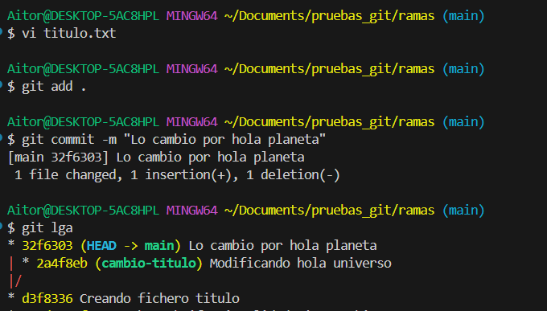

    **Qué estás viendo en la captura**
    - El cambio en `main` y un `git lga` que muestra que las dos ramas han avanzado por separado tocando el mismo archivo.

4. Intentas fusionar:

    ```bash
    git merge cambio-titulo
    ```

5. Git lanza el error de conflicto.

    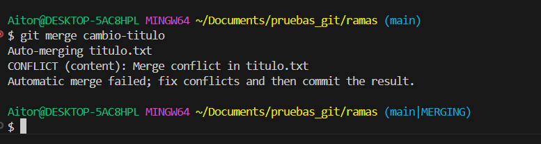

    **Qué estás viendo en la captura**
    - Git detecta que la misma línea ha sido modificada de forma distinta en ambas ramas y detiene la fusión.

6. Abres el archivo en tu editor y ves las marcas del conflicto.

    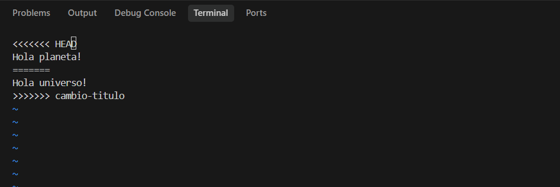

    **Qué estás viendo en la captura**
    - `<<<<<<< HEAD` marca los cambios de `main`. `>>>>>>> cambio-titulo` marca los cambios entrantes. La línea `=======` los separa.

7. Editas el archivo, eliminas las marcas y dejas solo la versión final (por ejemplo, `Hola Planeta!`).

    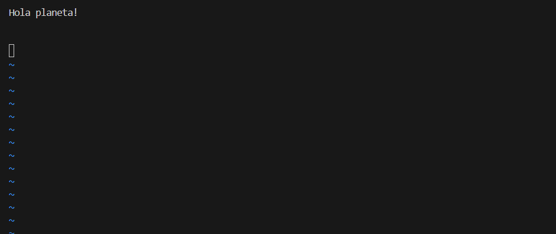

    **Qué estás viendo en la captura**
    - El archivo limpio, sin marcas de Git. Solo la versión que has decidido conservar.

8. Resuelves el conflicto y cierras el merge:

    ```bash
    git add titulo.txt
    git commit -m "Resuelve conflicto en titulo.txt"
    ```

    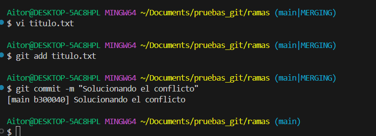

    **Qué estás viendo en la captura**
    - La confirmación de que el archivo ha entrado al staging y el merge commit ha quedado registrado.

9. El historial vuelve a unirse.

    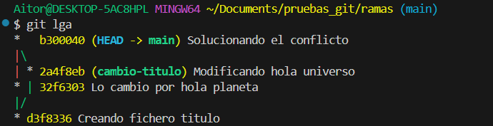

    **Qué estás viendo en la captura**
    - `git lga` muestra el merge commit uniendo las dos líneas. El proceso ha terminado correctamente.

10. Resultado final del archivo:

    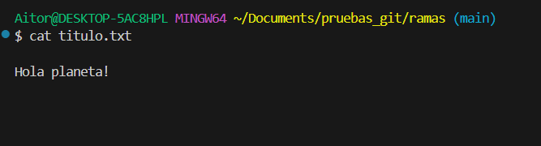

    **Qué estás viendo en la captura**
    - El contenido definitivo del archivo, tal como lo has decidido tú al resolver el conflicto.

---

## 🖥️ Ramas desde IntelliJ

No es obligatorio usar la terminal para todo. IntelliJ tiene integración completa con Git y puedes gestionar ramas desde la interfaz gráfica.

!!! tip "Gestión de ramas en IntelliJ"
    En la **barra inferior** de IntelliJ verás el nombre de la rama actual. Haz clic en él para:

    - Ver todas las ramas locales y remotas.
    - Crear una rama nueva (`New Branch`).
    - Cambiar de rama con un clic (`Checkout`).
    - Fusionar o hacer rebase desde el menú contextual.

    Los comandos que hace IntelliJ por debajo son exactamente los mismos que has practicado en terminal. Entenderlos te ayuda a saber qué está pasando cuando algo falla en la GUI.

---

## 📚 Recursos adicionales

- [Documentación oficial de Git sobre ramas](https://git-scm.com/book/es/v2/Ramificaciones-en-Git-¿Qué-es-una-rama%3F)
- [Learn Git Branching (Interactivo)](https://learngitbranching.js.org/?locale=es_ES)

---

## ✅ Ideas clave

??? tip "Abrir resumen"
    - `git branch <nombre>` crea una nueva rama (sin moverte a ella).
    - `git switch <nombre>` (o `git checkout <nombre>`) te mueve a otra rama.
    - `git switch -c <nombre>` crea la rama y te mueve en un solo paso.
    - `HEAD` apunta siempre a la rama y commit donde estás trabajando ahora.
    - `git merge <rama>` trae los cambios de esa rama a la rama donde estás.
    - **Fast-forward**: `main` no ha avanzado → Git mueve el puntero. Historial lineal.
    - **Merge commit**: ambas ramas han avanzado → Git crea un commit de unión.
    - Los conflictos ocurren cuando dos ramas han tocado las mismas líneas del mismo archivo.
    - `git branch -d <nombre>` borra si ya está fusionada; `-D` borra sin comprobación.
    - `git lga` (alias de `git log --graph --oneline --all --decorate`) muestra el grafo de ramas.
