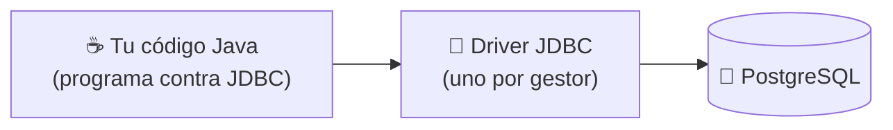

<a id="conectores-y-protocolos"></a>

# 🧩 2. Conectores y protocolos de acceso a bases de datos

Conoces SQL y bases de datos relacionales desde 1º de DAM — pero hasta ahora las has usado siempre desde una herramienta externa (un cliente SQL, un script). Este apartado responde a la pregunta que viene ahora: ¿cómo habla tu programa Java, con sus clases y objetos, con una base de datos que solo entiende tablas y filas?

---

## 🧩 El problema de partida: objetos contra tablas

Imagina una clase `Alumno` con una lista de `Asignatura`:

```java
class Alumno {
    String nombre;
    List<Asignatura> asignaturas;
}
```

Y, en la base de datos, dos tablas relacionadas por clave foránea:

```sql
CREATE TABLE alumno (id INT PRIMARY KEY, nombre VARCHAR(100));
CREATE TABLE asignatura (id INT PRIMARY KEY, alumno_id INT REFERENCES alumno(id));
```

Aunque representan la misma idea, la forma de trabajar con cada una es distinta:

- **Tipos que no coinciden**: Java tiene `List<Asignatura>`, `LocalDate`, `boolean`; SQL tiene `INT`, `VARCHAR`, `DATE`. No hay una correspondencia 1:1 automática.
- **Relaciones expresadas de forma distinta**: en Java, un alumno *contiene* su lista de asignaturas (una referencia en memoria); en SQL, esa misma relación es una clave foránea en la tabla `asignatura` — la dirección de la flecha depende de quién almacena la referencia a quién, y hace falta un `JOIN` para reconstruirla.
- **Identidad**: en Java, dos objetos son iguales si `==` los considera el mismo (o si `equals()` lo dice); en la base de datos, la identidad de una fila es su clave primaria. Son dos formas distintas de responder a "¿es esto lo mismo que aquello?".

Esta diferencia de fondo tiene nombre: **desfase objeto-relacional** (*impedance mismatch*). No es un error de diseño de nadie — es que los dos mundos, orientado a objetos y relacional, modelan la información de forma distinta por naturaleza. Todo lo que vas a ver en este tema (y en el Tema 2, con el ORM) existe para tender puentes sobre ese desfase.

---

## 🔌 Protocolos de acceso y conectores

Para que tu programa Java hable con un gestor de base de datos necesita dos cosas: un **protocolo** de acceso (las reglas de esa conversación) y un **conector** (o *driver*) que las implemente para un gestor concreto.

En Java, ese protocolo estándar es **JDBC** (*Java Database Connectivity*): una interfaz común que cualquier gestor puede implementar. Tu código programa contra esa interfaz común (`Connection`, `Statement`, `ResultSet` — los verás en detalle en el apartado de JDBC puro, más adelante en este tema), y es el **driver** concreto — una librería distinta para cada gestor (PostgreSQL, MySQL, SQL Server...) — quien traduce esas llamadas al protocolo de red real de ese gestor.



!!! tip "La ventaja de programar contra una interfaz común"
    Si mañana tu proyecto cambiara de PostgreSQL a MySQL, tu código Java (el que usa `Connection`/`Statement`) apenas cambiaría — cambiarías el driver y la cadena de conexión, no la forma de escribir las consultas. Ese es el valor de un protocolo estándar: desacopla tu código del gestor concreto.

---

## 🗄️ Gestor embebido vs. independiente

Los gestores de bases de datos se dividen en dos familias según cómo se ejecutan:

| | Embebido | Independiente |
|---|---|---|
| **Cómo corre** | Dentro del propio proceso de tu aplicación, sin servidor aparte | Como un proceso/servidor separado, al que te conectas por red |
| **Ejemplos** | H2, SQLite | PostgreSQL, MySQL, SQL Server |
| **Cuándo conviene** | Tests rápidos, prototipos, aplicaciones de escritorio sin instalación | Aplicaciones reales, con varios clientes concurrentes, datos que deben sobrevivir a la aplicación |

Un gestor **embebido** vive dentro de tu propio proceso: no hay nada que instalar ni levantar aparte, arranca y desaparece con tu aplicación. Es rápido de poner en marcha, pero normalmente no está pensado para que varias aplicaciones distintas lo usen a la vez.

Un gestor **independiente** corre como su propio servicio, escuchando en un puerto de red, y puede atender a muchos clientes (distintas aplicaciones, distintas instancias de la misma aplicación) al mismo tiempo. Es lo que ya conoces de Docker: un contenedor de PostgreSQL, separado de tu aplicación, al que te conectas por IP/puerto.

---

## 🏊 Pooling de conexiones

Abrir una conexión a una base de datos no es gratis: implica una negociación de red, autenticación, reserva de recursos en el gestor — tiene un coste real, medible en milisegundos. Si tu aplicación abriera y cerrara una conexión nueva por cada consulta, ese coste se pagaría una y otra vez, sin necesidad.

El **pooling de conexiones** resuelve esto manteniendo un conjunto de conexiones ya abiertas y listas para usar: cuando tu código necesita hablar con la base de datos, coge una conexión prestada del *pool*, la usa, y la devuelve — sin cerrarla de verdad.

!!! example "Analogía: taquillas ya abiertas"
    Forzar una cerradura nueva cada vez que necesitas guardar algo es lento. Un pool de conexiones es como un conjunto de taquillas que ya están abiertas de antemano: coges una libre, la usas, y la dejas lista para el siguiente — nadie tiene que forzar una cerradura nueva cada vez.

---

## 🎮 Aterrizaje en GameVault

### El gestor: PostgreSQL independiente, vía Docker

El `docker-compose.yaml` del proyecto levanta PostgreSQL como gestor independiente:

```yaml
services:
  postgres:
    image: postgres:18-alpine
    environment:
      POSTGRES_DB: gamevault_db
      POSTGRES_USER: gamevault_user
      POSTGRES_PASSWORD: password123
    ports:
      - "5432:5432"
```

Es exactamente el caso de la tabla de más arriba: un proceso separado, en su propio contenedor, al que la aplicación se conecta por red (`localhost:5432` desde tu máquina).

!!! tip "Una mejora posible: H2 embebido para tests"
    El proyecto usa PostgreSQL en todos los entornos, incluidos los tests unitarios (los de integración sí usan Testcontainers, que verás en el Tema 3). Una mejora habitual en proyectos reales es añadir H2 (embebido) en un perfil `test` para los tests unitarios más simples, que así no dependen de tener Docker levantado — no es lo que hace GameVault hoy, pero es algo que podrías plantearte incorporar a tu propio proyecto.

!!! warning "Dos versiones de Postgres en el mismo proyecto — y no es un error"
    Si más adelante (Tema 3, Actividad 3.3) ves que el test de integración usa `postgres:16-alpine` en vez del `postgres:18-alpine` de este `docker-compose.yaml`, no es una inconsistencia que arreglar: la versión del gestor de desarrollo y la usada en tests no tienen por qué coincidir exactamente, siempre que ambas sean compatibles con el SQL y las características (como JSONB) que usa el proyecto.

### La conexión: `application-dev.yaml`

```yaml
spring:
  datasource:
    url: jdbc:postgresql://localhost:5432/gamevault_db
    username: gamevault_user
    password: password123
```

`spring.datasource.*` es toda la información que Spring Boot necesita para conectar: la URL JDBC (fíjate en el prefijo `jdbc:postgresql://`, el protocolo que has visto arriba, seguido de host, puerto y nombre de la base de datos), usuario y contraseña. El pooling no lo configuras tú a mano: Spring Boot trae por defecto **HikariCP**, un pool de conexiones que se activa solo con tener el driver de PostgreSQL en el `pom.xml` — no hace falta ni una línea de configuración adicional para tenerlo funcionando.

### La estructura: entidades `Videojuego` y `Estudio`

La "definición de la estructura de la base de datos" en un proyecto Spring Data JPA no se escribe como `CREATE TABLE` a mano — se declara sobre las propias clases Java, con anotaciones:

```java
@Entity
@Table(name = "estudio")
public class Estudio {

    @Id
    @GeneratedValue(strategy = GenerationType.IDENTITY)
    private Long id;

    private String nombre;

    @OneToMany(mappedBy = "estudio", cascade = CascadeType.ALL, orphanRemoval = true)
    private List<Videojuego> videojuegos;
}
```

- `@Entity` + `@Table(name = "estudio")`: esta clase se mapea contra la tabla `estudio`.
- `@Id` + `@GeneratedValue`: el identificador y cómo se genera (aquí, autoincremental, delegado en la propia base de datos).
- `@OneToMany`/`@ManyToOne`: la relación entre `Estudio` y `Videojuego` — el mismo desfase objeto-relacional del principio del apartado, ahora resuelto con anotaciones en vez de a mano.

Y en `application-dev.yaml`, la propiedad `spring.jpa.hibernate.ddl-auto: update` es lo que hace que, al arrancar, Hibernate cree o actualice las tablas según esas anotaciones — sin que tú escribas el `CREATE TABLE`. Existen otros valores (`validate`, que solo comprueba que las tablas coincidan sin tocarlas, o `none`, que no hace nada): en un proyecto real, en producción, casi nunca se usa `update` ni mucho menos `create-drop` (que borraría y recrearía las tablas en cada arranque) — se prefiere gestionar el esquema con migraciones controladas (Flyway, Liquibase), precisamente para no perder datos por accidente.

Con esto ya tienes las piezas para la Actividad 1.1: levantar tu propio PostgreSQL con Docker Compose y replicar estas mismas entidades en tu proyecto.

---

## ✅ Ideas clave

??? tip "Abrir resumen"

    - El **desfase objeto-relacional** es la diferencia estructural entre cómo Java modela la información (objetos, referencias) y cómo lo hace SQL (tablas, claves foráneas) — no es un error, es una diferencia de naturaleza entre los dos modelos.
    - **JDBC** es la API estándar de Java para hablar con bases de datos; un **driver/conector** la implementa para un gestor concreto.
    - Un gestor **embebido** (H2, SQLite) corre dentro de tu proceso; uno **independiente** (PostgreSQL, MySQL) corre como servicio aparte, al que te conectas por red.
    - El **pooling de conexiones** reutiliza conexiones ya abiertas en vez de crear una nueva cada vez — en Spring Boot lo gestiona HikariCP por defecto, sin configuración manual.
    - GameVault usa PostgreSQL independiente vía Docker; la conexión se configura en `application-dev.yaml` (`spring.datasource.*`).
    - La estructura de la base de datos se declara con anotaciones JPA (`@Entity`, `@Id`, `@OneToMany`/`@ManyToOne`) sobre las propias clases Java; `ddl-auto` controla si Hibernate crea/actualiza las tablas automáticamente (algo que en producción se sustituye por migraciones controladas).
