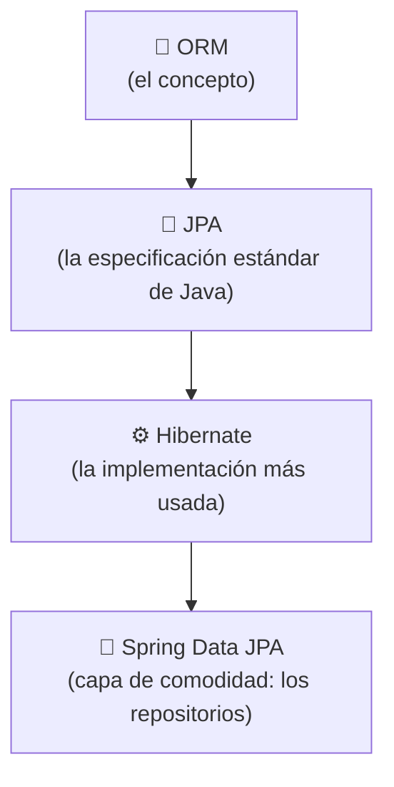
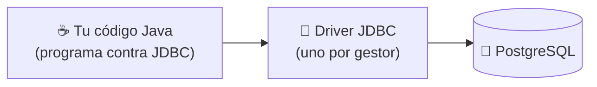
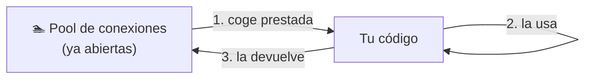
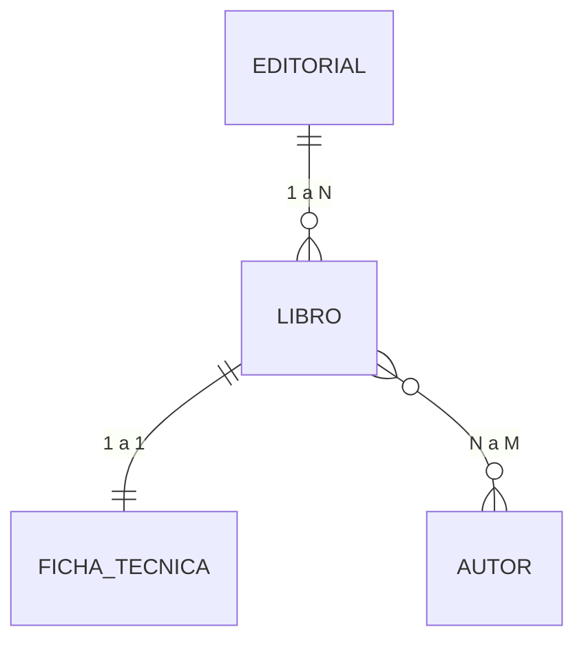

<a id="conectores-y-protocolos"></a>

# 🧩 2. Conectores y protocolos de acceso a bases de datos

Conoces SQL y bases de datos relacionales desde 1º de DAM — pero hasta ahora las has usado siempre desde una herramienta externa (un cliente SQL, un script). En el apartado anterior viste que el **repository** es la capa que habla con la base de datos, sin entrar en cómo lo hace por dentro. Este apartado responde a esa pregunta: ¿cómo habla tu programa Java, con sus clases y objetos, con una base de datos que solo entiende tablas y filas?

---

## 🧩 El problema de partida: objetos contra tablas

Imagina una clase `Editorial` con una lista de `Libro` — la misma pareja de clases que vas a usar durante todo este tema:

```java
class Editorial {
    String nombre;
    List<Libro> libros;
}
```

Y, en la base de datos, dos tablas relacionadas por clave foránea:

```sql
CREATE TABLE editorial (id INT PRIMARY KEY, nombre VARCHAR(100));
CREATE TABLE libro (id INT PRIMARY KEY, editorial_id INT REFERENCES editorial(id));
```

Aunque representan la misma idea, la forma de trabajar con cada una es distinta:

- **Tipos que no coinciden**: Java tiene `List<Libro>`, `LocalDate`, `boolean`; SQL tiene `INT`, `VARCHAR`, `DATE`. No hay una correspondencia 1:1 automática.
- **Relaciones expresadas de forma distinta**: en Java, una editorial *contiene* su lista de libros (una referencia en memoria); en SQL, esa misma relación es una clave foránea en la tabla `libro` — la dirección de la flecha depende de quién almacena la referencia a quién, y hace falta un `JOIN` para reconstruirla.
- **Identidad**: en Java, dos objetos son iguales si `==` los considera el mismo (o si `equals()` lo dice); en la base de datos, la identidad de una fila es su clave primaria. Son dos formas distintas de responder a "¿es esto lo mismo que aquello?".

Esta diferencia de fondo tiene nombre: **desfase objeto-relacional** (*impedance mismatch*). No es un error de diseño de nadie — es que los dos mundos, orientado a objetos y relacional, modelan la información de forma distinta por naturaleza. Todo lo que vas a ver en este tema existe para tender puentes sobre ese desfase — empezando por la propia herramienta que lo resuelve.

---

## 🌉 La solución: una herramienta ORM

Vas a resolver este desfase con una herramienta **ORM** (*Object-Relational Mapping*): declaras, una sola vez, las reglas de correspondencia entre una clase y una tabla — y a partir de ahí, guardar, actualizar y consultar objetos se traduce automáticamente al SQL correspondiente, sin que lo escribas tú. Todo lo que verás en este tema —las anotaciones de más abajo, el CRUD completo, las consultas dinámicas, JPQL— son, en el fondo, distintas caras de esa misma herramienta.

Tres nombres que aparecen siempre juntos y no significan lo mismo:

| Nombre | Qué es |
|---|---|
| **ORM** | El concepto: mapeo objeto-relacional en general. |
| **JPA** | *Jakarta Persistence API* — la especificación estándar de Java: qué anotaciones e interfaces debe ofrecer un ORM en Java. |
| **Hibernate** | La implementación más usada de JPA — el motor real que hace el trabajo. |



**Spring Data JPA** (el `JpaRepository` que vas a usar durante todo este tema) no es un ORM distinto — es una capa adicional de comodidad **por encima** de JPA/Hibernate: te genera automáticamente implementaciones de repositorios (`save`, `findById`, `findAll`...) para que ni siquiera tengas que escribir el código que usa directamente las anotaciones JPA.

!!! tip "Hibernate no es la única opción"
    Es la implementación de JPA más usada en el mundo Java, pero no la única — **EclipseLink** es otra implementación completa de la misma especificación. Fuera de Java, cada lenguaje tiene su propio ORM con la misma idea de fondo (SQLAlchemy en Python, Entity Framework en C#): el mapeo objeto-relacional no es un invento exclusivo de Hibernate ni de Java.

Las anotaciones que vas a ver más abajo (`@Entity`, `@Id`, `@OneToMany`...) son, literalmente, cómo se declara ese mapeo — hoy las vas a leer como "así defines la estructura de la base de datos", pero por debajo es la propia herramienta ORM en funcionamiento.

---

## 🔌 Protocolos de acceso y conectores

Para que tu programa Java hable con un gestor de base de datos necesita dos cosas: un **protocolo** de acceso (las reglas de esa conversación — el mismo concepto que ya viste con HTTP en el apartado 1, un formato de mensaje acordado de antemano, aplicado ahora a bases de datos en vez de a un servidor web) y un **conector** (o *driver*) que las implemente para un gestor concreto.

En Java, ese protocolo estándar es **JDBC** (*Java Database Connectivity*): una interfaz común que cualquier gestor puede implementar. Tu código programa contra esa interfaz común (`Connection`, `Statement`, `ResultSet` — los verás en detalle en el apartado de JDBC puro, más adelante en este tema), y es el **driver** concreto — una librería distinta para cada gestor (PostgreSQL, MySQL, SQL Server...) — quien traduce esas llamadas al protocolo de red real de ese gestor.



Esto tiene una ventaja concreta y un inconveniente concreto, y merece la pena nombrarlos los dos: la ventaja es que tu código queda desacoplado del gestor exacto — programas contra `Connection`/`Statement`, no contra PostgreSQL directamente. El inconveniente es que dependes de que exista un driver JDBC para tu gestor: si eligieras un motor muy nuevo o poco extendido, podrías encontrarte sin esa pieza todavía.

!!! tip "La ventaja de programar contra una interfaz común"
    Si mañana tu proyecto cambiara de PostgreSQL a MySQL, tu código Java (el que usa `Connection`/`Statement`) apenas cambiaría — cambiarías el driver y la cadena de conexión, no la forma de escribir las consultas. Ese es el valor de un protocolo estándar: desacopla tu código del gestor concreto.

---

## 🗄️ Gestor embebido vs. independiente

Los gestores de bases de datos se dividen en dos familias según cómo se ejecutan:

| | Embebido | Independiente |
|---|---|---|
| **Cómo corre** | Dentro del propio proceso de tu aplicación, sin servidor aparte | Como un proceso/servidor separado, al que te conectas por red |
| **Ejemplos** | H2, SQLite | PostgreSQL, MySQL, SQL Server |
| **Cuándo conviene** | Tests rápidos, prototipos, aplicaciones de escritorio sin instalación | Aplicaciones reales, con varios clientes concurrentes, datos que deben sobrevivir a la aplicación |

Un gestor **embebido** vive dentro de tu propio proceso: no hay nada que instalar ni levantar aparte, arranca y desaparece con tu aplicación. Es rápido de poner en marcha, pero normalmente no está pensado para que varias aplicaciones distintas lo usen a la vez.

Un gestor **independiente** corre como su propio servicio, escuchando en un puerto de red, y puede atender a muchos clientes (distintas aplicaciones, distintas instancias de la misma aplicación) al mismo tiempo. Es el mismo concepto de IP/puerto del apartado 1, aplicado ahora a una base de datos en vez de a tu propia aplicación: es lo que ya conoces de Docker, un contenedor de PostgreSQL, separado de tu aplicación, al que te conectas por IP/puerto.

---

## 🏊 Pooling de conexiones

Abrir una conexión a una base de datos no es gratis: implica una negociación de red, autenticación, reserva de recursos en el gestor — tiene un coste real, medible en milisegundos. Si tu aplicación abriera y cerrara una conexión nueva por cada consulta, ese coste se pagaría una y otra vez, sin necesidad.

El **pooling de conexiones** resuelve esto manteniendo un conjunto de conexiones ya abiertas y listas para usar: cuando tu código necesita hablar con la base de datos, coge una conexión prestada del *pool*, la usa, y la devuelve — sin cerrarla de verdad.



!!! example "Analogía: taquillas ya abiertas"
    Forzar una cerradura nueva cada vez que necesitas guardar algo es lento. Un pool de conexiones es como un conjunto de taquillas que ya están abiertas de antemano: coges una libre, la usas, y la dejas lista para el siguiente — nadie tiene que forzar una cerradura nueva cada vez.

---

## 🔗 Tipos de relación entre entidades

Antes de ver las entidades reales, falta una pieza: cuando dos clases están relacionadas, no basta con decir "están relacionadas" — hace falta precisar **cuántas** instancias de una pueden asociarse con **cuántas** de la otra. A ese matiz se le llama **multiplicidad** (o cardinalidad), y determina qué anotación JPA usas para mapear la relación.



| Relación | Ejemplo en la librería | Anotación |
|---|---|---|
| **Uno a uno (1:1)** | Un libro tiene una única ficha técnica con sus datos extendidos | `@OneToOne` en los dos lados |
| **Uno a muchos (1:N)** | Una editorial publica muchos libros | `@OneToMany` (lado "uno") + `@ManyToOne` (lado "muchos") |
| **Muchos a muchos (N:M)** | Un libro puede tener varios autores, y un autor puede haber escrito varios libros | `@ManyToMany` en los dos lados |

### Uno a uno: `Libro` y `FichaTecnica`

```java
@Entity
public class Libro {
    @Id
    @GeneratedValue(strategy = GenerationType.IDENTITY)
    private Long id;

    @OneToOne(mappedBy = "libro", cascade = CascadeType.ALL)
    private FichaTecnica fichaTecnica;
}

@Entity
public class FichaTecnica {
    @Id
    @GeneratedValue(strategy = GenerationType.IDENTITY)
    private Long id;

    private Integer numeroPaginas;
    private String idioma;

    @OneToOne
    @JoinColumn(name = "libro_id", unique = true)
    private Libro libro;
}
```

`FichaTecnica` es el lado que tiene la clave foránea real (`@JoinColumn(name = "libro_id")`, igual que en una relación 1:N), y `Libro` es el lado inverso (`mappedBy`). Lo único que distingue un 1:1 de un 1:N en la base de datos es esa columna `unique = true`: sin ella, nada impediría que varias fichas técnicas apuntaran al mismo libro, y dejaría de ser "uno a uno".

### Uno a muchos: `Editorial` y `Libro`

Es la relación que ya conoces del principio del apartado, y la que vas a ver a continuación con código real: una editorial tiene muchos libros, pero cada libro pertenece a una única editorial.

### Muchos a muchos: `Libro` y `Autor`

```java
@Entity
public class Libro {
    @Id
    @GeneratedValue(strategy = GenerationType.IDENTITY)
    private Long id;

    @ManyToMany
    @JoinTable(
        name = "libro_autor",
        joinColumns = @JoinColumn(name = "libro_id"),
        inverseJoinColumns = @JoinColumn(name = "autor_id")
    )
    private List<Autor> autores;
}

@Entity
public class Autor {
    @Id
    @GeneratedValue(strategy = GenerationType.IDENTITY)
    private Long id;

    private String nombre;

    @ManyToMany(mappedBy = "autores")
    private List<Libro> libros;
}
```

Aquí ninguna de las dos tablas (`libro`, `autor`) puede llevar la clave foránea: una columna solo puede guardar un valor, y aquí cada libro necesita apuntar a varios autores a la vez (y viceversa). La solución es una **tabla intermedia** — aquí `libro_autor` — con dos claves foráneas, una hacia cada tabla. `@JoinTable` es la anotación que le dice a Hibernate cómo se llama esa tabla intermedia y cuáles son sus dos columnas; `joinColumns` apunta al lado donde está la anotación (`Libro`), `inverseJoinColumns` al lado contrario (`Autor`).

---

## 🗄️ Las piezas en un proyecto Spring Boot

### El gestor: PostgreSQL independiente, vía Docker

Un `docker-compose.yaml` como este levanta PostgreSQL como gestor independiente — el ejemplo sigue con la aplicación de la librería:

```yaml
services:
  postgres:
    image: postgres:18-alpine
    environment:
      POSTGRES_DB: libreria_db
      POSTGRES_USER: libreria_user
      POSTGRES_PASSWORD: password123
    ports:
      - "5432:5432"
```

Es exactamente el caso de la tabla de más arriba: un proceso separado, en su propio contenedor, al que la aplicación se conecta por red (`localhost:5432` desde tu máquina).

!!! tip "Una mejora posible: H2 embebido para tests"
    Una práctica habitual en proyectos reales es añadir H2 (embebido) en un perfil `test` para los tests unitarios más simples, que así no dependen de tener Docker levantado — el gestor embebido arranca y muere con los propios tests.

### La conexión: `application-dev.yaml`

```yaml
spring:
  datasource:
    url: jdbc:postgresql://localhost:5432/libreria_db
    username: libreria_user
    password: password123
```

`spring.datasource.*` es toda la información que Spring Boot necesita para conectar: la URL JDBC (fíjate en el prefijo `jdbc:postgresql://`, el protocolo que has visto arriba, seguido de host, puerto y nombre de la base de datos), usuario y contraseña. El pooling no lo configuras tú a mano: Spring Boot trae por defecto **HikariCP**, un pool de conexiones que se activa solo con tener el driver de PostgreSQL en el `pom.xml` — la misma idea de *starter* del apartado 1: declaras la dependencia en Maven, y la pieza llega ya configurada, sin que escribas ni una línea más.

### La estructura: entidades `Libro` y `Editorial`

La "definición de la estructura de la base de datos" en un proyecto Spring Data JPA no se escribe como `CREATE TABLE` a mano — se declara sobre las propias clases Java, con anotaciones. Esto es el ORM que acabas de conocer, en código real:

```java
@Entity
@Table(name = "editorial")
public class Editorial {

    @Id
    @GeneratedValue(strategy = GenerationType.IDENTITY)
    private Long id;

    private String nombre;

    @OneToMany(mappedBy = "editorial", cascade = CascadeType.ALL, orphanRemoval = true)
    private List<Libro> libros;
}
```

- `@Entity` + `@Table(name = "editorial")`: esta clase se mapea contra la tabla `editorial`.
- `@Id` + `@GeneratedValue`: el identificador y cómo se genera (aquí, autoincremental, delegado en la propia base de datos).
- `@OneToMany(mappedBy = "editorial", ...)`: la relación 1:N que acabas de ver — `mappedBy` indica que la clave foránea real vive en `Libro` (que llevará su propio `@ManyToOne` apuntando de vuelta a `Editorial`), no aquí. Es el mismo desfase objeto-relacional del principio del apartado, ahora resuelto con anotaciones en vez de a mano.
- `cascade = CascadeType.ALL`: propaga las operaciones de `Editorial` a sus `Libro` — si guardas o borras una editorial, Hibernate aplica esa misma operación a todos sus libros automáticamente. Sin `cascade`, tendrías que guardar o borrar cada libro tú mismo, uno por uno.
- `orphanRemoval = true`: va un paso más allá — si quitas un libro de la lista `libros` sin borrar la editorial entera, ese libro queda "huérfano" (ya no lo referencia ninguna editorial) y Hibernate lo elimina de la base de datos por su cuenta, sin que tengas que borrarlo tú explícitamente.

Y en `application-dev.yaml`, la propiedad `spring.jpa.hibernate.ddl-auto: update` es lo que hace que, al arrancar, Hibernate cree o actualice las tablas según esas anotaciones — sin que tú escribas el `CREATE TABLE`. Existen otros valores (`validate`, que solo comprueba que las tablas coincidan sin tocarlas, o `none`, que no hace nada): en un proyecto real, en producción, casi nunca se usa `update` ni mucho menos `create-drop` (que borraría y recrearía las tablas en cada arranque) — se prefiere gestionar el esquema con migraciones controladas (Flyway, Liquibase), precisamente para no perder datos por accidente.

Con esto ya tienes las piezas para la Actividad 1.1: levantar tu propio PostgreSQL con Docker Compose y definir las primeras entidades de tu proyecto.

---

## ✅ Ideas clave

??? tip "Abrir resumen"

    - El **desfase objeto-relacional** es la diferencia estructural entre cómo Java modela la información (objetos, referencias) y cómo lo hace SQL (tablas, claves foráneas) — no es un error, es una diferencia de naturaleza entre los dos modelos.
    - Una herramienta **ORM** resuelve ese desfase; **JPA** es la especificación estándar de Java, **Hibernate** su implementación más usada (no la única — EclipseLink es otra), y **Spring Data JPA** añade los repositorios como capa de comodidad por encima.
    - **JDBC** es la API estándar de Java para hablar con bases de datos; un **driver/conector** la implementa para un gestor concreto.
    - Un gestor **embebido** (H2, SQLite) corre dentro de tu proceso; uno **independiente** (PostgreSQL, MySQL) corre como servicio aparte, al que te conectas por red.
    - El **pooling de conexiones** reutiliza conexiones ya abiertas en vez de crear una nueva cada vez — en Spring Boot lo gestiona HikariCP por defecto, sin configuración manual.
    - Las relaciones entre entidades tienen **multiplicidad**: 1:1 (`@OneToOne`), 1:N (`@OneToMany`/`@ManyToOne`) y N:M (`@ManyToMany`, con una tabla intermedia vía `@JoinTable`).
    - En este curso el gestor es PostgreSQL independiente vía Docker; la conexión se configura en `application-dev.yaml` (`spring.datasource.*`).
    - La estructura de la base de datos se declara con anotaciones JPA (`@Entity`, `@Id`, `@OneToMany`/`@ManyToOne`) sobre las propias clases Java; `mappedBy` señala el lado inverso, `cascade` propaga operaciones y `orphanRemoval` borra registros huérfanos automáticamente. `ddl-auto` controla si Hibernate crea/actualiza las tablas automáticamente (algo que en producción se sustituye por migraciones controladas).
