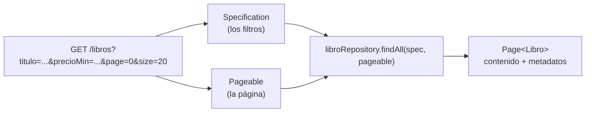

<a id="consultas-dinamicas"></a>

# 🧩 7. Consultas dinámicas: Specifications y paginación

Ya sabes recuperar y modificar un objeto cuando conoces su id — `findById()` lo trae, cambias sus campos, `save()` lo guarda. Pero un listado real casi nunca busca por id: busca por **criterios que el usuario elige**, y además no puede devolver el catálogo entero de golpe. Este apartado resuelve **dos problemas distintos**, que además comparten el mismo listado como escenario — por eso, al final, verás cómo se combinan en una sola consulta:



Este diagrama es el destino final del apartado — pero llegarás a él en tres pasos: primero resuelves los filtros solos, luego la paginación sola, y al final las combinas. No hace falta entenderlo todavía; vuelve a mirarlo cuando llegues a la última sección.

---

## 🔁 El punto de partida: recuperar y modificar por id

Esto ya lo conoces, y funciona bien mientras sepas el id exacto del objeto que quieres:

```java
@Transactional
public LibroResponseDTO update(Long id, LibroCreateDTO dto) {
    Libro libro = libroRepository.findById(id)
            .orElseThrow(() -> new ResponseStatusException(HttpStatus.NOT_FOUND, "Libro no encontrado"));

    libro.setTitulo(dto.titulo());
    libro.setPrecio(dto.precio());

    return mapToDTO(libroRepository.save(libro));
}
```

`findById` localiza el objeto (pasa a estado *managed*, como viste en el apartado anterior), modificas sus campos directamente sobre el objeto Java, y `save()` lo sincroniza — Hibernate genera el `UPDATE` por ti, a partir de qué campos han cambiado realmente. Compáralo con lo que habrías escrito a mano en JDBC puro: un `UPDATE ... SET ... WHERE id = ?` completo, con cada columna nombrada explícitamente.

Pero fíjate en la condición: **conoces el id**. En un listado de verdad, el usuario no busca "el libro número 42" — busca "libros de menos de 20€ de esta editorial", sin saber ni le importa qué id tienen. Ahí es donde `findById` deja de servir.

La primera idea que se te podría ocurrir: un método derivado por nombre para cada filtro, como `findByPrecioLessThan(BigDecimal precio)`. Y funciona bien — **mientras todos los usuarios busquen siempre por lo mismo**. El problema real es que cada usuario puede querer una combinación distinta: uno busca solo por precio máximo, otro solo por título, otro por precio mínimo y máximo a la vez, otro por título y precio mínimo juntos... y no sabes de antemano cuál de esas combinaciones va a pedir cada uno.

---

## 🔍 Problema A: los filtros fijos no escalan

Y el problema no es solo teórico: en cuanto el buscador tiene varios filtros opcionales de verdad — título, precio mínimo, precio máximo, editorial — cubrir cada combinación con un método derivado distinto crece exponencialmente:

| Filtros opcionales | Métodos que necesitarías |
|---|---|
| 1 (solo título) | 2 — `findAll()` y `findByTituloContaining(...)` |
| 2 (+ precio mínimo) | 4 — incluyendo `findByTituloContainingAndPrecioGreaterThanEqual(...)` |
| 3 (+ precio máximo) | 8 — incluyendo `findByTituloContainingAndPrecioGreaterThanEqualAndPrecioLessThanEqual(...)` |
| 4 (+ editorial) | 16 — con nombres como `findByTituloContainingAndPrecioGreaterThanEqualAndPrecioLessThanEqualAndEditorialId(...)` |

Con solo 4 filtros ya tienes 16 combinaciones posibles, y cada filtro nuevo que añadas **duplica** ese número — sin contar con que un nombre de método así de largo deja de ser legible mucho antes de llegar a 16.

---

## 🧩 Las piezas nuevas, traducidas desde SQL

Antes de resolver el problema A, tres nombres que van a aparecer juntos y conviene no confundir. Ninguno es tan raro como parece — cada uno tiene su equivalente exacto en el SQL que ya conoces:

| Concepto Java | Su equivalente en SQL | Qué es en la práctica |
|---|---|---|
| `Root<Libro>` | `FROM libro` | Representa la tabla que estás consultando; `root.get("titulo")` es literalmente "la columna `titulo`" |
| `CriteriaBuilder` | Los operadores de un `WHERE` (`=`, `LIKE`, `>=`...) | Una caja de herramientas con un método por cada tipo de comparación — lo llamas como método Java en vez de escribirlo como texto SQL |
| `Predicate` | Una condición ya completa del `WHERE` | Lo que construye el `CriteriaBuilder`, y lo que tu código debe devolver |

Con esto, una `Specification<Libro>` es, literalmente, una función con esta forma: recibe el `root` y el `criteriaBuilder`, y devuelve un `Predicate` — una única condición, construida con código Java en vez de escrita como texto.

---

## ✅ Resolviendo el problema A: Specifications, sin paginación todavía

Vas a construir la solución **completa** a este problema, de principio a fin, antes de complicarla con nada más.

### 1. Habilitar Specifications en el repositorio

```java
public interface LibroRepository extends
        JpaRepository<Libro, Long>,
        JpaSpecificationExecutor<Libro> {
}
```

`JpaSpecificationExecutor` añade la capacidad de ejecutar Specifications sobre este repositorio, junto al `save`/`findById`/`findAll` que ya tenías.

### 2. Tu primera Specification, condición por condición

Empieza por la parte que construye el `Predicate`, sin la parte del filtro opcional todavía:

```java
(root, query, criteriaBuilder) ->
        criteriaBuilder.like(criteriaBuilder.lower(root.get("titulo")), "%" + titulo.toLowerCase() + "%");
```

Línea a línea, con la tabla de arriba delante: `root.get("titulo")` es la columna `titulo`; `criteriaBuilder.lower(...)` pasa esa columna a minúsculas antes de comparar (para que la búsqueda no distinga mayúsculas); `criteriaBuilder.like(..., "%valor%")` construye el `Predicate` — la condición `LIKE '%valor%'`, pero escrita con métodos Java en vez de texto SQL. El tercer parámetro, `query`, no lo necesitas para filtros simples como este — está ahí porque la forma de la función lo exige, pero lo dejas sin usar.

### 3. El filtro es opcional: `Specification.unrestricted()`

Aquí es donde entra el problema de antes: este filtro puede no venir. Una Specification puede decidir, en tiempo de ejecución, si su condición entra o no en la consulta final — algo que un método derivado no podía hacer. Crea la clase `LibroSpecifications`, con un método estático por filtro:

```java
public final class LibroSpecifications {

    private LibroSpecifications() { }

    public static Specification<Libro> tituloContiene(String titulo) {
        if (titulo == null || titulo.isBlank()) {
            return Specification.unrestricted();
        }
        return (root, query, criteriaBuilder) ->
                criteriaBuilder.like(criteriaBuilder.lower(root.get("titulo")), "%" + titulo.toLowerCase() + "%");
    }

    public static Specification<Libro> precioMayorOIgualA(BigDecimal precioMin) {
        if (precioMin == null) {
            return Specification.unrestricted();
        }
        return (root, query, criteriaBuilder) ->
                criteriaBuilder.greaterThanOrEqualTo(root.get("precio"), precioMin);
    }

    // Resto de filtros (precioMenorOIgualA, perteneceAEditorial...) — mismo patrón,
    // uno por cada campo por el que quieras poder filtrar. Al final se usan más
    // de los que se han creado aquí, pero todos siguen esta misma estructura.
}
```

`Specification.unrestricted()` es una Specification especial que ya trae Spring Data: su `Predicate` no impone ninguna condición real, así que al combinarla con las demás es como si no existiera. El patrón se repite en cada método:

| Si el filtro es... | La Specification devuelve... | Efecto en el `WHERE` |
|---|---|---|
| `null` (el usuario no lo ha indicado) | `Specification.unrestricted()` | Ninguna condición añadida — se salta de verdad |
| Un valor real | El `Predicate` de arriba (`LIKE` para texto, `greaterThanOrEqualTo` para números...) | Se añade al `WHERE` |

### 4. El DTO de filtro y el service — el listado completo, en `List`

```java
public record LibroFiltroDTO(String titulo, BigDecimal precioMin, BigDecimal precioMax, Long editorialId) {}
```

```java
@Transactional(readOnly = true)
public List<LibroResponseDTO> findByFiltro(LibroFiltroDTO filtro) {
    Specification<Libro> spec = Specification
            .where(LibroSpecifications.tituloContiene(filtro.titulo()))
            .and(LibroSpecifications.precioMayorOIgualA(filtro.precioMin()));

    return libroRepository.findAll(spec)
            .stream()
            .map(this::mapToDTO)
            .toList();
}
```

`Specification.where(...).and(...)` encadena las piezas en una sola consulta final — las que son `unrestricted()` no añaden nada. `libroRepository.findAll(spec)` es el `findAll` de siempre, pero con una Specification como argumento: sigue devolviendo todos los libros que cumplan la condición, **sin ningún límite de página todavía**.

### 5. El controller

```java
@GetMapping
public ResponseEntity<List<LibroResponseDTO>> getAll(@ModelAttribute LibroFiltroDTO filtro) {
    return ResponseEntity.ok(libroService.findByFiltro(filtro));
}
```

`@ModelAttribute` mapea automáticamente los parámetros de query string (`?titulo=...&precioMin=...`) a los campos del DTO. Con esto, el problema A está resuelto de verdad — pero si tu tabla tiene miles de filas, esta respuesta seguiría devolviéndolas todas de golpe. Ese es el problema B.

---

## 🔍 Problema B: tampoco puedes devolver todo de golpe

Ninguna API seria devuelve "todo" en una sola respuesta — si una tabla tiene un millón de filas, no tiene sentido (ni es viable) mandarlas todas de golpe. Este problema no tiene nada que ver con los filtros del problema A: pasaría igual aunque `LibroController` no tuviera ningún filtro, con un `findAll()` liso y llano.

---

## ✅ Resolviendo el problema B: paginación, sin filtros todavía

Es la misma idea que cuando buscas algo en Google: con miles de resultados posibles, no te enseña todos de golpe — te da los primeros 10 y un botón para pedir los siguientes. La **paginación** aplica exactamente esa idea a tu API: pides una página concreta, de un tamaño concreto, con un orden concreto, y el servidor te devuelve solo esa porción.

Con una tabla de 47 libros y páginas de 20 en 20, así quedaría trocearla:

| Página | Filas que contiene |
|---|---|
| **0** (la primera) | Filas 1 a 20 |
| **1** | Filas 21 a 40 |
| **2** (la última) | Filas 41 a 47 |

Fíjate en el número de la primera página: es `0`, no `1` — Spring Data numera las páginas empezando desde cero, igual que un índice de array. Pedir la "página 1" te da la **segunda** página, no la primera; es un error habitual olvidarlo.

Spring Data modela todo esto con dos tipos:

| Tipo | Qué representa |
|---|---|
| `Pageable` | La petición: qué página, de qué tamaño, con qué orden — la construyes tú antes de consultar |
| `Page<T>` | La respuesta: el contenido de esa página, más metadatos (total de elementos, total de páginas...) |

### Por debajo, sigue siendo SQL de toda la vida

Nada de esto es magia nueva: Hibernate traduce cada `Pageable` en las cláusulas `LIMIT`/`OFFSET` que ya conoces de SQL. Pedir la página 2 (la tercera) con tamaño 20 genera, por debajo, algo como:

```sql
SELECT * FROM libro ORDER BY titulo LIMIT 20 OFFSET 40;
```

`LIMIT 20` dice "tráeme como mucho 20 filas"; `OFFSET 40` dice "sáltate las primeras 40" — las que ya salieron en las páginas 0 y 1. Spring Data calcula ese `OFFSET` por ti, multiplicando el número de página por el tamaño (`2 × 20 = 40`); tú solo indicas cuál página quieres.

Fíjate en que el parámetro `Pageable pageable` del controller no lleva ninguna anotación delante — a diferencia del `@ModelAttribute LibroFiltroDTO filtro` de antes. No hace falta: en cuanto Spring ve un parámetro de tipo `Pageable` en un método de un controller, busca automáticamente en la query string tres nombres muy concretos — `page`, `size` y `sort` — y construye el `Pageable` él solo, sin que tengas que declarar nada explícito para activarlo.

!!! example "Lo que ve el cliente por HTTP"
    Con esos tres nombres reservados, una petición como esta ya te da un `Pageable` completo, sin escribir un solo `@RequestParam`:

    ```
    GET /api/v1/libros?page=0&size=3&sort=titulo,asc
    ```

    Y la respuesta trae, además del contenido de esa página, todos los metadatos de `Page` — son más de los que parece a primera vista:

    ```json
    {
      "content": [ /* los libros de esta página */ ],
      "empty": false,
      "first": true,
      "last": false,
      "number": 0,
      "numberOfElements": 3,
      "pageable": {
        "offset": 0,
        "pageNumber": 0,
        "pageSize": 3,
        "paged": true,
        "sort": { "empty": true, "sorted": false, "unsorted": true },
        "unpaged": false
      },
      "size": 3,
      "sort": { "empty": true, "sorted": false, "unsorted": true },
      "totalElements": 7,
      "totalPages": 3
    }
    ```

    | Campo | Qué es |
    |---|---|
    | `content` | Los elementos de esta página |
    | `totalElements` | Filas que cumplen la consulta **en total**, no solo las de esta página |
    | `totalPages` | Páginas necesarias para recorrerlas todas (`totalElements` entre `size`, redondeado hacia arriba) |
    | `number` | La página que estás viendo ahora mismo (empieza en `0`) |
    | `size` | El tamaño de página que has pedido |
    | `numberOfElements` | Cuántos elementos trae **esta** página en concreto — distinto de `size` en la última página, si no llega a llenarla entera |
    | `first` / `last` | Si esta es la primera o la última página — un atajo para no tener que comparar tú mismo `number` con `0` o con `totalPages - 1` |
    | `empty` | Si esta página en concreto no trae ningún elemento |
    | `pageable` | La petición que ha generado esta página, devuelta tal cual: `pageNumber`/`pageSize` repiten `number`/`size`, y `offset` es el mismo cálculo que viste con `LIMIT`/`OFFSET` |
    | `sort` | El criterio de orden aplicado — aparece dos veces (aquí y dentro de `pageable.sort`); es el mismo dato repetido |

    En la práctica, solo un puñado de estos campos importa de verdad — `content`, `totalElements`, `totalPages`, `number` — el resto es información derivada de esos mismos datos, útil de vez en cuando pero no algo que vayas a leer en cada petición.

!!! warning "Si el campo de `sort` no existe, de momento da 500"
    Pide, por ejemplo, `sort=noExiste,asc` y la aplicación responde con un `500 Internal Server Error`, no con un `400` — un error de entrada del cliente disfrazado de fallo del servidor. Se resolverá más adelante, en Programación de Servicios y Procesos, cuando gestiones las excepciones con `GlobalExceptionHandler`.

Igual que antes, la solución completa y aislada, **sin ningún filtro de por medio** — un `findAll` paginado sobre todo el catálogo. Ni siquiera hace falta `JpaSpecificationExecutor` para esto: `findAll(Pageable)` ya viene incluido en el `JpaRepository` de siempre.

```java
@Transactional(readOnly = true)
public Page<LibroResponseDTO> findAllPaginated(Pageable pageable) {
    return libroRepository.findAll(pageable)
            .map(this::mapToDTO);
}
```

```java
@GetMapping
public ResponseEntity<Page<LibroResponseDTO>> getAll(@PageableDefault(size = 20) Pageable pageable) {
    return ResponseEntity.ok(libroService.findAllPaginated(pageable));
}
```

`@PageableDefault(size = 20)` fija un tamaño de página por defecto si el cliente no especifica ninguno. Fíjate en que este `getAll()` ya no devuelve `List`, sino `Page` — ese cambio de forma en la respuesta es justo lo que vas a tener en cuenta al combinarlo con los filtros.

---

## 🧩 Todo junto: Specifications + paginación en el mismo listado

En tu proyecto real no vas a mantener tres endpoints separados (uno solo con filtros, otro solo paginado, y un tercero con todo) — vas a tener **uno solo**, que hace ambas cosas a la vez. Esto es lo que cambia respecto a las dos versiones aisladas de arriba:

| Pieza | Versión "solo Specifications" | Versión "solo paginación" | Versión combinada |
|---|---|---|---|
| Repositorio | `JpaSpecificationExecutor` | Ninguno extra | `JpaSpecificationExecutor` (lo necesitas por los filtros) |
| Service, devuelve | `List<LibroResponseDTO>` | `Page<LibroResponseDTO>` | `Page<LibroResponseDTO>` |
| Service, recibe | `LibroFiltroDTO filtro` | `Pageable pageable` | `LibroFiltroDTO filtro, Pageable pageable` — los dos |
| `libroRepository.findAll(...)` | con `spec` | con `pageable` | con `spec` **y** `pageable` — existe ese `findAll(Specification, Pageable)` |
| Controller, parámetros | `@ModelAttribute filtro` | `@PageableDefault pageable` | Los dos a la vez |

Con esto, el service queda así — la misma Specification combinada de antes, más el `Pageable` que ya conoces:

```java
@Transactional(readOnly = true)
public Page<LibroResponseDTO> findAllPaginated(LibroFiltroDTO filtro, Pageable pageable) {
    Specification<Libro> spec = Specification
            .where(LibroSpecifications.tituloContiene(filtro.titulo()))
            .and(LibroSpecifications.precioMayorOIgualA(filtro.precioMin()))
            .and(LibroSpecifications.precioMenorOIgualA(filtro.precioMax()))
            .and(LibroSpecifications.perteneceAEditorial(filtro.editorialId()));

    return libroRepository.findAll(spec, pageable)
            .map(this::mapToDTO);
}
```

Y el controller combina los dos parámetros en un único endpoint:

```java
@GetMapping
public ResponseEntity<Page<LibroResponseDTO>> getAll(
        @ModelAttribute LibroFiltroDTO filtro,
        @PageableDefault(size = 20) Pageable pageable
) {
    return ResponseEntity.ok(libroService.findAllPaginated(filtro, pageable));
}
```

`libroRepository.findAll(spec, pageable)` es el `findAll` con los dos argumentos a la vez: aplica la Specification combinada (las piezas `unrestricted()` no añaden nada, así que sin ningún filtro es "todo el catálogo") y, de paso, trocea el resultado en la página pedida. Una sola llamada resuelve los dos problemas del apartado — exactamente lo que mostraba el diagrama del principio.

### Para que Swagger UI lo documente bien: `@ParameterObject`

Si pruebas este endpoint desde Swagger UI, puede que el formulario no te muestre un campo por cada filtro y cada parámetro de paginación por separado — en su lugar, un único cuadro de texto con un JSON para `filtro` y otro para `pageable`. Pasa porque, por defecto, `springdoc-openapi` no siempre "explota" un objeto recibido por `@ModelAttribute` (ni siempre `Pageable`) en parámetros de query independientes — lo trata como un objeto más, casi como si fuera el cuerpo de un `POST`.

La solución es añadir `@ParameterObject` (de `org.springdoc.core.annotations.ParameterObject`) a los dos parámetros, junto a las anotaciones que ya tenían:

```java
@GetMapping
public ResponseEntity<Page<LibroResponseDTO>> getAll(
        @ParameterObject @ModelAttribute LibroFiltroDTO filtro,
        @ParameterObject @PageableDefault(size = 20) Pageable pageable
) {
    return ResponseEntity.ok(libroService.findAllPaginated(filtro, pageable));
}
```

Con `@ParameterObject`, Swagger UI genera un campo de formulario por cada atributo (`titulo`, `precioMin`... y `page`, `size`, `sort`), en vez de un cuadro con JSON — que además, si lo rellenas a mano, no se traduce en la petición real que espera Spring: esa sigue siendo `?titulo=...&precioMin=...`, no un JSON metido en un único parámetro de la URL.

---

## ✅ Ideas clave

??? tip "Abrir resumen"

    - `findById` + `save()` recuperan y modifican un objeto **conocido por su id** — no sirven cuando el usuario busca por criterios variables.
    - **Problema A** (los filtros no escalan) y **problema B** (no se puede devolver todo de golpe) son problemas distintos, que resultan compartir el mismo listado como escenario.
    - Una **Specification** construye la consulta como piezas combinables en tiempo de ejecución; `Specification.unrestricted()` es la pieza "vacía" que se usa cuando un filtro es `null`.
    - La **paginación** trocea el resultado en páginas (tamaño, número, orden); `Pageable` modela la petición, `Page<T>` modela la respuesta (contenido + metadatos). Las páginas se numeran desde `0`, y por debajo se traduce en `LIMIT`/`OFFSET` de SQL de toda la vida.
    - `JpaSpecificationExecutor` habilita Specifications sobre un repositorio; `findAll(spec)`, `findAll(pageable)` y `findAll(spec, pageable)` son tres sobrecargas del mismo método, según qué problema (o los dos) necesites resolver.
    - `@ParameterObject` (de `springdoc-openapi`) hace que Swagger UI muestre un campo por cada atributo de `filtro` y de `pageable`, en vez de un único cuadro con JSON.
