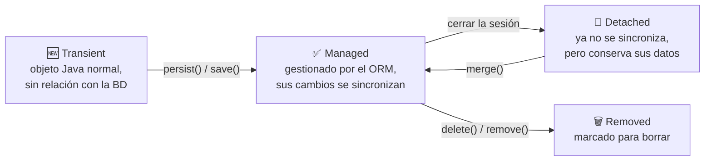
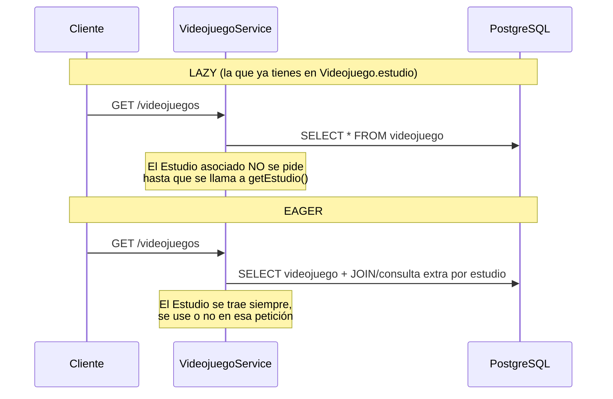

<a id="hibernate-a-fondo"></a>

# 🧩 6. Hibernate a fondo: decisiones de mapeo y ciclo de vida

Ya sabes qué es un ORM, y por qué existe (lo viste al principio de este tema, con `Libro`/`Editorial`) — llevas usando sus anotaciones desde la primera actividad. Toca ahora profundizar en lo que hasta ahora dabas por sentado: que esas anotaciones se podrían haber declarado de una forma completamente distinta, qué estados atraviesa un objeto mientras el ORM lo gestiona, y — ya sobre tu propio proyecto — cómo se instala y configura Hibernate de verdad, y por qué tomaste ciertas decisiones de mapeo (`IDENTITY`, `LAZY`, `cascade`...) que hasta ahora no habías cuestionado.

---

## 📐 Clase persistente y formas de declarar el mapeo

Una **clase persistente** (o entidad) es una clase Java cuyos objetos el ORM sabe guardar y recuperar de la base de datos. Existen dos formas históricas de declarar el mapeo entre una clase y una tabla — la que usas tú, y la que la precedió:

| Forma de mapeo | Cómo se declara | Estado hoy |
|---|---|---|
| **Fichero XML** | Documento aparte (`<hibernate-mapping>` como raíz, un `<class>` por entidad, un `<property>` por campo) | Legado — apenas se usa en proyectos nuevos |
| **Anotaciones** | Directamente sobre la propia clase (`@Entity`, `@Column`...) | El que usas tú desde la Actividad 1.1, y el estándar actual |

---

## 🔄 Los estados de un objeto en el ORM

Un objeto gestionado por un ORM pasa por distintos estados a lo largo de su vida:



- **Transient**: un objeto Java recién creado con `new`, sin ninguna relación todavía con la base de datos — el ORM no sabe que existe.
- **Managed** (o *persistent*): el ORM lo está gestionando activamente; cualquier cambio que hagas sobre sus campos se sincroniza automáticamente con la base de datos.
- **Detached**: el objeto existió como managed, pero la sesión que lo gestionaba se ha cerrado — conserva sus datos, pero ya no se sincroniza solo.
- **Removed**: marcado para eliminarse de la base de datos.

---

## 🗄️ Hibernate en un proyecto Spring Boot

### "Instalar" Hibernate no es un paso manual

A diferencia de lo que sugiere la palabra "instalar", en un proyecto Spring Boot no descargas ni configuras Hibernate por separado: viene incluido en la dependencia que ya conoces del Tema 1.

```xml
<dependency>
    <groupId>org.springframework.boot</groupId>
    <artifactId>spring-boot-starter-data-jpa</artifactId>
</dependency>
```

`spring-boot-starter-data-jpa` trae Hibernate como implementación de JPA por defecto, además de Spring Data JPA. Con solo esa dependencia (que ya tienes en tu `pom.xml` desde la Actividad 1.1), Hibernate está "instalado y configurado" en lo esencial.

### Decisiones de mapeo que ya tomaste, explicadas

Tu `Videojuego` y tu `Estudio` de la Actividad 1.1 ya llevan varias anotaciones concretas — las escribiste siguiendo el patrón de la teoría, sin que se justificara todavía cada elección. Toca cerrar ese hueco.

**`GenerationType.IDENTITY`, ¿por qué esa estrategia?** Existen otras (`SEQUENCE`, `AUTO`, `TABLE`), y cada una resuelve el mismo problema — generar un id único — de una forma distinta:

| Estrategia | Cómo genera el id | Cuándo conviene |
|---|---|---|
| **`IDENTITY`** | Delega en una columna autoincremental de la propia base de datos (en PostgreSQL, un `serial`/`identity` nativo) | Caso general — la que ya usas en `Videojuego`/`Estudio` |
| **`SEQUENCE`** | Usa un objeto secuencia independiente que Hibernate puede consultar por adelantado | Cuando necesitas reservar varios ids antes de insertar — algo que `IDENTITY` no permite |

Con PostgreSQL, que soporta columnas identity de forma nativa y eficiente, `IDENTITY` es la opción más directa cuando no necesitas esa reserva anticipada.

**`@Column(precision, scale)`, y por qué importa en una columna de dinero.** Puedes comprobarlo tú mismo: quita temporalmente `@Column(precision = 10, scale = 2)` de `precio`, borra la tabla y reinicia con `show-sql: true` activo — verás que el `create table` genera un tipo de columna distinto (sin la precisión exacta que sí tenía antes). En una columna que guarda dinero, esa precisión no es un detalle decorativo: sin ella, el cálculo podría dejar más decimales de los que tiene sentido guardar.

**`FetchType.LAZY` frente a `EAGER`, en número real de consultas.** Puedes comprobarlo activando el log de SQL (`logging.level.org.hibernate.SQL: DEBUG`) y contando cuántas consultas distintas aparecen al llamar a `GET /api/v1/videojuegos`:



Con `LAZY`, Hibernate no trae el `Estudio` asociado hasta que de verdad lo pides. Con `EAGER`, lo trae siempre en la misma consulta o en una adicional inmediata — más consultas (o *joins* más pesados) por cada petición, incluso cuando el cliente nunca llega a mirar ese dato.

**`cascade`/`orphanRemoval`, y qué pasa si los quitas.** Con tu configuración actual (`cascade = CascadeType.ALL, orphanRemoval = true` en `Estudio.videojuegos`), borrar un estudio borra en cascada sus videojuegos:

| Si quitas... | Qué pasa |
|---|---|
| `cascade` | Borrar un `Estudio` falla por la clave foránea que sigue apuntando a sus `Videojuego` — tendrías que borrarlos tú, uno a uno, antes |
| `orphanRemoval` | Quitar un `Videojuego` de la lista `videojuegos` sin borrar el `Estudio` entero lo deja huérfano en la base de datos, sin que Hibernate lo elimine por su cuenta |

La cascada se declara en el lado `Estudio → Videojuego` (el lado "uno" de la relación) porque no tendría sentido al revés: borrar un solo videojuego no debería llevarse por delante el estudio entero.

### Configuración avanzada: cuando el mapeo no es directo

Hibernate necesita, a veces, ayuda extra para mapear tipos que no tienen una correspondencia directa con una columna estándar (como el JSON que verás en el Tema 3). Esa ayuda se declara con un `@Converter` (una clase que implementa `AttributeConverter`, indicándole a Hibernate cómo convertir ese tipo concreto hacia y desde la columna) — no necesitas escribir uno todavía; basta con saber que, cuando el mapeo automático no llega, es exactamente ahí donde se completa.

### `ddl-auto`: configuración del ORM, no del conector

Ya usaste `spring.jpa.hibernate.ddl-auto: update` desde la Actividad 1.1, pero desde el ángulo de "cómo se crea la tabla". Con la distinción entre conector y ORM que ya conoces, es el momento de precisarlo: la conexión (usuario, contraseña, URL) es configuración del **conector**; qué hace Hibernate con las entidades que declaras (crear tablas, validarlas, no tocar nada) es configuración del **ORM** — y vive en esa misma propiedad, `ddl-auto`.

`ddl-auto` no es la única propiedad de configuración del ORM — estas son las que más vas a usar:

| Propiedad | Qué controla |
|---|---|
| `spring.jpa.hibernate.ddl-auto` | Si Hibernate crea, actualiza o solo valida las tablas al arrancar. |
| `spring.jpa.show-sql` | Si Hibernate imprime en consola el SQL real que ejecuta por debajo (ya la usaste en la Actividad 1.1, sin que se explicara todavía qué hacía). |
| `spring.jpa.properties.hibernate.format_sql` | Si ese SQL impreso se formatea legible, en varias líneas, en vez de aparecer todo seguido. |

!!! tip "El otro lado de lo automático: `data.sql`"
    `ddl-auto` resuelve la estructura (crear las tablas), pero no mete ni una fila de datos. Si colocas un fichero `src/main/resources/data.sql` con sentencias `INSERT`, Spring Boot lo ejecuta automáticamente justo después de crear el esquema, cada vez que arranca la aplicación — útil para tener datos de prueba consistentes sin sembrarlos a mano por `psql` o por `curl` cada vez. No lo has necesitado hasta ahora porque las actividades sembraban los datos explícitamente para que quedara claro qué se estaba probando, pero conviene que sepas que existe esta vía automática.

---

## 🔁 Los estados, ahora con `Libro`

Retoma el ciclo de estados que acabas de ver ("Los estados de un objeto en el ORM") con un ejemplo concreto: un `new Libro()` recién creado en Java es **transient** — el ORM no sabe nada de él. En cuanto lo guardas (lo verás en el siguiente apartado), pasa a **managed**: mientras la operación está en curso, cualquier cambio sobre sus campos se sincroniza con la base de datos. Si la transacción termina y la sesión se cierra, ese mismo objeto pasa a **detached** — sigue teniendo sus datos, pero ya no se sincroniza solo.

---

## ✅ Ideas clave

??? tip "Abrir resumen"

    - El mapeo se declara con **anotaciones** sobre la propia entidad (el XML de mapeo, con `<class>`/`<property>`, es el enfoque legado).
    - Los estados de un objeto en el ORM: **transient** (sin relación con la BD) → **managed** (gestionado, se sincroniza solo) → **detached** (ya no se sincroniza) / **removed** (marcado para borrar).
    - "Instalar" Hibernate en Spring Boot es, en la práctica, añadir `spring-boot-starter-data-jpa`.
    - `IDENTITY` delega la generación del id en la propia base de datos; `SEQUENCE` permite reservar ids por adelantado. `precision`/`scale` fijan el tipo exacto de columna (importa en dinero). `LAZY` difiere la carga de una relación hasta que se pide de verdad; `EAGER` la trae siempre. `cascade`/`orphanRemoval` propagan borrados y limpian huérfanos automáticamente.
    - `ddl-auto` es configuración del **ORM** (qué hace Hibernate con tus entidades), distinta de la configuración del **conector** (cómo se conecta); `show-sql`/`format_sql` muestran el SQL real generado.
    - `ddl-auto` crea el esquema automáticamente; `data.sql` (si existe en `resources`) siembra datos automáticamente justo después, en cada arranque.
