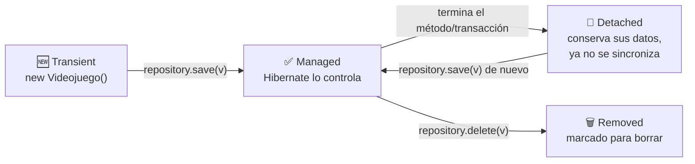
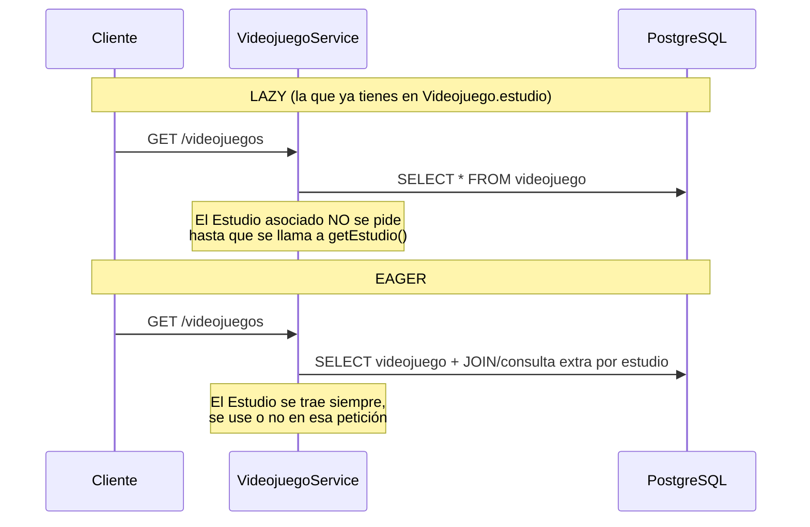

<a id="hibernate-a-fondo"></a>

# 🧩 6. Hibernate a fondo: decisiones de mapeo y ciclo de vida

Ya sabes qué es un ORM, y por qué existe (lo viste al principio de este tema, con `Libro`/`Editorial`) — llevas usando sus anotaciones desde la primera actividad. Toca ahora profundizar en lo que hasta ahora dabas por sentado: que esas anotaciones se podrían haber declarado de una forma completamente distinta, qué estados atraviesa un objeto mientras el ORM lo gestiona, y — ya sobre tu propio proyecto — cómo se instala y configura Hibernate de verdad, y por qué tomaste ciertas decisiones de mapeo (`IDENTITY`, `LAZY`, `cascade`...) que hasta ahora no habías cuestionado.

---

## 📐 Clase persistente y formas de declarar el mapeo

Una **clase persistente** (o entidad) es una clase Java cuyos objetos el ORM sabe guardar y recuperar de la base de datos. Existen dos formas históricas de declarar el mapeo entre una clase y una tabla — la que usas tú, y la que la precedió:

| Forma de mapeo | Cómo se declara | Estado hoy |
|---|---|---|
| **Fichero XML** | Documento aparte (`<hibernate-mapping>` como raíz, un `<class>` por entidad, un `<property>` por campo) | Legado — apenas se usa en proyectos nuevos |
| **Anotaciones** | Directamente sobre la propia clase (`@Entity`, `@Column`...) | El que usas tú desde la Actividad 1.1, y el estándar actual |

Las anotaciones ganaron terreno porque viven pegadas al propio código: cambias un campo y su mapeo a la vez, en el mismo fichero, sin mantener sincronizados un `.java` y un `.xml` por separado.

---

## 🔄 Los estados de un objeto en el ORM

Un objeto gestionado por un ORM pasa por distintos estados a lo largo de su vida:

- **Transient**: objeto Java recién creado, sin relación todavía con la base de datos — Hibernate no sabe que existe.
- **Managed** (o *persistent*): Hibernate lo gestiona activamente — cambiar un campo se sincroniza solo con la base de datos.
- **Detached**: la sesión que lo gestionaba se ha cerrado — conserva sus datos, pero ya no se sincroniza.
- **Removed**: marcado para eliminarse de la base de datos.

Estos nombres no son abstractos: nombran en qué momento exacto del código que ya escribes está cada objeto. Sigue este recorrido con tu propio `Videojuego`, línea a línea:

```java
Videojuego v = new Videojuego();       // 1. TRANSIENT: objeto Java normal, Hibernate no sabe que existe
v.setTitulo("Celeste");                //    (puedes tocar sus campos libremente, nada se guarda todavía)

videojuegoRepository.save(v);          // 2. Al llamar a save(), pasa a MANAGED: Hibernate ya lo controla
                                        //    y lo ha insertado en la base de datos

// ... en otra petición, más tarde ...

Videojuego v2 = videojuegoRepository.findById(1L).get(); // 3. MANAGED: recién cargado desde la BD
v2.setPrecio(nuevoPrecio);              // 4. Cambiar un campo aquí, MIENTRAS v2 sigue siendo managed,
                                         //    ya se sincroniza solo con la base de datos

// cuando el método/transacción termina y Spring cierra la sesión...
                                         // 5. v2 pasa a DETACHED: conserva sus datos, pero ya no se sincroniza

videojuegoRepository.delete(v2);        // 6. REMOVED: marcado para borrar (y borrado de verdad al terminar)
```



!!! question "¿Cuándo haces `new`, y cuándo intervienen los métodos del ORM?"
    `new Videojuego()` lo escribes tú, en tu propio código (normalmente en un service) — es un objeto Java corriente, igual que cualquier otro que hayas creado en cualquier clase. Hibernate no se entera de que existe hasta que se lo pasas explícitamente a un método de tu repository. `save()` es precisamente ese momento de transición: convierte un objeto transient en managed (si es la primera vez) o sincroniza uno ya existente (si venía de un `findById`).

!!! tip "¿Por qué el diagrama no dice `persist()`/`merge()`, si son los nombres 'oficiales' de JPA?"
    En JPA "puro" (sin Spring Data), tendrías que llamar tú mismo a `entityManager.persist(v)` la primera vez que guardas un objeto, y a `entityManager.merge(v)` para sincronizar uno que ya existía — dos métodos distintos según el caso, y tendrías que saber cuál tocaba en cada momento. `save()` de Spring Data JPA es una capa de comodidad por encima: mira si el objeto ya tiene id y decide por ti si hace falta un `persist` o un `merge`, sin que tengas que distinguirlo tú.

!!! tip "¿Y por qué se vuelve detached automáticamente, sin que llames a nada?"
    Cada método de tu service (gestionado por Spring, típicamente con `@Transactional` de por medio) abre su propia sesión de Hibernate y la cierra al terminar. Mientras el método sigue en marcha, cualquier objeto que hayas cargado o guardado está managed; en cuanto el método devuelve su resultado y la transacción se cierra, ese mismo objeto pasa a detached sin que hagas nada explícito — es una consecuencia del final del método, no una acción que tú invoques.

---

## 🗄️ Hibernate en un proyecto Spring Boot

### "Instalar" Hibernate no es un paso manual

A diferencia de lo que sugiere la palabra "instalar", en un proyecto Spring Boot no descargas ni configuras Hibernate por separado: viene incluido en la dependencia que ya conoces del Tema 1.

```xml
<dependency>
    <groupId>org.springframework.boot</groupId>
    <artifactId>spring-boot-starter-data-jpa</artifactId>
</dependency>
```

`spring-boot-starter-data-jpa` trae Hibernate como implementación de JPA por defecto, además de Spring Data JPA. Con solo esa dependencia (que ya tienes en tu `pom.xml` desde la Actividad 1.1), Hibernate está "instalado y configurado" en lo esencial.

### Decisiones de mapeo que ya tomaste, explicadas

Tu `Videojuego` y tu `Estudio` de la Actividad 1.1 ya llevan varias anotaciones concretas — las escribiste siguiendo el patrón de la teoría, sin que se justificara todavía cada elección. Toca cerrar ese hueco.

#### `GenerationType.IDENTITY`, ¿por qué esa estrategia?

`GenerationType` tiene cuatro valores, y cada uno resuelve el mismo problema — generar un id único — de una forma distinta:

| Estrategia | Cómo genera el id | Cuándo conviene |
|---|---|---|
| **`IDENTITY`** | Delega en una columna autoincremental de la propia base de datos (en PostgreSQL, un `serial`/`identity` nativo) | Caso general — la que ya usas en `Videojuego`/`Estudio` |
| **`SEQUENCE`** | Usa un objeto secuencia independiente que Hibernate puede consultar por adelantado | Cuando necesitas reservar varios ids antes de insertar — algo que `IDENTITY` no permite |
| **`TABLE`** | Simula una secuencia con una tabla auxiliar propia que Hibernate gestiona a mano | La más lenta de las cuatro — solo tiene sentido si el motor no soporta ni `IDENTITY` ni `SEQUENCE` |
| **`AUTO`** | Deja que el propio Hibernate elija una de las anteriores según el motor de base de datos configurado | Cuando quieres que el mismo código funcione igual si cambias de motor, sin decidir tú la estrategia |

Con PostgreSQL, que soporta columnas identity de forma nativa y eficiente, `IDENTITY` es la opción más directa cuando no necesitas la reserva anticipada de `SEQUENCE` ni la portabilidad de `AUTO`.

!!! example "`TABLE`, en concreto: así es la tabla auxiliar que crea Hibernate"
    `TABLE` es la más difícil de visualizar de las cuatro, porque no usa ninguna función nativa del motor — Hibernate crea una tabla normal y corriente, con una fila por cada entidad que la use, y cada vez que necesita un id nuevo hace, dentro de una transacción, un `SELECT` para leer el valor actual y un `UPDATE` para incrementarlo:

    ```sql
    -- la tabla auxiliar que crea y gestiona Hibernate
    CREATE TABLE hibernate_sequence (
        entidad VARCHAR(255) PRIMARY KEY,
        valor_actual BIGINT
    );

    -- cada vez que hace falta un id nuevo para Videojuego:
    SELECT valor_actual FROM hibernate_sequence WHERE entidad = 'videojuego'; -- 1. lee el valor
    UPDATE hibernate_sequence SET valor_actual = valor_actual + 1 WHERE entidad = 'videojuego'; -- 2. lo incrementa
    ```

    Es literalmente lo mismo que hace `SEQUENCE` por dentro — la diferencia es que `SEQUENCE` es un objeto del motor, optimizado por el propio PostgreSQL para que muchas inserciones a la vez no se bloqueen entre sí; `TABLE` es una tabla corriente, y ese `SELECT`/`UPDATE` se bloquea como cualquier otra fila. Con pocas inserciones no se nota, pero con muchas simultáneas se convierte en un cuello de botella — de ahí que sea la opción más lenta de las cuatro.

#### `@Column(precision, scale)`, y por qué importa en una columna de dinero

Para guardar dinero tenías, en realidad, tres alternativas — no solo "poner precision/scale o no":

| Alternativa | Cómo funciona | Por qué no se usó (o sí) |
|---|---|---|
| **`BigDecimal` sin `precision`/`scale`** | Hibernate elige un tipo de columna genérico, sin límite exacto de decimales | Deja que el motor decida el tipo — puede admitir más decimales de los que tiene sentido para un precio |
| **`BigDecimal` con `precision`/`scale`** (la elegida) | Tú fijas exactamente cuántos dígitos y decimales admite la columna | Precisión explícita y controlada, sin depender del valor por defecto del motor |
| **Entero en céntimos** (`Long precioEnCentimos`) | El dinero se guarda como un entero (250099 = 2500,99€), sin ningún decimal que redondear | Elimina el problema de raíz, a cambio de tener que multiplicar/dividir por 100 en cada conversión a euros — más código, menos intuitivo de leer |

Puedes comprobar la diferencia entre las dos primeras tú mismo: quita temporalmente `@Column(precision = 10, scale = 2)` de `precio`, borra la tabla y reinicia con `show-sql: true` activo — verás que el `create table` genera un tipo de columna distinto (sin la precisión exacta que sí tenía antes). En una columna que guarda dinero, esa precisión no es un detalle decorativo: sin ella, el cálculo podría dejar más decimales de los que tiene sentido guardar.

#### `FetchType.LAZY` frente a `EAGER`, en número real de consultas

Puedes comprobarlo activando el log de SQL (`logging.level.org.hibernate.SQL: DEBUG`) y contando cuántas consultas distintas aparecen al llamar a `GET /api/v1/videojuegos`:



Con `LAZY`, Hibernate no trae el `Estudio` asociado hasta que de verdad lo pides. Con `EAGER`, lo trae siempre en la misma consulta o en una adicional inmediata — más consultas (o *joins* más pesados) por cada petición, incluso cuando el cliente nunca llega a mirar ese dato.

#### `cascade`/`orphanRemoval`, y qué otras opciones había

`CascadeType.ALL` no es la única opción — es, de hecho, un atajo que combina otras cinco por separado. Podrías haber elegido propagar solo algunas operaciones, o ninguna:

| Valor de `cascade` | Qué propaga de `Estudio` hacia sus `Videojuego` |
|---|---|
| *(sin `cascade`)* | Nada — cada operación sobre un `Videojuego` la harías tú mismo, uno a uno |
| `PERSIST` | Guardar el `Estudio` guarda también los videojuegos nuevos que le hayas añadido |
| `MERGE` | Actualizar el `Estudio` sincroniza también los cambios de sus videojuegos ya existentes |
| `REMOVE` | Borrar el `Estudio` borra también todos sus videojuegos |
| `REFRESH` / `DETACH` | Recargar o desvincular el `Estudio` hace lo mismo con sus videojuegos |
| **`ALL`** (la elegida) | Las cinco anteriores combinadas, en una sola palabra |

Con tu configuración actual (`cascade = CascadeType.ALL, orphanRemoval = true` en `Estudio.videojuegos`), borrar un estudio borra en cascada sus videojuegos. Pero podrías haber elegido, por ejemplo, `cascade = {PERSIST, MERGE}` sin `REMOVE`: guardar y actualizar se propagarían igual, pero borrar un `Estudio` con videojuegos asociados fallaría por la clave foránea — obligándote a decidir explícitamente qué hacer con ellos, en vez de arrastrarlos en silencio. Se eligió `ALL` porque, en este proyecto, un videojuego sin su estudio no tiene sentido de negocio: no hay ningún caso en que interese conservarlo huérfano.

`orphanRemoval` es una decisión aparte, binaria — `true` (la elegida) o `false` (el valor por defecto si no lo escribes):

| Si `orphanRemoval` es... | Qué pasa al quitar un `Videojuego` de la lista `videojuegos` (sin borrar el `Estudio`) |
|---|---|
| `true` (la elegida) | Hibernate lo detecta como huérfano y lo elimina de la base de datos por su cuenta |
| `false` (por defecto) | El videojuego se queda en la base de datos, sin ningún `Estudio` que lo referencie desde la lista |

La cascada se declara en el lado `Estudio → Videojuego` (el lado "uno" de la relación) porque no tendría sentido al revés: borrar un solo videojuego no debería llevarse por delante el estudio entero.

### Configuración avanzada: cuando el mapeo no es directo

Hibernate necesita, a veces, ayuda extra para mapear tipos que no tienen una correspondencia directa con una columna estándar (como el JSON que verás en el Tema 2). Esa ayuda se declara con un `@Converter` (una clase que implementa `AttributeConverter`, indicándole a Hibernate cómo convertir ese tipo concreto hacia y desde la columna) — no necesitas escribir uno todavía; basta con saber que, cuando el mapeo automático no llega, es exactamente ahí donde se completa.

### `ddl-auto`: configuración del ORM, no del conector

Ya usaste `spring.jpa.hibernate.ddl-auto: update` desde la Actividad 1.1, pero desde el ángulo de "cómo se crea la tabla". Con la distinción entre conector y ORM que ya conoces, es el momento de precisarlo: la conexión (usuario, contraseña, URL) es configuración del **conector**; qué hace Hibernate con las entidades que declaras (crear tablas, validarlas, no tocar nada) es configuración del **ORM** — y vive en esa misma propiedad, `ddl-auto`.

`ddl-auto` no es la única propiedad de configuración del ORM — estas son las que más vas a usar:

| Propiedad | Qué controla |
|---|---|
| `spring.jpa.hibernate.ddl-auto` | Si Hibernate crea, actualiza o solo valida las tablas al arrancar. |
| `spring.jpa.show-sql` | Si Hibernate imprime en consola el SQL real que ejecuta por debajo (ya la usaste en la Actividad 1.1, sin que se explicara todavía qué hacía). |
| `spring.jpa.properties.hibernate.format_sql` | Si ese SQL impreso se formatea legible, en varias líneas, en vez de aparecer todo seguido. |

!!! tip "El otro lado de lo automático: `data.sql`"
    `ddl-auto` resuelve la estructura (crear las tablas), pero no mete ni una fila de datos. Si colocas un fichero `src/main/resources/data.sql` con sentencias `INSERT`, Spring Boot lo ejecuta automáticamente justo después de crear el esquema, cada vez que arranca la aplicación — útil para tener datos de prueba consistentes sin sembrarlos a mano por `psql` o por `curl` cada vez. No lo has necesitado hasta ahora porque las actividades sembraban los datos explícitamente para que quedara claro qué se estaba probando; en la Actividad 1.5 sí lo vas a usar, para tener de golpe suficiente catálogo con el que probar la paginación.

---

## ✅ Ideas clave

??? tip "Abrir resumen"

    - El mapeo se declara con **anotaciones** sobre la propia entidad (el XML de mapeo, con `<class>`/`<property>`, es el enfoque legado).
    - Los estados de un objeto en el ORM: **transient** (sin relación con la BD) → **managed** (gestionado, se sincroniza solo) → **detached** (ya no se sincroniza) / **removed** (marcado para borrar).
    - "Instalar" Hibernate en Spring Boot es, en la práctica, añadir `spring-boot-starter-data-jpa`.
    - `IDENTITY` delega la generación del id en la propia base de datos; `SEQUENCE` permite reservar ids por adelantado. `precision`/`scale` fijan el tipo exacto de columna (importa en dinero). `LAZY` difiere la carga de una relación hasta que se pide de verdad; `EAGER` la trae siempre. `cascade`/`orphanRemoval` propagan borrados y limpian huérfanos automáticamente.
    - `ddl-auto` es configuración del **ORM** (qué hace Hibernate con tus entidades), distinta de la configuración del **conector** (cómo se conecta); `show-sql`/`format_sql` muestran el SQL real generado.
    - `ddl-auto` crea el esquema automáticamente; `data.sql` (si existe en `resources`) siembra datos automáticamente justo después, en cada arranque.
