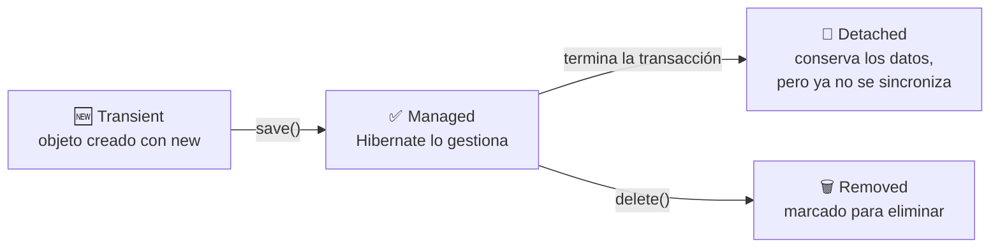
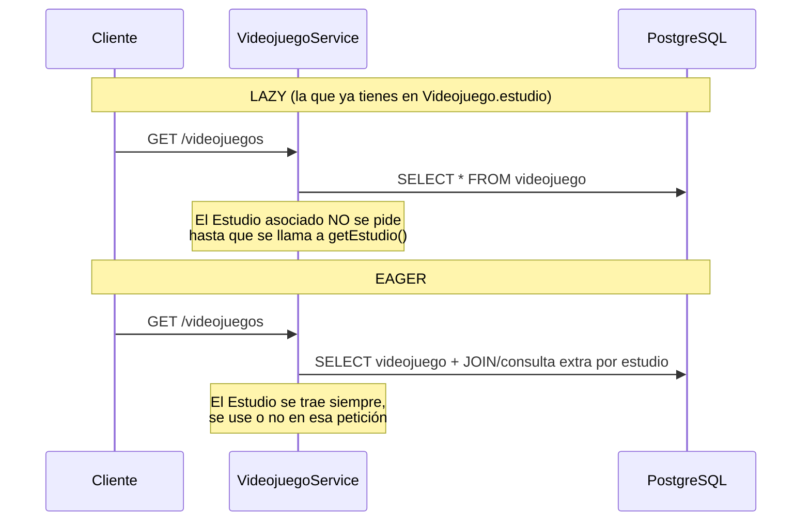

<a id="hibernate-a-fondo"></a>

# 🧩 6. Hibernate a fondo: decisiones de mapeo y ciclo de vida

Ya sabes qué es un ORM, y por qué existe (lo viste al principio de este tema, con `Libro`/`Editorial`) — llevas usando sus anotaciones desde la primera actividad. Toca ahora profundizar en lo que hasta ahora dabas por sentado: que esas anotaciones se podrían haber declarado de una forma completamente distinta, qué estados atraviesa un objeto mientras el ORM lo gestiona, y — ya sobre tu propio proyecto — cómo se instala y configura Hibernate de verdad, y por qué tomaste ciertas decisiones de mapeo (`IDENTITY`, `LAZY`, `cascade`...) que hasta ahora no habías cuestionado.

---

## 📐 Clase persistente y formas de declarar el mapeo

Una **clase persistente** (o entidad) es una clase Java cuyos objetos el ORM sabe guardar y recuperar de la base de datos. Existen dos formas históricas de declarar el mapeo entre una clase y una tabla — la que usas tú, y la que la precedió:

| Forma de mapeo | Cómo se declara | Estado hoy |
|---|---|---|
| **Fichero XML** | Documento aparte (`<hibernate-mapping>` como raíz, un `<class>` por entidad, un `<property>` por campo) | Legado — apenas se usa en proyectos nuevos |
| **Anotaciones** | Directamente sobre la propia clase (`@Entity`, `@Column`...) | El que usas tú desde la Actividad 1.1, y el estándar actual |

Las anotaciones ganaron terreno porque viven pegadas al propio código: cambias un campo y su mapeo a la vez, en el mismo fichero, sin mantener sincronizados un `.java` y un `.xml` por separado.

---

## 🔄 Los estados de un objeto en el ORM

Un objeto gestionado por un ORM pasa por distintos estados a lo largo de su vida:

- **Transient**: objeto Java recién creado, sin relación todavía con la base de datos — Hibernate no sabe que existe.
- **Managed** (o *persistent*): Hibernate lo está gestionando activamente — si cambias alguno de sus campos dentro de la transacción, detectará el cambio y lo guardará al finalizar.
- **Detached**: Hibernate ya no está gestionando el objeto — conserva sus datos, pero los cambios que hagas sobre él ya no se sincronizan automáticamente con la base de datos.
- **Removed**: marcado para eliminarse de la base de datos.

Estos estados se entienden mejor observando tres situaciones habituales.

### Crear una entidad nueva

```java
Videojuego videojuego = new Videojuego(); // TRANSIENT
videojuego.setTitulo("Celeste");

Videojuego guardado = videojuegoRepository.save(videojuego);
```

Al utilizar `new`, el objeto solo existe en la memoria de Java: está en estado **transient**. Cuando se guarda, Hibernate empieza a gestionarlo y lo inserta en la base de datos.

Conviene recoger siempre el objeto devuelto por `save()`:

```java
Videojuego guardado = videojuegoRepository.save(videojuego);
```

Ese objeto contiene el estado definitivo de la entidad, incluido el identificador generado por la base de datos.

### Recuperar y modificar una entidad

```java
@Transactional
public void cambiarPrecio(Long id, BigDecimal nuevoPrecio) {
    Videojuego videojuego = videojuegoRepository.findById(id)
            .orElseThrow();

    videojuego.setPrecio(nuevoPrecio);
}
```

La entidad obtenida mediante `findById()` está en estado **managed** mientras dura la transacción. Hibernate detecta el cambio de precio y lo guarda cuando la transacción termina correctamente, aunque no aparezca una nueva llamada a `save()`.

Cuando la transacción finaliza y Hibernate deja de gestionar ese objeto, pasa a estado **detached**. Conserva todos sus datos, pero los cambios posteriores ya no se sincronizan automáticamente con la base de datos.

### Eliminar una entidad

```java
@Transactional
public void eliminar(Long id) {
    Videojuego videojuego = videojuegoRepository.findById(id)
            .orElseThrow();

    videojuegoRepository.delete(videojuego);
}
```

Al llamar a `delete()`, la entidad queda en estado **removed**: Hibernate la marca para eliminarla de la base de datos al confirmar la transacción.


```mermaid
flowchart LR
    T["🆕 Transient<br/>objeto creado con new"] -->|"save()"| M["✅ Managed<br/>Hibernate lo gestiona"]
    M -->|"termina la transacción"| D["🔌 Detached<br/>conserva los datos,<br/>pero ya no se sincroniza"]
    M -->|"delete()"| R["🗑️ Removed<br/>marcado para eliminar"]
```

En JPA existen operaciones internas distintas para guardar entidades nuevas y entidades que ya existían: `persist()` y `merge()`. Spring Data JPA oculta esa diferencia detrás de `save()`. No necesitas decidir cuál utilizar en cada caso. Para trabajar de forma segura, quédate con dos reglas:

- Si cargas una entidad dentro de una transacción, puedes modificarla y Hibernate detectará los cambios.
- Cuando llames a `save()`, utiliza el objeto que devuelve el repository.

!!! tip "¿Cuándo deja de estar managed?"
    Hibernate mantiene una zona de trabajo en la que controla los objetos que ha cargado o guardado. Esta zona se llama **contexto de persistencia**.

    Mientras un objeto está dentro de ese contexto, permanece `managed`: Hibernate detecta sus cambios y puede guardarlos automáticamente.

    Cuando el contexto termina, el objeto pasa a `detached`. El objeto Java sigue existiendo y conserva sus datos, pero Hibernate ya no vigila los cambios que hagas sobre él.

    Para empezar, quédate con esta idea:

    ```text
    managed  → Hibernate vigila los cambios
    detached → Hibernate ya no vigila los cambios
    ```

    En los métodos anotados con `@Transactional`, lo habitual es que el objeto permanezca gestionado durante la transacción.

---

## 🗄️ Hibernate en un proyecto Spring Boot

### "Instalar" Hibernate no es un paso manual

A diferencia de lo que sugiere la palabra "instalar", en un proyecto Spring Boot no descargas ni configuras Hibernate por separado: viene incluido en la dependencia que ya conoces del Tema 1.

```xml
<dependency>
    <groupId>org.springframework.boot</groupId>
    <artifactId>spring-boot-starter-data-jpa</artifactId>
</dependency>
```

`spring-boot-starter-data-jpa` trae Hibernate como implementación de JPA por defecto, además de Spring Data JPA. Con solo esa dependencia (que ya tienes en tu `pom.xml` desde la Actividad 1.1), Hibernate está "instalado y configurado" en lo esencial.

### Decisiones de mapeo que ya has tomado, explicadas

Tu `Videojuego` y tu `Estudio` de la Actividad 1.1 ya llevan varias anotaciones concretas — las has escrito siguiendo el patrón de la teoría, sin que se justificara todavía cada elección. Toca cerrar ese hueco.

#### `GenerationType.IDENTITY`, ¿por qué esa estrategia?
`GenerationType` tiene cinco valores. Todos resuelven el mismo problema —generar un identificador único—, pero lo hacen de formas diferentes:

| Estrategia     | Cómo genera el id                                                                                          | Cuándo conviene                                                                                |
| -------------- | ---------------------------------------------------------------------------------------------------------- | ---------------------------------------------------------------------------------------------- |
| **`IDENTITY`** | Delega en una columna autoincremental de la propia base de datos.                                          | Es la que utilizas en `Videojuego` y `Estudio`, cuyos identificadores son números `Long`.      |
| **`SEQUENCE`** | Utiliza una secuencia de la base de datos que Hibernate puede consultar antes de insertar.                 | Cuando necesitas reservar identificadores por adelantado.                                      |
| **`TABLE`**    | Simula una secuencia mediante una tabla auxiliar gestionada por Hibernate.                                 | Cuando el gestor no dispone de columnas identity ni secuencias.                                |
| **`UUID`**     | Genera un identificador UUID, como `550e8400-e29b-41d4-a716-446655440000`.                                 | Cuando interesa generar identificadores únicos sin depender de una secuencia numérica central. |
| **`AUTO`**     | Deja que Hibernate elija la estrategia más adecuada según el tipo del identificador y el gestor utilizado. | Cuando prefieres delegar la elección en el ORM.                                                |

En este proyecto continuarás utilizando `IDENTITY`, porque tus entidades tienen un identificador numérico `Long` y PostgreSQL puede generarlo automáticamente. `UUID` es otra posibilidad útil, pero requeriría declarar el identificador con el tipo `UUID`:

```java
@Id
@GeneratedValue(strategy = GenerationType.UUID)
private UUID id;
```

!!! example "`TABLE`, en concreto: así es la tabla auxiliar que crea Hibernate"
    `TABLE` es una de las estrategias más difíciles de visualizar, porque no usa ninguna función nativa del motor — Hibernate crea una tabla normal y corriente, con una fila por cada entidad que la use, y cada vez que necesita un id nuevo hace, dentro de una transacción, un `SELECT` para leer el valor actual y un `UPDATE` para incrementarlo:

    ```sql
    -- la tabla auxiliar que crea y gestiona Hibernate
    CREATE TABLE hibernate_sequence (
        entidad VARCHAR(255) PRIMARY KEY,
        valor_actual BIGINT
    );

    -- cada vez que hace falta un id nuevo para Videojuego:
    SELECT valor_actual FROM hibernate_sequence WHERE entidad = 'videojuego'; -- 1. lee el valor
    UPDATE hibernate_sequence SET valor_actual = valor_actual + 1 WHERE entidad = 'videojuego'; -- 2. lo incrementa
    ```

    Es literalmente lo mismo que hace `SEQUENCE` por dentro — la diferencia es que `SEQUENCE` es un objeto del motor, optimizado por el propio PostgreSQL para que muchas inserciones a la vez no se bloqueen entre sí; `TABLE` es una tabla corriente, y ese `SELECT`/`UPDATE` se bloquea como cualquier otra fila. Con pocas inserciones no se nota, pero con muchas simultáneas se convierte en un cuello de botella — de ahí que normalmente sea la estrategia menos eficiente.

#### `@Column(precision, scale)`, y por qué importa en una columna de dinero

Para guardar dinero tenías, en realidad, tres alternativas — no solo "poner precision/scale o no":

| Alternativa | Cómo funciona | Por qué no se usó (o sí) |
|---|---|---|
| **`BigDecimal` sin `precision`/`scale`** | Hibernate elige un tipo de columna genérico, sin límite exacto de decimales | Deja que el motor decida el tipo — puede admitir más decimales de los que tiene sentido para un precio |
| **`BigDecimal` con `precision`/`scale`** (la elegida) | Tú fijas exactamente cuántos dígitos y decimales admite la columna | Precisión explícita y controlada, sin depender del valor por defecto del motor |
| **Entero en céntimos** (`Long precioEnCentimos`) | El dinero se guarda como un entero (250099 = 2500,99€), sin ningún decimal que redondear | Elimina el problema de raíz, a cambio de tener que multiplicar/dividir por 100 en cada conversión a euros — más código, menos intuitivo de leer |

Puedes comprobar la diferencia entre las dos primeras tú mismo: quita temporalmente `@Column(precision = 10, scale = 2)` de `precio`, borra la tabla y reinicia con `show-sql: true` activo — verás que el `create table` genera un tipo de columna distinto (sin la precisión exacta que sí tenía antes). En una columna que guarda dinero, esa precisión no es un detalle decorativo: sin ella, el cálculo podría dejar más decimales de los que tiene sentido guardar.

#### `FetchType.LAZY` frente a `EAGER`, en número real de consultas

Puedes comprobarlo activando el log de SQL (`logging.level.org.hibernate.SQL: DEBUG`) y contando cuántas consultas distintas aparecen al llamar a `GET /api/v1/videojuegos`:


```mermaid
sequenceDiagram
    participant C as Cliente
    participant S as VideojuegoService
    participant DB as PostgreSQL

    Note over C,DB: LAZY (la que ya tienes en Videojuego.estudio)
    C->>S: GET /videojuegos
    S->>DB: SELECT * FROM videojuego
    Note over S: El Estudio asociado NO se pide<br/>hasta que se llama a getEstudio()

    Note over C,DB: EAGER
    C->>S: GET /videojuegos
    S->>DB: SELECT videojuego + JOIN/consulta extra por estudio
    Note over S: El Estudio se trae siempre,<br/>se use o no en esa petición
```

Con `LAZY`, Hibernate no trae el `Estudio` asociado hasta que de verdad lo pides. Con `EAGER`, lo trae siempre en la misma consulta o en una adicional inmediata — más consultas (o *joins* más pesados) por cada petición, incluso cuando el cliente nunca llega a mirar ese dato.

#### `cascade`/`orphanRemoval`, y qué otras opciones había

`CascadeType.ALL` no es la única opción — es, de hecho, un atajo que combina otras cinco por separado. Podrías haber elegido propagar solo algunas operaciones, o ninguna:

| Valor de `cascade` | Qué propaga de `Estudio` hacia sus `Videojuego` |
|---|---|
| *(sin `cascade`)* | Nada — cada operación sobre un `Videojuego` la harías tú mismo, uno a uno |
| `PERSIST` | Guardar el `Estudio` guarda también los videojuegos nuevos que le hayas añadido |
| `MERGE` | Actualizar el `Estudio` sincroniza también los cambios de sus videojuegos ya existentes |
| `REMOVE` | Borrar el `Estudio` borra también todos sus videojuegos |
| `REFRESH` / `DETACH` | Recargar o desvincular el `Estudio` hace lo mismo con sus videojuegos |
| **`ALL`** (la elegida) | Las cinco anteriores combinadas, en una sola palabra |

Con tu configuración actual (`cascade = CascadeType.ALL, orphanRemoval = true` en `Estudio.videojuegos`), borrar un estudio borra en cascada sus videojuegos. Pero podrías haber elegido, por ejemplo, `cascade = {PERSIST, MERGE}` sin `REMOVE`: guardar y actualizar se propagarían igual, pero borrar un `Estudio` con videojuegos asociados fallaría por la clave foránea — obligándote a decidir explícitamente qué hacer con ellos, en vez de arrastrarlos en silencio. Se eligió `ALL` porque, en este proyecto, un videojuego sin su estudio no tiene sentido de negocio: no hay ningún caso en que interese conservarlo huérfano.

`orphanRemoval` es una decisión aparte, binaria — `true` (la elegida) o `false` (el valor por defecto si no lo escribes):

| Si `orphanRemoval` es... | Qué pasa al quitar un `Videojuego` de la lista `videojuegos` (sin borrar el `Estudio`) |
|---|---|
| `true` (la elegida) | Hibernate lo detecta como huérfano y lo elimina de la base de datos por su cuenta |
| `false` (por defecto) | El videojuego se queda en la base de datos, sin ningún `Estudio` que lo referencie desde la lista |

`orphanRemoval = true` se utiliza cuando el objeto hijo no tiene sentido por separado: si deja de pertenecer al objeto padre, también debe desaparecer de la base de datos.

La cascada se declara en el lado `Estudio → Videojuego` (el lado "uno" de la relación) porque no tendría sentido al revés: borrar un solo videojuego no debería llevarse por delante el estudio entero.

### Configuración avanzada: cuando el mapeo no es directo

Hibernate necesita, a veces, ayuda extra para mapear tipos que no tienen una correspondencia directa con una columna estándar — por ejemplo, si quisieras guardar cifrado el contenido de un campo, o dar formato propio a un tipo que Hibernate no reconoce de fábrica. Esa ayuda se declara con un `@Converter` (una clase que implementa `AttributeConverter`, indicándole a Hibernate cómo convertir ese tipo concreto hacia y desde la columna) — no necesitas escribir uno todavía; basta con saber que, cuando el mapeo automático no llega, es exactamente ahí donde se completa.

### `ddl-auto`: configuración del ORM, no del conector

Ya has usado `spring.jpa.hibernate.ddl-auto: update` desde la Actividad 1.1, pero desde el ángulo de "cómo se crea la tabla". Con la distinción entre conector y ORM que ya conoces, es el momento de precisarlo: la conexión (usuario, contraseña, URL) es configuración del **conector**; qué hace Hibernate con las entidades que declaras (crear tablas, validarlas, no tocar nada) es configuración del **ORM** — y vive en esa misma propiedad, `ddl-auto`.

`ddl-auto` no es la única propiedad de configuración del ORM — estas son las que más vas a usar:

| Propiedad | Qué controla |
|---|---|
| `spring.jpa.hibernate.ddl-auto` | Si Hibernate crea, actualiza o solo valida las tablas al arrancar. |
| `spring.jpa.show-sql` | Si Hibernate imprime en consola el SQL real que ejecuta por debajo (ya la has usado en la Actividad 1.1, sin que se explicara todavía qué hacía). |
| `spring.jpa.properties.hibernate.format_sql` | Si ese SQL impreso se formatea legible, en varias líneas, en vez de aparecer todo seguido. |

!!! tip "El otro lado de lo automático: `data.sql`"
    `ddl-auto` se ocupa de la **estructura** de la base de datos: crea o actualiza las tablas a partir de las entidades. Para introducir datos iniciales puedes crear un fichero:

    ```text
    src/main/resources/data.sql
    ```

    Dentro se escriben sentencias `INSERT` normales:

    ```sql
    INSERT INTO estudio (nombre) VALUES ('Nintendo');
    INSERT INTO estudio (nombre) VALUES ('Supergiant Games');
    ```

    Como el proyecto utiliza PostgreSQL y las tablas las prepara Hibernate, debes añadir estas propiedades en `application-dev.yaml`:

    ```yaml
    spring:
      jpa:
        hibernate:
          ddl-auto: update
        defer-datasource-initialization: true

      sql:
        init:
          mode: always
    ```

    Cada propiedad cumple una función:

    - `spring.sql.init.mode: always` hace que Spring Boot ejecute `data.sql` también con PostgreSQL.
    - `spring.jpa.defer-datasource-initialization: true` espera a que Hibernate haya preparado las tablas antes de ejecutar los `INSERT`.

    De esta manera, el orden de arranque será:

    ```text
    Hibernate prepara las tablas → Spring Boot ejecuta data.sql → arranca la aplicación
    ```

    En la Actividad 1.5 utilizarás este mecanismo para disponer rápidamente de suficientes datos con los que probar la paginación.

    Ten en cuenta que `data.sql` se ejecuta cada vez que arranca la aplicación. Los datos del fichero deben estar preparados para no provocar errores por insertar varias veces los mismos registros.

---

## ✅ Ideas clave

??? tip "Abrir resumen"

    - El mapeo se declara con **anotaciones** sobre la propia entidad (el XML de mapeo, con `<class>`/`<property>`, es el enfoque legado).
    - Los estados de un objeto en el ORM: **transient** (sin relación con la BD) → **managed** (gestionado, se sincroniza solo) → **detached** (ya no se sincroniza) / **removed** (marcado para borrar).
    - "Instalar" Hibernate en Spring Boot es, en la práctica, añadir `spring-boot-starter-data-jpa`.
    - `IDENTITY` delega la generación del id en la propia base de datos; `SEQUENCE` permite reservar ids por adelantado. `precision`/`scale` fijan el tipo exacto de columna (importa en dinero). `LAZY` difiere la carga de una relación hasta que se pide de verdad; `EAGER` la trae siempre. `cascade`/`orphanRemoval` propagan borrados y limpian huérfanos automáticamente.
    - `ddl-auto` es configuración del **ORM** (qué hace Hibernate con tus entidades), distinta de la configuración del **conector** (cómo se conecta); `show-sql`/`format_sql` muestran el SQL real generado.
    - `ddl-auto` permite que Hibernate prepare las tablas. Para ejecutar después un `data.sql` sobre PostgreSQL se utilizan `spring.sql.init.mode: always` y `spring.jpa.defer-datasource-initialization: true`.

