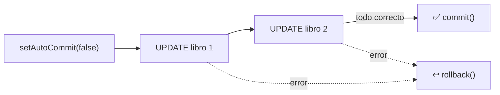

<a id="jdbc-puro"></a>

# 🧩 4. JDBC puro: conexión manual sin ORM

Todo lo que has hecho hasta ahora con la base de datos ha pasado por Spring Data JPA: declaras una entidad, extiendes `JpaRepository`, y `save()` o `findAll()` funcionan sin que escribas una sola línea de SQL ni gestiones conexiones directamente. 

Hoy vas a levantar esa capa y ver qué hay debajo — la API sobre la que se apoya **todo** lo demás, incluido Hibernate: **JDBC**.

---

## 🧱 Las cuatro piezas de JDBC

**JDBC** (*Java Database Connectivity*) es la API estándar de Java para hablar con bases de datos relacionales. Se apoya en cuatro piezas, cada una con un papel concreto:

| Pieza | Papel |
|---|---|
| `DriverManager` / `DataSource` | Abre la conexión con el gestor. |
| `Connection` | Representa esa sesión abierta con la base de datos. |
| `Statement` / `PreparedStatement` | Transporta el SQL que quieres ejecutar. |
| `ResultSet` | El cursor sobre las filas que devuelve una consulta. |

Cada una de estas piezas es un **recurso**: mientras está abierta, mantiene ocupada una conexión de red y memoria en el gestor de base de datos. Un recurso que se abre y no se cierra no desaparece solo — sigue consumiendo esos recursos hasta que algo lo cierre explícitamente (o, en el peor caso, hasta que el proceso entero termine).

---

## ⚠️ La problemática: todo lo que pasa a ser cosa tuya

Cuando escribes `libroRepository.findAll()`, das por hecho un montón de trabajo que alguien tiene que hacer. Con JDBC puro, ese "alguien" eres tú, para cada consulta que escribas:

- **Abrir la conexión** con la URL, usuario y contraseña correctos, y **cerrarla** después — sin olvidarte, o el recurso queda ocupado para siempre.
- **Escribir el SQL a mano**, como texto, sin que nadie compruebe que la sintaxis es correcta hasta que lo ejecutas.
- **Pasar los parámetros con cuidado**, o exponerte a una inyección SQL (lo ves en detalle más abajo).
- **Recorrer el resultado fila a fila**, extrayendo cada columna con el método `getXxx` que corresponda a su tipo, y **construir tú mismo** el objeto Java con esos datos.
- **Gestionar `SQLException`**, una excepción *checked* que Java te obliga a capturar o declarar en cada método que toque JDBC.

Ninguna de estas piezas es difícil por separado — el problema es que hay que acordarse de las cinco, en cada consulta, cada vez.

---

## 🆚 La misma consulta, dos formas

Antes de entrar en el código pieza a pieza, compara el punto de partida y el de llegada: "todos los libros de una editorial", resuelto de las dos formas.

<div class="tabs-colored" markdown>

=== "Con Spring Data JPA (lo que ya conoces)"

    ```java
    public interface LibroRepository extends JpaRepository<Libro, Long> {
        List<Libro> findByEditorialId(Long editorialId);
    }
    ```

    Una línea, sin cuerpo. Spring Data JPA lee el nombre del método (`findBy` + `EditorialId`) y genera la consulta SQL él solo, sin que escribas nada dentro de la interfaz — el mismo principio de "interfaz no vacía" que ya has visto con `findAll()`/`save()`, aplicado ahora a una consulta que tú mismo has pedido.

=== "Con JDBC puro (lo que vas a hacer hoy)"

    ```java
    String sql = "SELECT id, titulo, precio FROM libro WHERE editorial_id = ?";

    try (Connection conn = DriverManager.getConnection(url, user, pass);
         PreparedStatement stmt = conn.prepareStatement(sql)) {

        stmt.setLong(1, editorialId);

        try (ResultSet rs = stmt.executeQuery()) {
            List<Libro> libros = new ArrayList<>();
            while (rs.next()) {
                Libro libro = new Libro();
                libro.setId(rs.getLong("id"));
                libro.setTitulo(rs.getString("titulo"));
                libro.setPrecio(rs.getBigDecimal("precio"));
                libros.add(libro);
            }
            return libros;
        }
    } catch (SQLException e) {
        throw new RuntimeException("Error accediendo a la base de datos", e);
    }
    ```

    Quince líneas para lo mismo — y esto es la versión *ya* correcta, con los recursos cerrándose solos. El resto de este apartado explica cada pieza de este bloque, una a una.

</div>

---

## 🔧 El ciclo completo, pieza a pieza

### 1. Abrir la conexión

```java
Connection conn = DriverManager.getConnection(
        "jdbc:postgresql://localhost:5432/libreria_db",
        "libreria_user",
        "password123"
);
```

`DriverManager.getConnection(...)` recibe la misma URL JDBC, usuario y contraseña que ya conoces de `application-dev.yml`, pero aquí los datos se pasan directamente desde Java, sin que Spring intervenga.

Cada llamada a `getConnection()` abre una nueva conexión con la base de datos. Por eso, cuando termines de utilizarla, debes cerrarla correctamente.

En las aplicaciones Spring Boot se suele trabajar de otra manera: Spring configura un `DataSource` y utiliza HikariCP para mantener un conjunto de conexiones abiertas y reutilizarlas entre distintas operaciones. En esta actividad, sin embargo, utilizarás `DriverManager` para observar el funcionamiento básico de JDBC sin que un pool gestione las conexiones por ti.

### 2. Preparar la sentencia — y por qué nunca con `+`

```java
String sql = "SELECT id, titulo, precio FROM libro WHERE editorial_id = ?";
PreparedStatement stmt = conn.prepareStatement(sql);
stmt.setLong(1, editorialId);
```

!!! danger "Nunca concatenes el SQL con datos del usuario"
    Podrías escribir `"SELECT * FROM libro WHERE editorial_id = " + editorialId` y funcionaría... hasta que `editorialId` (o cualquier dato que venga de fuera) contenga algo como `1 OR 1=1`. Eso es una **inyección SQL**: el atacante consigue que su texto se interprete como código SQL, no como un simple valor. `PreparedStatement` con parámetros (`?`) evita esto por diseño: el valor se envía por separado del SQL, y el driver lo trata siempre como un dato, nunca como código a ejecutar, sea lo que sea lo que contenga.

### 3. Ejecutar y recorrer el resultado

```java
ResultSet rs = stmt.executeQuery();
while (rs.next()) {
    Long id = rs.getLong("id");
    String titulo = rs.getString("titulo");
    BigDecimal precio = rs.getBigDecimal("precio");
    // mapear a mano a un objeto Java
}
```

`ResultSet` es un cursor: `rs.next()` avanza fila a fila (y devuelve `false` cuando ya no quedan más), y `rs.getXxx("columna")` extrae cada valor de la fila actual, con el tipo Java que corresponda. Este mapeo — convertir una fila de columnas sueltas en un objeto `Libro` completo — es exactamente lo que Hibernate hace por ti, para cada fila, cada vez, sin que lo veas.

### 4. Cerrar los recursos — en orden, o con try-with-resources

```java
try (Connection conn = DriverManager.getConnection(url, user, pass);
     PreparedStatement stmt = conn.prepareStatement(sql)) {

    stmt.setLong(1, editorialId);
    try (ResultSet rs = stmt.executeQuery()) {
        while (rs.next()) {
            // ...
        }
    }
}
```

`try-with-resources` cierra automáticamente cada recurso al salir del bloque, en orden inverso a como se abrió. También lo hace cuando se produce una excepción, por lo que evita tener que escribir manualmente un bloque `finally` con varias llamadas a `close()`.

En este ejemplo, cada `Connection` se ha abierto directamente mediante `DriverManager`. Si olvidas cerrarla, la sesión con PostgreSQL permanece ocupada y continúa consumiendo recursos. Si el problema se repite muchas veces, la base de datos puede alcanzar su límite de conexiones y dejar de aceptar nuevas peticiones.

Cerrar correctamente los recursos no es, por tanto, una tarea opcional: forma parte del funcionamiento básico de cualquier operación JDBC.

---

## ✍️ ¿Y para escribir? INSERT, con JDBC puro

La lectura ya cuesta quince líneas. Escribir es, si cabe, más delicado — porque además del `INSERT` en sí, normalmente necesitas recuperar el `id` que la base de datos acaba de generar para esa fila nueva.

<div class="tabs-colored" markdown>

=== "Con Spring Data JPA (lo que ya conoces)"

    ```java
    Libro guardado = libroRepository.save(libro);
    Long idGenerado = guardado.getId(); // ya viene relleno
    ```

    `save()` construye el `INSERT`, lo ejecuta, y además rellena automáticamente el campo `id` de tu propio objeto `Libro` con el valor que ha generado la base de datos. Tú no vuelves a pedir nada.

=== "Con JDBC puro"

    ```java
    String sql = "INSERT INTO libro (titulo, precio, editorial_id) VALUES (?, ?, ?)";

    try (Connection conn = DriverManager.getConnection(url, user, pass);
         PreparedStatement stmt = conn.prepareStatement(sql, Statement.RETURN_GENERATED_KEYS)) {

        stmt.setString(1, titulo);
        stmt.setBigDecimal(2, precio);
        stmt.setLong(3, editorialId);
        stmt.executeUpdate();

        try (ResultSet keys = stmt.getGeneratedKeys()) {
            if (keys.next()) {
                Long idGenerado = keys.getLong(1);
            }
        }
    }
    ```

    `Statement.RETURN_GENERATED_KEYS` es un detalle fácil de olvidar: sin él, `getGeneratedKeys()` devuelve un `ResultSet` vacío, y te quedas sin saber qué `id` le ha puesto la base de datos a la fila que acabas de crear. `executeUpdate()` (no `executeQuery()`) es el método que usan `INSERT`/`UPDATE`/`DELETE` — devuelve el número de filas afectadas, no un `ResultSet` con datos.

</div>

---

## 💳 Transacciones manuales con JDBC

Hasta ahora, cada ejemplo ejecutaba una única sentencia SQL. Pero algunas operaciones necesitan realizar varios cambios que deben comportarse como una sola unidad: o se completan todos, o no se conserva ninguno.

Imagina una promoción que debe aplicar un descuento a dos libros. No tendría sentido que el primero cambiara de precio y el segundo no porque se produjera un error a mitad del proceso.

Con JDBC, las conexiones utilizan por defecto el modo **autocommit**: cada sentencia se confirma automáticamente en cuanto termina. Para agrupar varias operaciones en una misma transacción, primero tienes que desactivar ese comportamiento:

```java
conn.setAutoCommit(false);
```

A partir de ese momento, eres tú quien decide cuándo confirmar o deshacer los cambios:

```java
String sql = "UPDATE libro SET precio = precio * ? WHERE id = ?";

try (Connection conn = DriverManager.getConnection(url, user, pass)) {
    conn.setAutoCommit(false);

    try (PreparedStatement stmt = conn.prepareStatement(sql)) {
        // Primer libro
        stmt.setBigDecimal(1, new BigDecimal("0.90"));
        stmt.setLong(2, 1L);

        if (stmt.executeUpdate() != 1) {
            throw new SQLException("No se ha encontrado el primer libro");
        }

        // Segundo libro
        stmt.setBigDecimal(1, new BigDecimal("0.90"));
        stmt.setLong(2, 2L);

        if (stmt.executeUpdate() != 1) {
            throw new SQLException("No se ha encontrado el segundo libro");
        }

        conn.commit();
    } catch (SQLException e) {
        conn.rollback();
        throw e;
    }
} catch (SQLException e) {
    throw new RuntimeException("No se ha podido aplicar la promoción", e);
}
```

El recorrido es este:

1. `setAutoCommit(false)` inicia el control manual de la transacción.
2. Se ejecutan las dos actualizaciones.
3. Si ambas terminan correctamente, `commit()` confirma los cambios.
4. Si alguna falla, `rollback()` deshace también las operaciones anteriores de esa misma transacción.



Fíjate en la diferencia con Spring Data JPA. En un método anotado con `@Transactional`, Spring abre la transacción, hace el `commit` y ejecuta el `rollback` por ti. Con JDBC puro, todas esas decisiones forman parte de tu propio código.

!!! tip "Comprobar las filas afectadas"
    Un `UPDATE` que no encuentra ninguna fila no siempre lanza una excepción: `executeUpdate()` devuelve `0`. Por eso el ejemplo comprueba que cada sentencia haya modificado exactamente una fila y lanza una excepción cuando el libro no existe.

---

## 🆚 Lo que Spring Data JPA te estaba ahorrando

Con las dos comparaciones ya delante, esto es lo que cambia de fondo entre un enfoque y otro:

| En este ejemplo con JDBC puro, tienes que... | En la aplicación con Spring Data JPA... |
|---|---|
| Solicitar una `Connection` mediante `DriverManager` y cerrarla correctamente al terminar | Spring obtiene una conexión del pool de HikariCP y la devuelve al pool cuando termina la operación |
| Escribir el SQL como texto, tú mismo | Hibernate lo genera a partir de tus entidades y del nombre del método |
| Mapear cada fila del `ResultSet` a un objeto | Hibernate mapea automáticamente cada fila a tu entidad |
| Capturar `SQLException` en cada método | Spring la convierte en excepciones *unchecked*, más cómodas de propagar |
| Desactivar el autocommit y decidir cuándo ejecutar `commit()` o `rollback()` | `@Transactional`, que abre, confirma o deshace la transacción automáticamente |

Ahora que has visto la "fontanería" real, `libroRepository.findAll()` deja de ser magia: es JDBC con todo este trabajo repetitivo automatizado.

!!! tip "¿Entonces por qué aprender JDBC puro, si un ORM lo hace todo?"
    Porque un ORM sigue generando SQL por debajo, y entender qué SQL genera (y por qué a veces conviene evitarlo) te va a ayudar a diagnosticar problemas de rendimiento más adelante en tu carrera. Además, hay situaciones — consultas muy específicas, procedimientos almacenados (que verás en el siguiente apartado) — donde JDBC puro, o herramientas intermedias como `JdbcTemplate`, siguen siendo la opción más directa.

En este punto del curso, tu propio proyecto usa Spring Data JPA en todas partes, sin una sola línea de JDBC manual (tus repositorios son interfaces vacías que extienden `JpaRepository`). Por eso, en la Actividad 1.3, vas a dejar GameVault a un lado por un momento: un proyecto Java suelto, sin Spring, con su propia base de datos — para ver JDBC sin nada alrededor que lo oculte.

---

## ✅ Ideas clave

??? tip "Abrir resumen"

    - **JDBC** es la API estándar de Java para bases de datos, y la base sobre la que se apoya cualquier ORM, incluido Hibernate.
    - Sus cuatro piezas: `DriverManager`/`DataSource` (abre conexión), `Connection` (la sesión), `Statement`/`PreparedStatement` (transporta el SQL), `ResultSet` (cursor sobre el resultado).
    - Con JDBC puro, tú te encargas de todo lo que JPA automatiza: abrir/cerrar conexión, escribir el SQL, mapear cada fila a mano, y capturar `SQLException`.
    - Un **recurso** abierto y no cerrado sigue consumiendo conexión y memoria — por eso se cierra siempre, idealmente con `try-with-resources`.
    - `PreparedStatement` con parámetros (`?`) evita la **inyección SQL**; concatenar SQL con datos externos (`+`) es peligroso siempre.
    - Escribir con JDBC puro (`INSERT`) es más delicado que leer: `executeUpdate()` en vez de `executeQuery()`, y `Statement.RETURN_GENERATED_KEYS` si necesitas el `id` generado — nada de esto hace falta con `save()`.
    - Todo lo que hace `@Transactional`/`JpaRepository` de forma automática es exactamente esto, hecho a mano.
