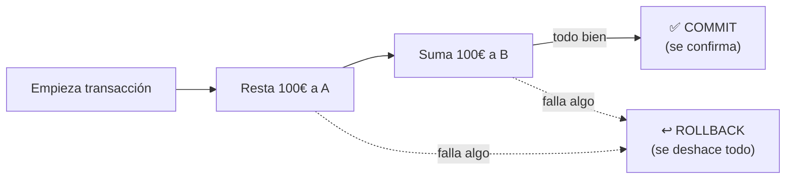

<a id="operaciones-crud-transacciones"></a>

# 🧩 3. Operaciones CRUD y gestión de transacciones

Ya sabes por qué hacen falta conectores y cómo se declara la estructura de una base de datos desde Java. Toca el paso siguiente: cómo se modifican y consultan los datos desde una aplicación real, y qué garantiza que esas modificaciones no dejen la base de datos a medias si algo falla.

---

## 🔤 Qué es CRUD

**CRUD** son las siglas de las cuatro operaciones universales sobre datos: **C**reate, **R**ead, **U**pdate, **D**elete. Ya las conoces en SQL — son la misma idea con otro nombre:

| CRUD | SQL |
|---|---|
| Create | `INSERT` |
| Read | `SELECT` |
| Update | `UPDATE` |
| Delete | `DELETE` |

Casi cualquier funcionalidad de una aplicación real, por compleja que parezca, se reduce en el fondo a combinar estas cuatro operaciones sobre distintos datos.

---

## 💳 Qué es una transacción

Imagina una transferencia bancaria: restar 100€ de la cuenta A y sumar 100€ a la cuenta B. Son dos operaciones — pero si el programa falla justo después de restar y antes de sumar, el dinero desaparece. Nadie quiere eso.

Una **transacción** es una forma de agrupar varias operaciones para que se comporten como una sola unidad: **todo o nada**. Si todas las operaciones de la transacción terminan bien, se confirman de golpe (**commit**); si cualquiera falla a mitad, se deshace todo lo hecho hasta ese punto (**rollback**), como si nunca hubiera pasado nada.



Las propiedades que debe cumplir una transacción se resumen en el acrónimo **ACID**:

- **Atomicidad**: la transacción se ejecuta entera o no se ejecuta nada de ella.
- **Consistencia**: la base de datos pasa de un estado válido a otro estado válido, nunca a uno a medias.
- **Aislamiento**: dos transacciones que ocurren al mismo tiempo no se interfieren entre sí.
- **Durabilidad**: una vez confirmada (commit), la transacción sobrevive aunque el sistema se caiga justo después.

---

## 📦 Qué es un DTO

Un **DTO** (*Data Transfer Object*, objeto de transferencia de datos) es un objeto hecho a medida de lo que entra o sale de tu aplicación — distinto del objeto que usas internamente. En vez de exponer directamente tus clases internas a quien consuma tu API, defines objetos específicos: uno para lo que se recibe al crear algo, otro para lo que se devuelve al consultarlo.

¿Por qué separar ambos si "básicamente son los mismos datos"? Dos razones concretas: controlas exactamente qué campos se exponen hacia fuera (una entidad interna puede tener columnas que no quieres que nadie vea), y puedes tener formas distintas para crear y para leer (al crear, por ejemplo, no tiene sentido pedir un `id`, porque todavía no existe).

---

## 🧱 Qué es un `record` de Java

Antes de ver los DTOs reales del proyecto, necesitas conocer una construcción del lenguaje que no has usado hasta ahora: el **record** (desde Java 16). Un record declara, en una sola línea, una clase inmutable pensada exactamente para "llevar datos de un sitio a otro":

```java
record Punto(int x, int y) {}
```

Con esa única línea, el compilador genera automáticamente:

- Un **constructor** que recibe `x` e `y`.
- Un **getter** por cada campo, sin el prefijo `get` (`punto.x()`, no `punto.getX()`).
- `equals()`, `hashCode()` y `toString()` coherentes con los campos.

```java
Punto p = new Punto(3, 4);
p.x();       // 3
p.toString(); // "Punto[x=3, y=4]"
```

Todos los campos de un record son `final` por diseño: una vez creado, no se puede modificar — no hay setters, ni forma de cambiar `x` o `y` después de construirlo. Esa **inmutabilidad** es justo lo que encaja con un DTO: un objeto que representa un dato en un momento concreto (lo que se recibió, lo que se va a devolver), no algo que deba cambiar de estado con el tiempo.

!!! warning "Un record NO es lo mismo que una `@Entity`"
    Las entidades JPA (`Videojuego`, `Estudio`, que ya conoces del apartado anterior) siguen siendo clases normales, con `@Getter`/`@Setter` de Lombok: necesitan ser mutables (Hibernate las modifica al cargarlas y guardarlas) y tener un identificador gestionado por el framework. Un record, en cambio, encaja con los DTOs porque nunca necesita cambiar una vez construido. No confundas ambos: si ves `record` en una clase, es un DTO; si ves `@Entity`, es una entidad persistente.

---

## 🎮 Aterrizaje en GameVault: el CRUD de `Videojuego`

`VideojuegoController` (que empezaste a leer en el apartado 1) expone las cuatro operaciones CRUD completas sobre `/api/v1/videojuegos`: `GET` (lista y por id), `POST`, `PUT` y `DELETE`.

### Transacciones con `@Transactional`

Toda la lógica vive en `VideojuegoService`:

```java
@Transactional(readOnly = true)
public VideojuegoResponseDTO findById(Long id) {
    return videojuegoRepository.findById(id)
            .map(this::mapToDTO)
            .orElseThrow(() -> new ResponseStatusException(HttpStatus.NOT_FOUND, "Videojuego no encontrado"));
}

@Transactional
public VideojuegoResponseDTO update(Long id, VideojuegoCreateDTO dto) {
    Videojuego v = videojuegoRepository.findById(id)
            .orElseThrow(() -> new ResponseStatusException(HttpStatus.NOT_FOUND, "Videojuego no encontrado"));

    Estudio estudio = estudioRepository.findById(dto.estudioId())
            .orElseThrow(() -> new ResponseStatusException(HttpStatus.NOT_FOUND, "Estudio no encontrado"));

    v.setTitulo(dto.titulo());
    v.setPrecio(dto.precio());
    v.setEstudio(estudio);

    return mapToDTO(videojuegoRepository.save(v));
}
```

`@Transactional` en un método de escritura (como `update`) hace que Spring abra una transacción antes de ejecutarlo y haga commit automáticamente si termina bien, o rollback si se lanza cualquier excepción por el camino — sin que escribas `connection.commit()` ni `connection.rollback()` en ningún sitio. `@Transactional(readOnly = true)`, en los métodos de solo lectura, es una pista de optimización: le dice al framework y a la base de datos que esta operación no va a modificar nada.

!!! tip "Contraste con lo que viene después"
    En el siguiente apartado (JDBC puro) vas a gestionar una conexión y una transacción **a mano**, sin Spring de por medio. Verás entonces, con código explícito, exactamente lo que `@Transactional` te está ahorrando aquí.

### Los DTOs reales

```java
public record VideojuegoResponseDTO(
        Long id,
        String titulo,
        BigDecimal precio,
        LocalDate fechaLanzamiento,
        EstudioDTO estudio,
        Map<String, Object> detallesPlataforma
) {}

public record VideojuegoCreateDTO(
        @NotBlank String titulo,
        @NotNull @PositiveOrZero BigDecimal precio,
        @NotNull @PastOrPresent LocalDate fechaLanzamiento,
        @NotNull @Positive Long estudioId,
        Map<String, Object> detallesPlataforma
) {}
```

Ahí tienes la aplicación práctica de lo que acabas de ver: dos records distintos para dos propósitos distintos. `VideojuegoCreateDTO` es lo que se recibe al crear/actualizar (pide `estudioId`, un identificador simple, no el objeto `Estudio` completo); `VideojuegoResponseDTO` es lo que se devuelve al consultar (incluye el `EstudioDTO` completo embebido, no solo su id). Ninguno de los dos expone directamente la entidad JPA `Videojuego` — el service se encarga de convertir entre una cosa y otra con un mapeo manual:

Fíjate en las anotaciones sobre los campos de `VideojuegoCreateDTO` (`@NotBlank`, `@NotNull`, `@PositiveOrZero`, `@PastOrPresent`): son anotaciones de **Bean Validation** (`jakarta.validation`), una librería estándar de Java para declarar restricciones sobre los datos — "este campo no puede estar vacío", "este número no puede ser negativo", "esta fecha no puede ser futura". Spring las comprueba automáticamente en cuanto el parámetro del controller lleva `@Valid` delante (lo verás en Programación de Servicios y Procesos, que profundiza en cómo se gestiona el error): si algún campo incumple su restricción, la petición se rechaza con un `400 Bad Request` antes de que tu código llegue a ejecutarse.

```java
private VideojuegoResponseDTO mapToDTO(Videojuego v) {
    EstudioDTO estudioDTO = new EstudioDTO(v.getEstudio().getId(), v.getEstudio().getNombre(), v.getEstudio().getPais());
    return new VideojuegoResponseDTO(
            v.getId(), v.getTitulo(), v.getPrecio(), v.getFechaLanzamiento(), estudioDTO, v.getDetallesPlataforma()
    );
}
```

¿Por qué no devolver directamente la entidad `Videojuego`? Tres motivos: acoplas tu API a los detalles internos de tu modelo de datos (si cambias una columna, rompes el contrato de la API); puedes exponer sin querer relaciones internas o columnas sensibles; y las relaciones `@ManyToOne`/`@OneToMany` con carga *lazy* (como viste en el Tema 1, apartado 2) pueden dar problemas al convertirlas directamente a JSON si Hibernate no las ha cargado todavía.

!!! warning "`EstudioController` está incompleto — y es a propósito"
    Tu propio `EstudioController.java`, tal como lo vas a construir, solo va a tener `GET` y `POST` por ahora, sin `PUT` ni `DELETE`. No es un olvido: ese `PUT`/`DELETE` de `Estudio` se construyen como práctica en Programación de Servicios y Procesos — ambos módulos avanzan sobre el mismo GameVault y se reparten qué construye cada uno.

Con todo esto ya puedes abordar la Actividad 1.2: construir, guiado, este mismo CRUD completo de `Videojuego` en tu propio proyecto.

---

## ✅ Ideas clave

??? tip "Abrir resumen"

    - **CRUD** = Create/Read/Update/Delete, equivalentes a `INSERT`/`SELECT`/`UPDATE`/`DELETE` en SQL.
    - Una **transacción** agrupa operaciones como una unidad todo-o-nada: **commit** si todo va bien, **rollback** si algo falla. Las propiedades **ACID** (atomicidad, consistencia, aislamiento, durabilidad) las garantizan.
    - Un **DTO** es un objeto a medida de lo que entra/sale de la aplicación, distinto del objeto interno — permite controlar qué se expone y tener formas distintas para crear y leer.
    - Un **`record`** de Java declara en una línea una clase inmutable con constructor, getters, `equals`/`hashCode`/`toString` generados — encaja con los DTOs porque nunca cambian tras crearse. No es lo mismo que una `@Entity` (mutable, gestionada por Hibernate).
    - `@Transactional` gestiona commit/rollback automáticamente; `@Transactional(readOnly = true)` marca operaciones de solo lectura.
    - GameVault nunca devuelve sus entidades JPA directamente: siempre convierte a DTOs con un mapeo manual (`mapToDTO`), para no acoplar la API al modelo interno.
