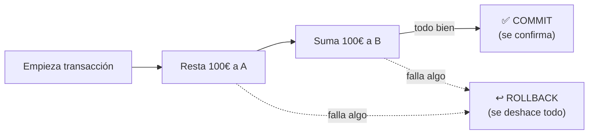
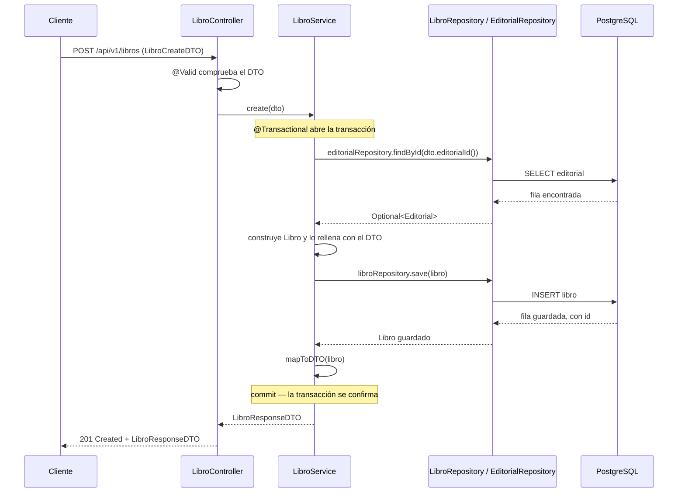

<a id="operaciones-crud-transacciones"></a>

# 🧩 3. Operaciones CRUD y gestión de transacciones

Ya sabes por qué hacen falta conectores y cómo se declara la estructura de una base de datos desde Java. Toca el paso siguiente: cómo se modifican y consultan los datos desde una aplicación real. Vas a construir el CRUD de `Libro` igual que lo harías tú solo — empezando por la versión más simple, tropezando con sus problemas, y resolviéndolos uno a uno — hasta llegar al mismo código que vas a escribir en la Actividad 1.2.

---

## 🔤 Qué es CRUD

**CRUD** son las siglas de las cuatro operaciones universales sobre datos: **C**reate, **R**ead, **U**pdate, **D**elete. Ya conoces su versión en SQL. También tiene una versión en verbos HTTP (`GET`, `POST`, `PUT`, `DELETE`), que trabajas en Programación de Servicios y Procesos — son la misma idea repetida en dos sitios distintos, y no por casualidad:

| CRUD | SQL | HTTP |
|---|---|---|
| Create | `INSERT` | `POST` |
| Read | `SELECT` | `GET` |
| Update | `UPDATE` | `PUT` |
| Delete | `DELETE` | `DELETE` |

REST está pensado precisamente para eso: modelar operaciones CRUD sobre recursos usando los verbos que HTTP ya trae de fábrica, en vez de inventar una ruta o un verbo distinto para cada acción (algo como `/libros/crear` sería el estilo antiguo, no REST). Casi cualquier funcionalidad de una aplicación real, por compleja que parezca, se reduce en el fondo a combinar estas cuatro operaciones sobre distintos datos.

---

## 🗄️ La primera pieza: el repository

Antes de leer nada necesitas la pieza de la arquitectura en capas (Controller → Service → Repository) que todavía no has visto declarada: el **repository**, quien de verdad habla con la base de datos.

Con JDBC "a pelo" (lo verás en detalle un par de apartados más adelante), escribir un repository significa escribir tú mismo cada consulta SQL, abrir la conexión, recorrer el resultado fila a fila y cerrarlo todo — para cada entidad, para cada operación. Con **Spring Data JPA** ese trabajo desaparece casi por completo: declaras una **interfaz vacía**, sin ningún método escrito, y Spring te da una implementación real ya funcionando.

```java
public interface LibroRepository extends JpaRepository<Libro, Long> {}
```

### Qué significa exactamente `extends JpaRepository<Libro, Long>`

`JpaRepository<T, ID>` es una interfaz que trae Spring Data JPA, con dos **parámetros de tipo** entre `< >` — como los de `List<String>` o `Optional<Libro>`, que ya conoces:

```
JpaRepository<Libro, Long>
              └─┬──┘ └─┬─┘
                T      ID
```

- **`T`**: la entidad que gestiona este repository — aquí, `Libro`.
- **`ID`**: el tipo de la clave primaria de esa entidad — el mismo tipo que le pusiste al campo anotado con `@Id` en el apartado anterior (en este curso, siempre `Long`).

`JpaRepository` **no está vacía**: por dentro, ya trae declarados decenas de métodos — `findAll()`, `findById(id)`, `save(entidad)`, `deleteById(id)`... Cuando escribes `interface LibroRepository extends JpaRepository<Libro, Long> {}`, `LibroRepository` **hereda** todos esos métodos automáticamente, ya especializados para `Libro`, aunque tú no escribas ni una línea dentro de las llaves.

!!! info "¿Cómo puede funcionar una interfaz sin implementación?"
    Una interfaz normal, con métodos sin cuerpo, no se puede usar directamente — tendrías que implementarla tú. Aquí no hace falta: Spring Data JPA, al arrancar la aplicación, **genera una clase real** que implementa `LibroRepository` por completo (con código que traduce cada método a SQL de verdad contra tu tabla `libro`) y la registra como un bean, igual que los beans `@Service`/`@Repository` que ya conoces. Tú nunca ves esa clase generada ni la escribes — solo inyectas la interfaz, como si la implementación ya existiera desde siempre.

### Lo que ya tienes disponible, sin escribir nada

| Método | Qué hace | Ejemplo |
|---|---|---|
| `List<Libro> findAll()` | Devuelve todas las filas de la tabla `libro`, como una lista de entidades. | `libroRepository.findAll()` |
| `Optional<Libro> findById(Long id)` | Busca una fila por su clave primaria. Puede no encontrar nada — por eso no devuelve un `Libro` directamente. | `libroRepository.findById(3L)` |
| `Libro save(Libro libro)` | Inserta el libro si su `id` es `null`, o lo actualiza si ya existe — la misma llamada sirve para crear y para modificar. | `libroRepository.save(libro)` |
| `boolean existsById(Long id)` | Comprueba si existe una fila con ese `id`, sin cargar la entidad entera — más barato que un `findById` cuando solo necesitas saber si está. | `libroRepository.existsById(3L)` |
| `void deleteById(Long id)` | Borra la fila con ese `id`. | `libroRepository.deleteById(3L)` |
| `long count()` | Cuenta cuántas filas hay en la tabla. | `libroRepository.count()` |

Fíjate en `findById`: no devuelve un `Libro`, devuelve un `Optional<Libro>`. Un **`Optional`** es un envoltorio que representa "puede que haya un valor, puede que no" — en vez de devolver directamente el libro (y arriesgarte a un `NullPointerException` si no existe) o `null` (que es fácil de olvidar comprobar), `findById` te obliga a decidir explícitamente qué hacer en el caso "no encontrado". Vas a ver ese patrón constantemente a partir de aquí:

```java
libroRepository.findById(id)
        .orElseThrow(() -> new ResponseStatusException(HttpStatus.NOT_FOUND, "Libro no encontrado"));
```

`orElseThrow(...)` dice, en una línea: "si el `Optional` trae un libro, dámelo; si viene vacío, lanza esta excepción en su lugar". En Programación de Servicios y Procesos resolviste el caso "recurso no encontrado" con un `if` explícito comprobando `null` — esto es la versión más directa de esa misma idea, apoyada en que `findById` ya te avisa con un `Optional` vacío en vez de con un `null` a pelo.

### Y si necesitas una consulta que no viene de fábrica

`findAll`/`findById`/`save`... cubren lo genérico, pero ¿y si necesitas "todos los libros de una editorial concreta"? No hace falta escribir SQL a mano ni implementar nada: declaras el método en la interfaz, sin cuerpo, siguiendo un patrón de nombre:

```java
public interface LibroRepository extends JpaRepository<Libro, Long> {
    List<Libro> findByEditorialId(Long editorialId);
}
```

Spring Data JPA lee el nombre del método al arrancar la aplicación, lo descompone (`find` + `By` + `EditorialId`) y genera la consulta él solo — el `EditorialId` del nombre tiene que coincidir con un campo real de `Libro` (aquí, la relación `editorial`, a través de su `id`). El resultado equivale a:

```sql
SELECT * FROM libro WHERE editorial_id = ?
```

La convención admite más piezas combinables, todas sin escribir una sola consulta:

| Patrón | Ejemplo | Equivale a |
|---|---|---|
| `findByX` | `findByTitulo(String titulo)` | `WHERE titulo = ?` |
| `findByXAndY` | `findByTituloAndPrecioLessThan(String t, BigDecimal p)` | `WHERE titulo = ? AND precio < ?` |
| `findByXOrderByY` | `findByEditorialIdOrderByPrecioDesc(Long id)` | `WHERE editorial_id = ? ORDER BY precio DESC` |
| `existsByX` | `existsByTitulo(String titulo)` | igual que `findByX`, pero devuelve `boolean` |
| `countByX` | `countByEditorialId(Long id)` | igual, pero devuelve `long` |

!!! tip "Cuidado con los límites de esta convención"
    Es cómoda para consultas simples y fijas. Si necesitas filtros que cambian según el caso (a veces por título, a veces por precio, a veces ambos) o consultas más elaboradas, esta convención se queda corta — para eso están las **Specifications** (filtros dinámicos) y `@Query` con JPQL, que verás más adelante en este mismo tema.

El CRUD que vas a construir en este apartado no necesita ninguna consulta personalizada todavía — `findAll`/`findById`/`save`/`deleteById` bastan. Declara `LibroRepository` y `EditorialRepository` vacías, sabiendo ya cómo añadirles un método propio el día que lo necesites:

```java
public interface LibroRepository extends JpaRepository<Libro, Long> {}
public interface EditorialRepository extends JpaRepository<Editorial, Long> {}
```

Con las dos interfaces declaradas, tienes las tres capas listas para empezar: **Controller** recibe la petición HTTP, **Service** decide qué hacer, **Repository** habla con la base de datos. Vas a construir las tres, una encima de otra, empezando por la lectura.

---

## 📖 Primer intento: leer y devolver la entidad tal cual

La forma más directa de exponer un libro por HTTP es la que probablemente se te ocurriría a ti solo: el controller le pide al service el libro, el service se lo pide al repository, y todo el mundo se pasa el mismo objeto `Libro`:

```java
@Service
@RequiredArgsConstructor
public class LibroService {
    private final LibroRepository libroRepository;

    @Transactional(readOnly = true)
    public Libro findById(Long id) {
        return libroRepository.findById(id)
                .orElseThrow(() -> new ResponseStatusException(HttpStatus.NOT_FOUND, "Libro no encontrado"));
    }
}
```

```java
@RestController
@RequestMapping("/api/v1/libros")
@RequiredArgsConstructor
public class LibroController {
    private final LibroService libroService;

    @GetMapping("/{id}")
    public ResponseEntity<Libro> getById(@PathVariable Long id) {
        return ResponseEntity.ok(libroService.findById(id));
    }
}
```

Ignora por un momento el `@Transactional(readOnly = true)` — vuelves a él más abajo. Fíjate en la forma: el controller no toca el repository directamente, solo habla con el service; el service es quien de verdad llama a `libroRepository.findById(...)`. Ese orden (Controller → Service → Repository, cada uno hablando solo con el siguiente) no cambia en todo lo que viene a continuación — lo único que cambia es lo que circula por esas capas.

Compila, funciona, y `GET /api/v1/libros/3` te devuelve algo así:

```json
{
  "id": 3,
  "titulo": "El nombre del viento",
  "precio": 19.95,
  "coste": 8.40,
  "fechaPublicacion": "2007-03-27",
  "editorial": { "id": 1, "nombre": "Plaza & Janés", "hibernateLazyInitializer": {} }
}
```

---

## ❌ El problema: la entidad expone más de lo que quieres

Mira otra vez esa respuesta. Dos cosas no deberían estar ahí:

| Campo | Por qué es un problema |
|---|---|
| `coste` | El precio al que tu librería compra el libro al proveedor — un dato interno, de gestión, que jamás debería llegar a un cliente de la API. Imagina que fuera un margen de beneficio, o directamente una contraseña: el problema es el mismo — cualquier campo `private` de la entidad viaja tal cual al JSON, lo quieras exponer o no. |
| `hibernateLazyInitializer` | Un detalle interno de cómo Hibernate representa la relación `@ManyToOne` con carga *lazy* que viste en el apartado anterior, filtrado sin querer al convertir el objeto a JSON. |

El problema de fondo es siempre el mismo: **la entidad `Libro` está diseñada para que Hibernate la entienda, no para que la vea un cliente HTTP.** Son dos propósitos distintos, y una sola clase no puede servir bien a los dos a la vez.

---

## 📦 La solución: DTOs

Un **DTO** (*Data Transfer Object*, objeto de transferencia de datos) es un objeto hecho a medida de lo que sale (o entra) de tu aplicación — distinto de la entidad interna. En vez de devolver `Libro` tal cual, defines una clase nueva con exactamente los campos que quieres exponer, ni uno más.

Antes de escribirlo, una construcción del lenguaje que encaja perfectamente aquí: el **record** (desde Java 16). Un record declara, en una sola línea, una clase inmutable pensada exactamente para "llevar datos de un sitio a otro":

```java
record Punto(int x, int y) {}
```

Con esa única línea, el compilador genera automáticamente un **constructor** que recibe `x` e `y`, un **getter** por cada campo sin el prefijo `get` (`punto.x()`, no `punto.getX()`), y `equals()`/`hashCode()`/`toString()` coherentes. Todos los campos de un record son `final` por diseño — no hay setters, ni forma de cambiarlos tras construirlo. Esa **inmutabilidad** es justo lo que necesitas para un DTO: un objeto que representa un dato en un momento concreto, no algo que deba cambiar de estado con el tiempo.

!!! warning "Un record NO es lo mismo que una `@Entity`"
    `Libro`/`Editorial` siguen siendo clases normales, con `@Getter`/`@Setter` de Lombok: necesitan ser mutables (Hibernate las modifica al cargarlas y guardarlas) y tener un identificador gestionado por el framework. Un record encaja con los DTOs porque nunca necesita cambiar una vez construido. Si ves `record` en una clase, es un DTO; si ves `@Entity`, es una entidad persistente.

Con eso, el DTO de salida:

```java
public record EditorialDTO(Long id, String nombre) {}

public record LibroResponseDTO(
        Long id,
        String titulo,
        BigDecimal precio,
        LocalDate fechaPublicacion,
        EditorialDTO editorial
) {}
```

Ni rastro de `coste`, ni de los detalles internos de Hibernate — solo lo que quieres que vea un cliente. Ahora reescribe `LibroService.findById` para que, antes de devolver nada, convierta la entidad al DTO:

```java
@Transactional(readOnly = true)
public LibroResponseDTO findById(Long id) {
    Libro libro = libroRepository.findById(id)
            .orElseThrow(() -> new ResponseStatusException(HttpStatus.NOT_FOUND, "Libro no encontrado"));
    return mapToDTO(libro);
}

private LibroResponseDTO mapToDTO(Libro libro) {
    EditorialDTO editorialDTO = new EditorialDTO(libro.getEditorial().getId(), libro.getEditorial().getNombre());
    return new LibroResponseDTO(
            libro.getId(), libro.getTitulo(), libro.getPrecio(), libro.getFechaPublicacion(), editorialDTO
    );
}
```

Fíjate en `mapToDTO`, porque va a reaparecer en todo lo que queda de apartado. Es **`private`** — a diferencia de `findById`, que es `public` — porque no forma parte de lo que `LibroService` ofrece hacia fuera: el controller no lo llama nunca, ni sabe que existe, es solo cómo `LibroService` traduce cada `Libro` (la entidad que gestiona Hibernate) al DTO que ve el cliente, **campo a campo**:

| Campo de `LibroResponseDTO` | De dónde sale |
|---|---|
| `id` | `libro.getId()` |
| `titulo` | `libro.getTitulo()` |
| `precio` | `libro.getPrecio()` |
| `fechaPublicacion` | `libro.getFechaPublicacion()` |
| `editorial` | Un `EditorialDTO` nuevo, construido aparte a partir de `libro.getEditorial()` — la misma traducción, un nivel más adentro |
| *(no aparece)* | `coste` no tiene fila en esta tabla: no se copia a ningún sitio, por eso desaparece del JSON — no hay ninguna regla mágica ocultándolo |

No hay ninguna librería detrás de esta conversión (existen herramientas que la automatizan, como MapStruct, pero escribirla a mano tiene la ventaja de que se ve exactamente qué campo va a parar a dónde). A partir de aquí, cualquier método de `LibroService` que necesite devolver un libro (`findAll`, `create`, `update`) va a llamar a este mismo `mapToDTO` en vez de repetir la traducción cada vez.

Y el controller cambia una sola palabra — el tipo que envuelve `ResponseEntity`:

```java
@GetMapping("/{id}")
public ResponseEntity<LibroResponseDTO> getById(@PathVariable Long id) {
    return ResponseEntity.ok(libroService.findById(id));
}
```

Fíjate en que el flujo no ha cambiado: sigue siendo Controller → Service → Repository. Lo único nuevo es que el **service**, además de pedirle datos al repository, ahora también decide qué parte de esos datos sale de la aplicación — esa traducción es trabajo suyo, no del controller ni del repository.

---

## ✍️ Ahora la escritura: `create()`, y el problema de los datos basura

Para crear un libro necesitas un DTO de entrada — y aquí no vale reutilizar `LibroResponseDTO`: al crear, no tiene sentido pedir un `id` (todavía no existe), y si reutilizas el DTO de salida, nada te impide que alguien intente fijar el `id` a mano. Un primer intento, sin pensarlo mucho:

```java
public record LibroCreateDTO(String titulo, BigDecimal precio, LocalDate fechaPublicacion, Long editorialId) {}
```

```java
@Transactional
public LibroResponseDTO create(LibroCreateDTO dto) {
    Editorial editorial = editorialRepository.findById(dto.editorialId())
            .orElseThrow(() -> new ResponseStatusException(HttpStatus.NOT_FOUND, "Editorial no encontrada"));

    Libro libro = new Libro();
    libro.setTitulo(dto.titulo());
    libro.setPrecio(dto.precio());
    libro.setFechaPublicacion(dto.fechaPublicacion());
    libro.setEditorial(editorial);

    return mapToDTO(libroRepository.save(libro));
}
```

Funciona... con datos razonables. Pero nada impide mandar `{"titulo": "", "precio": -5, "fechaPublicacion": "2099-01-01", "editorialId": -1}` — un título vacío, un precio negativo, una fecha de publicación en el futuro. Tu aplicación lo aceptaría igual, porque `create()` no comprueba nada de eso.

**La solución**: anotaciones de **Bean Validation** (`jakarta.validation`) sobre el propio DTO, declarando la restricción justo donde vive el dato:

!!! warning "Falta una dependencia en el `pom.xml`"
    `spring-boot-starter-webmvc` no trae Bean Validation incluido — es un starter aparte. Si usas `@NotBlank` y compañero sin haberlo añadido, el propio IDE no reconoce la anotación (no la encuentra para importar) o el proyecto falla al compilar. Añade esto al `pom.xml`:

    ```xml
    <dependency>
        <groupId>org.springframework.boot</groupId>
        <artifactId>spring-boot-starter-validation</artifactId>
    </dependency>
    ```

    Esta dependencia trae Hibernate Validator, la implementación de Bean Validation que Spring usa por debajo — sin ella, `jakarta.validation.constraints` (de donde vienen `@NotBlank`, `@NotNull`...) ni siquiera está en el classpath del proyecto.

```java
public record LibroCreateDTO(
        @NotBlank String titulo,
        @NotNull @PositiveOrZero BigDecimal precio,
        @NotNull @PastOrPresent LocalDate fechaPublicacion,
        @NotNull @Positive Long editorialId
) {}
```

Estas cuatro no son las únicas — Bean Validation trae toda una familia de anotaciones para las restricciones más habituales, todas se usan igual (sobre el campo, sin nada más que declararlas):

| Anotación | Qué exige | En este DTO |
|---|---|---|
| `@NotNull` | El valor no puede ser `null`. | `precio`, `fechaPublicacion`, `editorialId` |
| `@NotBlank` | Además de no ser `null`, si es un `String` no puede estar vacío ni ser solo espacios. | `titulo` |
| `@NotEmpty` | Igual que `@NotBlank`, pero para colecciones/arrays: no puede estar vacía. | — |
| `@Size(min=, max=)` | La longitud de un `String` (o el tamaño de una colección) debe caer en ese rango. | — |
| `@Positive` / `@PositiveOrZero` | El número debe ser mayor que cero / mayor o igual que cero. | `editorialId` / `precio` |
| `@Negative` / `@NegativeOrZero` | Lo mismo, en negativo. | — |
| `@Min(valor)` / `@Max(valor)` | El número no puede bajar de / superar ese valor concreto. | — |
| `@Past` / `@PastOrPresent` | La fecha debe ser anterior a ahora / anterior o igual a ahora. | `fechaPublicacion` |
| `@Future` / `@FutureOrPresent` | La fecha debe ser posterior a ahora / posterior o igual a ahora. | — |
| `@Email` | El `String` debe tener forma de dirección de correo. | — |
| `@Pattern(regexp = ...)` | El `String` debe coincidir con la expresión regular dada. | — |

Todas se pueden combinar sobre el mismo campo, como `@NotNull @PositiveOrZero` en `precio`.

Y en el controller, un único añadido delante del parámetro:

```java
@PostMapping
public ResponseEntity<LibroResponseDTO> create(@Valid @RequestBody LibroCreateDTO dto) {
    return ResponseEntity.status(HttpStatus.CREATED).body(libroService.create(dto));
}
```

`@RequestBody` convierte el cuerpo JSON de la petición en un `LibroCreateDTO`; `@Valid` es lo que activa de verdad las comprobaciones — sin él, las anotaciones de arriba existirían pero nadie las miraría. Si algún campo incumple su restricción, Spring rechaza la petición con un `400 Bad Request` antes de que tu código llegue a ejecutarse — `create()` ya ni se entera de que ha habido un intento con datos basura. Lo comprobarás en detalle en Programación de Servicios y Procesos, que profundiza en cómo se gestiona ese error.

---

## 🔄 `update()` y `delete()`: el problema del recurso que no existe

`update()` reutiliza `LibroCreateDTO` (pide los mismos datos que `create()`) y sigue un patrón parecido, con un matiz: primero tiene que cargar el libro que ya existe.

```java
@Transactional
public LibroResponseDTO update(Long id, LibroCreateDTO dto) {
    Libro libro = libroRepository.findById(id)
            .orElseThrow(() -> new ResponseStatusException(HttpStatus.NOT_FOUND, "Libro no encontrado"));

    Editorial editorial = editorialRepository.findById(dto.editorialId())
            .orElseThrow(() -> new ResponseStatusException(HttpStatus.NOT_FOUND, "Editorial no encontrada"));

    libro.setTitulo(dto.titulo());
    libro.setPrecio(dto.precio());
    libro.setEditorial(editorial);

    return mapToDTO(libroRepository.save(libro));
}
```

¿Qué pasaría si no comprobaras si el libro existe, y simplemente llamaras a `libro.setTitulo(...)` sobre un `libro` que nunca has cargado? No compilaría — necesitas el objeto antes de poder modificarlo, así que la comprobación de "no encontrado" no es opcional aquí, es la única forma de tener algo que modificar. El mismo `orElseThrow(() -> new ResponseStatusException(HttpStatus.NOT_FOUND, ...))` que ya usaste en `findById` resuelve el caso: si no existe, la petición corta ahí mismo con un `404`, antes de tocar nada.

`delete()` no tiene nada que cargar ni modificar, así que usa la comprobación más ligera que ofrece el repository:

```java
@Transactional
public void delete(Long id) {
    if (!libroRepository.existsById(id)) {
        throw new ResponseStatusException(HttpStatus.NOT_FOUND, "Libro no encontrado");
    }
    libroRepository.deleteById(id);
}
```

`findAll()` no tiene ninguno de estos problemas (no hay "no encontrado" posible al pedir una lista completa, que puede estar vacía sin que sea un error) — es un `@Transactional(readOnly = true)` que mapea la lista entera del repository, tal como ya has visto hacer con un único libro.

---

## 💳 Qué garantiza que estas escrituras no dejen la base de datos a medias

En todos los métodos anteriores has visto aparecer la anotación `@Transactional`, sin explicar todavía qué hace exactamente — solo se te pidió que la ignoraras por un momento. Toca explicarla.

Mira otra vez `update()`: hace **dos lecturas** (`libroRepository.findById`, `editorialRepository.findById`) y **una escritura** (`libroRepository.save`). ¿Qué pasaría si el proceso se cayera justo después de guardar el libro, pero antes de que la operación completa terminara de confirmarse?

Es el mismo problema, en miniatura, que una transferencia bancaria: restar 100€ de una cuenta y sumar 100€ a otra son dos operaciones — si el programa falla justo después de restar y antes de sumar, el dinero desaparece. Una **transacción** es una forma de agrupar varias operaciones para que se comporten como una sola unidad: **todo o nada**. Si todas terminan bien, se confirman de golpe (**commit**); si cualquiera falla a mitad, se deshace todo lo hecho hasta ese punto (**rollback**), como si nunca hubiera pasado nada.



Las propiedades que debe cumplir una transacción se resumen en el acrónimo **ACID**:

| Propiedad | Qué garantiza |
|---|---|
| **Atomicidad** | Se ejecuta entera, o no se ejecuta nada de ella. |
| **Consistencia** | La base de datos pasa de un estado válido a otro estado válido, nunca a uno a medias. |
| **Aislamiento** | Dos transacciones que ocurren al mismo tiempo no se interfieren entre sí. |
| **Durabilidad** | Una vez confirmada (commit), sobrevive aunque el sistema se caiga justo después. |

Vuelve a mirar el código de `update()` y `delete()`: los dos llevan `@Transactional` encima, y `findById`/`findAll` llevan `@Transactional(readOnly = true)`. Eso es todo lo que hace falta — tú no escribes `connection.commit()` ni `connection.rollback()` en ningún sitio. Por debajo, Spring hace tres cosas:

- Abre la transacción **antes** de ejecutar el método.
- Hace ***commit* automáticamente** si el método termina bien.
- Hace ***rollback*** si se lanza cualquier excepción por el camino — por ejemplo, el `ResponseStatusException` de "editorial no encontrada" a mitad de un `update()`: si eso pasa, el libro tampoco se guarda, aunque el `save()` esté más abajo en el método.

`readOnly = true`, en los métodos que solo leen, es una pista de optimización: le dice al framework y a la base de datos que esa operación no va a modificar nada.

!!! tip "Contraste con lo que viene después"
    En el siguiente apartado (JDBC puro) vas a gestionar una conexión y una transacción **a mano**, sin Spring de por medio. Verás entonces, con código explícito, exactamente lo que `@Transactional` te está ahorrando aquí.

---

## 🗄️ Las piezas juntas: el `LibroController` completo

Con el service ya resuelto, el controller completo es la traducción directa de la tabla CRUD↔HTTP del principio — cada método delega en su equivalente de `LibroService` y no hace nada más:

```java
@RestController
@RequestMapping("/api/v1/libros")
@RequiredArgsConstructor
public class LibroController {
    private final LibroService libroService;

    @GetMapping
    public ResponseEntity<List<LibroResponseDTO>> getAll() {
        return ResponseEntity.ok(libroService.findAll());
    }

    @GetMapping("/{id}")
    public ResponseEntity<LibroResponseDTO> getById(@PathVariable Long id) {
        return ResponseEntity.ok(libroService.findById(id));
    }

    @PostMapping
    public ResponseEntity<LibroResponseDTO> create(@Valid @RequestBody LibroCreateDTO dto) {
        return ResponseEntity.status(HttpStatus.CREATED).body(libroService.create(dto));
    }

    @PutMapping("/{id}")
    public ResponseEntity<LibroResponseDTO> update(@PathVariable Long id, @Valid @RequestBody LibroCreateDTO dto) {
        return ResponseEntity.ok(libroService.update(id, dto));
    }

    @DeleteMapping("/{id}")
    public ResponseEntity<Void> delete(@PathVariable Long id) {
        libroService.delete(id);
        return ResponseEntity.noContent().build();
    }
}
```

Fíjate en que cada método usa exactamente el código de estado que anticipaba la tabla del principio: `create` responde `201` con `HttpStatus.CREATED` explícito, `update` responde `200` con `ResponseEntity.ok(...)`, y `delete` responde `204` con `ResponseEntity.noContent().build()` — sin cuerpo, porque una vez borrado el libro no hay nada que devolver. Y en las cinco líneas de este controller se repite la misma regla que has visto todo el apartado: el controller no habla nunca con el repository, ni construye nunca SQL — solo traduce entre HTTP y una llamada a `LibroService`.

Con todo esto ya puedes abordar la Actividad 1.2: construir, guiado, un CRUD completo como este en tu propio proyecto.

---

## 🔁 El viaje completo, de principio a fin

Todas las piezas del apartado, juntas de una vez: así es el recorrido real de un `POST /api/v1/libros`, desde que llega la petición hasta que el cliente recibe el `201`.



Cada flecha de este diagrama es algo que ya has visto por separado en el apartado: la validación en el controller, el `Controller → Service → Repository` que no se salta ninguna capa, el `Optional` que puede o no traer la editorial, la traducción de `mapToDTO` justo antes de responder, y la transacción que envuelve todo el tramo de escritura. `findById`, `update` y `delete` siguen exactamente el mismo patrón — solo cambia qué hacen `Service` y `Repository` en el tramo intermedio.

---

## ✅ Ideas clave

??? tip "Abrir resumen"

    - **CRUD** = Create/Read/Update/Delete, equivalentes a `INSERT`/`SELECT`/`UPDATE`/`DELETE` en SQL y a `POST`/`GET`/`PUT`/`DELETE` en HTTP — las tres son la misma idea.
    - Un **repository** (`interface XRepository extends JpaRepository<X, Long>`) te da `findAll`/`findById`/`save`/`existsById`/`deleteById` sin escribir SQL ni implementación propia.
    - Puedes declarar tus propias consultas sin escribir SQL, con un método sin cuerpo cuyo nombre siga la convención (`findByEditorialId`, `findByTituloAndPrecioLessThan`...) — útil para consultas simples y fijas; para filtros dinámicos o consultas complejas están las Specifications y `@Query` (más adelante en este tema).
    - Devolver la entidad JPA tal cual expone campos internos que no deberías publicar (y puede arrastrar detalles de Hibernate en las relaciones *lazy*) — por eso se convierte a un **DTO** antes de salir.
    - Un **`record`** de Java declara en una línea una clase inmutable — encaja con los DTOs porque nunca cambian tras crearse. No es lo mismo que una `@Entity` (mutable, gestionada por Hibernate).
    - Las anotaciones de **Bean Validation** (`@NotBlank`, `@PositiveOrZero`...) sobre el DTO de entrada, combinadas con `@Valid` en el controller, rechazan datos basura con un `400` antes de que tu código se ejecute.
    - El caso "recurso no encontrado" se resuelve con `orElseThrow(...)`/`existsById(...)` lanzando `ResponseStatusException(HttpStatus.NOT_FOUND, ...)` — la misma comprobación en `findById`, `update` y `delete`.
    - Una **transacción** agrupa operaciones como una unidad todo-o-nada: **commit** si todo va bien, **rollback** si algo falla. Las propiedades **ACID** la garantizan. `@Transactional` lo gestiona automáticamente; `@Transactional(readOnly = true)` marca las operaciones de solo lectura.
    - En las cinco capas de este apartado, el flujo es siempre el mismo: **Controller → Service → Repository**, cada uno hablando solo con el siguiente.
