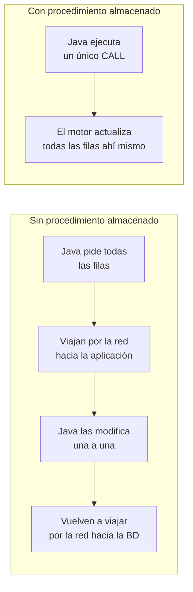

<a id="procedimientos-almacenados"></a>

# 🧩 5. Procedimientos almacenados

Hasta ahora, toda la lógica sobre tus datos vivía en tu aplicación Java: tanto con Spring Data JPA como con JDBC puro, era tu programa el que pedía las filas, las recorría y decidía qué hacer con ellas. En este apartado esa lógica cambia de sitio: se traslada al propio motor de base de datos, que la ejecuta él mismo, sin que tu aplicación tenga que traerse nada.

---

## 🗄️ Qué es un procedimiento almacenado

Un **procedimiento almacenado** es código SQL (con lógica: variables, condiciones, bucles) que se guarda y se ejecuta dentro del propio gestor de base de datos, no en tu aplicación. Lo defines una vez, y a partir de ahí se invoca por su nombre — el motor ejecuta esa lógica cerca de los datos, sin que viajen por la red hacia tu aplicación y vuelvan.

Cada gestor tiene su propio lenguaje procedural para escribirlos — en PostgreSQL es **PL/pgSQL**, una extensión de SQL con variables, parámetros y control de flujo:

```sql
CREATE OR REPLACE PROCEDURE nombre_procedimiento(parametro TIPO)
LANGUAGE plpgsql
AS $$
BEGIN
    -- lógica con SQL normal aquí dentro
END;
$$;
```

!!! tip "Procedimiento vs. función"
    Ambos son código guardado en el gestor, pero una **función** siempre devuelve un valor y se puede usar dentro de una consulta (`SELECT mi_funcion(x)`); un **procedimiento** no tiene por qué devolver nada y se invoca de forma independiente con `CALL`. Cuando lo que quieres es "ejecutar una acción" más que "calcular un valor", un procedimiento encaja mejor.

Fíjate en `parametro TIPO`, entre paréntesis: cada parámetro se pasa **por posición** (el primer valor que envíes desde Java rellena el primer parámetro, el segundo el segundo, y así sucesivamente) y es de entrada (`IN`) por defecto — el procedimiento puede leerlo, pero no modificarlo y devolvértelo (para eso existen los parámetros `OUT`, fuera del alcance de este curso). Si al invocarlo inviertes el orden, el motor no te avisa de nada raro: simplemente asigna cada valor al parámetro equivocado, y el error solo aparece cuando compruebas el resultado.

### Cuándo tiene sentido usarlos — y cuándo no

Tienen sentido cuando una operación conviene que ocurra **atómicamente, cerca de los datos** — por ejemplo, un ajuste masivo de precios que afecta a muchas filas a la vez: hacerlo dentro del motor evita traer todas las filas a Java, modificarlas una a una, y devolverlas, con todo el tráfico de red que eso implica.

Esto es lo que cambia, en idas y vueltas por la red, entre hacerlo en Java y hacerlo con un procedimiento:



El inconveniente: la lógica queda repartida en dos sitios (tu código Java y la base de datos), lo que la hace más difícil de versionar junto con el resto del proyecto y de probar con las mismas herramientas que usas para el resto de tu código.

| | Ventaja | Coste |
|---|---|---|
| **Procedimiento almacenado** | Una sola operación atómica, sin ida y vuelta por fila | Lógica repartida en dos sitios; más difícil de versionar y de probar |
| **Bucle en Java** | Todo el código en un solo sitio, fácil de testear | Un viaje de red por cada fila leída y modificada |

---

## ☎️ Cómo se invocan desde Java

La vía estándar de JDBC es `CallableStatement` (el primo de `PreparedStatement`, pensado específicamente para invocar procedimientos) — se menciona para que sepas que existe, pero en este curso vas a usar una vía más cómoda: **`JdbcTemplate`**.

`JdbcTemplate` es el ayudante que trae Spring sobre JDBC puro: te evita exactamente la fontanería que viste el apartado anterior (abrir conexión, cerrar recursos, gestionar excepciones a mano) sin llegar a ser un ORM completo como el que verás en el Tema 2.

```java
jdbcTemplate.update("CALL ajustar_precio_editorial(?, ?)", editorialId, porcentaje);
```

Una sola línea: `JdbcTemplate` abre la conexión, prepara la sentencia con parámetros (igual de seguros frente a inyección SQL que el `PreparedStatement` que ya conoces), la ejecuta y cierra todo por ti.

---

## 📚 Un ejemplo completo: `ajustar_precio_editorial`

Siguiendo con la aplicación de la librería: imagina que una editorial sube (o baja) el precio de todo su catálogo en un porcentaje. Es el caso perfecto para un procedimiento almacenado — una operación masiva, atómica, cerca de los datos.

### 1. El procedimiento en PostgreSQL

```sql
CREATE OR REPLACE PROCEDURE ajustar_precio_editorial(p_editorial_id BIGINT, p_porcentaje NUMERIC)
LANGUAGE plpgsql
AS $$
BEGIN
    UPDATE libro                                          -- toca la tabla libro entera...
    SET precio = ROUND(precio * (1 + p_porcentaje / 100.0), 2)  -- ...pero solo cambia precio, redondeado a 2 decimales
    WHERE editorial_id = p_editorial_id;                  -- ...y solo en las filas de esta editorial
END;
$$;
```

Sube o baja, de una sola vez, el precio de **todos** los libros de una editorial en el porcentaje indicado. `ROUND(..., 2)` importa: `precio` es una columna con precisión `10,2` en la base de datos — sin redondear explícitamente a dos decimales, el cálculo (`precio * (1 + porcentaje/100)`) podría dejar más decimales de los que la columna admite con precisión limpia.

### 2. La invocación desde el service

```java
@Service
@RequiredArgsConstructor
public class EditorialService {
    private final EditorialRepository editorialRepository;
    private final JdbcTemplate jdbcTemplate;

    @Transactional
    public void ajustarPrecio(Long editorialId, BigDecimal porcentaje) {
        if (!editorialRepository.existsById(editorialId)) {
            throw new ResponseStatusException(HttpStatus.NOT_FOUND, "Editorial no encontrada");
        }
        jdbcTemplate.update("CALL ajustar_precio_editorial(?, ?)", editorialId, porcentaje);
    }
}
```

`JdbcTemplate` se inyecta exactamente igual que cualquier otro bean — junto al `EditorialRepository`, con `@RequiredArgsConstructor`, sin ninguna configuración especial (Spring Boot lo configura automáticamente en cuanto detecta un `DataSource` en el classpath, que ya tienes desde el Tema 1). La comprobación de "editorial no encontrada" la sigues haciendo con Spring Data JPA (`existsById`) antes de invocar el procedimiento — no hace falta que todo pase por `JdbcTemplate`, solo la parte que de verdad conviene ejecutar cerca de los datos.

El `@Transactional` de arriba es el mismo que ya viste en `update()`/`delete()` del apartado anterior: aquí también hay una lectura (`existsById`) seguida de una escritura (la llamada al procedimiento), así que el método entero se trata como una sola unidad todo-o-nada.

Con el procedimiento y el método del service ya tienes la lógica completa — pero, igual que con cualquier otra operación de tu API, todavía no es alcanzable desde fuera. Falta el último paso de siempre: un endpoint en el controller correspondiente que llame a `ajustarPrecio(...)` y lo exponga por HTTP. Sin ese endpoint, el procedimiento solo podría invocarse desde dentro de la propia aplicación Java, nunca desde un cliente externo.

### 3. Por qué procedimiento y no un bucle en Java

Podrías haber escrito esto en Java: cargar todos los libros de la editorial, recorrerlos con un bucle, modificar el precio de cada uno, y guardar. Funcionaría — pero el procedimiento almacenado lo hace en **una sola operación atómica** dentro del motor, sin traer ninguna fila a Java ni hacer múltiples viajes de red por cada libro. Para una actualización masiva como esta, es la opción más directa. En la Actividad 1.4 construirás un procedimiento como este en tu propio proyecto.

---

## 🔍 Antes de cerrar el tema: profundizando en las consultas derivadas por nombre

Este apartado es más corto que los anteriores, así que aprovechamos para volver a algo que quedó solo apuntado: en "Operaciones CRUD y gestión de transacciones" viste que puedes declarar una consulta propia en tu repository sin escribir SQL, con un método sin cuerpo — como `findByEditorialId`. Ahí quedó como una idea suelta; aquí ves la convención completa, con más ejemplos reales.

Spring Data JPA lee el nombre del método pieza a pieza y lo traduce a una consulta. Estos son los patrones más habituales, todos sobre `LibroRepository`:

| Método | Qué genera |
|---|---|
| `findByTitulo(String titulo)` | `WHERE titulo = ?` |
| `findByPrecioLessThan(BigDecimal precio)` | `WHERE precio < ?` |
| `findByTituloContainingIgnoreCase(String fragmento)` | `WHERE LOWER(titulo) LIKE LOWER('%fragmento%')` — búsqueda por texto parcial, sin distinguir mayúsculas |
| `findByEditorialIdOrderByPrecioDesc(Long editorialId)` | `WHERE editorial_id = ? ORDER BY precio DESC` |
| `existsByTitulo(String titulo)` | igual que `findByTitulo`, pero devuelve `boolean` en vez de la entidad |
| `countByEditorialId(Long editorialId)` | igual, pero devuelve `long` — cuántas filas, no cuáles |
| `deleteByEditorialId(Long editorialId)` | `DELETE FROM libro WHERE editorial_id = ?` — borrado masivo, sin cargar ninguna fila a Java primero |

Estas piezas se combinan entre sí. Un nombre más largo, descompuesto:

```java
List<Libro> findByTituloContainingIgnoreCaseOrderByPrecioAsc(String fragmento);
```

`findBy` (busca) + `TituloContainingIgnoreCase` (el campo `titulo` contiene el fragmento, sin distinguir mayúsculas de minúsculas) + `OrderByPrecioAsc` (el resultado, ordenado por `precio` ascendente). Cada pieza se lee de izquierda a derecha, y cada una añade una condición o una cláusula más a la consulta final — sin que tú escribas una sola línea de SQL.

!!! warning "Un nombre mal escrito no falla al llamarlo — falla al arrancar la aplicación"
    Spring Data JPA valida el nombre de cada método derivado contra los campos reales de la entidad **al arrancar la aplicación**, no la primera vez que lo llamas. Si te equivocas — por ejemplo, `findByTitle` en vez de `findByTitulo`, o `findByEditorial` cuando el campo se llama `editorial` pero tú quieres filtrar por su `id` y falta el `Id` al final — la aplicación ni siquiera llega a arrancar: falla con un `PropertyReferenceException` que señala exactamente qué parte del nombre no ha sabido interpretar. Es una de las pocas veces en que un error de "nombre mal escrito" se detecta antes de ejecutar nada, no en mitad de una petición real.

---

## 🧭 Recapitulación del tema

Con esto se completa el recorrido: por qué existen los conectores y cómo se define la estructura de la base de datos (apartado 2) → CRUD completo y transacciones gestionadas por Spring (apartado 3) → la misma fontanería, pero a mano, con JDBC puro (apartado 4) → código que vive dentro del propio motor, invocado desde Java, y las consultas derivadas por nombre, con más detalle del que viste en el apartado 3 (este apartado). El Tema 2 retoma exactamente donde empezó todo: el desfase objeto-relacional, ahora resuelto con una herramienta ORM completa (Hibernate) en vez de conectores manuales.

---

## ✅ Ideas clave

??? tip "Abrir resumen"

    - Un **procedimiento almacenado** es código con lógica que vive y se ejecuta dentro del gestor de base de datos, no en la aplicación.
    - PostgreSQL usa **PL/pgSQL** como lenguaje procedural; un procedimiento se invoca con `CALL`, una función se puede usar dentro de un `SELECT`.
    - Sus parámetros se pasan **por posición** y son de entrada (`IN`) por defecto — invertir el orden al invocarlo no da error, asigna mal los valores.
    - Conviene usarlos para operaciones que deben ocurrir atómicamente y cerca de los datos (ajustes masivos, sin ida y vuelta por fila); tienen el coste de repartir la lógica entre dos sitios.
    - **`JdbcTemplate`** es el ayudante de Spring sobre JDBC puro — invoca procedimientos con parámetros seguros (`jdbcTemplate.update("CALL ...", ...)`) sin la fontanería manual de abrir/cerrar recursos.
    - Se inyecta como cualquier otro bean, junto a los repositorios de Spring Data JPA — ambos enfoques conviven en el mismo service.
    - Las **consultas derivadas por nombre** (`findByX`, `existsByX`, `countByX`, `deleteByX`, combinables con `And`/`OrderBy`/`ContainingIgnoreCase`...) generan SQL sin que escribas ninguna consulta — pero un nombre mal escrito falla al **arrancar** la aplicación (`PropertyReferenceException`), no al llamarlo.
