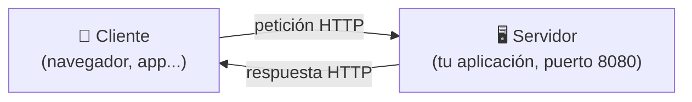
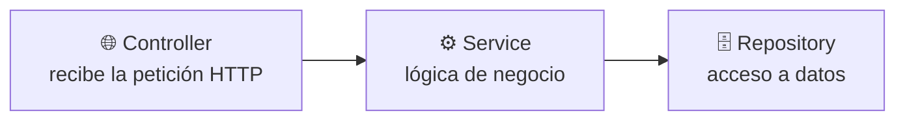
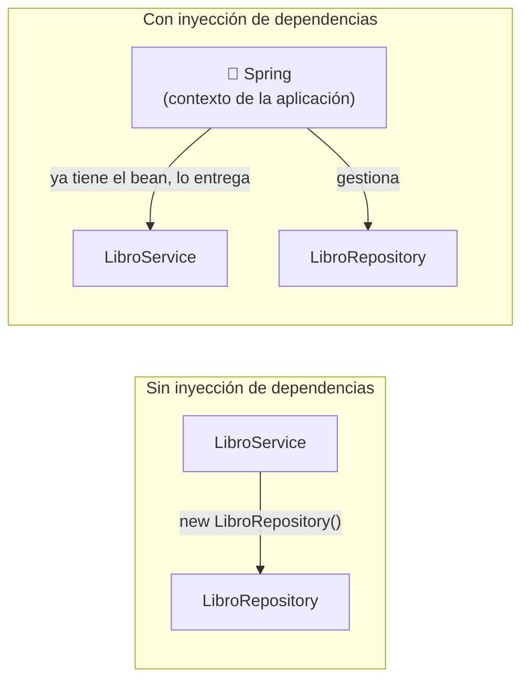

<a id="spring-boot-fundamentos"></a>

# 🧩 1. Fundamentos de Spring Boot

Hasta ahora todo lo que has programado en Java ha sido consola: el programa arranca, hace algo, y termina. A partir de aquí vas a construir un tipo de programa distinto — uno que arranca y se queda **esperando**, sin que tú le digas nada más, hasta que otro programa le hace una pregunta. Este apartado es la base sin la que no vas a entender nada de lo que viene, ni en este módulo ni en Programación de Servicios y Procesos (PSP).

---

## 🖥️ De la consola al servidor

Un programa de consola tiene un ciclo de vida corto: arranca, hace su trabajo (leer, calcular, escribir), y termina. Una **aplicación de servidor** (o *backend*) es distinta en un punto clave: arranca, se pone a escuchar en un puerto, y se queda ahí, viva, esperando. No tiene ventanas ni pide datos por teclado — su "usuario" es otro programa (un navegador, una app móvil, otro servidor) que le habla a través de la red.

Para que ese mensaje llegue al programa correcto hacen falta dos datos, no uno: la **dirección IP** identifica la máquina dentro de la red (qué ordenador es), y el **puerto** identifica, dentro de esa máquina, a qué programa concreto va dirigido el mensaje. Un mismo ordenador puede tener varios programas escuchando a la vez — tu aplicación, una base de datos, otro servidor web — y cada uno necesita su propio número de puerto para no mezclarse.

!!! example "Analogía: el bloque de pisos"
    La dirección IP es como la dirección de un bloque de pisos: identifica el edificio dentro de la ciudad. El puerto es como el número de piso: dentro del mismo edificio, distingue a qué vivienda va dirigida una carta. Sin el número de piso, el cartero llegaría al portal correcto pero no sabría dónde dejarla. Cuando decimos que un servidor "escucha en el puerto 8080", significa que se ha quedado a la espera de mensajes dirigidos precisamente a ese número, en esa máquina.

Cliente y servidor, además, necesitan hablar el mismo idioma para entenderse: un formato de mensaje acordado de antemano, llamado **protocolo**. El que vas a usar durante todo el curso es **HTTP** — define cómo se formula una petición y cómo se responde a ella, y es el mismo protocolo que usa tu navegador cada vez que visitas una página web.



!!! tip "El servidor no decide cuándo actuar, el cliente sí"
    En un programa de consola, tú controlas el ritmo: lees una línea, procesas, escribes. Un servidor no elige cuándo trabajar — se queda a la espera, y reacciona cada vez que llega una petición. Puede pasar un minuto sin que ocurra nada, o puede llegar una petición cada milisegundo.

La aplicación que vas a ir construyendo en las actividades de este curso es exactamente eso: un programa Java que no tiene `Scanner` ni `System.out.println` esperando que pulses Intro — arranca, se pone a escuchar en un puerto, y responde peticiones HTTP hasta que alguien lo detiene.

---

## 🧱 Qué es un framework

Hasta ahora, en tus programas, el flujo de control lo llevas tú: tu `main()` llama a tus clases, tus clases llaman a librerías (una `ArrayList`, un `Scanner`...) cuando las necesitan. Tú decides qué se ejecuta y cuándo.

Un **framework** invierte esa relación. En vez de que tu código llame a la librería, es la librería (el framework) la que llama a tu código, en los momentos que él decide: cuando arranca la aplicación, cuando llega una petición HTTP, cuando se necesita guardar un objeto en la base de datos. A esta idea se la llama **inversión de control**: el control del "cuándo se ejecuta qué" pasa de tus manos a las del framework.

!!! example "Analogía: el restaurante"
    Cuando cocinas en casa (tu programa de consola), tú decides cuándo picas la cebolla, cuándo enciendes el fuego, en qué orden. Trabajar con un framework es más parecido a ser cocinero en un restaurante: el camarero (el framework) te avisa "mesa 4, primer plato" y tú solo escribes la parte que sabes hacer — la receta. Cuándo se sirve, en qué orden llegan los pedidos y cómo se reparte el trabajo entre la cocina lo decide el camarero, no tú.

**Spring** es el framework de Java más usado para construir este tipo de aplicaciones. **Spring Boot** es una capa sobre Spring que elimina casi toda la configuración manual que antes hacía falta: trae un servidor web ya integrado (no hay que instalar ni configurar uno aparte), configura automáticamente piezas típicas a partir de lo que detecta en tu proyecto, y organiza las dependencias en paquetes llamados *starters* — añades uno y llegan ya preparadas todas las librerías que necesitas para esa funcionalidad, sin ir buscándolas una a una.

---

## 📦 Maven y el `pom.xml`

Un proyecto Java real no se escribe solo con las clases que tú creas: depende de librerías externas (el propio Spring, el driver de PostgreSQL, Lombok...). **Maven** es la herramienta que gestiona esas dependencias por ti: en vez de descargar manualmente cada `.jar` —un fichero que empaqueta código Java ya compilado, listo para usarse como librería— y añadirlo al proyecto, declaras qué necesitas en un fichero — el `pom.xml` — y Maven se encarga de descargarlo, con la versión correcta, y de resolver las dependencias que esas librerías necesitan a su vez.

Una dependencia en el `pom.xml` tiene esta forma:

```xml
<dependency>
    <groupId>org.springframework.boot</groupId>
    <artifactId>spring-boot-starter-webmvc</artifactId>
</dependency>
```

`groupId` identifica quién publica la librería (aquí, el propio equipo de Spring Boot) y `artifactId` identifica cuál de sus paquetes quieres. Con esa entrada, Maven descarga ese *starter* y todo lo que necesita para funcionar.

En este curso vas a trabajar, entre otras, con estas dos dependencias clave:

```xml
<dependency>
    <groupId>org.springframework.boot</groupId>
    <artifactId>spring-boot-starter-webmvc</artifactId>
</dependency>
<dependency>
    <groupId>org.springframework.boot</groupId>
    <artifactId>spring-boot-starter-data-jpa</artifactId>
</dependency>
```

!!! warning "El nombre del starter web ha cambiado"
    Si buscas tutoriales antiguos de Spring Boot verás `spring-boot-starter-web`. En este curso usas Spring Boot 4, que separó ese starter en dos variantes según el modelo de programación: `spring-boot-starter-webmvc` (el modelo clásico, el que vas a usar) y `spring-boot-starter-webflux` (el modelo reactivo, que no vas a usar en este curso). Es el mismo starter que vas a elegir al generar tu propio proyecto en la Actividad 1.1 — si buscas `spring-boot-starter-web` a secas en tu `pom.xml`, no lo vas a encontrar.

`spring-boot-starter-webmvc` trae todo lo necesario para exponer una API HTTP (servidor embebido incluido); `spring-boot-starter-data-jpa` trae **Hibernate** —la herramienta que traduce automáticamente tus clases Java anotadas a tablas y sentencias SQL, sin que tú escribas ese SQL a mano— junto con Spring Data JPA, que profundizarás más adelante en este mismo tema. Desde ya vas a ver a Hibernate trabajar: es quien crea de verdad las tablas de tu base de datos a partir de tus entidades. Con solo declarar estas dos líneas, Maven descarga decenas de librerías relacionadas — esa es la ventaja de los *starters*: no las buscas una a una.

---

## 🗂️ La arquitectura en capas

Una aplicación backend no mete todo el código en una sola clase gigante: lo reparte en **capas**, cada una con una responsabilidad clara. El patrón más extendido — y el que vas a usar durante todo el curso — tiene tres:



Imagina una aplicación que gestiona el catálogo de una librería (el ejemplo que va a usar toda la teoría del curso; tu proyecto real, GameVault, lo trabajas en las actividades):

- El **controller** (`LibroController`) recibe la petición HTTP y la traduce a una llamada Java — no contiene lógica de negocio, solo enruta.
- El **service** (`LibroService`) contiene la lógica: qué hay que comprobar, qué hay que calcular, en qué orden se hacen las cosas.
- El **repository** (`LibroRepository`) es quien habla con la base de datos.

¿Por qué separar así? Porque cada capa se puede entender, probar y cambiar sin tocar las demás: si mañana cambias de base de datos, solo tocas el repository; si cambia una regla de negocio, solo el service. La regla es que cada capa habla solo con la siguiente, sin saltarse ninguna: el controller nunca accede directamente a la base de datos.

Cada capa depende de la siguiente — el controller necesita un service, el service necesita un repository — pero ninguna crea directamente lo que necesita. Eso es justo lo que resuelve la inyección de dependencias, que ves a continuación.

---

## 💉 Inyección de dependencias

Mira otra vez el diagrama de capas: el controller necesita un service, y el service necesita un repository. En algún punto del código, alguien tiene que crear esos objetos y encajarlos unos dentro de otros. La pregunta de esta sección es quién hace ese trabajo — ¿tu código, o el framework?

Imagina una clase que necesita usar otra para hacer su trabajo — por ejemplo, un servicio que necesita un repositorio para consultar datos. La forma más directa, la que ya conoces, es crearla tú mismo dentro de la clase que la usa:

```java
public class LibroService {
    private LibroRepository repositorio = new LibroRepository();
}
```

Funciona, pero tiene un coste que se nota en cuanto el proyecto crece. `LibroService` queda **atado** a esa implementación concreta de `LibroRepository`: si mañana quisieras probar `LibroService` sin conectarte a una base de datos real (con un repositorio "de mentira" que devuelva datos fijos para el test), no podrías — el `new LibroRepository()` está escrito dentro de `LibroService`, así que siempre construye la versión real. Cambiar esa dependencia obliga a tocar el código de la clase que la usa.

Con **inyección de dependencias** (o *dependency injection*, DI), la clase deja de crear lo que necesita: se limita a **declararlo** — normalmente como parámetro del constructor — y es otro quien se lo entrega ya construido:

```java
public class LibroService {
    private final LibroRepository repositorio;

    public LibroService(LibroRepository repositorio) {
        this.repositorio = repositorio;
    }
}
```

La diferencia parece pequeña en el código, pero cambia quién manda: `LibroService` ya no sabe (ni le importa) de dónde sale su `LibroRepository` — solo sabe que lo recibe listo para usar por el constructor. Es el mismo principio de **inversión de control** visto más arriba, aplicado esta vez a un caso muy concreto: en vez de que tu código construya sus propias piezas, las recibe ya montadas.

!!! example "La misma analogía del restaurante, un paso más"
    Cuando cocinas en el restaurante (recuerda la analogía de antes), no vas tú al almacén a buscar los ingredientes — te los traen a la mesa de trabajo, ya listos, cuando los necesitas. La inyección de dependencias es justo eso, pero con objetos: `LibroService` no va a buscar su `LibroRepository`; se lo entregan.

Aquí falta la pieza que hace que esto funcione de verdad: ¿quién construye ese `LibroRepository` y decide dárselo a `LibroService`? La respuesta es Spring. Al arrancar, Spring crea y guarda en un contenedor interno (el llamado **contexto de la aplicación**) una instancia de cada clase que le has dicho que gestione — esas instancias gestionadas son los **beans**. Cuando Spring necesita construir un `LibroService`, mira su constructor, ve que pide un `LibroRepository`, busca en ese contenedor si ya tiene uno, y si lo tiene, se lo pasa automáticamente. Tú nunca escribes `new LibroService(...)` en ningún sitio — Spring construye el objeto por ti y resuelve toda la cadena de dependencias, capa por capa.



Para que Spring sepa qué clases debe gestionar como beans, se marcan con anotaciones. Las que vas a ver constantemente:

| Anotación | Qué declara |
|---|---|
| `@Service` | Un bean con lógica de negocio (la capa intermedia entre controlador y datos). |
| `@Repository` | Un bean que accede a datos (normalmente, una interfaz que Spring Data implementa por ti). |
| `@RestController` | Un bean que expone endpoints HTTP y devuelve las respuestas en el cuerpo (JSON, por ejemplo). |
| `@Configuration` | Una clase que define manualmente uno o varios beans, para casos que no encajan en las anteriores. |

Las cuatro tienen algo en común: todas le dicen a Spring "esto es un bean, gestióname el ciclo de vida y pásame lo que necesite por inyección".

Este mecanismo no se para en una sola capa — se repite hacia arriba. Así se ve la cadena completa en el controller de la librería, que declara `private final LibroService libroService;`, recibe el service por constructor exactamente igual que el service recibía el repository, y delega en él cada método:

```java
@RestController
@RequestMapping("/api/v1/libros")
public class LibroController {
    private final LibroService libroService;

    public LibroController(LibroService libroService) {
        this.libroService = libroService;
    }

    @GetMapping("/{id}")
    public ResponseEntity<LibroDTO> getById(@PathVariable Long id) {
        return ResponseEntity.ok(libroService.findById(id));
    }
}
```

No hace falta que entiendas todavía `@GetMapping`, `@PathVariable` ni `ResponseEntity` — esas anotaciones son de HTTP/REST, y las vas a ver en detalle en PSP. Aquí solo interesa la forma: controller → service → repository, cada uno con una responsabilidad y sin saltarse capas.

---

## 🚀 El punto de arranque de la aplicación

Toda aplicación Spring Boot tiene una clase con un `main()` que la arranca:

```java
@SpringBootApplication
public class LibreriaApplication {

    static void main(String[] args) {
        SpringApplication.run(LibreriaApplication.class, args);
    }
}
```

`@SpringBootApplication` es la anotación que activa todo lo visto hasta ahora: le dice a Spring Boot "escanea este paquete y los que cuelgan de él en busca de beans (`@Service`, `@Repository`...), y configúrate automáticamente según lo que encuentres en el classpath" —el conjunto de sitios donde Java busca el código que necesita para ejecutar el programa: tus clases compiladas y las librerías que ha traído Maven—. `SpringApplication.run(...)` es lo que realmente arranca el servidor embebido y deja la aplicación escuchando.

---

## 🧩 El `@RequiredArgsConstructor` de Lombok

Escribir a mano el constructor de inyección de cada clase se vuelve repetitivo enseguida. **Lombok** es una librería que genera código repetitivo por ti a partir de anotaciones, y `@RequiredArgsConstructor` genera automáticamente un constructor con un parámetro por cada campo `final` de la clase:

```java
@Service
@RequiredArgsConstructor
public class LibroService {
    private final LibroRepository libroRepository;
    private final EditorialRepository editorialRepository;
    // Lombok genera aquí, en tiempo de compilación, un constructor
    // que recibe ambos repositorios — no lo ves escrito en el .java,
    // pero existe y es el que Spring usa para la inyección.
}
```

Sin Lombok tendrías que escribir ese constructor a mano cada vez que añadieras un campo `final`. Con la anotación, Spring sigue pudiendo inyectar las dependencias exactamente igual (por constructor), pero tú no mantienes ese código repetitivo.

---

## ⚙️ Configuración: `application.yaml` y perfiles

Spring Boot centraliza la configuración (credenciales de base de datos, puertos, propiedades propias de la aplicación) en ficheros YAML en `src/main/resources`. Lo habitual es tener al menos dos: `application.yaml`, con la configuración común, y `application-dev.yaml`, con la específica del entorno de desarrollo (por ejemplo, la URL de conexión a PostgreSQL que usarás en la Actividad 1.1).

Ese `-dev` en el nombre es un **perfil**: un conjunto de configuración que solo se activa si le dices a Spring Boot que use ese perfil al arrancar. Así, el mismo código puede arrancar con configuración distinta según si estás desarrollando en tu máquina, ejecutando tests, o (en un proyecto real) desplegando en producción, sin tocar una sola línea de Java.

---

## 🧭 Dónde estás y hacia dónde vas

Estas piezas —el proyecto Maven, las capas, la inyección de dependencias, la configuración— las vas a trabajar durante todo el curso desde dos módulos a la vez: en **Acceso a Datos** te centrarás en la persistencia, todo lo que hay del service hacia abajo (JDBC, JPA, JSONB, MongoDB); en **Programación de Servicios y Procesos** te centrarás en los servicios en red y la seguridad, del controller hacia fuera (REST, JWT, hilos, sockets). En las actividades de ambos módulos irás construyendo, pieza a pieza, tu propia aplicación con esta misma estructura.

---

## ✅ Ideas clave

??? tip "Abrir resumen"

    - Una aplicación de servidor arranca y se queda escuchando peticiones en un **puerto**; no tiene el mismo ciclo de vida que un programa de consola. La **IP** identifica la máquina, el **puerto** identifica el programa dentro de ella, y **HTTP** es el protocolo que cliente y servidor usan para entenderse.
    - Un **framework** invierte el control: en vez de que tu código llame a la librería, el framework llama al tuyo (inversión de control).
    - **Spring** es el framework; **Spring Boot** añade configuración automática, servidor embebido y *starters* que agrupan dependencias relacionadas.
    - **Maven** gestiona las dependencias del proyecto a través del `pom.xml`; en este curso usarás `spring-boot-starter-webmvc` (no `-web`, nombre antiguo) y `spring-boot-starter-data-jpa`.
    - La arquitectura en capas es controller (HTTP) → service (lógica) → repository (datos): cada capa habla solo con la siguiente.
    - La **inyección de dependencias** hace que una clase declare lo que necesita (por constructor) en vez de crearlo ella misma; Spring guarda una instancia de cada clase gestionada (un **bean**) en su contexto de la aplicación, y se la entrega ya construida a quien la pida. `@Service`, `@Repository`, `@RestController` y `@Configuration` marcan qué clases gestiona Spring como beans.
    - `application.yaml`/`application-dev.yaml` centralizan la configuración; un **perfil** (`dev`) permite tener configuración distinta según el entorno sin tocar código.
    - `@RequiredArgsConstructor` de Lombok genera el constructor con los campos `final`, que es lo que Spring usa para inyectar dependencias.
