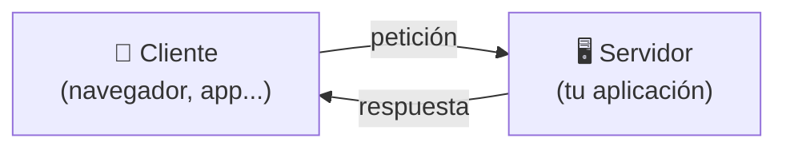
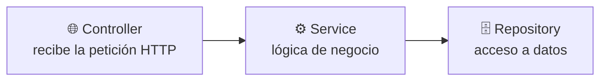

<a id="spring-boot-y-gamevault"></a>

# 🧩 1. Spring Boot: el chasis de GameVault

Hasta ahora todo lo que has programado en Java ha sido consola: el programa arranca, hace algo, y termina. A partir de aquí vas a construir un tipo de programa distinto — uno que arranca y se queda **esperando**, sin que tú le digas nada más, hasta que otro programa le hace una pregunta. Este apartado es la base sin la que no vas a entender nada de lo que viene, ni en este módulo ni en Programación de Servicios y Procesos (PSP), que trabaja sobre el mismo proyecto desde el otro lado.

---

## 🖥️ De la consola al servidor

Un programa de consola tiene un ciclo de vida corto: arranca, hace su trabajo (leer, calcular, escribir), y termina. Una **aplicación de servidor** (o *backend*) es distinta en un punto clave: arranca, abre una puerta de red, y se queda ahí, viva, esperando. No tiene ventanas ni pide datos por teclado — su "usuario" es otro programa (un navegador, una app móvil, otro servidor) que le habla a través de la red.



!!! tip "El servidor no decide cuándo actuar, el cliente sí"
    En un programa de consola, tú controlas el ritmo: lees una línea, procesas, escribes. Un servidor no elige cuándo trabajar — se queda a la espera, y reacciona cada vez que llega una petición. Puede pasar un minuto sin que ocurra nada, o puede llegar una petición cada milisegundo.

GameVault, el proyecto que vas a construir durante el curso, es exactamente eso: un programa Java que no tiene `Scanner` ni `System.out.println` esperando que pulses Intro — arranca, se pone a escuchar en un puerto de red, y responde peticiones hasta que alguien lo detiene.

---

## 🧱 Qué es un framework

Hasta ahora, en tus programas, el flujo de control lo llevas tú: tu `main()` llama a tus clases, tus clases llaman a librerías (una `ArrayList`, un `Scanner`...) cuando las necesitan. Tú decides qué se ejecuta y cuándo.

Un **framework** invierte esa relación. En vez de que tu código llame a la librería, es la librería (el framework) la que llama a tu código, en los momentos que él decide: cuando arranca la aplicación, cuando llega una petición HTTP, cuando se necesita guardar un objeto en la base de datos. A esta idea se la llama **inversión de control**: el control del "cuándo se ejecuta qué" pasa de tus manos a las del framework.

!!! example "Analogía: el restaurante"
    Cuando cocinas en casa (tu programa de consola), tú decides cuándo picas la cebolla, cuándo enciendes el fuego, en qué orden. Trabajar con un framework es más parecido a ser cocinero en un restaurante: el maître (el framework) te avisa "mesa 4, primer plato" y tú solo escribes la parte que sabes hacer — la receta. Cuándo se sirve, en qué orden llegan los pedidos y cómo se reparte el trabajo entre la cocina lo decide el maître, no tú.

**Spring** es el framework de Java más usado para construir este tipo de aplicaciones. **Spring Boot** es una capa sobre Spring que elimina casi toda la configuración manual que antes hacía falta: trae un servidor web ya integrado (no hay que instalar ni configurar uno aparte), configura automáticamente piezas típicas a partir de lo que detecta en tu proyecto, y organiza las dependencias en paquetes llamados *starters* — añades uno y llegan ya preparadas todas las librerías que necesitas para esa funcionalidad, sin ir buscándolas una a una.

---

## 📦 Maven y el `pom.xml`

Un proyecto Java real no se escribe solo con las clases que tú creas: depende de librerías externas (el propio Spring, el driver de PostgreSQL, Lombok...). **Maven** es la herramienta que gestiona esas dependencias por ti: en vez de descargar manualmente cada `.jar` y añadirlo al proyecto, declaras qué necesitas en un fichero — el `pom.xml` — y Maven se encarga de descargarlo, con la versión correcta, y de resolver las dependencias que esas librerías necesitan a su vez.

Una dependencia en el `pom.xml` tiene esta forma:

```xml
<dependency>
    <groupId>org.springframework.boot</groupId>
    <artifactId>spring-boot-starter-webmvc</artifactId>
</dependency>
```

`groupId` identifica quién publica la librería (aquí, el propio equipo de Spring Boot) y `artifactId` identifica cuál de sus paquetes quieres. Con esa entrada, Maven descarga ese *starter* y todo lo que necesita para funcionar.

---

## 💉 Inyección de dependencias

Imagina una clase que necesita usar otra para hacer su trabajo — por ejemplo, un servicio que necesita un repositorio para consultar datos. Sin framework, la forma más directa es crearla tú mismo dentro de la clase que la usa:

```java
public class VideojuegoService {
    private VideojuegoRepository repositorio = new VideojuegoRepository();
}
```

El problema: `VideojuegoService` queda atado a esa implementación concreta de `VideojuegoRepository`. Si quisieras sustituirla (por ejemplo, por una versión de pruebas), tendrías que tocar el código de `VideojuegoService`.

Con **inyección de dependencias**, la clase no crea lo que necesita — lo declara, y es el framework quien se lo entrega ya construido:

```java
public class VideojuegoService {
    private final VideojuegoRepository repositorio;

    public VideojuegoService(VideojuegoRepository repositorio) {
        this.repositorio = repositorio;
    }
}
```

Spring ve que `VideojuegoService` necesita un `VideojuegoRepository` en su constructor, ya tiene uno gestionado (un **bean**), y se lo pasa automáticamente al crear el servicio. Tú nunca escribes `new VideojuegoService(...)` en ningún sitio — Spring construye el objeto por ti y resuelve toda la cadena de dependencias.

Para que Spring sepa qué clases debe gestionar como beans, se marcan con anotaciones. Las que vas a ver constantemente en GameVault:

| Anotación | Qué declara |
|---|---|
| `@Service` | Un bean con lógica de negocio (la capa intermedia entre controlador y datos). |
| `@Repository` | Un bean que accede a datos (normalmente, una interfaz que Spring Data implementa por ti). |
| `@RestController` | Un bean que expone endpoints HTTP y devuelve las respuestas en el cuerpo (JSON, por ejemplo). |
| `@Configuration` | Una clase que define manualmente uno o varios beans, para casos que no encajan en las anteriores. |

Las cuatro tienen algo en común: todas le dicen a Spring "esto es un bean, gestióname el ciclo de vida y pásame lo que necesite por inyección".

---

## 🚀 El punto de arranque de GameVault

Toda aplicación Spring Boot tiene una clase con un `main()` que la arranca. En GameVault es `GamevaultApplication.java`:

```java
@SpringBootApplication
@EnableCaching
@EnableAsync
public class GamevaultApplication {

    static void main(String[] args) {
        SpringApplication.run(GamevaultApplication.class, args);
    }
}
```

`@SpringBootApplication` es la anotación que activa todo lo visto hasta ahora: le dice a Spring Boot "escanea este paquete y los que cuelgan de él en busca de beans (`@Service`, `@Repository`...), y configúrate automáticamente según lo que encuentres en el classpath". `SpringApplication.run(...)` es lo que realmente arranca el servidor embebido y deja la aplicación escuchando.

Verás también `@EnableCaching` y `@EnableAsync` — activan capacidades adicionales (caché y ejecución en segundo plano) que no vas a usar todavía; están ahí porque otras partes del curso (en PSP) las necesitarán más adelante.

---

## 📄 El `pom.xml` real de GameVault

Un `pom.xml` de GameVault incluye, entre otras, estas dos dependencias clave:

```xml
<dependency>
    <groupId>org.springframework.boot</groupId>
    <artifactId>spring-boot-starter-webmvc</artifactId>
</dependency>
<dependency>
    <groupId>org.springframework.boot</groupId>
    <artifactId>spring-boot-starter-data-jpa</artifactId>
</dependency>
```

!!! warning "El nombre del starter web ha cambiado"
    Si buscas tutoriales antiguos de Spring Boot verás `spring-boot-starter-web`. GameVault usa Spring Boot 4, que separó ese starter en dos variantes según el modelo de programación: `spring-boot-starter-webmvc` (el modelo clásico, el que usa este proyecto) y `spring-boot-starter-webflux` (el modelo reactivo, que no vas a usar en este curso). Es el mismo starter que ya elegiste al generar tu propio proyecto en la Actividad 1.1 — si buscas `spring-boot-starter-web` a secas en tu `pom.xml`, no lo vas a encontrar.

`spring-boot-starter-webmvc` trae todo lo necesario para exponer una API HTTP (servidor embebido incluido); `spring-boot-starter-data-jpa` trae Hibernate y Spring Data JPA, que usarás en el Tema 2 para hablar con la base de datos sin escribir SQL a mano. Con solo declarar estas dos líneas, Maven descarga decenas de librerías relacionadas — esa es la ventaja de los *starters*: no las buscas una a una.

---

## 🗂️ La estructura de paquetes y la arquitectura en capas

!!! warning "Esto es una vista previa, no tu proyecto todavía"
    Lo que ves en este apartado es la forma que tendrá tu GameVault más adelante — no lo que tienes ahora mismo. Tu propio proyecto, en este punto, solo tiene lo que has creado en la Actividad 1.1: el esqueleto generado con Spring Initializr y, como mucho, las entidades `Videojuego`/`Estudio`. Tu propio `VideojuegoController`/`VideojuegoService`/`VideojuegoRepository` con el CRUD completo lo vas a construir la semana que viene, en la Actividad 1.2 — no debería sorprenderte no tenerlo todavía.

GameVault organiza su código en paquetes por dominio: `catalogo` (videojuegos y estudios), `reviews` (reseñas), `actividad` (registro de eventos), `seguridad`, `config` y `exception`. Dentro de cada paquete de dominio se repite el mismo patrón de tres capas:



- El **controller** (`VideojuegoController`) recibe la petición HTTP y la traduce a una llamada Java — no contiene lógica de negocio, solo enruta.
- El **service** (`VideojuegoService`) contiene la lógica: qué hay que comprobar, qué hay que calcular, en qué orden se hacen las cosas.
- El **repository** (`VideojuegoRepository`) es quien habla con la base de datos.

Puedes ver esta cadena en `VideojuegoController`, que declara `private final VideojuegoService videojuegoService;` e inyecta el servicio por constructor (gracias a `@RequiredArgsConstructor`, que verás en el siguiente apartado), y delega en él cada método:

```java
@RestController
@RequestMapping("/api/v1/videojuegos")
@RequiredArgsConstructor
public class VideojuegoController {
    private final VideojuegoService videojuegoService;

    @GetMapping("/{id}")
    public ResponseEntity<VideojuegoResponseDTO> getById(@PathVariable Long id) {
        return ResponseEntity.ok(videojuegoService.findById(id));
    }
}
```

No hace falta que entiendas todavía `@GetMapping`, `@PathVariable` ni `ResponseEntity` — esas anotaciones son de HTTP/REST, y las vas a ver en detalle en PSP, que esta misma semana empieza a leer este mismo controlador desde ese ángulo. Aquí solo interesa la forma: controller → service → repository, cada uno con una responsabilidad y sin saltarse capas.

---

## ⚙️ Configuración: `application.yaml` y perfiles

Spring Boot centraliza la configuración (credenciales de base de datos, puertos, propiedades propias de la aplicación) en ficheros YAML en `src/main/resources`. GameVault tiene dos: `application.yaml`, con la configuración común, y `application-dev.yaml`, con la específica del entorno de desarrollo (por ejemplo, la URL de conexión a PostgreSQL que usarás en la Actividad 1.1).

Ese `-dev` en el nombre es un **perfil**: un conjunto de configuración que solo se activa si le dices a Spring Boot que use ese perfil al arrancar. Así, el mismo código puede arrancar con configuración distinta según si estás desarrollando en tu máquina, ejecutando tests, o (en un proyecto real) desplegando en producción, sin tocar una sola línea de Java.

---

## 🧩 El `@RequiredArgsConstructor` de Lombok

Vas a ver esta anotación en casi todas las clases del proyecto (ya ha aparecido dos veces en este mismo apartado). **Lombok** es una librería que genera código repetitivo por ti a partir de anotaciones, y `@RequiredArgsConstructor` genera automáticamente un constructor con un parámetro por cada campo `final` de la clase:

```java
@Service
@RequiredArgsConstructor
public class VideojuegoService {
    private final VideojuegoRepository videojuegoRepository;
    private final EstudioRepository estudioRepository;
    // Lombok genera aquí, en tiempo de compilación, un constructor
    // que recibe ambos repositorios — no lo ves escrito en el .java,
    // pero existe y es el que Spring usa para la inyección.
}
```

Sin Lombok tendrías que escribir ese constructor a mano cada vez que añadieras un campo `final`. Con la anotación, Spring sigue pudiendo inyectar las dependencias exactamente igual (por constructor), pero tú no mantienes ese código repetitivo.

---

## 🧭 Dónde estás y hacia dónde vas

Este chasis —el proyecto, sus capas, su configuración— lo vais a ir rellenando durante todo el curso desde dos módulos a la vez: en **Acceso a Datos** trabajarás la persistencia, todo lo que hay del service hacia abajo (JDBC, JPA, JSONB, MongoDB); en **Programación de Servicios y Procesos** trabajarás la parte de servicios en red y seguridad, del controller hacia fuera (REST, JWT, hilos, sockets). Es el mismo proyecto, visto y construido desde dos ángulos distintos.

---

## ✅ Ideas clave

??? tip "Abrir resumen"

    - Una aplicación de servidor arranca y se queda escuchando peticiones de red; no tiene el mismo ciclo de vida que un programa de consola.
    - Un **framework** invierte el control: en vez de que tu código llame a la librería, el framework llama al tuyo (inversión de control).
    - **Spring** es el framework; **Spring Boot** añade configuración automática, servidor embebido y *starters* que agrupan dependencias relacionadas.
    - **Maven** gestiona las dependencias del proyecto a través del `pom.xml`.
    - La **inyección de dependencias** hace que una clase declare lo que necesita (por constructor) en vez de crearlo ella misma; Spring se lo entrega ya construido. `@Service`, `@Repository`, `@RestController` y `@Configuration` marcan qué clases gestiona Spring como beans.
    - GameVault usa `spring-boot-starter-webmvc` (no `-web`, nombre antiguo) y `spring-boot-starter-data-jpa`.
    - La arquitectura en capas del proyecto es controller (HTTP) → service (lógica) → repository (datos); lo visto en este apartado es una **vista previa** del proyecto terminado, no el tuyo, que en este punto solo tiene lo creado en la Actividad 1.1.
    - `application.yaml`/`application-dev.yaml` centralizan la configuración; un **perfil** (`dev`) permite tener configuración distinta según el entorno sin tocar código.
    - `@RequiredArgsConstructor` de Lombok genera el constructor con los campos `final`, que es lo que Spring usa para inyectar dependencias.
