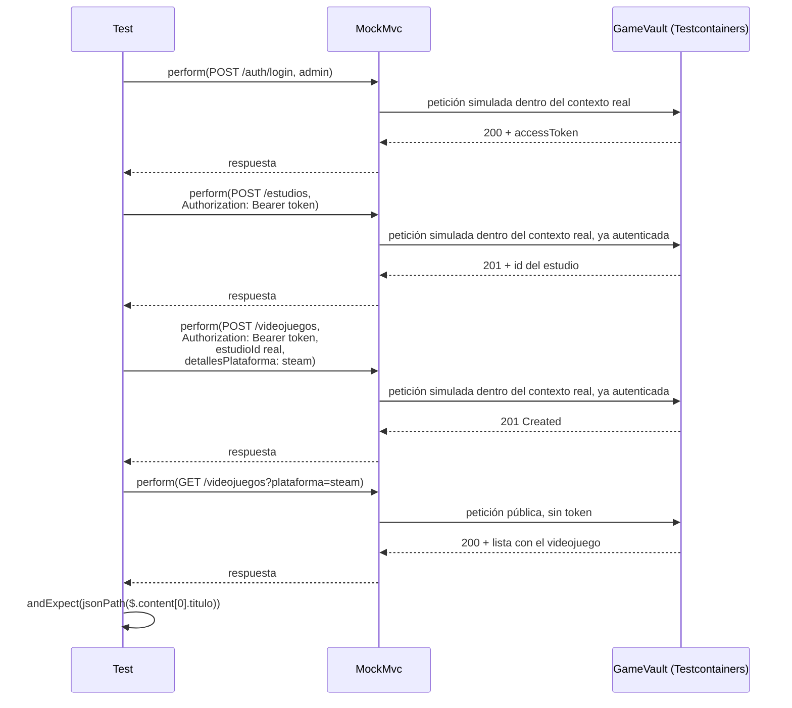
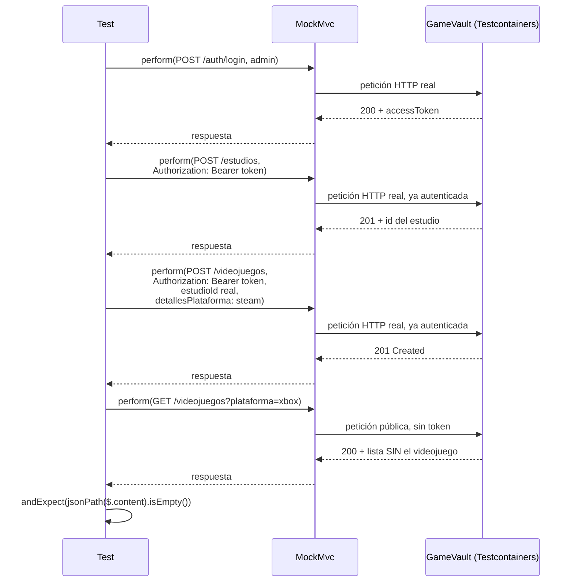
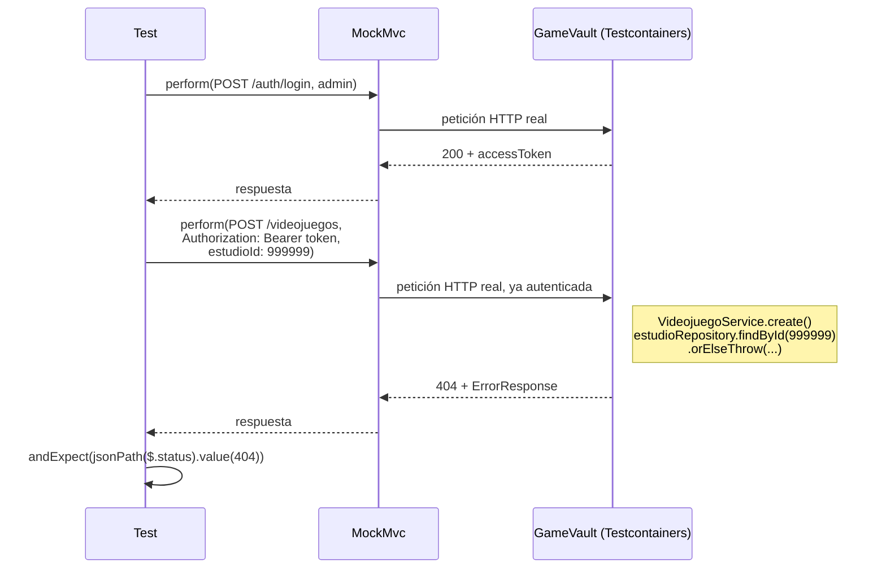
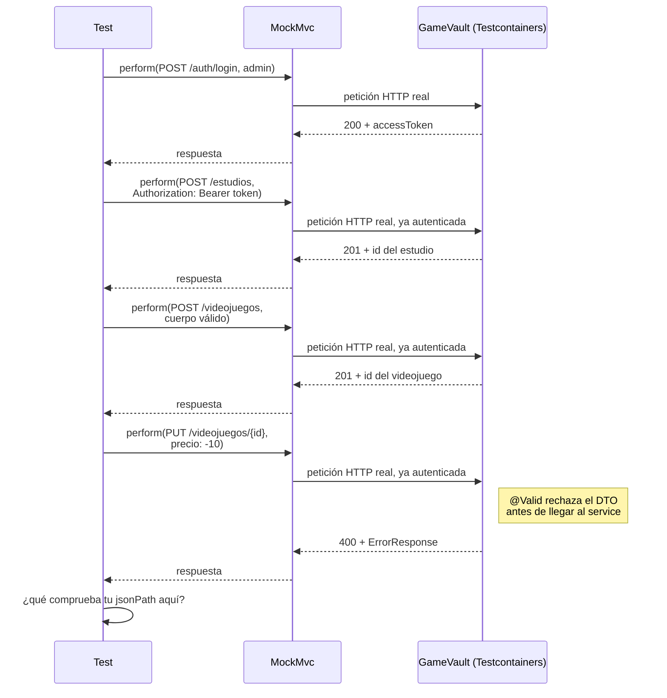
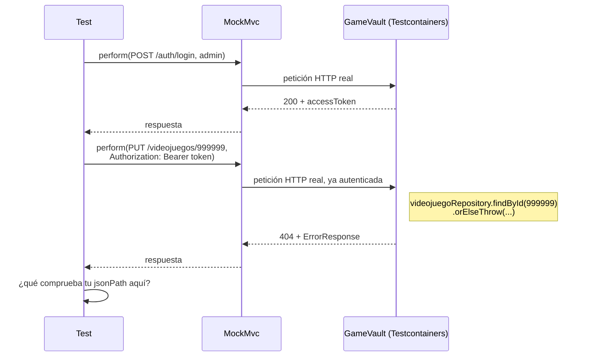
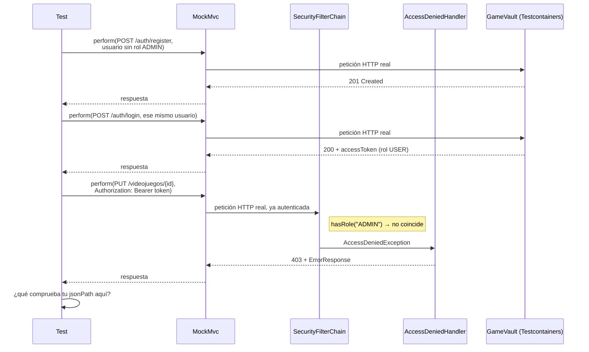

# 🧪 Actividad 2.3: Pruebas de integración: JSONB y manejo de errores

!!! info "Práctica guiada"
    Hoy escribes un test de integración real, con Testcontainers, que verifica de verdad el comportamiento de la columna JSONB y el filtro `jsonb_exists` que has construido en las dos actividades anteriores.

## Qué vas a practicar

- Configurar un test con Testcontainers y `@ServiceConnection`.
- Escribir un test de integración completo, vía la API, sobre JSONB.
- Probar tanto el camino feliz como los casos de error, sobre dos endpoints distintos.
- Entender qué detecta un test así que un test con mocks nunca detectaría.

---

## Requisitos previos

Tu columna `detallesPlataforma` (Actividad 2.1) y el filtro `disponibleEnPlataforma` (Actividad 2.2), ambos funcionando. También tu login JWT y tu política de rutas cerrada por defecto (Actividades 2.4 y 2.5 de PSP), ya en marcha — el `POST` de este test pasa ahora por esa misma política, así que necesitas un token de administrador antes de poder crear un videojuego.

!!! note "Esto es una muestra, no la batería de tests completa"
    Aquí escribes seis tests sobre dos endpoints (`POST` y `PUT` de `/api/v1/videojuegos`): el camino feliz, un caso negativo, y los errores más comunes (`400` de validación, `404` de recurso inexistente, `403` de rol insuficiente). Es más de lo habitual en una actividad de este curso, precisamente porque el objetivo de hoy es la cobertura de errores — pero ni de lejos toda la API. `Estudio` tiene su propio CRUD sin ningún test todavía, y ni `POST`/`PUT` cubren aquí un `401` sin token. Decidir hasta dónde llega la cobertura de un proyecto real es una decisión de cada equipo, no algo que se enseñe de una sola actividad.

---

## Paso 1 — Configuración del test, guiada al completo

!!! tip "Por qué esto funciona dentro de tu Dev Container (y qué hacer si Docker da problemas)"
    Tu JVM, dentro de `app`, le pide contenedores nuevos al Docker del *host* — y eso puede fallar de dos maneras distintas: primero, que ni siquiera pueda hablar con ese Docker; segundo, que hable con él pero no alcance por red los contenedores que acaba de crear. Tienes la explicación completa en la teoría de este apartado — resumen rápido de los dos:

    - **Primero: `Permission denied` sobre `/var/run/docker.sock`**. Añade a `devcontainer.json`:
      ```json
      "postStartCommand": "sudo chmod 666 /var/run/docker.sock || true"
      ```
    - **Segundo: `Connection refused` hacia una IP tipo `172.17.0.1`** (Ryuk, o el propio contenedor de Postgres de Testcontainers, ya arrancados pero inalcanzables). Añade al servicio `app` de tu `.devcontainer/docker-compose.yml` (junto a `volumes` y `command`, no en `postgres`):
      ```yaml
      services:
        app:
          image: mcr.microsoft.com/devcontainers/base:bookworm
          volumes:
            - ..:/workspace:cached
            - /var/run/docker.sock:/var/run/docker.sock
          environment:
            - TESTCONTAINERS_HOST_OVERRIDE=host.docker.internal
          command: sleep infinity

        postgres:
          # ... tu servicio postgres, sin cambios
      ```

    En los dos casos, reconstruye el contenedor (**"Dev Containers: Rebuild Container"**) después de editar.

Añade las dependencias de Testcontainers a tu `pom.xml` — las mismas que acabas de ver en la teoría de este apartado, **incluido el BOM** en `dependencyManagement` (junto al `<parent>`, no dentro de `<dependencies>`): sin él, Maven falla con `'dependencies.dependency.version' ... is missing` antes de compilar nada, porque `org.testcontainers:junit-jupiter` y `org.testcontainers:postgresql` no traen versión gestionada por `spring-boot-starter-parent`.

```xml
<properties>
    <testcontainers.version>1.20.4</testcontainers.version>
</properties>

<dependencyManagement>
    <dependencies>
        <dependency>
            <groupId>org.testcontainers</groupId>
            <artifactId>testcontainers-bom</artifactId>
            <version>${testcontainers.version}</version>
            <type>pom</type>
            <scope>import</scope>
        </dependency>
    </dependencies>
</dependencyManagement>
```

Y, dentro de tu `<dependencies>` habitual, las tres de siempre — ya sin necesitar `<version>` propia:

```xml
<dependency>
    <groupId>org.springframework.boot</groupId>
    <artifactId>spring-boot-testcontainers</artifactId>
    <scope>test</scope>
</dependency>
<dependency>
    <groupId>org.testcontainers</groupId>
    <artifactId>junit-jupiter</artifactId>
    <scope>test</scope>
</dependency>
<dependency>
    <groupId>org.testcontainers</groupId>
    <artifactId>postgresql</artifactId>
    <scope>test</scope>
</dependency>
```

Crea la clase `VideojuegoApiIntegrationTest` en `src/test/java/com/tunombre/gamevault/integration/VideojuegoApiIntegrationTest.java` (paquete nuevo, `integration` — créalo si no existe todavía):

```java
package com.tunombre.gamevault.integration;

import com.jayway.jsonpath.JsonPath;
import org.junit.jupiter.api.Test;
import org.springframework.beans.factory.annotation.Autowired;
import org.springframework.boot.test.context.SpringBootTest;
import org.springframework.boot.testcontainers.service.connection.ServiceConnection;
import org.springframework.http.MediaType;
import org.springframework.test.context.ActiveProfiles;
import org.springframework.test.web.servlet.MockMvc;
import org.springframework.boot.webmvc.test.autoconfigure.AutoConfigureMockMvc;
import org.testcontainers.containers.PostgreSQLContainer;
import org.testcontainers.junit.jupiter.Container;
import org.testcontainers.junit.jupiter.Testcontainers;

import static org.springframework.test.web.servlet.request.MockMvcRequestBuilders.*;
import static org.springframework.test.web.servlet.result.MockMvcResultMatchers.*;

@SpringBootTest
@AutoConfigureMockMvc
@ActiveProfiles("test")
@Testcontainers
class VideojuegoApiIntegrationTest {

    @Container
    @ServiceConnection
    static PostgreSQLContainer<?> postgres = new PostgreSQLContainer<>("postgres:16-alpine");

    @Autowired
    private MockMvc mockMvc;

    private String loginComoAdmin() throws Exception {
        String respuesta = mockMvc.perform(post("/api/v1/auth/login")
                        .contentType(MediaType.APPLICATION_JSON)
                        .content("""
                                {
                                  "username": "admin",
                                  "password": "admintest123"
                                }
                                """))
                .andExpect(status().isOk())
                .andReturn()
                .getResponse()
                .getContentAsString();

        return JsonPath.read(respuesta, "$.accessToken");
    }

    private Long crearEstudio(String adminToken) throws Exception {
        String respuesta = mockMvc.perform(post("/api/v1/estudios")
                        .header("Authorization", "Bearer " + adminToken)
                        .contentType(MediaType.APPLICATION_JSON)
                        .content("""
                                {
                                  "nombre": "Team Cherry",
                                  "pais": "Australia"
                                }
                                """))
                .andExpect(status().isCreated())
                .andReturn()
                .getResponse()
                .getContentAsString();

        return Long.parseLong(JsonPath.read(respuesta, "$.id").toString());
    }

    // los tests van aquí
}
```

`@ServiceConnection` es la pieza clave: conecta automáticamente el `PostgreSQLContainer` a tu aplicación de test, sin que tengas que configurar manualmente `spring.datasource.url` en ningún `application-test.yml` — Spring Boot lo resuelve por ti. Fíjate en que la imagen es `postgres:16-alpine`, no la `18-alpine` de tu `docker-compose.yaml` de desarrollo — recuerda del Tema 1 que ambas versiones no tienen por qué coincidir, mientras sean compatibles con las características (como JSONB) que usa el proyecto.

`@ActiveProfiles("test")` activa un perfil que todavía no existe en tu proyecto. Sin él, el contexto de Spring no arranca y ningún test se ejecuta — así que antes de nada, crea `src/test/resources/application-test.yml`:

```yaml
spring:
  config:
    activate:
      on-profile: test
  jpa:
    hibernate:
      ddl-auto: create-drop
    show-sql: true

gamevault:
  admin:
    password: admintest123
  jwt:
    secret: un-secreto-de-test-de-al-menos-32-caracteres-largo
    expiration-minutes: 60
```

`ddl-auto: create-drop` deja cada ejecución del test con una base de datos limpia, sin arrastrar datos de la anterior. La limpieza se produce al arrancar un nuevo contexto de pruebas, no antes de cada método `@Test`. Como el contenedor y el contexto se comparten durante la ejecución de esta clase, los datos creados por un método podrían seguir presentes cuando se ejecute el siguiente.

!!! warning "Sin `admin.password`, `jwt.secret` y `jwt.expiration-minutes`, el contexto ni arranca"
    Ninguna de las tres tiene valor por defecto en el código (`@Value` sin *fallback*) — sin ellas, ningún test de la clase llega a ejecutarse. La contraseña que pongas aquí tiene que coincidir con la que envíe `loginComoAdmin()` en su petición de login (más arriba, dentro de la misma clase) — de ahí el nombre `admintest123`, para que quede claro de un vistazo que es una credencial solo de test, sin relación con la de `dev`. El valor de `expiration-minutes` no importa para el test — `60` (el mismo de `dev`) sirve igual que cualquier otro. Este fichero sí se sube a Git: las credenciales de dentro no son reales, solo existen en el contenedor Postgres desechable que Testcontainers destruye al terminar el test.

`loginComoAdmin()` es nuevo respecto a lo que tenías hasta ahora: hace un login real contra `/api/v1/auth/login` (el mismo endpoint que has construido en PSP, Actividad 2.4) y extrae el `accessToken` de la respuesta con `JsonPath`, la misma clase que ya conoces de otros tests con MockMvc. Lo necesitas porque, desde que tu política de rutas quedó cerrada por defecto (PSP, Actividad 2.5), crear un videojuego exige un token de `ADMIN` — antes de esa actividad, el `POST` de más abajo habría funcionado sin credenciales; ahora ya no.

`crearEstudio()` resuelve otro problema: `ddl-auto: create-drop` deja tu base de datos de test completamente vacía en cada ejecución, así que ningún `estudioId` fijo (como `1`) existe todavía cuando el test arranca. Este ayudante crea un `Estudio` de verdad, autenticado igual que el resto, y devuelve su `id` real — que es justo lo que necesitas para crear un videojuego que apunte a un estudio que sí existe.

---

## Paso 2 — Primer test, guiado al completo



Así se traduce a código:

```java
@Test
void filtrarPorPlataforma_DebeDevolverElVideojuego_CuandoLaTiene() throws Exception {
    String adminToken = loginComoAdmin();
    Long estudioId = crearEstudio(adminToken);

    mockMvc.perform(post("/api/v1/videojuegos")
                    .header("Authorization", "Bearer " + adminToken)
                    .contentType(MediaType.APPLICATION_JSON)
                    .content("""
                            {
                              "titulo": "Hades",
                              "precio": 24.99,
                              "fechaLanzamiento": "2020-09-17",
                              "estudioId": %d,
                              "detallesPlataforma": {"steam": {"idApp": 123}}
                            }
                            """.formatted(estudioId)))
            .andExpect(status().isCreated());

    mockMvc.perform(get("/api/v1/videojuegos?plataforma=steam"))
            .andExpect(status().isOk())
            .andExpect(jsonPath("$.content[0].titulo").value("Hades"));
}
```

`.formatted(estudioId)` sustituye el marcador `%d` del texto por el id real, antes de que el bloque se convierta en el JSON que se envía — el mismo patrón `String.formatted(...)` que ya conoces, aplicado sobre un bloque de texto en vez de una única línea.

Línea a línea: primero el login como `admin`, para obtener el token; luego un `POST` real, vía MockMvc y ya autenticado, que crea un videojuego con una plataforma concreta en su `detallesPlataforma`; después un `GET` filtrado por esa misma plataforma, sin token porque la lectura del catálogo sigue siendo pública, comprobando con `jsonPath` que el videojuego creado aparece en el resultado. Todo esto ocurre contra el PostgreSQL **real** del contenedor — no hay ningún mock de por medio.

---

## Paso 3 — El test negativo

Repite el mismo patrón del Paso 2, pero esta vez filtrando por una plataforma que el videojuego creado **no tiene** (por ejemplo, `?plataforma=xbox`), y comprueba que la lista de resultados **no** incluye ese videojuego:



Solo se indica el nombre del test — tú escribes todo lo demás, siguiendo el patrón del Paso 2 (recuerda: también necesitas `crearEstudio()` antes del videojuego, y este test crea el suyo propio, no reutiliza el del test anterior, así no depende del orden en que JUnit ejecute los tests de la clase):

```java
@Test
void filtrarPorPlataforma_NoDebeDevolverElVideojuego_CuandoNoLaTiene() throws Exception {
    // tu turno — pista: jsonPath("$.content").isEmpty() comprueba que una lista
    //           viene vacía, sin tener que contar elementos a mano
}
```

**Captura**: los dos tests de filtrado (Pasos 2 y 3) en verde, ejecutados desde tu IDE.

---

## Paso 4 — Un caso de error, guiado al completo

Los Pasos 2 y 3 solo prueban el camino feliz de la creación. Pero `VideojuegoService.create()` también puede fallar — por ejemplo, si `estudioId` no existe (el mismo `orElseThrow` que ya conoces de la teoría de PSP, Tema 2). Un test de integración también tiene que cubrir eso.

Sigue en la **misma clase** que ya tienes: `VideojuegoApiIntegrationTest`, en `src/test/java/com/tunombre/gamevault/integration/VideojuegoApiIntegrationTest.java`. No crees ningún fichero nuevo — añade este método `@Test` dentro de la clase, junto a los de los Pasos 2 y 3 (todos comparten el mismo `mockMvc` y el mismo `loginComoAdmin()`, así que tienen que vivir en la misma clase para poder usarlos):



El test que implementa este flujo:

```java
@Test
void crearVideojuego_DebeDevolver404_CuandoElEstudioNoExiste() throws Exception {
    String adminToken = loginComoAdmin();

    mockMvc.perform(post("/api/v1/videojuegos")
                    .header("Authorization", "Bearer " + adminToken)
                    .contentType(MediaType.APPLICATION_JSON)
                    .content("""
                            {
                              "titulo": "Juego fantasma",
                              "precio": 9.99,
                              "fechaLanzamiento": "2024-01-01",
                              "estudioId": 999999,
                              "detallesPlataforma": {"steam": {"idApp": 1}}
                            }
                            """))
            .andExpect(status().isNotFound())
            .andExpect(jsonPath("$.status").value(404));
}
```

`estudioId: 999999` es, deliberadamente, un id que no existe en tu base de datos de test (recién creada por `ddl-auto: create-drop`, así que ningún id llega a esa cifra). Fíjate en que esto también pasa por Testcontainers de verdad: un mock del repositorio nunca ejecutaría el `orElseThrow` contra una base de datos real, así que este test comprueba el camino de error tal y como ocurriría en producción, no una simulación de él.

---

## Paso 5 — Otro endpoint, con más tipos de error posibles

Los Pasos 2 a 4 prueban siempre el mismo endpoint (`POST /api/v1/videojuegos`). `PUT /api/v1/videojuegos/{id}` tiene, además del `404` que ya conoces, dos tipos de error más: validación (`precio` con `@PositiveOrZero`, puede fallar) y autorización (exige rol `ADMIN`, igual que el `POST`).

Sigues en la misma clase, `VideojuegoApiIntegrationTest`. Aquí tienes la estructura de los tres tests que van a continuación de `crearVideojuego_DebeDevolver404_CuandoElEstudioNoExiste`, uno por uno — completa tú el cuerpo de cada petición y la aserción final, según lo que cada nombre de método y cada diagrama ya te dicen que tiene que pasar.

**El primero, `400` por validación**:



El esqueleto a completar:

```java
@Test
void actualizarVideojuego_DebeDevolver400_CuandoElPrecioEsNegativo() throws Exception {
    String adminToken = loginComoAdmin();
    // tu turno: crearEstudio(adminToken) y luego un videojuego válido (reutiliza el
    //           patrón del Paso 2) — anota el id del videojuego para el PUT de abajo

    mockMvc.perform(put("/api/v1/videojuegos/" + /* el id que acabas de crear */ "")
                    .header("Authorization", "Bearer " + adminToken)
                    .contentType(MediaType.APPLICATION_JSON)
                    .content("""
                            {
                              // tu turno: mismo cuerpo válido, pero con un precio negativo
                            }
                            """))
            // tu turno: ¿qué código de estado esperas? ¿qué comprueba jsonPath del cuerpo del error?
            ;
}
```

**El segundo, `404` por id inexistente**:



Mismo patrón, esqueleto a completar:

```java
@Test
void actualizarVideojuego_DebeDevolver404_CuandoElVideojuegoNoExiste() throws Exception {
    // tu turno: mismo patrón del Paso 4, pero sobre PUT y con un id de videojuego
    //           (no de estudio) que no existe
}
```

**El tercero, `403` por rol insuficiente**:



Y el último, también por completar:

```java
@Test
void actualizarVideojuego_DebeDevolver403_CuandoElUsuarioNoEsAdmin() throws Exception {
    // tu turno: tu base de datos de test solo tiene sembrado el admin (el ApplicationRunner) —
    //           no hay ningún usuario sin rol ADMIN todavía. Regístralo tú primero con un
    //           POST a /api/v1/auth/register (es permitAll(), no necesita token), y luego
    //           haz login con esas mismas credenciales para conseguir un token sin ADMIN.
    //           Compáralo con el test de 403 que ya has visto en la teoría de este apartado
    //           ("Comprobar también los casos de error")
}
```

**Pregunta**: los tres tests de este paso comparten casi toda la estructura (login, `PUT`, cuerpo JSON, aserciones). ¿Por qué no merece la pena extraer esa parte común a un método ayudante, como sí has hecho con `loginComoAdmin()`? Piensa en qué cambia realmente entre los tres — el cuerpo de la petición, el token usado, y sobre todo la aserción final, que es lo que hace que cada test verifique algo distinto.

**Captura**: los seis tests de `VideojuegoApiIntegrationTest` en verde, ejecutados desde tu IDE.

---

## Pregunta de comprensión

¿Qué detectaría este test con Testcontainers que **no** detectaría un test equivalente con el repositorio mockeado? Piensa en un error concreto: por ejemplo, si escribieras mal el nombre de la función SQL en `criteriaBuilder.function("jsonb_exists", ...)` (una errata tipográfica), o si el tipo de columna generado no fuera realmente `jsonb`. ¿Un mock del repositorio detectaría ese error? ¿Por qué sí o por qué no?

---

## ✅ Cierre

En el Tema 3 das el salto a MongoDB: la primera base de datos NoSQL distinta de PostgreSQL de todo el curso, con un modelo documental nativo, sin tablas de ningún tipo.
