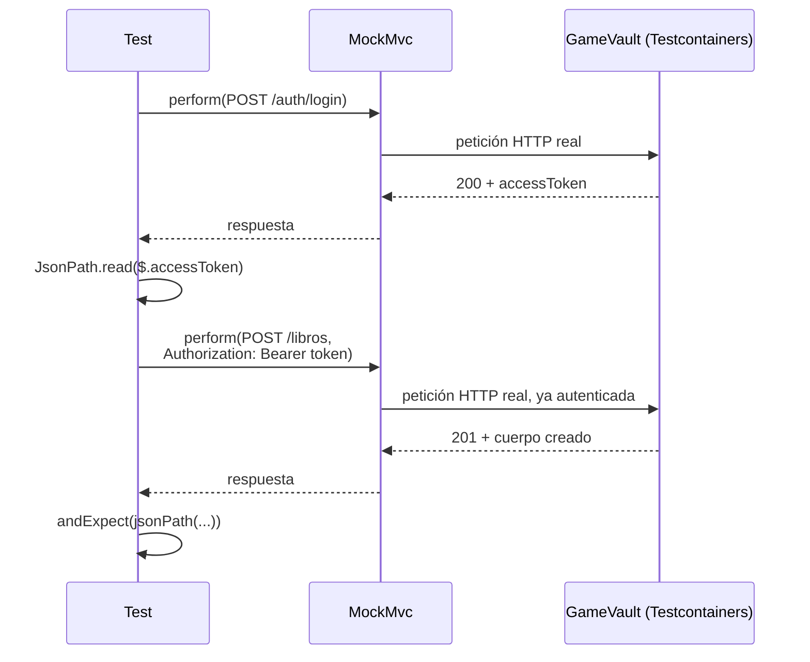
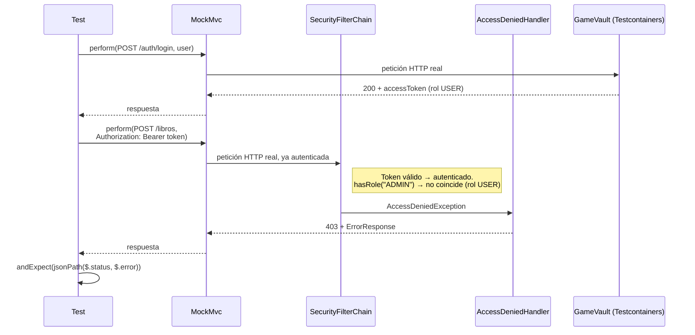

<a id="bd-orientadas-a-objetos"></a>

# 🧩 3. Bases de datos orientadas a objetos, pruebas y documentación

Este apartado tiene dos partes bien diferenciadas: primero un bloque teórico sobre una categoría de bases de datos que no vas a usar en las prácticas —lo ves de forma conceptual, sin instalar ni configurar nada—, y después las pruebas que dan por buenas todas las piezas construidas hasta ahora.

---

## 🧊 Bases de datos orientadas a objetos puras

!!! info "Idea clave"
    Una base de datos orientada a objetos **pura** persiste los objetos tal cual, con su identidad y sus referencias intactas, sin traducirlos a filas y columnas ni siquiera parcialmente. Es un paso más allá de lo objeto-relacional que has trabajado con JSONB: allí, una columna de una tabla normal contenía un objeto JSON, pero seguía siendo una tabla con filas. Aquí no hay tablas en absoluto — el propio motor entiende y almacena objetos directamente.

Con los tres modelos ya vistos —el relacional puro del Tema 1, el objeto-relacional con JSONB de este mismo tema, y este último— conviene verlos uno junto a otro:

| | Relacional (Tema 1) | Objeto-relacional con JSONB (este tema) | Orientada a objetos pura |
|---|---|---|---|
| ¿Cómo se guarda un objeto? | Traducido a filas y columnas | Filas y columnas, con una columna JSON dentro | Tal cual, con su identidad y sus referencias intactas |
| ¿Hace falta un ORM? | Sí | Sí | No — el motor ya entiende objetos de forma nativa |
| Lenguaje de consulta | SQL | SQL (+ funciones JSONB, como `jsonb_exists`) | OQL |
| Adopción real | Muy extendido | Extendido (PostgreSQL, MySQL...) | Nicho — casi ningún proyecto nuevo lo elige hoy |

Esa última fila resume la desventaja real de este modelo: menos documentación, menos gente con experiencia a la que preguntar, y el riesgo de quedarte atado a un gestor que puede dejar de mantenerse — por eso casi nadie elige hoy una BD orientada a objetos pura para un proyecto nuevo.

Como consecuencia directa de no traducir nada a tablas, **no hace falta un ORM**: un ORM (Tema 1) existe precisamente para hacer de puente entre el mundo de objetos de tu programa y el mundo de tablas de una base de datos relacional, y aquí ese puente sobra. El lenguaje de consulta asociado a este modelo se llama **OQL** (*Object Query Language*) — a diferencia de JPQL (Tema 1), que opera sobre entidades y propiedades pero sigue traduciéndose a SQL relacional por debajo, OQL consulta directamente sobre el modelo de objetos nativo del motor, sin esa traducción intermedia.

!!! note "Algunos gestores, solo como referencia"
    **db4o**, **ObjectDB**, **Versant** — los mencionas aquí solo para saber que existen; no vas a instalar ninguno, este bloque es puramente conceptual.

---

## 🧪 Pruebas y documentación

De vuelta al código: cómo se prueba y documenta lo construido en este tema.

### Test de capa (controller, y más adelante service)

Ya conoces el test de **controller**, del Tema 1 de PSP (aunque aquí es Acceso a Datos, la idea es la misma): con MockMvc, mockeando el service, prueba solo la capa HTTP — y aplica igual cuando la entidad lleva una columna JSONB, como aquí. Existe también el test de **service**, que aísla la lógica de negocio mockeando el repositorio en su lugar — pero ese lo construyes más adelante, en la Actividad 4.1 de este mismo módulo; no hace falta todavía.

### Test de integración real (con Testcontainers)

Los dos tests de arriba tienen algo en común: ninguno toca una base de datos de verdad, todo lo que hay debajo está mockeado. **Testcontainers** es la librería que resuelve ese hueco — levanta contenedores Docker reales (una base de datos, una cola de mensajes, lo que haga falta) solo para la duración del test, y los destruye al terminar, sin dejar nada instalado en tu máquina ni depender de ningún servicio externo compartido. No viene incluida en ningún starter que ya tengas — es la primera vez que aparece en el curso, así que hace falta añadirla.

Y aquí aparece algo que no habías necesitado hasta ahora: cada `<dependency>` que has añadido en todo el curso ha resuelto su versión sola, porque `spring-boot-starter-parent` (tu `<parent>`, desde la Actividad 1.1) ya sabe qué versión de cada pieza de Spring es compatible con tu proyecto. `org.testcontainers:junit-jupiter` y `org.testcontainers:postgresql`, en cambio, no son de Spring — son del propio proyecto Testcontainers, y ese `<parent>` no sabe nada de ellos. Sin ayuda, Maven falla con `'dependencies.dependency.version' ... is missing` antes de compilar nada.

!!! info "Idea clave: qué es un BOM"
    Un **BOM** (*Bill of Materials*, "lista de materiales") es un POM especial que no añade ningún código a tu proyecto — solo fija qué versión usar para un conjunto de artefactos que se saben compatibles entre sí. Es exactamente lo mismo que ya hace `spring-boot-starter-parent` para todo lo de Spring; aquí lo añades tú mismo, explícitamente, para lo de Testcontainers. Se declara en `<dependencyManagement>`, no en `<dependencies>`: `<dependencyManagement>` fija qué versión usar **si** algo la pide, sin añadir nada todavía a tu build; `<dependencies>` es lo que de verdad mete un artefacto en tu proyecto.

Va junto al `<parent>`, no dentro del bloque de dependencias habitual:

```xml
<properties>
    <testcontainers.version>1.20.4</testcontainers.version>
</properties>

<dependencyManagement>
    <dependencies>
        <dependency>
            <groupId>org.testcontainers</groupId>
            <artifactId>testcontainers-bom</artifactId>
            <version>${testcontainers.version}</version>
            <type>pom</type>
            <scope>import</scope>
        </dependency>
    </dependencies>
</dependencyManagement>
```

Ahora sí, las tres dependencias de siempre, dentro de tu `<dependencies>` habitual — con el BOM ya importado, ninguna necesita `<version>` propia:

```xml
<dependency>
    <groupId>org.springframework.boot</groupId>
    <artifactId>spring-boot-testcontainers</artifactId>
    <scope>test</scope>
</dependency>
<dependency>
    <groupId>org.testcontainers</groupId>
    <artifactId>junit-jupiter</artifactId>
    <scope>test</scope>
</dependency>
<dependency>
    <groupId>org.testcontainers</groupId>
    <artifactId>postgresql</artifactId>
    <scope>test</scope>
</dependency>
```

Esto también deja el terreno preparado para el resto del curso: cuando más adelante añadas otros contenedores de Testcontainers (MongoDB, RabbitMQ...), ninguno va a necesitar tampoco su propia `<version>` — todos quedan cubiertos por este mismo BOM, ya importado una sola vez.

!!! tip "Por qué esto funciona dentro de tu Dev Container"
    Testcontainers necesita arrancar contenedores de verdad — y tu proyecto entero corre dentro de un contenedor (`app`) desde la Actividad 1.1. Funciona porque, ya desde entonces, has montado el socket de Docker del host dentro de `app` y has añadido la *feature* `docker-outside-of-docker`: tu contenedor puede pedirle contenedores nuevos al mismo Docker que usa tu sistema operativo, sin necesitar un Docker propio dentro del Docker.

!!! warning "`Connection refused` al conectar con Ryuk"
    Testcontainers levanta, además de tu PostgreSQL de test, un contenedor auxiliar llamado **Ryuk** que limpia automáticamente los contenedores al terminar. Ryuk arranca como contenedor hermano en la red del host, y tu `app` no siempre puede alcanzarlo por red desde su propia red aislada — el síntoma es un `Connection refused` hacia una IP tipo `172.17.0.1`, antes incluso de llegar a tu primer test. La solución es desactivar Ryuk en este escenario (contenedor con acceso al Docker del host, no un Docker propio): añade a `.devcontainer/docker-compose.yml`, en el servicio `app`:
    ```yaml
    environment:
      - TESTCONTAINERS_RYUK_DISABLED=true
    ```
    y reconstruye el contenedor (**"Dev Containers: Rebuild Container"**). Sin Ryuk, Testcontainers sigue limpiando los contenedores al final de cada ejecución normal de la JVM — solo pierdes la limpieza extra ante una caída abrupta, algo asumible en desarrollo.

Con las dependencias ya resueltas, así queda la clase de test en sí:

```java
@SpringBootTest
@AutoConfigureMockMvc
@ActiveProfiles("test")
@Testcontainers
class LibreriaApiTest {

    @Container
    @ServiceConnection
    static PostgreSQLContainer<?> postgres = new PostgreSQLContainer<>("postgres:16-alpine");

    @Autowired
    private MockMvc mockMvc;

    // ...
}
```

`@Testcontainers` + `@Container` levantan un **PostgreSQL real** dentro de un contenedor Docker, solo para la duración del test — no una base de datos en memoria, no un mock. `@ServiceConnection` conecta automáticamente ese contenedor a tu aplicación de test, sin que configures manualmente la URL de conexión. `@ActiveProfiles("test")` activa un perfil propio, distinto del `dev` de siempre — así puedes usar `ddl-auto: create-drop` (cada ejecución parte de una base de datos limpia) sin tocar la configuración con la que trabajas a diario.

!!! warning "La anotación sola no basta: el perfil `test` tiene que existir"
    `@ActiveProfiles("test")` le dice a Spring qué perfil activar, pero no crea nada por sí sola — igual que te pasó con `dev` al depurar `GamevaultApplicationTests` (PSP, Actividad 1.3). Y aquí hay tres propiedades que, sin valor, impiden arrancar del todo: `@Value("${gamevault.admin.password}")` (el `ApplicationRunner` que siembra el `admin`), `@Value("${gamevault.jwt.secret}")` (los beans `JwtEncoder`/`JwtDecoder`) y `@Value("${gamevault.jwt.expiration-minutes}")` (`JwtService`, para construir cualquier token) — ninguna de las tres lleva un valor por defecto, así que sin ellas el contexto ni siquiera llega a levantarse, y ningún test de la clase se ejecuta. `spring.datasource` no hace falta escribirlo: eso ya lo resuelve `@ServiceConnection` en tiempo de ejecución. Crea `src/test/resources/application-test.yml`:
    ```yaml
    spring:
      config:
        activate:
          on-profile: test
      jpa:
        hibernate:
          ddl-auto: create-drop
        show-sql: true

    gamevault:
      admin:
        password: admintest123
      jwt:
        secret: un-secreto-de-test-de-al-menos-32-caracteres-largo
        expiration-minutes: 60
    ```
    La contraseña que pongas aquí tiene que ser exactamente la misma que envíe `loginComoAdmin()` en su petición de login, más abajo — los dos viven dentro del mismo mundo de test, aislado del perfil `dev` (que ni siquiera se carga con `@ActiveProfiles("test")` activo). De ahí el nombre `admintest123`: dice de un vistazo que es una credencial solo de test, sin que tengas que recordar que no tiene relación con la de `dev`. El valor de `expiration-minutes`, en cambio, no importa para el test — `60` (el mismo de `dev`) sirve igual que cualquier otro.
    Este fichero sí se sube a Git, a diferencia de `application-dev-local.yml`: las credenciales que lleva dentro no son reales, solo existen dentro del contenedor Postgres desechable que Testcontainers destruye al terminar el test — no hay nada que proteger.

¿Por qué esto da más confianza que mockear el repositorio? Porque prueba el mapeo JSONB **real** contra un PostgreSQL **real** — una base de datos en memoria genérica (como H2) podría no soportar `jsonb_exists` exactamente igual, o ni siquiera soportar el tipo `jsonb` de PostgreSQL. Un test con Testcontainers detectaría un error de mapeo que un test con mocks jamás vería, porque el mock nunca ejecuta SQL de verdad contra ningún motor.

### Peticiones autenticadas dentro del test

Si tu API tiene rutas protegidas —y a estas alturas del curso ya las tiene, con roles y todo—, un test de integración real tiene que pasar por la misma autenticación que pasaría un cliente cualquiera: no hay ningún atajo que salte la seguridad "porque es un test". `MockMvc` hace la petición de login exactamente igual que la haría un cliente HTTP real, y `JsonPath` (la misma clase que ya usas dentro de `jsonPath(...)` para comprobar respuestas) sirve también para **leer** un valor de una respuesta, no solo para compararlo. Son dos peticiones separadas, una detrás de otra, dentro del mismo método de test:



Así se traduce a código: primero el ayudante que hace login y devuelve el token, después el test que lo usa:

```java
private String loginComoAdmin() throws Exception {
    String respuesta = mockMvc.perform(post("/api/v1/auth/login")
                    .contentType(MediaType.APPLICATION_JSON)
                    .content("""
                            {
                              "username": "admin",
                              "password": "admintest123"
                            }
                            """))
            .andExpect(status().isOk())
            .andReturn()
            .getResponse()
            .getContentAsString();

    return JsonPath.read(respuesta, "$.accessToken");
}

@Test
void crearLibro_DebeGuardarDetallesEdicion_CuandoEsValido() throws Exception {
    String adminToken = loginComoAdmin();

    mockMvc.perform(post("/api/v1/libros")
                    .header("Authorization", "Bearer " + adminToken)
                    .contentType(MediaType.APPLICATION_JSON)
                    .content("""
                            {
                              "titulo": "Rayuela",
                              "detallesEdicion": {"editorial": "Sudamericana", "paginas": 634}
                            }
                            """))
            .andExpect(status().isCreated())
            .andExpect(jsonPath("$.titulo").value("Rayuela"))
            .andExpect(jsonPath("$.detallesEdicion.editorial").value("Sudamericana"));
}
```

`loginComoAdmin()` no lleva `@Test`: es un método ayudante, no un test en sí mismo, que cualquier otro test de la clase puede llamar cuando necesite un token válido (necesita `import com.jayway.jsonpath.JsonPath;`, ya incluida en `spring-boot-starter-test`). El test de arriba es un `POST` normal con la cabecera `Authorization` añadida, y sus aserciones finales no se quedan en el código de estado: comprueban también el cuerpo devuelto campo a campo con `jsonPath`, incluida la parte anidada dentro del propio JSONB (`detallesEdicion.editorial`) — confirmando que el objeto estructurado se ha guardado y se ha devuelto tal cual, no solo que "algo" se ha creado.

### Comprobar también los casos de error

Un test de integración que solo prueba el camino feliz deja fuera la mitad del comportamiento real de tu API: qué pasa cuando la petición **no** debería tener éxito. Con tu `GlobalExceptionHandler` ya construido (PSP, Tema 2), cada error tiene un formato consistente — y ese formato también se comprueba con `jsonPath`, campo a campo, igual que un cuerpo de éxito. Aquí la petición sí está autenticada —el token de `user` es válido—, pero no autorizada, así que ni siquiera llega a tu controller:



El test que reproduce ese flujo, con las aserciones sobre el cuerpo del error:

```java
@Test
void crearLibro_DebeDevolver403_CuandoElUsuarioNoEsAdmin() throws Exception {
    String userToken = loginComoUsuario(); // igual que loginComoAdmin(), con credenciales sin rol ADMIN

    mockMvc.perform(post("/api/v1/libros")
                    .header("Authorization", "Bearer " + userToken)
                    .contentType(MediaType.APPLICATION_JSON)
                    .content("""
                            {
                              "titulo": "Rayuela",
                              "detallesEdicion": {"editorial": "Sudamericana", "paginas": 634}
                            }
                            """))
            .andExpect(status().isForbidden())
            .andExpect(jsonPath("$.status").value(403))
            .andExpect(jsonPath("$.error").value("No autorizado"));
}
```

No es casualidad que este test compruebe el cuerpo del error, no solo el código `403`: dos errores distintos pueden compartir el mismo código de estado, y solo el cuerpo —con tu propio `ErrorResponse`, no el genérico de Spring— dice cuál de los dos ha ocurrido de verdad. Quedarte solo con `status().isForbidden()` dejaría pasar una regresión real: por ejemplo, que el `403` siga llegando pero con el formato por defecto de Spring Security en vez del tuyo, porque alguien ha desconectado sin querer tu `AccessDeniedHandler`.

!!! tip "Qué comprobar en un test de integración, en general"
    Tres cosas, casi siempre: el código de estado (`status()`), la forma del cuerpo cuando lo hay (`jsonPath` sobre los campos que de verdad importan, no todos), y —cuando la petición debía cambiar algo— que ese cambio ha persistido de verdad, con una segunda petición (normalmente un `GET`) que lo confirme. Un test así, con un nombre que dice exactamente qué caso cubre (`crearLibro_DebeDevolver403_CuandoElUsuarioNoEsAdmin`), documenta ese comportamiento mejor que un README aparte — y a diferencia de un README, no puede quedarse desactualizado sin que te enteres: si el comportamiento cambia, el test falla.

---

## ✅ Ideas clave

??? tip "Abrir resumen"

    - Una BD orientada a objetos **pura** persiste objetos tal cual, sin traducirlos a filas/columnas — por eso no necesita ORM.
    - **OQL** consulta directamente sobre el modelo de objetos nativo, sin traducción a SQL relacional (a diferencia de JPQL).
    - Comparado con relacional puro y objeto-relacional (JSONB), lo orientado a objetos puro tiene poquísima adopción real — la razón de que este bloque sea conceptual y no práctico.
    - Un test de **controller** (ya conocido, PSP Tema 1) prueba la capa HTTP mockeando el service; un test de **service** hace lo análogo mockeando el repositorio, pero eso llega en la Actividad 4.1; un test de **integración** con Testcontainers levanta un motor real en Docker.
    - Testcontainers detecta errores de mapeo real (como con `jsonb`) que un mock nunca podría detectar.
    - Contra rutas protegidas, el test hace login de verdad con `MockMvc` y extrae el token con `JsonPath`, igual que haría un cliente real — no hay atajo que salte la seguridad "por ser un test".
    - Los casos de error también se comprueban con `jsonPath`, campo a campo del `ErrorResponse` — no basta con el código de estado, porque dos errores distintos pueden compartir el mismo.
    - Un test bien nombrado, con esas tres comprobaciones, documenta el comportamiento mejor que un README aparte — y no se queda desactualizado sin avisar: si el comportamiento cambia, el test falla.
