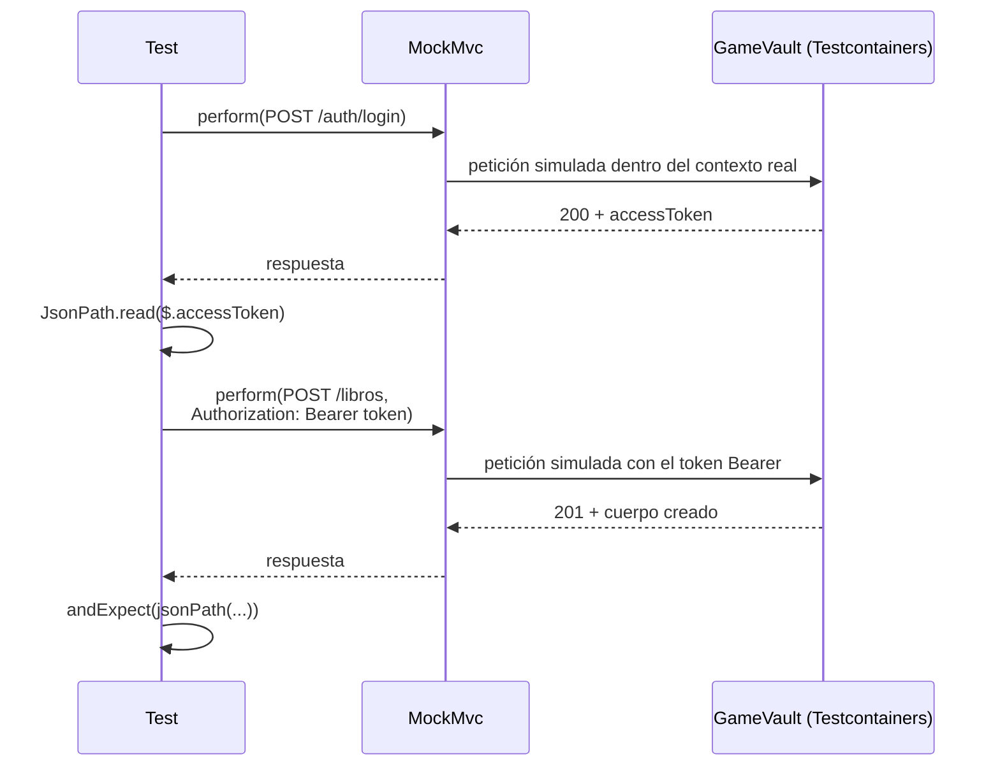
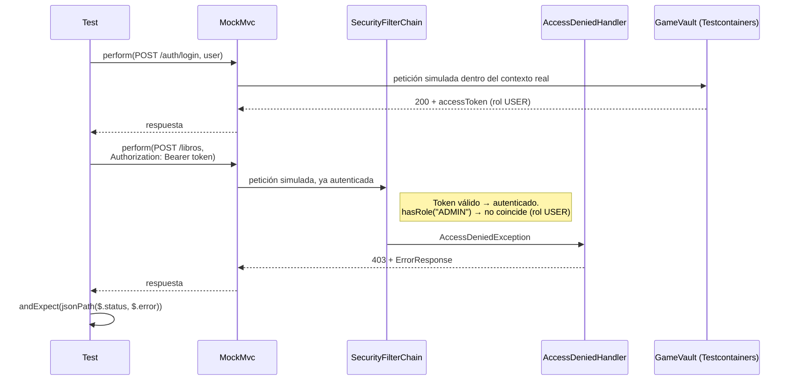

<a id="bd-orientadas-a-objetos"></a>

# 🧩 3. Bases de datos orientadas a objetos, pruebas y documentación

{ type=application/pdf style="width:100%;min-height:80vh" }

!!!info "Descarga de diapositivas"
    [Descarga las diapositivas](diapositivas/bd-orientadas-a-objetos.pptx){target="_blank" rel="noopener"}

---

Este apartado tiene dos partes bien diferenciadas: primero un bloque teórico sobre una categoría de bases de datos que no vas a usar en las prácticas —lo ves de forma conceptual, sin instalar ni configurar nada—, y después las pruebas que dan por buenas todas las piezas construidas hasta ahora.

---

## 🧊 Bases de datos orientadas a objetos puras

!!! info "Idea clave"
    Una base de datos orientada a objetos almacena directamente el estado de los objetos, su identidad y las relaciones que mantienen entre ellos, sin descomponerlos previamente en el modelo relacional de filas, columnas y claves foráneas.

    Esto no significa que copie literalmente un objeto Java tal como existe en la memoria del programa. El gestor utiliza su propia representación interna, pero su modelo lógico se basa en objetos y referencias, no en tablas relacionales.

Con los tres modelos ya vistos —el relacional puro del Tema 1, el objeto-relacional con JSONB de este mismo tema, y este último— conviene verlos uno junto a otro:

| | Relacional (Tema 1) | Objeto-relacional con JSONB (este tema) | Orientada a objetos |
|---|---|---|---|
| **Modelo de almacenamiento** | Tablas, filas, columnas y relaciones | Modelo relacional, con tipos avanzados como `jsonb` | Objetos, identidades y referencias |
| **Acceso desde Java** | JDBC directamente o mediante un ORM como Hibernate | SQL/JDBC o, como en este curso, Hibernate | API específica del gestor o estándares orientados a objetos |
| **Lenguaje de consulta** | SQL | SQL y operadores o funciones JSONB | Depende del gestor: OQL, JPQL, JDOQL o APIs propias |
| **Adopción** | Muy extendida | Muy extendida en gestores como PostgreSQL | Mucho menos habitual |

Esa última fila resume la desventaja real de este modelo: menos documentación, menos gente con experiencia a la que preguntar, y el riesgo de quedarte atado a un gestor que puede dejar de mantenerse — por eso casi nadie elige hoy una BD orientada a objetos pura para un proyecto nuevo.

Al no existir la separación entre objetos y tablas relacionales, no hace falta un **ORM objeto-relacional** como Hibernate. Sigue siendo necesaria una API o un controlador que permita al programa comunicarse con el gestor, pero ya no tiene que traducir entidades a filas y claves foráneas.

**OQL** (*Object Query Language*) es uno de los lenguajes asociados históricamente a este modelo, pero no es una opción universal. Cada gestor puede ofrecer lenguajes y APIs diferentes. Algunos utilizan OQL; otros, como ObjectDB, permiten consultar directamente mediante JPQL o JDOQL sin traducir después la consulta a SQL.

!!! note "Algunos gestores, solo como referencia"
    **db4o**, **ObjectDB** y **Versant** son ejemplos representativos —algunos principalmente históricos— de este tipo de bases de datos. No todos utilizan el mismo lenguaje de consulta ni ofrecen las mismas APIs. No vas a instalar ninguno: este bloque es puramente conceptual.

---

## 🧪 Pruebas y documentación

De vuelta al código: cómo se prueba y documenta lo construido en este tema.

### Test de capa (controller, y más adelante service)

Ya conoces el test de **controller**, del Tema 1 de PSP (aunque aquí es Acceso a Datos, la idea es la misma): con MockMvc, mockeando el service, prueba solo la capa HTTP — y aplica igual cuando la entidad lleva una columna JSONB, como aquí. Existe también el test de **service**, que aísla la lógica de negocio mockeando el repositorio en su lugar — pero ese lo construyes más adelante, en la Actividad 4.1 de este mismo módulo; no hace falta todavía.

### Test de integración real (con Testcontainers)

Los dos tests de arriba tienen algo en común: ninguno toca una base de datos de verdad, todo lo que hay debajo está mockeado. **Testcontainers** es la librería que resuelve ese hueco — levanta contenedores Docker reales (una base de datos, una cola de mensajes, lo que haga falta) solo para la duración del test, y los destruye al terminar, sin dejar nada instalado en tu máquina ni depender de ningún servicio externo compartido. No viene incluida en ningún starter que ya tengas — es la primera vez que aparece en el curso, así que hace falta añadirla.

`spring-boot-starter-parent` gestiona también versiones de numerosas dependencias externas, entre ellas Testcontainers. Sin embargo, en este curso se fija expresamente **Testcontainers 1.20.4**, porque los módulos y los imports utilizados en las actividades corresponden a la línea 1.x.

Testcontainers 2 cambió los nombres de sus módulos y trasladó varias clases a paquetes nuevos. Por tanto, utilizar directamente la versión actual gestionada por Spring Boot no sería un cambio transparente: también habría que adaptar las coordenadas Maven y algunos imports. El BOM explícito mantiene todos los ejemplos del tema en una versión común y compatible, sin realizar ahora esa migración.

!!! info "Idea clave: qué es un BOM"
    Un **BOM** (*Bill of Materials*, "lista de materiales") es un POM especial que coordina las versiones de un conjunto de artefactos compatibles, pero no añade por sí mismo esas librerías al proyecto.

    `spring-boot-starter-parent` ya incorpora su propia gestión de dependencias. Al importar el BOM de Testcontainers 1.20.4, este proyecto fija explícitamente la versión de todos sus módulos y permite mantener las coordenadas e imports utilizados en las actividades.

Va junto al `<parent>`, no dentro del bloque de dependencias habitual:

```xml
<properties>
    <testcontainers.version>1.20.4</testcontainers.version>
</properties>

<dependencyManagement>
    <dependencies>
        <dependency>
            <groupId>org.testcontainers</groupId>
            <artifactId>testcontainers-bom</artifactId>
            <version>${testcontainers.version}</version>
            <type>pom</type>
            <scope>import</scope>
        </dependency>
    </dependencies>
</dependencyManagement>
```

Con el BOM explícito ya importado, las dependencias de Testcontainers utilizan la versión coordinada que has fijado y no necesitan declarar una `<version>` individual:

```xml
<dependency>
    <groupId>org.springframework.boot</groupId>
    <artifactId>spring-boot-testcontainers</artifactId>
    <scope>test</scope>
</dependency>
<dependency>
    <groupId>org.testcontainers</groupId>
    <artifactId>junit-jupiter</artifactId>
    <scope>test</scope>
</dependency>
<dependency>
    <groupId>org.testcontainers</groupId>
    <artifactId>postgresql</artifactId>
    <scope>test</scope>
</dependency>
```

Esto también deja el terreno preparado para el resto del curso: cuando más adelante añadas otros contenedores de Testcontainers (MongoDB, RabbitMQ...), ninguno va a necesitar tampoco su propia `<version>` — todos quedan cubiertos por este mismo BOM, ya importado una sola vez.

!!! tip "Por qué esto funciona dentro de tu Dev Container"
    Testcontainers necesita arrancar contenedores de verdad — y tu proyecto entero corre dentro de un contenedor (`app`) desde la Actividad 1.1. Funciona porque, ya desde entonces, has montado el socket de Docker del host dentro de `app` y has añadido la *feature* `docker-outside-of-docker`: tu contenedor puede pedirle contenedores nuevos al mismo Docker que usa tu sistema operativo, sin necesitar un Docker propio dentro del Docker.

Esa misma idea —tu JVM, dentro de `app`, pidiéndole contenedores al Docker del *host*, no a uno propio— es justo lo que puede fallar de dos maneras distintas, cada una en un momento distinto del proceso. Primero, antes de nada: ¿tiene tu JVM permiso siquiera para *hablar* con ese Docker? Y si lo tiene: una vez que Docker crea un contenedor nuevo (Ryuk, tu Postgres de test...), ¿puede tu JVM *alcanzarlo por red* desde dentro de `app`? Ninguno de los dos es un fallo en tu código — son fricciones conocidas de mezclar Docker Desktop con un Dev Container que monta el socket del host, y las dos tienen arreglo fijo:

!!! warning "Primer fallo posible: `Permission denied` al conectar con `/var/run/docker.sock`"
    Este es el de "ni siquiera puede hablar con Docker": un `java.io.IOException` / `Permission denied` sobre el propio socket, antes de llegar a crear ningún contenedor. En Docker Desktop (a diferencia de un Docker nativo en Linux), ese socket pertenece al grupo `root`, no a un grupo `docker` — y la *feature* `docker-outside-of-docker` no puede añadirte automáticamente a `root` por seguridad, así que el usuario del contenedor se queda sin permiso para usarlo. La solución es forzar los permisos del socket cada vez que arranca el contenedor: añade a `devcontainer.json` (no a `docker-compose.yml`, esto es una clave propia de `devcontainer.json`):
    ```json
    "postStartCommand": "sudo chmod 666 /var/run/docker.sock || true"
    ```
    El `|| true` evita que el propio arranque del contenedor falle si el comando no puede ejecutarse por algún motivo. Tras añadirlo, reconstruye el contenedor — a partir de ahí se aplica solo, en cada arranque, sin que tengas que repetirlo a mano.

!!! warning "Segundo fallo posible: `Connection refused` al conectar con Ryuk (o con tu propio contenedor de Postgres)"
    Este es el de "habla con Docker, pero no alcanza lo que Docker acaba de crear". Testcontainers levanta, además de tu PostgreSQL de test, un contenedor auxiliar llamado **Ryuk** que limpia automáticamente los contenedores al terminar — y tanto Ryuk como tu propio Postgres de test arrancan como contenedores hermanos en la red del *host*, no en la de `app`. Tu `app` no siempre puede alcanzarlos por red desde su propia red aislada: el síntoma es un `Connection refused` hacia una IP tipo `172.17.0.1`, ya sea al arrancar (Ryuk) o al intentar la primera conexión JDBC (tu Postgres de test). La solución es indicarle a Testcontainers una dirección que `app` sí pueda alcanzar: añade a `.devcontainer/docker-compose.yml`, en el servicio `app`:
    ```yaml
    environment:
      - TESTCONTAINERS_HOST_OVERRIDE=host.docker.internal
    ```
    y reconstruye el contenedor (**"Dev Containers: Rebuild Container"**). `host.docker.internal` es el nombre especial que Docker Desktop sí resuelve correctamente desde cualquier contenedor hacia los puertos publicados — con esto, tanto Ryuk como el resto de contenedores que levante Testcontainers (tu PostgreSQL de test incluido) quedan alcanzables.

Con las dependencias ya resueltas, así queda la clase de test en sí:

```java
@SpringBootTest
@AutoConfigureMockMvc
@ActiveProfiles("test")
@Testcontainers
class LibreriaApiTest {

    @Container
    @ServiceConnection
    static PostgreSQLContainer<?> postgres = new PostgreSQLContainer<>("postgres:16-alpine");

    @Autowired
    private MockMvc mockMvc;

    // ...
}
```

`@Testcontainers` + `@Container` levantan un **PostgreSQL real** dentro de un contenedor Docker, solo para la duración del test — no una base de datos en memoria, no un mock. `@ServiceConnection` conecta automáticamente ese contenedor a tu aplicación de test, sin que configures manualmente la URL de conexión. `@ActiveProfiles("test")` activa un perfil propio, distinto del `dev` de siempre — así puedes usar `ddl-auto: create-drop` (cada ejecución parte de una base de datos limpia) sin tocar la configuración con la que trabajas a diario.

!!! warning "La anotación sola no basta: el perfil `test` tiene que existir"
    `@ActiveProfiles("test")` le dice a Spring qué perfil activar, pero no crea nada por sí sola — igual que te pasó con `dev` al depurar `GamevaultApplicationTests` (PSP, Actividad 1.3). Y aquí hay tres propiedades que, sin valor, impiden arrancar del todo: `@Value("${gamevault.admin.password}")` (el `ApplicationRunner` que siembra el `admin`), `@Value("${gamevault.jwt.secret}")` (los beans `JwtEncoder`/`JwtDecoder`) y `@Value("${gamevault.jwt.expiration-minutes}")` (`JwtService`, para construir cualquier token) — ninguna de las tres lleva un valor por defecto, así que sin ellas el contexto ni siquiera llega a levantarse, y ningún test de la clase se ejecuta. `spring.datasource` no hace falta escribirlo: eso ya lo resuelve `@ServiceConnection` en tiempo de ejecución. Crea `src/test/resources/application-test.yml`:
    ```yaml
    spring:
      config:
        activate:
          on-profile: test
      jpa:
        hibernate:
          ddl-auto: create-drop
        show-sql: true

    gamevault:
      admin:
        password: admintest123
      jwt:
        secret: un-secreto-de-test-de-al-menos-32-caracteres-largo
        expiration-minutes: 60
    ```
    La contraseña que pongas aquí tiene que ser exactamente la misma que envíe `loginComoAdmin()` en su petición de login, más abajo — los dos viven dentro del mismo mundo de test, aislado del perfil `dev` (que ni siquiera se carga con `@ActiveProfiles("test")` activo). De ahí el nombre `admintest123`: dice de un vistazo que es una credencial solo de test, sin que tengas que recordar que no tiene relación con la de `dev`. El valor de `expiration-minutes`, en cambio, no importa para el test — `60` (el mismo de `dev`) sirve igual que cualquier otro.
    Este fichero puede subirse a Git porque contiene valores ficticios, utilizados únicamente por el perfil `test` y por una base de datos desechable. La condición es que esas credenciales y secretos no se reutilicen nunca en `dev`, producción ni en ningún servicio persistente o compartido.

¿Por qué esto da más confianza que mockear el repositorio? Porque prueba el mapeo JSONB **real** contra un PostgreSQL **real** — una base de datos en memoria genérica (como H2) podría no soportar `jsonb_exists` exactamente igual, o ni siquiera soportar el tipo `jsonb` de PostgreSQL. Un test con Testcontainers detectaría un error de mapeo que un test con mocks jamás vería, porque el mock nunca ejecuta SQL de verdad contra ningún motor.

### Peticiones autenticadas dentro del test

Si tu API tiene rutas protegidas —y a estas alturas del curso ya las tiene, con roles y todo—, el test debe recorrer el mismo flujo de autenticación y autorización de la aplicación: no hay ningún atajo que salte la seguridad «porque es un test».

`MockMvc` no abre una conexión HTTP real ni arranca un servidor. Construye peticiones y respuestas simuladas, pero las hace pasar por el `DispatcherServlet`, la cadena de filtros de seguridad, los controllers y el resto del contexto real de Spring. Por eso puedes realizar el login, extraer el token y utilizarlo después en otra petición dentro del test.



Así se traduce a código: primero el ayudante que hace login y devuelve el token, después el test que lo usa:

```java
private String loginComoAdmin() throws Exception {
    String respuesta = mockMvc.perform(post("/api/v1/auth/login")
                    .contentType(MediaType.APPLICATION_JSON)
                    .content("""
                            {
                              "username": "admin",
                              "password": "admintest123"
                            }
                            """))
            .andExpect(status().isOk())
            .andReturn()
            .getResponse()
            .getContentAsString();

    return JsonPath.read(respuesta, "$.accessToken");
}

@Test
void crearLibro_DebeGuardarDetallesEdicion_CuandoEsValido() throws Exception {
    String adminToken = loginComoAdmin();

    mockMvc.perform(post("/api/v1/libros")
                    .header("Authorization", "Bearer " + adminToken)
                    .contentType(MediaType.APPLICATION_JSON)
                    .content("""
                            {
                              "titulo": "Rayuela",
                              "detallesEdicion": {"editorial": "Sudamericana", "paginas": 634}
                            }
                            """))
            .andExpect(status().isCreated())
            .andExpect(jsonPath("$.titulo").value("Rayuela"))
            .andExpect(jsonPath("$.detallesEdicion.editorial").value("Sudamericana"));
}
```

`loginComoAdmin()` no lleva `@Test`: es un método ayudante que cualquier otro test de la clase puede utilizar cuando necesite un token válido. Requiere `import com.jayway.jsonpath.JsonPath;`, ya incluido en `spring-boot-starter-test`.

El test ejecuta el flujo completo de creación contra un PostgreSQL real y comprueba tanto el código de estado como el cuerpo devuelto, incluida la propiedad anidada `detallesEdicion.editorial`. De esta forma se ejercitan el mapeo JSONB y la escritura en la base de datos.

Sin embargo, las aserciones mostradas solo inspeccionan la respuesta del `POST`. Para comprobar de forma independiente que el dato puede recuperarse después, haría falta una segunda petición `GET` o una consulta al repositorio, como se indica en el aviso final del apartado.

### Comprobar también los casos de error

Un test de integración que solo prueba el camino feliz deja fuera la mitad del comportamiento real de tu API: qué pasa cuando la petición **no** debería tener éxito. Con tu `GlobalExceptionHandler` ya construido (PSP, Tema 2), cada error tiene un formato consistente — y ese formato también se comprueba con `jsonPath`, campo a campo, igual que un cuerpo de éxito. Aquí la petición sí está autenticada —el token de `user` es válido—, pero no autorizada, así que ni siquiera llega a tu controller:



El test que reproduce ese flujo, con las aserciones sobre el cuerpo del error:

```java
@Test
void crearLibro_DebeDevolver403_CuandoElUsuarioNoEsAdmin() throws Exception {
    String userToken = loginComoUsuario(); // igual que loginComoAdmin(), con credenciales sin rol ADMIN

    mockMvc.perform(post("/api/v1/libros")
                    .header("Authorization", "Bearer " + userToken)
                    .contentType(MediaType.APPLICATION_JSON)
                    .content("""
                            {
                              "titulo": "Rayuela",
                              "detallesEdicion": {"editorial": "Sudamericana", "paginas": 634}
                            }
                            """))
            .andExpect(status().isForbidden())
            .andExpect(jsonPath("$.status").value(403))
            .andExpect(jsonPath("$.error").value("No autorizado"));
}
```

No es casualidad que este test compruebe el cuerpo del error, no solo el código `403`: dos errores distintos pueden compartir el mismo código de estado, y solo el cuerpo —con tu propio `ErrorResponse`, no el genérico de Spring— dice cuál de los dos ha ocurrido de verdad. Quedarte solo con `status().isForbidden()` dejaría pasar una regresión real: por ejemplo, que el `403` siga llegando pero con el formato por defecto de Spring Security en vez del tuyo, porque alguien ha desconectado sin querer tu `AccessDeniedHandler`.

!!! tip "Qué comprobar en un test de integración, en general"
    Tres cosas, casi siempre: el código de estado (`status()`), la forma del cuerpo cuando lo hay (`jsonPath` sobre los campos que de verdad importan, no todos), y —cuando la petición debía cambiar algo— que ese cambio ha persistido de verdad, con una segunda petición (normalmente un `GET`) que lo confirme. Un test así, con un nombre que dice exactamente qué caso cubre (`crearLibro_DebeDevolver403_CuandoElUsuarioNoEsAdmin`), documenta ese comportamiento mejor que un README aparte — y a diferencia de un README, no puede quedarse desactualizado sin que te enteres: si el comportamiento cambia, el test falla.

---

## ✅ Ideas clave

??? tip "Abrir resumen"

    - Una base de datos orientada a objetos almacena el estado, la identidad y las referencias de los objetos sin descomponerlos en tablas relacionales; por eso no necesita un ORM objeto-relacional, aunque sí una API para comunicarse con el gestor.
    - OQL es uno de los lenguajes asociados históricamente a este modelo, pero no es universal: cada gestor puede utilizar OQL, JPQL, JDOQL o APIs propias.
    - Comparado con relacional puro y objeto-relacional (JSONB), lo orientado a objetos puro tiene poquísima adopción real — la razón de que este bloque sea conceptual y no práctico.
    - Un test de **controller** (ya conocido, PSP Tema 1) prueba la capa HTTP mockeando el service; un test de **service** hace lo análogo mockeando el repositorio, pero eso llega en la Actividad 4.1; un test de **integración** con Testcontainers levanta un motor real en Docker.
    - Testcontainers detecta errores de mapeo real (como con `jsonb`) que un mock nunca podría detectar.
    - Contra rutas protegidas, MockMvc reproduce el flujo real de login, filtros y autorización y extrae el token con `JsonPath`, aunque utiliza peticiones simuladas y no un servidor HTTP real.
    - Los casos de error también se comprueban con `jsonPath`, campo a campo del `ErrorResponse` — no basta con el código de estado, porque dos errores distintos pueden compartir el mismo.
    - Un test bien nombrado actúa como documentación ejecutable: si cambia alguno de los comportamientos que comprueba, el test falla. No sustituye toda la documentación escrita y solo documenta los casos que realmente cubre.
