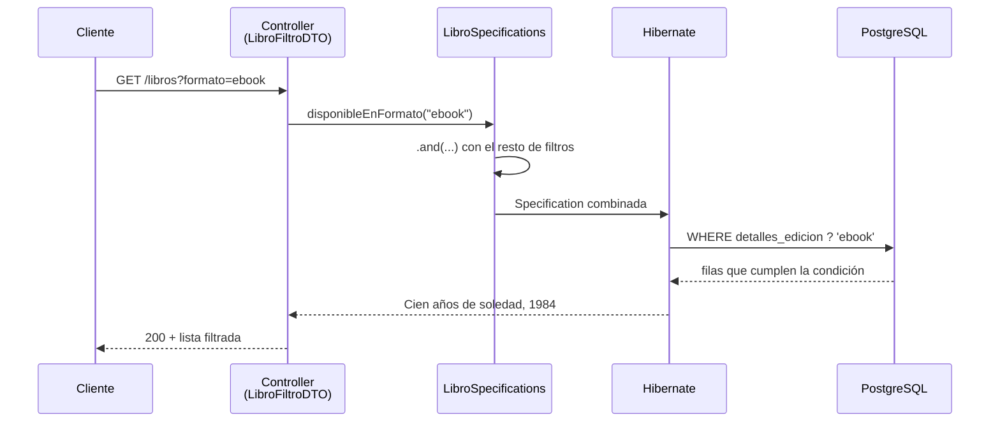

<a id="consultas-jsonb"></a>

# 🧩 2. Consultas sobre columnas JSONB

Ya sabes guardar objetos estructurados en una columna JSONB. El siguiente paso: filtrar por su contenido — algo que una condición `WHERE` normal no sabe hacer, porque ya no compara una columna, sino una **clave dentro de un objeto**.

---

## 🔍 El problema: consultar dentro de un JSON

Con una columna normal, un `WHERE` compara el valor completo de esa columna. Con JSONB, lo que quieres comprobar no es la columna entera, sino si existe (o qué vale) una clave concreta dentro del objeto que esa columna contiene. PostgreSQL ofrece operadores y funciones específicas para esto:

```sql
-- ¿Existe la clave "ebook" de primer nivel en el JSON?
SELECT * FROM libro WHERE jsonb_exists(detalles_edicion, 'ebook');
-- equivalente con el operador ?
SELECT * FROM libro WHERE detalles_edicion ? 'ebook';

-- Extraer el valor de una clave
SELECT detalles_edicion -> 'ebook' FROM libro;       -- como JSON
SELECT detalles_edicion ->> 'ebook' FROM libro;      -- como texto
```

| Operador / función | Qué hace | Devuelve |
|---|---|---|
| `jsonb_exists(columna, clave)` / `columna ? 'clave'` | Comprueba si existe una clave de primer nivel — sin importar su valor | `boolean` |
| `columna -> 'clave'` | Extrae el valor de una clave, manteniéndolo como JSON (útil si vas a seguir navegando dentro) | `jsonb` |
| `columna ->> 'clave'` | Extrae el valor de una clave como texto plano | `text` |

Fíjate en que esto es SQL puro, directamente contra PostgreSQL — antes de verlo envuelto en Java, conviene tenerlo claro a este nivel.

!!! tip "El índice GIN de la Actividad 2.1 es exactamente para esto"
    Si en la Actividad 2.1 has creado un índice GIN sobre `detalles_edicion` (`CREATE INDEX ... USING GIN (detalles_edicion)`), no era un ejercicio suelto: `jsonb_exists` y el operador `?` son precisamente las consultas que ese índice acelera. Un `WHERE detalles_edicion ? 'ebook'` sobre una tabla grande es justo el caso que pasaba de `Seq Scan` a `Bitmap Index Scan` cuando has comprobado el `EXPLAIN` antes y después de crearlo. Todo lo que veas en este apartado se beneficia de ese mismo índice, sin que tengas que hacer nada más.

---

## 📚 Un ejemplo completo: `disponibleEnFormato`

Siguiendo con la librería: un filtro opcional más en el buscador — "solo libros disponibles en ebook" (o en tapa dura, o en bolsillo). El dato que hay que comprobar vive dentro de la columna JSONB `detallesEdicion`, no en una columna con su propio tipo simple. Antes de llegar al código Java, mira qué datos hay y qué debería devolver la consulta — así, cuando aparezca el código que la construye, ya sabes qué tiene que reproducir.

### Los datos de partida

| `id` | `titulo` | `detalles_edicion` |
|---|---|---|
| 1 | Cien años de soledad | `{"tapaDura": {...}, "ebook": {"formato": "epub"}}` |
| 2 | El nombre del viento | `{"bolsillo": {...}}` |
| 3 | Rayuela | `{"tapaDura": {...}}` |
| 4 | 1984 | `{"ebook": {"formato": "mobi"}, "bolsillo": {...}}` |

Con estos cuatro libros, "solo los disponibles en ebook" debería devolver **Cien años de soledad** y **1984** —los únicos dos con la clave `"ebook"` presente en su `detalles_edicion`—, y descartar Rayuela y El nombre del viento, que no la tienen. En SQL puro, con lo que ya has visto arriba:

```sql
SELECT titulo FROM libro WHERE detalles_edicion ? 'ebook';
```

```
titulo
------------------------
Cien años de soledad
1984
```

Esa es la respuesta que tiene que dar tu API cuando alguien busque `?formato=ebook` — pero nadie escribe SQL a mano contra tu endpoint: el cliente manda un parámetro de consulta, y tu código tiene que traducirlo a la misma condición `WHERE`, encajada con el resto de filtros del buscador (título, precio...) exactamente igual que ya haces con las Specifications del Tema 1. Así queda el recorrido completo, de la petición HTTP a las dos filas de antes:



Cada paso es una pieza que ya conoces por separado — el parámetro de consulta, el DTO, la Specification, `.and(...)` — la novedad de hoy es solo el tramo Hibernate→PostgreSQL: cómo `jsonb_exists`/`?` llega a formar parte de esa traducción.

### La Specification, con `jsonb_exists` desde Criteria API

```java
public static Specification<Libro> disponibleEnFormato(String formato) {
    if (formato == null || formato.isBlank()) {
        return Specification.unrestricted();
    }

    return (root, query, criteriaBuilder) ->
            criteriaBuilder.isTrue(
                    criteriaBuilder.function(
                            "jsonb_exists",
                            Boolean.class,
                            root.get("detallesEdicion"),
                            criteriaBuilder.literal(formato)
                    )
            );
}
```

Compárala con las Specifications "normales" que ya conoces del Tema 1 (`tituloContiene`, `precioMayorOIgualA`), que usan métodos directos de `criteriaBuilder` como `like` o `greaterThanOrEqualTo` — funcionan porque operan sobre una columna con su propio tipo simple.

**Criteria API** es la API de JPA para construir consultas con objetos Java (`CriteriaBuilder`, `Root`, `Predicate`...) en vez de con SQL o JPQL escrito como texto — es justo lo que hay detrás de cada `Specification` que ya has escrito. Pero aquí no existe un método directo de Criteria API para "existe esta clave en este JSON", porque es una función **específica del motor** (PostgreSQL), no parte del estándar JPA. Por eso hace falta `criteriaBuilder.function("jsonb_exists", ...)`: es la forma de invocar una función SQL nativa arbitraria desde Criteria API, pasándole el nombre de la función, el tipo de resultado esperado (`Boolean.class`), y sus argumentos (la columna, y un literal con la clave a buscar).

Con los cuatro libros de antes, `disponibleEnFormato("ebook")` genera —por debajo, a través de Hibernate— la misma consulta que ya has visto en SQL, y devuelve la misma pareja: Cien años de soledad y 1984. La Specification no es una forma distinta de filtrar, es la misma condición `WHERE`, solo expresada en Java para que Spring Data la combine con el resto de filtros del buscador.

### Combinada con el resto, de forma transparente

```java
Specification<Libro> spec = Specification
        .where(LibroSpecifications.tituloContiene(filtro.titulo()))
        .and(LibroSpecifications.precioMayorOIgualA(filtro.precioMin()))
        .and(LibroSpecifications.disponibleEnFormato(filtro.formato()));
```

Desde el punto de vista de quien usa el repositorio, filtrar por JSONB o por una columna relacional corriente es exactamente lo mismo — una Specification más, encadenada con `.and(...)` como cualquier otra. Toda la complejidad de "esto necesita una función nativa" queda encapsulada dentro del método `disponibleEnFormato`.

### 🔬 Y si la clave que te interesa está más adentro

`jsonb_exists`/`?` solo comprueban si una clave de primer nivel **existe** — no dicen nada de lo que hay dentro de ella. Con los mismos cuatro libros de antes, "¿tiene ebook?" no es lo mismo que "¿el ebook está en formato `mobi`?": Cien años de soledad y 1984 tienen los dos la clave `ebook`, pero solo 1984 la tiene en `mobi`. Para esa pregunta más concreta hace falta bajar un nivel más:

```sql
-- Encadenando -> hasta el último nivel, y ->> para sacar el valor final como texto
SELECT titulo FROM libro WHERE detalles_edicion -> 'ebook' ->> 'formato' = 'mobi';

-- Equivalente con el operador de ruta #>>, dando la ruta completa de una vez
SELECT titulo FROM libro WHERE detalles_edicion #>> '{ebook,formato}' = 'mobi';
```

Esta vez el resultado es solo **1984** — `jsonb_exists(..., 'ebook')` no distinguiría entre los dos libros, porque nunca mira el valor de la clave, solo si está presente.

Desde Criteria API el patrón es el mismo que acabas de ver con `jsonb_exists`: otra función nativa de PostgreSQL —`jsonb_extract_path_text`, en este caso—, envuelta en `criteriaBuilder.function(...)` y comparada con `criteriaBuilder.equal(...)`:

```java
criteriaBuilder.equal(
        criteriaBuilder.function(
                "jsonb_extract_path_text",
                String.class,
                root.get("detallesEdicion"),
                criteriaBuilder.literal("ebook"),
                criteriaBuilder.literal("formato")
        ),
        "mobi"
);
```

La técnica es idéntica a la de `disponibleEnFormato`: nombre de la función nativa, tipo de retorno, argumentos — solo cambia la función y qué haces con el resultado. La construyes tú mismo en la Actividad 2.2, con tus propios datos de plataforma.

!!! warning "El índice GIN no acelera esto igual"
    El índice de la Actividad 2.1 está pensado para `?`/`jsonb_exists` (existencia de claves), no para comparaciones de un valor anidado como esta. Una consulta así, sobre una tabla grande, volvería a hacer `Seq Scan` — necesitaría un índice distinto (por ejemplo, uno de expresión sobre `(detalles_edicion -> 'ebook' ->> 'formato')`) si de verdad se usara mucho en producción. Queda fuera del alcance de este apartado, pero conviene no dar por hecho que "ya tienes un índice JSONB, así que todo va rápido" — depende de qué consulta exacta hagas.

---

## 🗄️ La alternativa: `@Query` con SQL nativo

Retoma el Tema 1: cuando JPQL no llegaba a algo —allí fueron las funciones de ventana—, la solución era `@Query(nativeQuery = true)`, SQL literal sin traducir. `jsonb_exists` y `?` son exactamente ese mismo caso: no existen en JPQL, porque JPQL solo conoce el vocabulario común de JPA, no las funciones propias de PostgreSQL.

```java
public interface LibroRepository extends JpaRepository<Libro, Long> {

    @Query(value = "SELECT * FROM libro WHERE jsonb_exists(detalles_edicion, :formato)", nativeQuery = true)
    List<Libro> buscarPorFormato(@Param("formato") String formato);
}
```

!!! warning "Usa la función, no el operador `?`, dentro de una `@Query` nativa"
    El operador `?` de JSONB choca con el `?` que JDBC usa como marcador de parámetro posicional — Hibernate lo interpretaría mal, y la consulta fallaría o se comportaría de forma inesperada. `jsonb_exists(columna, clave)` hace exactamente lo mismo que `?`, sin ese conflicto: dentro de una `@Query` nativa, usa siempre la función.

Fíjate en el tipo de retorno: a diferencia del ranking con `ROW_NUMBER()` del Tema 1 (que necesitaba `List<Object[]>`, porque añadía una columna calculada que ninguna entidad tiene), aquí `SELECT *` selecciona exactamente las columnas de `Libro` — Spring Data mapea el resultado de vuelta a `List<Libro>` sin problema, como si fuera una consulta derivada normal.

La misma alternativa nativa sirve también para la ruta anidada de antes —el ejemplo de `ebook.formato = "mobi"`—, y aquí sin ningún conflicto de por medio:

```java
@Query(value = "SELECT * FROM libro WHERE detalles_edicion -> 'ebook' ->> 'formato' = :formato", nativeQuery = true)
List<Libro> buscarPorFormatoEbook(@Param("formato") String formato);
```

`buscarPorFormatoEbook("mobi")` devuelve solo *1984*, el mismo resultado que ya has visto con `jsonb_extract_path_text` desde Criteria API. Como aquí no interviene el operador `?`, no hay ningún conflicto con el marcador de parámetro de JDBC — puedes escribir la ruta con `->`/`->>` tal cual, igual que la escribirías directamente en `psql`.

¿Y entonces, `criteriaBuilder.function(...)` o `@Query(nativeQuery = true)`? La misma pregunta que ya te has hecho en el Tema 1 entre Specifications y `@Query` con JPQL, con la misma respuesta:

| | Specification + `criteriaBuilder.function` | `@Query(nativeQuery = true)` |
|---|---|---|
| Se combina con `.and(...)` con otros filtros opcionales | Sí, de forma natural | No — es una consulta fija, con sus propios parámetros |
| Sintaxis | Más verbosa (función, tipo, argumentos) | SQL directo, más legible |
| Cuándo usarla | Un filtro más dentro de un buscador con varias condiciones opcionales | Una consulta propia y fija, pensada solo para esto |

---

## ✏️ Modificar objetos JSONB: reemplazo, no *merge*

Un `update()` que recibe un `Map` nuevo reemplaza el contenido completo de `detallesEdicion`, no combina el nuevo contenido con el anterior — como has comprobado tú mismo en la Actividad 2.1. Con "Cien años de soledad" (`{"tapaDura": {...}, "ebook": {"formato": "epub"}}`) y un `PUT` que solo manda `{"ebook": {"formato": "mobi"}}`, la diferencia entre lo que realmente pasa y lo que alguien podría esperar es esta:

| | Valor guardado antes | `PUT` manda | Valor final |
|---|---|---|---|
| **Lo que ocurre de verdad (reemplazo)** | `{tapaDura, ebook}` | `{ebook}` | `{ebook}` — `tapaDura` ha desaparecido |
| **Lo que alguien podría esperar (*merge*, y no pasa)** | `{tapaDura, ebook}` | `{ebook}` | `{tapaDura, ebook}` combinados |

```java
libro.setDetallesEdicion(dto.detallesEdicion()); // sustituye el Map entero
```

¿Por qué no existe, en Hibernate/JPA estándar, una forma directa de hacer un "merge parcial" del JSON sin traer el objeto completo primero? Porque, desde el punto de vista de Hibernate, `detallesEdicion` es un único valor de columna — igual que `titulo` o `precio`. JPA no sabe "mirar dentro" de ese valor para combinar solo una parte; trata el `Map` completo como una unidad atómica que se sustituye entera. Si quisieras un *merge* parcial de verdad, tendrías que cargar el objeto, modificar el `Map` en memoria en Java (añadiendo o quitando claves tú mismo) y luego guardar el resultado completo — la combinación ocurre en tu código, no en el ORM. Y la transacción que envuelve ese guardado no cambia en nada por tratarse de JSONB: `@Transactional` se comporta exactamente igual que sobre cualquier otra entidad, la misma anotación y el mismo comportamiento que ya conoces del Tema 1.

---

## ✅ Ideas clave

??? tip "Abrir resumen"

    - `jsonb_exists(columna, clave)` (o el operador `?`) comprueba si una clave existe en el JSON; `->`/`->>` extraen valores (como JSON o como texto).
    - El índice GIN de la Actividad 2.1 acelera exactamente estas consultas — `jsonb_exists`/`?` son el caso de uso para el que se creó.
    - Para comparar un valor anidado (no solo comprobar que una clave existe), se encadena `->`/`->>` o se usa el operador de ruta `#>>` — y ahí el índice GIN de `?` ya no ayuda igual.
    - Consultar el contenido de una columna JSONB desde Criteria API requiere `criteriaBuilder.function(...)`, porque son funciones específicas del motor, no parte del estándar JPA.
    - `@Query(nativeQuery = true)` es la alternativa cuando la consulta JSONB no necesita combinarse con otros filtros — más simple de leer, pero fija; usa `jsonb_exists(...)` en vez de `?`, que choca con el marcador de parámetro de JDBC.
    - Combinada con `.and(...)`, una Specification sobre JSONB se usa exactamente igual que una sobre una columna normal — transparente para quien consume el repositorio.
    - Actualizar un campo JSONB **reemplaza** el objeto completo — JPA no sabe hacer *merge* parcial de un valor de columna; si lo necesitas, lo haces tú en memoria antes de guardar.
    - `@Transactional` no cambia en nada por tener columnas JSONB de por medio.
