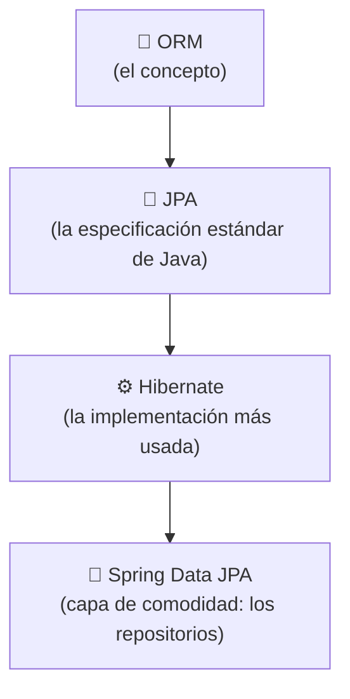
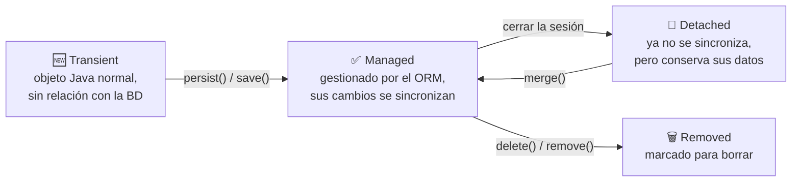

<a id="instalacion-configuracion-orm"></a>

# 🧩 1. Instalación y configuración de Hibernate

En el Tema 1 conociste el desfase objeto-relacional y aprendiste a tender el puente hacia la base de datos primero con JDBC puro, después con Spring Data JPA sin entrar en detalle. Toca ahora entender de verdad la herramienta que hace posible esa comodidad: un **ORM**.

---

## 🌉 Qué es el mapeo objeto-relacional

Recuerda el desfase objeto-relacional del Tema 1: tus clases Java y las tablas de tu base de datos representan la misma información de formas distintas. Una herramienta **ORM** (*Object-Relational Mapping*) automatiza ese puente: tú declaras, una sola vez, las reglas de correspondencia entre una clase y una tabla — y a partir de ahí, guardar, actualizar y consultar objetos se traduce automáticamente al SQL correspondiente, sin que lo escribas tú.

```java
// Con JDBC puro (Tema 1): tenías que escribir el SQL a mano
String sql = "SELECT id, nombre FROM alumno WHERE id = ?";
// ... PreparedStatement, ResultSet, mapeo manual fila a objeto ...

// Con un ORM: declaras el mapeo una vez, y esto basta
Alumno alumno = entityManager.find(Alumno.class, id);
```

Todo lo que escribías a mano en el Tema 1 — abrir conexión, preparar sentencia, recorrer `ResultSet`, mapear cada fila a un objeto — lo hace la herramienta ORM por ti, a partir de las reglas de mapeo que declaras.

---

## 🔤 El trío que siempre se confunde: ORM, JPA, Hibernate

Tres nombres que aparecen siempre juntos y no significan lo mismo:

| Nombre | Qué es |
|---|---|
| **ORM** | El concepto: mapeo objeto-relacional en general. |
| **JPA** | *Jakarta Persistence API* — la especificación estándar de Java: qué anotaciones e interfaces debe ofrecer un ORM en Java. |
| **Hibernate** | La implementación más usada de JPA — el motor real que hace el trabajo. |



Spring Data JPA, que ya usaste en el Tema 1 (`JpaRepository`), no es un ORM distinto — es una capa adicional de comodidad **por encima** de JPA/Hibernate: te genera automáticamente implementaciones de repositorios (`save`, `findById`, `findAll`...) para que ni siquiera tengas que escribir el código que usa directamente las anotaciones JPA.

---

## 📐 Clase persistente y formas de declarar el mapeo

Una **clase persistente** (o entidad) es una clase Java cuyos objetos el ORM sabe guardar y recuperar de la base de datos. Existen dos formas históricas de declarar el mapeo entre una clase y una tabla:

- **Fichero XML de mapeo**: un documento aparte que describe la correspondencia — el enfoque más antiguo, hoy considerado legado.
- **Anotaciones**: el mapeo se declara directamente sobre la propia clase (`@Entity`, `@Column`...) — el enfoque que se usa hoy en día, y el que vas a usar durante todo el curso.

---

## 🔄 Los estados de un objeto en el ORM

Un objeto gestionado por un ORM pasa por distintos estados a lo largo de su vida:



- **Transient**: un objeto Java recién creado con `new`, sin ninguna relación todavía con la base de datos — el ORM no sabe que existe.
- **Managed** (o *persistent*): el ORM lo está gestionando activamente; cualquier cambio que hagas sobre sus campos se sincroniza automáticamente con la base de datos.
- **Detached**: el objeto existió como managed, pero la sesión que lo gestionaba se ha cerrado — conserva sus datos, pero ya no se sincroniza solo.
- **Removed**: marcado para eliminarse de la base de datos.

---

## 🗄️ Hibernate en un proyecto Spring Boot

### "Instalar" Hibernate no es un paso manual

A diferencia de lo que sugiere la palabra "instalar", en un proyecto Spring Boot no descargas ni configuras Hibernate por separado: viene incluido en la dependencia que ya conoces del Tema 1.

```xml
<dependency>
    <groupId>org.springframework.boot</groupId>
    <artifactId>spring-boot-starter-data-jpa</artifactId>
</dependency>
```

`spring-boot-starter-data-jpa` trae Hibernate como implementación de JPA por defecto, además de Spring Data JPA. Con solo esa dependencia (que ya tienes en tu `pom.xml` desde la Actividad 1.1), Hibernate está "instalado y configurado" en lo esencial.

### El mapeo con anotaciones, entidad por entidad

Ya conoces `Libro` y `Editorial` del Tema 1 — ahora las lees con la óptica de "mapeo ORM" en vez de "estructura de base de datos":

```java
@Entity
@Table(name = "libro")
public class Libro {

    @Id
    @GeneratedValue(strategy = GenerationType.IDENTITY)
    private Long id;

    @Column(precision = 10, scale = 2)
    private BigDecimal precio;

    @ManyToOne(fetch = FetchType.LAZY)
    @JoinColumn(name = "editorial_id")
    private Editorial editorial;
}
```

| Anotación | Qué mapea |
|---|---|
| `@Entity` + `@Table(name = "...")` | La clase corresponde a esa tabla concreta. |
| `@Id` + `@GeneratedValue(strategy = GenerationType.IDENTITY)` | El identificador, generado por la propia base de datos (columna autoincremental). |
| `@Column(precision = 10, scale = 2)` | El tipo de columna exacto — aquí, un `numeric(10,2)`, con precisión suficiente para precios sin perder céntimos. |
| `@ManyToOne(fetch = FetchType.LAZY)` + `@JoinColumn` | La relación y la columna real de clave foránea; `LAZY` significa que `Editorial` no se carga hasta que de verdad lo pidas. |
| `@OneToMany(mappedBy = "editorial", cascade = CascadeType.ALL, orphanRemoval = true)` (en `Editorial`) | El lado inverso de la relación; `mappedBy` indica que la clave foránea real vive en `Libro`, no aquí. |

Cada una de estas anotaciones sustituye código que en el Tema 1, con JDBC puro, habrías tenido que escribir a mano: el `CREATE TABLE`, el `JOIN` en cada consulta, la conversión de tipos entre columna y campo Java.

### Configuración avanzada: cuando el mapeo no es directo

Hibernate necesita, a veces, ayuda extra para mapear tipos que no tienen una correspondencia directa con una columna estándar (como el JSON que verás en el Tema 3). Esa ayuda se declara en clases de configuración (`@Configuration`, que ya conoces del Tema 1) — no necesitas el detalle todavía; basta con saber que, cuando el mapeo automático no llega, ahí es donde se completa.

### `ddl-auto`: configuración del ORM, no del conector

Ya usaste `spring.jpa.hibernate.ddl-auto: update` en el Tema 1, pero desde el ángulo de "cómo se crea la tabla". Ahora, con la distinción clara entre conector y ORM que has visto hoy, es el momento de precisarlo: la conexión (usuario, contraseña, URL) es configuración del **conector** (Tema 1); qué hace Hibernate con las entidades que declaras (crear tablas, validarlas, no tocar nada) es configuración del **ORM** — y vive en esa misma propiedad, `ddl-auto`.

---

## 🔁 Los estados, ahora con `Libro`

Retoma el ciclo de estados de la PARTE 1 con un ejemplo concreto: un `new Libro()` recién creado en Java es **transient** — el ORM no sabe nada de él. En cuanto lo guardas (lo verás en el siguiente apartado), pasa a **managed**: mientras la operación está en curso, cualquier cambio sobre sus campos se sincroniza con la base de datos. Si la transacción termina y la sesión se cierra, ese mismo objeto pasa a **detached** — sigue teniendo sus datos, pero ya no se sincroniza solo.

---

## ✅ Ideas clave

??? tip "Abrir resumen"

    - Un **ORM** traduce automáticamente entre objetos y filas, siguiendo unas reglas de mapeo declaradas una vez.
    - **ORM** es el concepto, **JPA** la especificación estándar de Java, **Hibernate** la implementación más usada; **Spring Data JPA** añade los repositorios como capa de comodidad por encima.
    - El mapeo se declara con **anotaciones** sobre la propia entidad (el XML de mapeo es el enfoque legado).
    - Los estados de un objeto en el ORM: **transient** (sin relación con la BD) → **managed** (gestionado, se sincroniza solo) → **detached** (ya no se sincroniza) / **removed** (marcado para borrar).
    - "Instalar" Hibernate en Spring Boot es, en la práctica, añadir `spring-boot-starter-data-jpa`.
    - `ddl-auto` es configuración del **ORM** (qué hace Hibernate con tus entidades), distinta de la configuración del **conector** (cómo se conecta, vista en el Tema 1).
