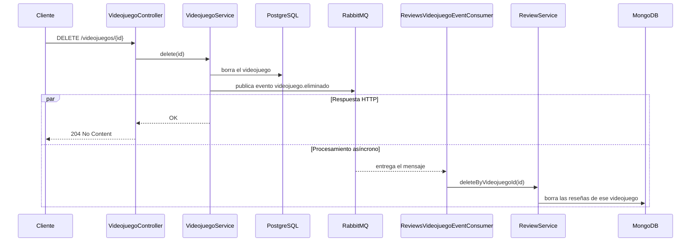
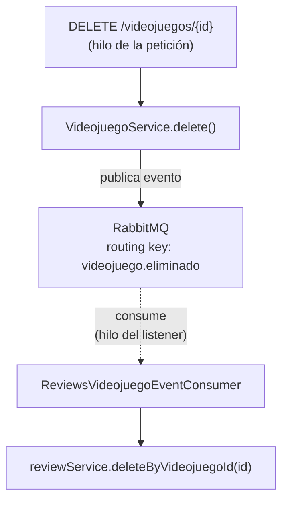

# 🧪 Actividad 3.2: Tu propia colección documental

!!! warning "Descarga la plantilla"
    📄 [Plantilla 3.2 — Tu propia colección documental](plantillas/Actividad_3_2_AD_Plantilla.docx){target="_blank" rel="noopener"}

!!! info "Práctica guiada"
    Construyes el flujo real de borrado en cascada vía eventos RabbitMQ y lo endureces frente a reintentos — esa es la mejora real de hoy.

## Qué vas a practicar

- Ampliar un exchange de mensajería ya existente con una cola nueva.
- Crear una colección explícitamente, con un validador de esquema.
- Entender y replicar un flujo de borrado en cascada entre dos motores distintos, vía eventos.
- Hacer una operación idempotente frente a mensajes duplicados.
- Escribir una consulta con `@Query`, más allá de lo que cubre el naming.
- Comparar por escrito tu experiencia con PostgreSQL y con MongoDB.

---

## El resultado esperado, de principio a fin

Antes de tocar nada, esto es lo que vas a conseguir que pase cuando termines la actividad: el `DELETE` publica un evento y, a partir de ahí, la respuesta HTTP y la limpieza de MongoDB avanzan de forma independiente.



La petición HTTP no espera a que termine la limpieza de MongoDB: tras publicar el evento, el flujo de la respuesta y el procesamiento del consumer avanzan de forma independiente. El consumer puede terminar antes o después de que el cliente reciba físicamente el `204`; lo importante es que el borrado de reseñas ya no forma parte del tiempo de respuesta de esa petición.

---

## Requisitos previos

Tu módulo `reviews` de la Actividad 3.1, y RabbitMQ funcionando con el registro de actividad del catálogo — se construye en Programación de Servicios y Procesos, Actividad 3.1. Si todavía no has llegado a esa actividad en PSP, complétala antes de seguir: hoy vas a ampliar el `RabbitMQConfig` y el `VideojuegoEventPublisher` que se construyen ahí, no a crearlos desde cero.

---

## Paso 0 — Añadir la cola de reseñas al exchange existente

Tu `RabbitMQConfig` (de PSP, Actividad 3.1) ya tiene un `TopicExchange` (`CATALOGO_EXCHANGE`) con una cola de actividad. Añade una segunda cola sobre ese mismo exchange, esta vez de interés solo para `reviews`:

```java
public static final String REVIEWS_VIDEOJUEGO_QUEUE = "reviews.videojuego.queue";

@Bean
public Queue reviewsVideojuegoQueue() {
    return new Queue(REVIEWS_VIDEOJUEGO_QUEUE);
}

@Bean
public Binding reviewsBinding(Queue reviewsVideojuegoQueue, TopicExchange catalogoExchange) {
    return BindingBuilder.bind(reviewsVideojuegoQueue).to(catalogoExchange).with("videojuego.eliminado");
}
```

A diferencia de la cola de actividad (enlazada a `videojuego.*`, todo evento), esta se enlaza solo a `videojuego.eliminado` — a `reviews` no le interesa que se cree o modifique un videojuego, solo que se borre. Es el mismo exchange sirviendo a dos consumidores con intereses distintos, sin que ninguno reciba mensajes que no necesita.

`VideojuegoEventPublisher` y el evento `VideojuegoEvent` no cambian — ya publican en `videojuego.eliminado` cada vez que `VideojuegoService.delete()` se ejecuta, así que esta cola nueva empieza a recibir mensajes en cuanto la declaras, sin tocar nada más.

---

## Paso 1 — Entender el flujo, antes de tocar nada

El borrado en cascada de reseñas sigue un flujo ya definido — no lo vas a inventar, lo vas a construir siguiendo este diseño. El viaje completo de un evento:



`VideojuegoService.delete()` (en el módulo `catalogo`) no llama directamente a nada de `reviews` — publica un evento a través de `VideojuegoEventPublisher`, y sigue su camino sin esperar, sin saber siquiera que `reviews` existe. En otro hilo, en su propio momento, un consumer nuevo —`ReviewsVideojuegoEventConsumer`, que vas a escribir en el Paso 2— recibe ese evento desde la cola que has creado en el Paso 0 y actúa: si el evento dice que un videojuego se ha eliminado, borra sus reseñas.

!!! tip "¿Por qué un broker, y no algo más ligero como el warm-up de caché de PSP?"
    Publicador y consumer viven en la misma aplicación, igual que en el warm-up de caché, pero aquí perder un aviso puede dejar reseñas huérfanas. RabbitMQ desacopla ambos trabajos y permite que el mensaje permanezca pendiente hasta que un consumer pueda procesarlo, además de soportar reintentos y posibles redeliveries.

    Aun así, PostgreSQL y RabbitMQ siguen siendo sistemas distintos: el borrado en la base de datos y la publicación del mensaje no forman una única operación atómica. En sistemas donde esa garantía fuera crítica se utilizarían patrones adicionales, como *transactional outbox*. Para esta práctica nos quedamos con el modelo sencillo de consistencia eventual.

**Fíjate**: el borrado de reseñas va a ocurrir en un hilo distinto al de la petición HTTP que originó el borrado del videojuego — el mismo patrón de "hilo del listener de RabbitMQ" que ya has analizado en PSP.

---

## Paso 2 — Replicar el consumer en tu GameVault

Aquí es donde escribes el consumer del que hablaba el Paso 1, ya con el `package` y los `import` que necesita tu proyecto:

```java
package com.tunombre.gamevault.reviews.mensajeria;

import com.tunombre.gamevault.catalogo.api.eventos.VideojuegoEvent;
import com.tunombre.gamevault.config.RabbitMQConfig;
import com.tunombre.gamevault.reviews.ReviewService;
import lombok.RequiredArgsConstructor;
import org.springframework.amqp.rabbit.annotation.RabbitListener;
import org.springframework.stereotype.Service;
import tools.jackson.databind.json.JsonMapper;

@Service
@RequiredArgsConstructor
public class ReviewsVideojuegoEventConsumer {
    private final ReviewService reviewService;
    private final JsonMapper jsonMapper;

    @RabbitListener(queues = RabbitMQConfig.REVIEWS_VIDEOJUEGO_QUEUE)
    public void recibir(String payload) {
        System.out.println("[TRAZA] Consumer ejecutándose en hilo: " + Thread.currentThread().getName());
        VideojuegoEvent event = jsonMapper.readValue(payload, VideojuegoEvent.class);
        if (VideojuegoEvent.VIDEOJUEGO_ELIMINADO.equals(event.tipo())) {
            reviewService.deleteByVideojuegoId(event.videojuegoId());
        }
    }
}
```

El `System.out.println` es temporal, solo para el Paso 4 — lo vas a usar para comparar el nombre de este hilo con el de la petición `DELETE`. Puedes quitarlo al terminar la actividad.

Es el mismo patrón de deserialización que ya tienes en `ActividadVideojuegoEventConsumer` (PSP, Actividad 3.1): un `JsonMapper` de Jackson, inyectado como bean, con `readValue` convirtiendo el `payload` (JSON en texto) de vuelta a un `VideojuegoEvent`.

Añade también `deleteByVideojuegoId` a tu `ReviewRepository` (`long deleteByVideojuegoId(Long videojuegoId);`) y, en `ReviewService`, el método que lo invoca:

```java
public long deleteByVideojuegoId(Long videojuegoId) {
    return reviewRepository.deleteByVideojuegoId(videojuegoId);
}
```

!!! warning "No repitas aquí el `existsById` de tus otros métodos"
    `findByVideojuegoId`, `create` y `getResumenByVideojuegoId` comprueban `videojuegoRepository.existsById(...)` porque los llama la API, esperando que el videojuego exista. Este método lo llama el consumer justo **después** de que el videojuego ya se ha borrado de PostgreSQL — es la razón por la que se ejecuta. Si añadieras esa misma comprobación aquí, `deleteByVideojuegoId` fallaría siempre y las reseñas nunca llegarían a limpiarse.

---

## Paso 3 — Protege tu colección con un validador

Antes de seguir trabajando con nuevos datos, cierra un hueco que arrastras desde que empezaste con `reviews`: `puntuacion` está protegida en `ReviewRequestDTO` (`@NotNull`, `@Min(1)` y `@Max(10)`), pero esa validación vive en tu código Java y cualquiera con acceso directo a Mongo puede saltársela. Vas a añadir ahora la misma protección a nivel de base de datos, antes de continuar con las pruebas.

Borra la colección `review` con los datos de prueba de la Actividad 3.1 y recréala explícitamente, esta vez con un validador:

```bash
docker exec -it <tu-contenedor-mongo> mongosh gamevault_db
```

```javascript
db.review.drop()

db.createCollection("review", {
  validator: {
    $jsonSchema: {
      required: ["videojuegoId", "autor", "puntuacion"],
      properties: {
        puntuacion: {
          bsonType: "int",
          minimum: 1,
          maximum: 10,
          description: "debe ser un número entero entre 1 y 10"
        }
      }
    }
  }
})
```

**Comprueba** que MongoDB rechaza un documento inválido, insertado directamente y sin pasar por tu API:

```javascript
db.review.insertOne({ videojuegoId: 1, autor: "test", puntuacion: 999 })
```

**Captura**: el error de validación que devuelve MongoDB.

**Pregunta de comprensión**: si `ReviewRequestDTO` ya rechaza una `puntuacion` fuera de rango con `@Min`/`@Max`, ¿qué aporta de más este validador a nivel de MongoDB? ¿En qué situación concreta llegaría a activarse, que la validación de Java nunca llegaría a ver?

---

## Paso 4 — Prueba con datos reales

Añade también una traza temporal al principio de `VideojuegoService.delete()`, igual que en el consumer, para tener con qué comparar el hilo de la petición `DELETE`:

```java
System.out.println("[TRAZA] DELETE ejecutándose en hilo: " + Thread.currentThread().getName());
```

Aquí tienes los comandos con `curl`, pero puedes hacer exactamente lo mismo desde Swagger UI si lo prefieres:

```bash
# Crea un videojuego y una reseña
curl -X POST http://localhost:8080/api/v1/videojuegos \
  -H "Authorization: Bearer $ADMIN_TOKEN" -H "Content-Type: application/json" \
  -d '{"titulo":"Test","precio":1,"fechaLanzamiento":"2020-01-01","estudioId":1}'

curl -X POST http://localhost:8080/api/v1/videojuegos/{id}/reviews \
  -H "Authorization: Bearer $USER_TOKEN" -H "Content-Type: application/json" \
  -d '{"puntuacion": 7, "comentario": "Prueba"}'
# $USER_TOKEN: crear una reseña solo exige estar autenticado, no rol ADMIN —
# vale el token de cualquier usuario registrado, a diferencia del $ADMIN_TOKEN de arriba y abajo

# Borra el videojuego (exige rol ADMIN, igual que crearlo)
curl -X DELETE http://localhost:8080/api/v1/videojuegos/{id} \
  -H "Authorization: Bearer $ADMIN_TOKEN"
```

Fíjate en que esa segunda petición ha devuelto `201`, exactamente como siempre — el validador del Paso 3 no ha cambiado nada del comportamiento normal de tu aplicación, solo bloquea lo que nunca debería haber entrado.

**Captura**: los logs de tu aplicación mostrando dos nombres de hilo distintos — uno para la petición `DELETE`, otro para el consumer.

**Anota**: ¿coinciden con lo que esperabas? Compáralos.

Comprueba en MongoDB, **esperando un instante** (no es síncrono):

```bash
docker exec -it <tu-contenedor-mongo> mongosh gamevault_db --eval "db.review.find({videojuegoId: <id>})"
```

**Captura**: la salida de `mongosh`, confirmando que ya no quedan reseñas para ese `videojuegoId`.

**Explica**, revisando tu `RabbitMQConfig.java`, por qué `ReviewsVideojuegoEventConsumer` se activa al borrar un videojuego pero no al crearlo o modificarlo (pista: busca la *routing key* `videojuego.eliminado` y a qué cola está enlazada) — y por qué, en cambio, `ActividadVideojuegoEventConsumer` (PSP, Actividad 3.1) sí se activa con las tres operaciones.

---

## Paso 5 — La mejora real: idempotencia

Los brokers de mensajería pueden, en ciertas circunstancias (una caída de red, un reintento), entregar el **mismo** mensaje más de una vez. Antes de dar por cerrado el `deleteByVideojuegoId` que has escrito en el Paso 2, comprueba si ya es seguro frente a eso, sin tocar una línea: ¿qué pasa si RabbitMQ entrega dos veces el mismo evento `VIDEOJUEGO_ELIMINADO`, y tu método se invoca dos veces seguidas para el mismo `videojuegoId`?

**Pregunta de comprensión**: la segunda vez, `reviewRepository.deleteByVideojuegoId` ya no encuentra ninguna reseña con ese `videojuegoId` — ¿qué hace MongoDB en ese caso, falla o simplemente no borra nada? ¿Es necesario añadir alguna comprobación extra en tu código, o el propio comportamiento de `deleteByVideojuegoId` sobre MongoDB ya es seguro por diseño?

---

## Paso 6 — Una consulta más allá del naming

Un jugador indeciso podría querer ver, antes de comprar, solo las reseñas de un videojuego con puntuación alta. Sin más código dado que el patrón que has visto en la teoría de este apartado, añade a `ReviewRepository` un método con `@Query` que busque, para un `videojuegoId` dado, solo las reseñas con puntuación igual o superior a un mínimo — misma idea que el ejemplo de la teoría, aplicada a tu propio dominio, con sintaxis de filtro de Mongo en vez de naming.

Expón el resultado en un endpoint nuevo, `GET /api/v1/videojuegos/{videojuegoId}/reviews/buenas?puntuacionMinima={min}`, siguiendo el mismo patrón de controller que ya conoces.

```bash
curl "http://localhost:8080/api/v1/videojuegos/1/reviews/buenas?puntuacionMinima=8"
```

**Captura**: la respuesta, con solo las reseñas que cumplen el mínimo.

---

## Reflexión de cierre

Compara por escrito (4-5 líneas) tu experiencia con PostgreSQL en los temas anteriores y con MongoDB en este tema. Y compara también borrar de forma **síncrona** (como haría un `cascade`/`orphanRemoval` dentro de un único motor relacional, que ya has usado en el Tema 1 entre `Estudio` y `Videojuego`) frente a borrar de forma **asíncrona** entre dos motores distintos, como acabas de hacer aquí: ¿qué se gana (desacoplamiento entre módulos) y qué se pierde (consistencia inmediata — hay una ventana de tiempo en la que el videojuego ya no existe pero sus reseñas todavía sí)?

---

## ✅ Cierre

Antes de dar la actividad por terminada, quita las dos trazas temporales (`System.out.println`) que has añadido en el Paso 2 y en el Paso 4 para comparar los hilos — ya han cumplido su función.

Tu GameVault ya limpia reseñas huérfanas automáticamente, de forma robusta frente a reintentos. En la última actividad del tema trabajas el `PUT` de reseñas y control de autoría.
