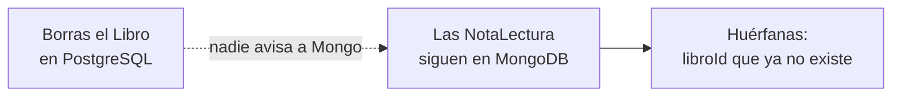

<a id="colecciones-documentales"></a>

# 🧩 2. Colecciones documentales: gestión y consultas

{ type=application/pdf style="width:100%;min-height:80vh" }

!!!info "Descarga de diapositivas"
    [Descarga las diapositivas](diapositivas/colecciones-documentales.pdf){target="_blank" rel="noopener"}

---

La comparación relacional/documental y el porqué de usar dos motores a la vez ya los has visto con detalle en el apartado anterior — no hace falta repetirlos aquí. Lo que te falta es más práctico y algo más concreto: en el ejemplo de las notas de lectura, la colección `nota_lectura` se crea sola, sin que nadie lo pida explícitamente, en cuanto `NotaLecturaRepository` guarda el primer documento. Hoy ves esa creación **explícita** (y su contrapartida, eliminarla), y una herramienta nueva para cuando una consulta ya no cabe cómodamente en el nombre de un método.

---

## 🛠️ Colecciones: crear, eliminar, listar

Todo lo que ves en este apartado se hace desde `mongosh`, no desde tu código Java — no vas a anotar nada de esto en `NotaLectura` ni en su repositorio. Con PostgreSQL tienes a Hibernate de tu lado: `ddl-auto` puede crear la tabla por ti (ya lo viste en el Tema 1), sin que escribas ni un `CREATE TABLE`. Spring Data MongoDB no convierte automáticamente tus anotaciones de Bean Validation (`@Min`, `@Max`, etc.) en reglas de validación de la colección. Son dos capas independientes. En este apartado vas a configurar el validador directamente desde `mongosh`, para ver con claridad que la regla vive también en la propia base de datos.

Ya sabes que MongoDB no valida claves foráneas — eso lo comprueba tu código, con la integridad referencial manual del apartado anterior. Pero hay un segundo hueco, más básico todavía: por defecto, MongoDB **tampoco valida la forma de un documento**. Nada te impide, desde `mongosh`, insertar esto directamente en la colección:

```javascript
db.nota_lectura.insertOne({ libroId: 1, autor: "ana", puntuacion: 999 })
```

`puntuacion: 999` no tiene ningún sentido — tu DTO en Java, con `@Min(1) @Max(10)`, nunca dejaría pasar algo así a través de tu API. Pero esa validación vive **solo** en tu código Java: cualquiera con acceso directo a Mongo (`mongosh`, un script, otra aplicación) se la salta sin ningún esfuerzo, porque la propia base de datos no sabe que esa regla existe.

Para cerrar ese hueco, MongoDB deja poner un **validador** directamente en la colección. Puedes añadir o modificar la validación posteriormente con `collMod`, pero en esta práctica vas a seguir la opción más sencilla de observar: eliminar la colección de pruebas y crearla explícitamente desde el principio con sus reglas.

```javascript
db.createCollection("nota_lectura", {
  validator: {
    $jsonSchema: {
      required: ["libroId", "autor", "puntuacion"],
      properties: {
        puntuacion: {
          bsonType: "int",
          minimum: 1,
          maximum: 10,
          description: "debe ser un número entero entre 1 y 10"
        }
      }
    }
  }
})
```

Con esto montado, el mismo `insertOne` de antes (`puntuacion: 999`) falla directamente en MongoDB, sin llegar nunca a tu aplicación — la base de datos rechaza el documento por sí sola, igual que rechazaría un `INSERT` en PostgreSQL que violara una restricción `CHECK`.

Las otras dos operaciones son más directas:

```javascript
// Eliminar la colección entera
db.nota_lectura.drop()

// Listar qué colecciones existen en la base de datos
show collections
```

!!! tip "El mismo objetivo que las restricciones de PostgreSQL, con otra sintaxis"
    `minimum: 1` y `maximum: 10` cumplen un papel similar a un `CHECK (puntuacion BETWEEN 1 AND 10)` de PostgreSQL, mientras que incluir `puntuacion` en `required` obliga además a que el campo exista, de forma comparable a un `NOT NULL`. En ambos casos, la idea es la misma: que la propia base de datos también proteja la validez de los datos, sin depender únicamente de la aplicación.

---

## 🗑️ Eliminar documentos en bloque

Borrar la colección entera con `drop()` es un martillo demasiado grande para un problema más concreto: eliminar solo **algunos** documentos, los que cumplen una condición, sin tocar el resto de la colección. Imagina que borras un `Libro` de PostgreSQL: sus notas de lectura en MongoDB no se enteran de nada — son dos motores completamente independientes, sin ninguna relación real entre ellos (la integridad referencial manual que ya conoces). Se quedan ahí, **huérfanas**, apuntando a un `libroId` que ya no existe:



Para limpiarlas hace falta un método que borre varios documentos a la vez, no uno por uno — y se genera exactamente igual que cualquier otra consulta por naming, sin escribir ninguna query:

```java
public interface NotaLecturaRepository extends MongoRepository<NotaLectura, String> {
    long deleteByLibroId(Long libroId);
}
```

`deleteByLibroId` borra de golpe todas las notas de lectura de un libro concreto. Pero, por sí solo, este método no hace nada: alguien tiene que **llamarlo** cuando se produzca el borrado del libro. En el diseño que vas a construir, el servicio que elimina el libro publica un evento en RabbitMQ y un *consumer* lo recibe de forma asíncrona para llamar a `deleteByLibroId`. La limpieza no tiene por qué ocurrir exactamente al mismo tiempo que el borrado: durante un breve intervalo pueden existir notas huérfanas, hasta que el *consumer* procese el evento. En la práctica de este tema vas a construir precisamente ese flujo.
---

## 🔍 Cuando el naming ya no basta: `@Query`

`findByLibroId`, `deleteByLibroId`... el naming de Spring Data funciona muy bien mientras la consulta tenga una o dos condiciones. Pero según añades condiciones, el nombre del método crece con ellas — y en algún punto deja de ser más claro que la propia consulta. Con dos condiciones, todavía se lee bien:

```java
List<NotaLectura> findByLibroIdAndPuntuacionGreaterThanEqual(Long libroId, Integer puntuacionMinima);
```

Añade una tercera condición — que además tenga comentario, para descartar puntuaciones sueltas sin explicar — y mira qué le pasa al nombre:

```java
List<NotaLectura> findByLibroIdAndPuntuacionGreaterThanEqualAndComentarioIsNotNull(Long libroId, Integer puntuacionMinima);
```

Con `@Query`, en cambio, añadir una condición más no alarga el nombre del método — solo el filtro, que se lee de un vistazo, en la sintaxis nativa de Mongo:

```java
public interface NotaLecturaRepository extends MongoRepository<NotaLectura, String> {

    @Query("{ 'libroId': ?0, 'puntuacion': { $gte: ?1 }, 'comentario': { $ne: null } }")
    List<NotaLectura> buscarBuenasNotasConComentario(Long libroId, Integer puntuacionMinima);
}
```

`?0`, `?1`... son marcadores de posición para los parámetros del método, en el orden en que los declaras — Spring Data los sustituye por ti antes de mandar la consulta a Mongo.

!!! info "Es el mismo mecanismo que ya conoces de JPA, con otra sintaxis"
    `@Query` en Spring Data MongoDB cumple exactamente el mismo papel que `@Query` en Spring Data JPA (Tema 1): una vía de escape para cuando el naming se queda corto o se vuelve ilegible. Solo cambia el idioma dentro de las comillas — JPQL o SQL nativo allí, un documento de filtro de Mongo aquí. El concepto — "puedo escribir la consulta a mano cuando el nombre del método no me basta" — es el mismo en los dos motores.

Pero hasta `@Query` tiene un límite: el filtro sigue siendo **fijo**, escrito de antemano — solo los valores cambian con cada llamada, no las condiciones en sí. Imagina ahora una búsqueda con varios criterios, todos **opcionales**, donde no sabes de antemano cuáles va a rellenar quien la use (por autor, sí; por puntuación mínima, no; por las dos, a veces). Para eso ni el naming ni `@Query` sirven bien — necesitarías una consulta distinta por cada combinación posible.

MongoDB tiene su propio equivalente a las `Specification` que ya conoces de PostgreSQL (Tema 2): las clases `Criteria` y `Query`, que se combinan condición a condición, en tiempo de ejecución, añadiendo solo los filtros que de verdad han llegado:

```java
@Service
@RequiredArgsConstructor
public class NotaLecturaService {

    private final MongoTemplate mongoTemplate;

    public List<NotaLectura> buscar(Long libroId, String autor, Integer puntuacionMinima) {
        Query query = new Query();

        if (libroId != null) {
            query.addCriteria(Criteria.where("libroId").is(libroId));
        }
        if (autor != null) {
            query.addCriteria(Criteria.where("autor").is(autor));
        }
        if (puntuacionMinima != null) {
            query.addCriteria(Criteria.where("puntuacion").gte(puntuacionMinima));
        }

        return mongoTemplate.find(query, NotaLectura.class);
    }
}
```

Cada `if` añade una condición solo si ese criterio ha llegado — igual que ibas encadenando condiciones a una `Specification` con `.and(...)`, aquí vas añadiendo `Criteria` a la misma `Query`. No lo vas a trabajar en las prácticas de este módulo, pero conviene que sepas que existe, para cuando te haga falta.

---

## ✅ Ideas clave

??? tip "Abrir resumen"

    - Por defecto, MongoDB no valida la forma de un documento (a diferencia de un `CHECK` en PostgreSQL) — una colección se crea implícitamente al primer `insert`, sin ninguna regla. La validación puede definirse al crear la colección con `createCollection` y `$jsonSchema`, o añadirse posteriormente a una colección existente.
    - Borrar un `Libro` no borra automáticamente sus notas de lectura en Mongo, porque son dos motores independientes. `deleteByLibroId` elimina documentos en bloque por naming de método; en la práctica, un *consumer* recibe de forma asíncrona el evento de borrado publicado en RabbitMQ y llama a ese método, por lo que la consistencia entre ambos motores es eventual.
    - `@Query`, con sintaxis de filtro de Mongo, es la vía de escape cuando el naming se vuelve largo o ilegible — el mismo papel que `@Query` en Spring Data JPA, con otro idioma dentro de las comillas.
    - Para filtros opcionales combinables en tiempo de ejecución, `Criteria`/`Query` con `MongoTemplate` es el equivalente Mongo de `Specification` — no se practica en este módulo, pero existe para cuando haga falta.
