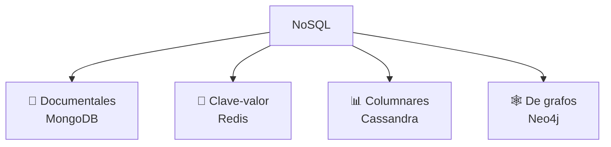
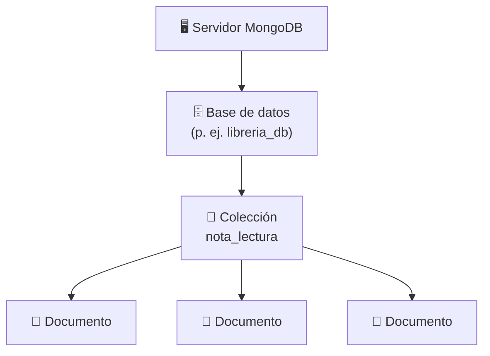
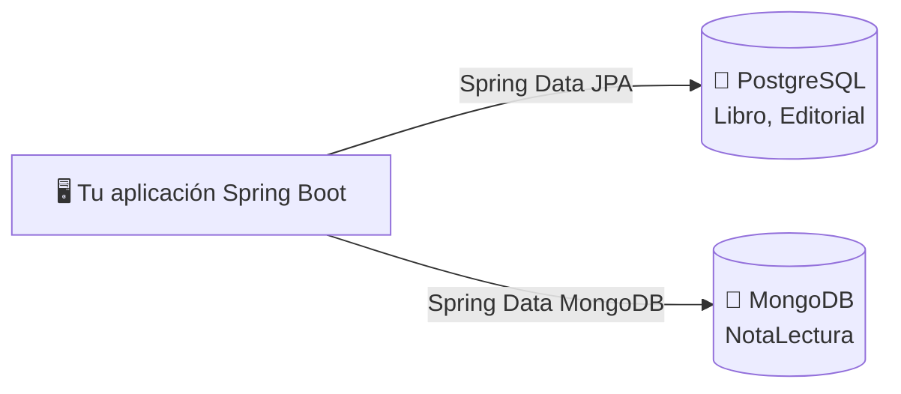
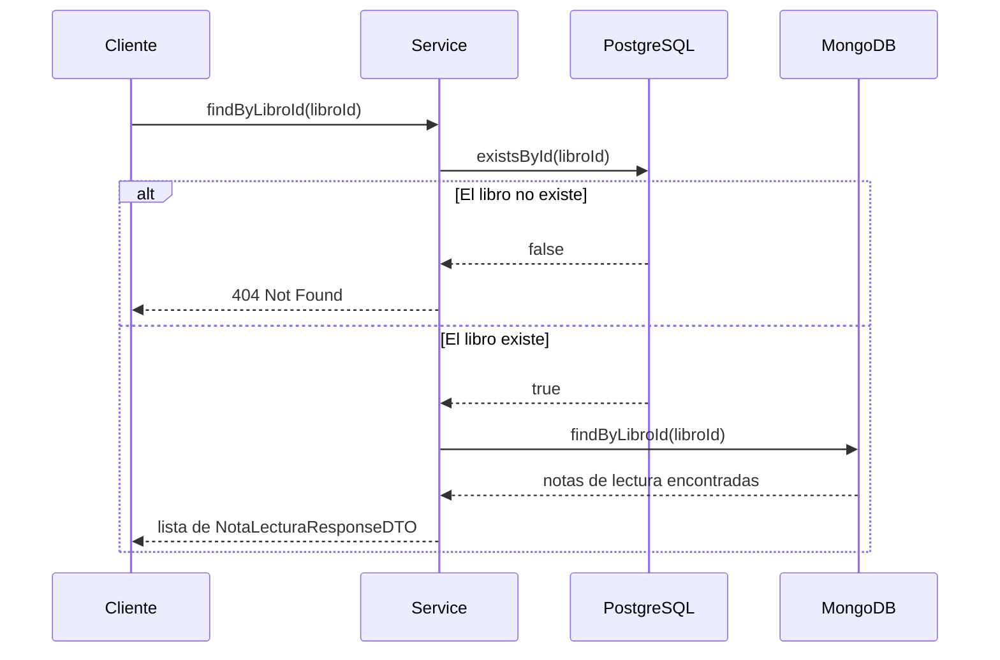
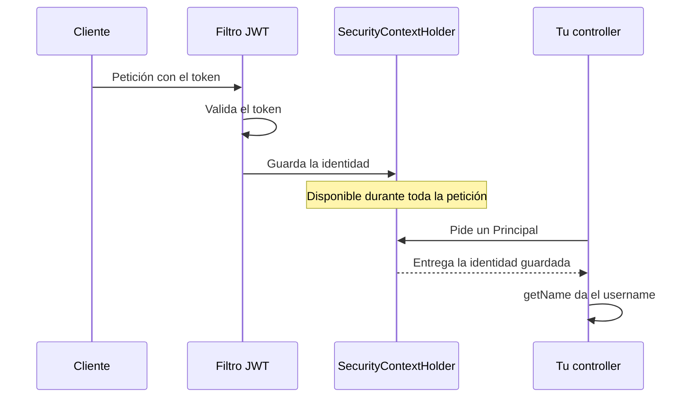

<a id="conexion-mongodb"></a>

# 🧩 1. Conexión a MongoDB y consultas sobre notas de lectura

Hasta ahora, todo lo que has persistido ha vivido dentro de PostgreSQL — incluso el JSONB del Tema 2 seguía siendo una columna de una tabla relacional. Este tema da un salto real: una base de datos completamente distinta, sin tablas de ningún tipo.

---

## 🗂️ Qué es NoSQL

Esa base de datos "completamente distinta" que acabas de leer no es una sola cosa: es una familia entera, agrupada bajo un nombre común precisamente porque todas comparten lo que **no** hacen. **NoSQL** es el nombre que se le da a esa familia de bases de datos que abandonan el modelo tabla/fila/SQL en favor de otros modelos de datos. No es un único tipo de motor, sino cuatro grandes categorías, cada una pensada para un problema distinto:



- **Documentales**: documentos autocontenidos, tipo JSON (donde se sitúa este tema) — uso habitual: catálogos de producto, perfiles de usuario, contenido con estructura variable (notas personales, artículos).
- **Clave-valor**: pares simples clave → valor (como Redis) — uso habitual: cachés, sesiones de usuario, contadores; lecturas y escrituras muy rápidas, sin necesidad de consultas complejas.
- **Columnares**: optimizadas para leer columnas completas de grandes volúmenes de datos — uso habitual: analítica a gran escala, series temporales (métricas, sensores).
- **De grafos**: optimizadas para relaciones muy conectadas (nodos y aristas) — uso habitual: redes sociales (amigos de amigos), sistemas de recomendación.

---

## 📄 Bases de datos documentales nativas: documento y colección

De las cuatro, este tema se centra en la primera — la documental, con MongoDB como motor concreto — porque es la que vas a usar en las próximas actividades. Antes de verla en código, dos piezas la definen, y ninguna es una tabla:

- **Documento**: un objeto completo, tipo JSON, autocontenido — con su propia estructura, que puede variar de un documento a otro dentro de la misma colección.
- **Colección**: un grupo de documentos, sin esquema fijo impuesto por el motor.

Así se ve en la práctica: dos documentos reales dentro de la misma colección `nota_lectura` (el ejemplo que vas a construir en este tema), con estructura distinta entre sí — el segundo tiene un campo (`comentario`) que el primero ni siquiera necesita:

```javascript
// Colección "nota_lectura"
{ "_id": ObjectId("..."), "libroId": 1, "autor": "ana", "puntuacion": 8 }
{ "_id": ObjectId("..."), "libroId": 1, "autor": "javi", "puntuacion": 9, "comentario": "Me ha encantado el ritmo" }
```

Puesto al lado de lo que ya conoces, el contraste queda más claro en tabla que en prosa:

| Aspecto | Relacional | JSONB (Tema 2) | Documental (este tema) |
|---|---|---|---|
| Estructura de fondo | Tablas y filas | Tabla, con una columna en formato JSON | Ninguna tabla — todo es documento |
| Columnas fijas | Sí | Sí, salvo la columna JSONB | No |
| Claves foráneas | Sí | Sí | No (relación lógica, gestionada a mano) |
| `JOIN` | Sí | Sí | No |

La diferencia clave con el JSONB del Tema 2: allí, el JSON era **una columna** dentro de una tabla relacional normal — aquí, **todo** es documento, no hay ninguna tabla por debajo.

---

## 🍃 Qué es MongoDB

Siguiendo con el ejemplo que llevamos trabajando toda la teoría: podríamos necesitar una base de datos documental para las notas de lectura de nuestra librería — cada nota de lectura es un documento independiente, sin relaciones fuertes que mantener entre ellas, con una forma que podría cambiar con el tiempo (más adelante volveremos sobre esto con más detalle). El motor documental que vas a usar para eso es **MongoDB**.

**MongoDB** es el gestor documental más usado. Sus documentos se almacenan en **BSON** (una versión binaria de JSON), y su identificador es un `ObjectId` — alfanumérico, no un número autoincremental como los que has usado hasta ahora en PostgreSQL. Se organiza en niveles: servidor → bases de datos → colecciones → documentos.



Un documento de ejemplo, y su consulta equivalente en `mongosh` (la consola de MongoDB, análoga a `psql`):

```javascript
// Un documento
{ "_id": ObjectId("..."), "libroId": 1, "autor": "ana", "puntuacion": 8 }

// El equivalente a un SELECT sencillo
db.nota_lectura.find({ "libroId": 1 })
```

Vale la pena verlo en esta forma cruda antes de que Spring lo esconda tras un repositorio.

---

## ⚖️ Cuándo encaja lo documental

Cuando los datos son autocontenidos y su estructura puede variar de un registro a otro sin que eso sea un problema —como una nota de lectura, que a veces lleva un comentario largo y a veces solo una puntuación— el modelo documental encaja bien: cada documento se guarda tal cual, sin forzarlo a una plantilla fija que todos los registros tengan que cumplir por igual. Cuando, en cambio, hay relaciones fuertes entre entidades que hay que mantener consistentes, y operaciones que necesitan modificar varias de ellas a la vez de forma atómica —como una venta que descuenta stock y genera una factura en la misma transacción—, el modelo relacional sigue siendo la opción más segura, porque es el que sabe garantizar esa consistencia de forma nativa, con claves foráneas y transacciones reales.

Profundizarás en esta comparación, con más detalle y más casos concretos, en el siguiente apartado.

---

## 📚 Un ejemplo completo: las notas de lectura de la librería

### Por qué dos bases de datos distintas

Siguiendo con la librería: el catálogo (`Libro`/`Editorial`) vive en PostgreSQL — relaciones claras, necesidad de transacciones fuertes. Pero imagina que ahora los lectores pueden escribir **notas de lectura** sobre los libros: documentos independientes entre sí, sin relaciones que mantener, con forma que podría evolucionar con el tiempo. Eso encaja mejor en **MongoDB**. Usar dos motores a la vez es una decisión de arquitectura habitual, no una moda — cada uno se usa donde encaja mejor:



La misma aplicación habla con los dos motores a la vez, cada uno a través de su propio Spring Data — no hay ningún puente automático entre ellos, y esa ausencia de puente es precisamente lo que vas a tener que resolver tú mismo en el resto de este apartado.

### Establecer la conexión

Antes de escribir ninguna entidad ni repositorio, tu aplicación necesita saber cómo llegar a MongoDB — exactamente igual que necesitó saber cómo llegar a PostgreSQL antes de poder usar `@Entity`. Una dependencia nueva en el `pom.xml`:

```xml
<dependency>
    <groupId>org.springframework.boot</groupId>
    <artifactId>spring-boot-starter-data-mongodb</artifactId>
</dependency>
```

Y la propiedad de conexión, en `application-dev.yml`:

```yaml
spring:
  mongodb:
    uri: mongodb://localhost:27017/libreria_db
```

!!! warning "La propiedad real es `spring.mongodb.uri`, no `spring.data.mongodb.uri`"
    Es fácil confundirse con tutoriales antiguos: en la versión de Spring Boot que usas en este curso, `mongodb` cuelga directamente de `spring`, no de `spring.data`. Comprueba siempre tu `application-dev.yml` antes de dar por buena una propiedad.

En paralelo al `datasource` de PostgreSQL que ya conoces del Tema 1, esta es toda la configuración necesaria para conectar con MongoDB. Con esto ya montado, puedes pasar a escribir la primera entidad.

### La entidad `NotaLectura`

```java
@Document(collection = "nota_lectura")
public class NotaLectura {

    @Id
    private String id; // alfanumérico, tipo ObjectId — no un Long autogenerado

    private Long libroId; // relación "lógica" con el catálogo en PostgreSQL
    private String autor;
    private Integer puntuacion;
    private String comentario;
}
```

`@Document(collection = "nota_lectura")` es el equivalente Mongo de `@Entity`/`@Table` — declara en qué colección vive. El `@Id` es `String`, no `Long`: en Mongo los identificadores son alfanuméricos por naturaleza (`ObjectId`), a diferencia del autoincremental que has usado siempre en PostgreSQL.

!!! warning "`libroId` no es una clave foránea real"
    Aunque el campo se llame `libroId` y apunte conceptualmente a un `Libro` de PostgreSQL, **no hay ninguna integridad referencial automática** entre dos motores de base de datos distintos. MongoDB no sabe nada de PostgreSQL, ni al revés — es responsabilidad de tu código mantener esa relación con sentido.

### El repositorio, con naming de método (igual que en JPA)

```java
public interface NotaLecturaRepository extends MongoRepository<NotaLectura, String> {
    List<NotaLectura> findByLibroId(Long libroId);
}
```

Spring Data también genera consultas automáticas por el nombre del método en MongoDB, exactamente igual que hacía `JpaRepository` en el Tema 1 — sin que escribas una sola query explícita.

### El patrón de "integridad referencial manual"

El método de más abajo devuelve `NotaLecturaResponseDTO`, un `record` con el mismo patrón de siempre — nada nuevo que explicar en este, a diferencia de los DTOs de creación que verás en el siguiente apartado:

```java
public record NotaLecturaResponseDTO(String id, Long libroId, String autor, Integer puntuacion, String comentario) {}
```

```java
public List<NotaLecturaResponseDTO> findByLibroId(Long libroId) {
    // 1. Verificamos que el libro exista en PostgreSQL antes de buscar sus notas de lectura
    if (!libroRepository.existsById(libroId)) {
        throw new ResponseStatusException(HttpStatus.NOT_FOUND, "Libro no encontrado en el catálogo");
    }
    // 2. Buscamos en MongoDB y mapeamos
    return notaLecturaRepository.findByLibroId(libroId).stream().map(this::mapToDTO).toList();
}
```

Este es el patrón central de este apartado: como Mongo no puede validar una clave foránea hacia una tabla de PostgreSQL, el propio código de la aplicación tiene que hacerlo — comprobando primero contra PostgreSQL (`existsById`, Spring Data JPA) antes de tocar Mongo. Así se ve el flujo completo, con los dos motores implicados y las dos posibles salidas:



Fíjate en el orden: **primero** PostgreSQL, y solo si responde que sí, se llega a tocar Mongo — si lo hicieras al revés (consultar Mongo primero), estarías haciendo una consulta de más en el caso, nada raro, de que el libro no exista.

Este método, igual que el resto de este apartado, vive en `NotaLecturaService`. No hace falta que veas el controller que lo expone: se construye con el mismo patrón de siempre — un `@RestController` con `@RequiredArgsConstructor` que inyecta el service y delega en él, igual que ya has hecho con `Libro`/`Editorial`.

### Crear una nota de lectura, con el autor protegido

Falta la otra mitad: cómo se crea una nota de lectura nueva. Aquí aparece algo que no te hacía falta con `Libro`/`Editorial`: el campo `autor` no puede venir del cliente en el cuerpo de la petición — si lo dejaras, cualquiera podría escribir el nombre de otra persona y hacerse pasar por ella. Por eso el DTO que valida lo que manda el cliente y el objeto que de verdad se usa para crear el documento no son el mismo:

```java
public record NotaLecturaRequestDTO(
        @Min(1) @Max(10) Integer puntuacion,
        @NotBlank String comentario
) {}

public record NotaLecturaCreateDTO(Long libroId, String autor, Integer puntuacion, String comentario) {}
```

`NotaLecturaRequestDTO` es literalmente lo único que el cliente controla: la puntuación y el comentario, con sus validaciones de siempre. `NotaLecturaCreateDTO` añade los dos campos que decide el servidor: `libroId` (que llega por la URL, no por el cuerpo) y `autor`. Así se juntan los dos, en el controller:

```java
@PostMapping
public ResponseEntity<NotaLecturaResponseDTO> create(
        @PathVariable Long libroId,
        @Valid @RequestBody NotaLecturaRequestDTO dto,
        Principal principal
) {
    NotaLecturaCreateDTO createDTO = new NotaLecturaCreateDTO(libroId, principal.getName(), dto.puntuacion(), dto.comentario());
    return ResponseEntity.status(HttpStatus.CREATED).body(notaLecturaService.create(createDTO));
}
```

`Principal` es una interfaz estándar de Java — Spring te la entrega ya rellena como parámetro del controller, sin que tengas que pedirla ni construirla tú mismo:



Por debajo es el mismo `Authentication` que el filtro JWT que ya construiste en PSP (Actividad 2.4) guarda al validar el token — `Principal` es, simplemente, esa misma identidad. `principal.getName()` te da directamente el `username`, el mismo que ya usas en tu `/me` de PSP.

El controller combina eso (`autor`, decidido por el servidor) con lo que sí manda el cliente (`puntuacion`, `comentario`) para construir el `NotaLecturaCreateDTO` completo, antes de pasárselo al service.

### Una agregación sencilla, en memoria

Junto al listado de notas de lectura, tiene sentido ofrecer también un resumen: cuántas tiene un libro y cuál es su puntuación media. Este método se añade al mismo `NotaLecturaService`, y se expone igual que el anterior — un controller que lo llama, sin nada nuevo que mostrar ahí:

```java
public NotaLecturaResumenDTO getResumenByLibroId(Long libroId) {
    List<NotaLectura> notasLectura = notaLecturaRepository.findByLibroId(libroId);
    long totalNotas = notasLectura.size();
    double puntuacionMedia = notasLectura.stream().mapToInt(NotaLectura::getPuntuacion).average().orElse(0.0);
    return new NotaLecturaResumenDTO(libroId, totalNotas, puntuacionMedia);
}
```

`getResumenByLibroId` calcula el total y la media de puntuación **en memoria**, con streams de Java, tras traer todos los documentos de Mongo — no usa el framework de agregación nativo de Mongo (`$group`, `$avg`). Es una simplificación deliberada, con un compromiso claro entre ambos enfoques:

| Enfoque | Cómo funciona | Cuándo conviene |
|---|---|---|
| En memoria (streams de Java) | Trae todos los documentos a la aplicación y calcula con `.stream()` | Pocos documentos por libro — simple de escribir y de entender |
| Framework de agregación de Mongo (`$group`, `$avg`) | El cálculo lo hace el propio motor, sin traer todos los documentos | Muchos documentos — más eficiente, pero la consulta es más compleja de escribir |

Para este curso, con pocas notas de lectura por libro, la primera opción es más que suficiente. Si algún día hubiera muchísimas notas de lectura por consultar, la mejora sería sustituir este cálculo en memoria por una consulta con el framework de agregación nativo de Mongo (`$group`/`$avg`): el motor calcularía el total y la media directamente sobre los documentos, sin necesidad de traerlos todos a la aplicación primero.

---

## ✅ Ideas clave

??? tip "Abrir resumen"

    - **NoSQL** abandona tablas/filas/SQL; las bases **documentales** (MongoDB) son una de varias familias (clave-valor, columnares, de grafos).
    - Un **documento** es un objeto autocontenido; una **colección** los agrupa sin esquema fijo — nada de tablas ni `JOIN`.
    - MongoDB usa BSON y `ObjectId` (alfanumérico) como identificador — distinto del `Long` autoincremental de JPA.
    - `libroId` en `NotaLectura` es una relación **lógica**, no una clave foránea real — no hay integridad referencial automática entre dos motores distintos.
    - El patrón de **integridad referencial manual**: el código comprueba en PostgreSQL antes de tocar Mongo, porque el motor no puede hacerlo por sí solo.
    - La propiedad real de conexión es `spring.mongodb.uri` (no `spring.data.mongodb.uri`).
