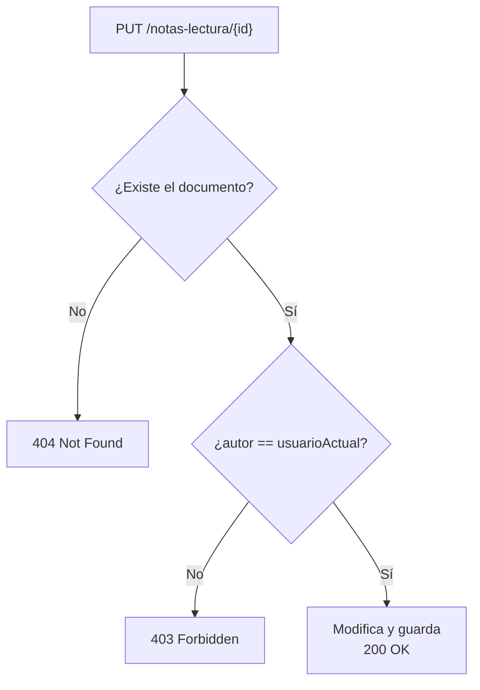

<a id="modificacion-documentos"></a>

# 🧩 3. Modificación de documentos

{ type=application/pdf style="width:100%;min-height:80vh" }

!!!info "Descarga de diapositivas"
    [Descarga las diapositivas](diapositivas/modificacion-documentos.pdf){target="_blank" rel="noopener"}

---

Te falta la pieza final del bloque documental: modificar un documento concreto, con una particularidad que no habías tenido que resolver hasta ahora — comprobar quién tiene permiso para hacerlo.

---

## ✏️ Añadir, modificar y eliminar documentos, en `mongosh`

```javascript
// Añadir
db.nota_lectura.insertOne({ libroId: 1, autor: "ana", puntuacion: 8 })

// Modificar solo un campo concreto
db.nota_lectura.updateOne({ _id: ObjectId("...") }, { $set: { puntuacion: 9 } })

// Reemplazar el documento entero
db.nota_lectura.replaceOne({ _id: ObjectId("...") }, { libroId: 1, autor: "ana", puntuacion: 9, comentario: "..." })

// Eliminar
db.nota_lectura.deleteOne({ _id: ObjectId("...") })
```

Hay una diferencia conceptual importante entre `updateOne` con `$set` (modifica solo los campos indicados, deja el resto intacto) y `replaceOne` (sustituye el documento entero). Conviene que sepas que `$set` existe, aunque en esta práctica no lo uses desde Java: `save()` de Spring Data MongoDB, que ya conoces, hace lo segundo — reemplaza el documento completo, no un *merge* parcial.

| | `updateOne` + `$set` | `replaceOne` | `save()` (Spring Data) |
|---|---|---|---|
| Qué toca | Solo los campos que indicas | Todo el documento | Todo el documento |
| Campos que no incluyes | Se quedan como estaban | Desaparecen | Se sobrescriben con lo que traiga el objeto Java |
| ¿Lo usas desde Java en esta práctica? | No | No | Sí — es lo que ya usas |

!!! warning "El riesgo silencioso de `save()`"
    `save()` no hace un *merge*: sustituye el documento entero por el objeto Java que le pasas. Si ese objeto llega sin todos los campos rellenos (por ejemplo, porque olvidaste copiar `comentario` antes de guardar), MongoDB los sobrescribe con `null` sin ningún aviso — a diferencia de `$set`, que solo toca lo que le dices explícitamente. Por eso el patrón de la siguiente sección siempre carga el documento completo antes de tocar nada: para no perder por el camino los campos que no vas a cambiar.

---

## 📚 Un ejemplo completo: modificar una nota de lectura, con control de autoría

Siguiendo con las notas de lectura de la librería: cualquier usuario autenticado puede publicar una, pero solo el **autor original** debería poder modificarla después. Imagina que no hicieras esa comprobación: cualquiera que tuviera sesión iniciada podría llamar al mismo endpoint sobre la nota de lectura de otra persona, y sobrescribirle la puntuación y el comentario sin que nada se lo impidiera — hasta ahora la única barrera ha sido "estás identificado", nunca "eres el dueño de esto". Ese hueco es exactamente lo que cierra el control de autoría, la particularidad nueva de este apartado.

### De dónde sale la identidad: `Principal`

```java
@PostMapping
public ResponseEntity<NotaLecturaResponseDTO> create(
        @PathVariable Long libroId,
        @Valid @RequestBody NotaLecturaRequestDTO dto,
        Principal principal
) {
    NotaLecturaCreateDTO createDTO = new NotaLecturaCreateDTO(libroId, principal.getName(), dto.puntuacion(), dto.comentario());
    return ResponseEntity.status(HttpStatus.CREATED).body(notaLecturaService.create(createDTO));
}
```

El `POST` usa `Principal principal` para tomar `principal.getName()` como autor — es la identidad del usuario autenticado, inyectada automáticamente por Spring Security a partir del JWT que construyes en Programación de Servicios y Procesos (usuarios, roles, JWT). No hace falta que repases aquí cómo funciona ese JWT por dentro — solo que sepas que, si tu petición llega autenticada, `Principal` te da el nombre de quien la hizo.

### El patrón de control de autoría

```java
public NotaLecturaResponseDTO update(String notaLecturaId, NotaLecturaRequestDTO dto, String usuarioActual) {
    NotaLectura notaLectura = notaLecturaRepository.findById(notaLecturaId)
            .orElseThrow(() -> new ResponseStatusException(HttpStatus.NOT_FOUND, "Nota de lectura no encontrada"));

    if (!notaLectura.getAutor().equals(usuarioActual)) {
        throw new ResponseStatusException(HttpStatus.FORBIDDEN, "Solo el autor puede modificar esta nota de lectura");
    }

    notaLectura.setPuntuacion(dto.puntuacion());
    notaLectura.setComentario(dto.comentario());

    return mapToDTO(notaLecturaRepository.save(notaLectura));
}
```

El patrón, en tres pasos: cargar el documento por id, comprobar que el campo `autor` guardado coincide con `usuarioActual` (el `principal.getName()` de la petición), y solo entonces aplicar los cambios y guardar. Si no coincide, `403 Forbidden` — el usuario está autenticado (sabemos quién es), pero no tiene permiso para esta acción concreta sobre este recurso. Si la nota de lectura no existe, `404 Not Found`, como ya conoces.



El orden de las dos comprobaciones no es casual: primero averiguas si el recurso existe (si no, `404`), y solo después comparas el autor (si no coincide, `403`) — invertirlo no tendría sentido, porque no puedes comparar el autor de un documento que todavía no has cargado.

!!! tip "En la práctica, el autor no suele ser la única vía de permiso"
    Solo el autor original es la regla mínima, pero casi cualquier aplicación real añade una segunda vía: un rol con permisos de moderación (un `ADMIN`, por ejemplo) que pueda actuar igual sin ser el autor. La condición pasa de `autor == usuarioActual` a `autor == usuarioActual` **o** `esAdmin` — el rol no sustituye la comprobación de autoría, se suma a ella como una vía alternativa de permiso. Lo practicas así, con tu propio dominio, en la actividad de hoy.

!!! tip "El id del documento ya es único — ¿para qué comprobar también el padre de la URL?"
    Si la ruta anida el recurso bajo otro (`PUT /libros/{libroId}/notas-lectura/{id}`), el `id` de la nota de lectura por sí solo ya basta para encontrarla — no necesitarías `libroId` para eso. Pero como la URL afirma que esa nota pertenece a ese libro concreto, conviene comprobarlo también: si la nota existe pero pertenece a otro libro distinto, trátalo igual que si no existiera (`404`) — para esa URL, tal como está escrita, ese recurso no está. Sin esa comprobación, cualquier `libroId` de la URL sería aceptado siempre que el `id` de la nota fuera válido, sin que nadie llegara a mirar si de verdad coinciden.

### `save()` sirve para crear y para actualizar — otra vez

`NotaLecturaRepository` (que extiende `MongoRepository<NotaLectura, String>`) ya tiene `save()` heredado, y sirve tanto para crear un documento nuevo como para actualizar uno existente — basta con que el objeto que le pases tenga el mismo `id` que ya existe en la colección. No es un concepto nuevo: es exactamente lo mismo que ya viste con `JpaRepository` en el Tema 1 — solo cambia el motor de base de datos por debajo, el comportamiento de `save()` es idéntico en la forma de razonar sobre él.

Lo mismo pasa con eliminar un documento suelto por su id: `deleteById(id)` viene heredado de `MongoRepository`, igual que en `JpaRepository` — el método en sí no hay que escribirlo. Lo que sí construyes tú, en la práctica de hoy, es el endpoint que lo expone con el mismo control de autoría (o rol de administrador) que acabas de ver, más allá del borrado en bloque por `libroId` que ya viste en el apartado anterior.

!!! info "Una alternativa más avanzada: filtrar la autoría directamente en la consulta"
    El patrón de hoy hace dos pasos en Java: cargar el documento, comprobar el autor, y solo entonces guardar — dos idas y vueltas a MongoDB. Hay una forma más directa: exigir esa misma condición dentro del propio filtro de la actualización, `db.nota_lectura.updateOne({ _id: ..., autor: usuarioActual }, { $set: {...} })`. Si el autor no coincide, el filtro simplemente no encuentra nada que actualizar, y la operación devuelve cero documentos modificados, sin ninguna lectura previa. Es más eficiente, pero pierdes precisión en el error: sin una consulta aparte, no puedes distinguir "no existe" de "no es tuyo", así que decidir entre `404` y `403` como haces aquí ya no es tan directo. No lo vas a practicar en este módulo, pero conviene que sepas que existe, para cuando el rendimiento pese más que la claridad del error.

---

## ✅ Ideas clave

??? tip "Abrir resumen"

    - `updateOne` con `$set` modifica campos concretos; `replaceOne` (y `save()` de Spring Data) sustituye el documento entero — y lo hace en silencio, sin avisar si el objeto Java llega con campos vacíos.
    - `Principal` te da la identidad del usuario autenticado, inyectada por Spring Security a partir del JWT construido en PSP.
    - El patrón de control de autoría: cargar → comprobar que el autor coincide con el usuario actual → solo entonces modificar y guardar. `403` si no coincide, `404` si no existe — en ese orden, porque no puedes comparar el autor de algo que no has cargado todavía.
    - En la práctica, un rol de moderación (`ADMIN`) suele añadirse como segunda vía de permiso junto al autor — `autor == usuarioActual` **o** `esAdmin`, no en sustitución de la comprobación de autoría.
    - Si la URL anida el recurso bajo un padre (`.../{padreId}/notas-lectura/{id}`), comprueba también que el documento pertenece a ese padre, aunque su propio `id` ya sea único — si no coincide, `404`, igual que si no existiera para esa URL.
    - `save()`/`deleteById()` de `MongoRepository` sirven tanto para crear/actualizar como para eliminar un documento suelto, exactamente igual que `JpaRepository` — mismo concepto, distinto motor.
    - Filtrar la autoría directamente en el `updateOne` (en vez de cargar y comparar en Java) es más eficiente pero pierde precisión en el error — no se practica en este módulo, pero conviene saber que existe.
