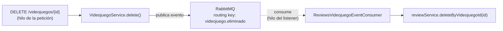

# 🧪 Actividad 4.2: Tu propia colección documental

!!! info "Práctica guiada"
    Construyes el flujo real de borrado en cascada vía eventos RabbitMQ y lo endureces frente a reintentos — esa es la mejora real de hoy.

## Qué vas a practicar

- Ampliar un exchange de mensajería ya existente con una cola nueva.
- Entender y replicar un flujo de borrado en cascada entre dos motores distintos, vía eventos.
- Hacer una operación idempotente frente a mensajes duplicados.
- Comparar por escrito tu experiencia con PostgreSQL y con MongoDB.

---

## Requisitos previos

Tu módulo `reviews` de la Actividad 4.1, y RabbitMQ funcionando con el registro de actividad del catálogo — se construye en Programación de Servicios y Procesos, Actividad 3.1. Si todavía no has llegado a esa actividad en PSP, complétala antes de seguir: hoy vas a ampliar el `RabbitMQConfig` y el `VideojuegoEventPublisher` que se construyen ahí, no a crearlos desde cero.

---

## Paso 0 — Añadir la cola de reseñas al exchange existente

Tu `RabbitMQConfig` (de PSP, Actividad 3.1) ya tiene un `TopicExchange` (`CATALOGO_EXCHANGE`) con una cola de actividad. Añade una segunda cola sobre ese mismo exchange, esta vez de interés solo para `reviews`:

```java
public static final String REVIEWS_VIDEOJUEGO_QUEUE = "reviews.videojuego.queue";

@Bean
public Queue reviewsVideojuegoQueue() {
    return new Queue(REVIEWS_VIDEOJUEGO_QUEUE);
}

@Bean
public Binding reviewsBinding(Queue reviewsVideojuegoQueue, TopicExchange catalogoExchange) {
    return BindingBuilder.bind(reviewsVideojuegoQueue).to(catalogoExchange).with("videojuego.eliminado");
}
```

A diferencia de la cola de actividad (enlazada a `videojuego.*`, todo evento), esta se enlaza solo a `videojuego.eliminado` — a `reviews` no le interesa que se cree o modifique un videojuego, solo que se borre. Es el mismo exchange sirviendo a dos consumidores con intereses distintos, sin que ninguno reciba mensajes que no necesita.

`VideojuegoEventPublisher` y el evento `VideojuegoEvent` no cambian — ya publican en `videojuego.eliminado` cada vez que `VideojuegoService.delete()` se ejecuta, así que esta cola nueva empieza a recibir mensajes en cuanto la declaras, sin tocar nada más.

---

## Paso 1 — Entender el flujo, antes de tocar nada

El borrado en cascada de reseñas sigue un flujo ya definido — no lo vas a inventar, lo vas a construir siguiendo este diseño. El viaje completo de un evento:



`VideojuegoService.delete()` (en el módulo `catalogo`) no llama directamente a nada de `reviews` — publica un evento a través de `VideojuegoEventPublisher`, y sigue su camino sin esperar. En otro hilo, en su propio momento, `ReviewsVideojuegoEventConsumer` lo recibe y actúa:

```java
@Service
@RequiredArgsConstructor
public class ReviewsVideojuegoEventConsumer {
    private final ReviewService reviewService;

    @RabbitListener(queues = RabbitMQConfig.REVIEWS_VIDEOJUEGO_QUEUE)
    public void recibir(String payload) {
        VideojuegoEvent event = /* deserializar */;
        if (VideojuegoEvent.VIDEOJUEGO_ELIMINADO.equals(event.tipo())) {
            reviewService.deleteByVideojuegoId(event.videojuegoId());
        }
    }
}
```

**Fíjate**: el borrado de reseñas ocurre en un hilo distinto al de la petición HTTP que originó el borrado del videojuego — el mismo patrón de "hilo del listener de RabbitMQ" que analizaste en PSP.

---

## Paso 2 — Replicar el consumer en tu GameVault

```java
package com.tunombre.gamevault.reviews.mensajeria;

import com.tunombre.gamevault.catalogo.api.eventos.VideojuegoEvent;
import com.tunombre.gamevault.config.RabbitMQConfig;
import com.tunombre.gamevault.reviews.ReviewService;
import lombok.RequiredArgsConstructor;
import org.springframework.amqp.rabbit.annotation.RabbitListener;
import org.springframework.stereotype.Service;

@Service
@RequiredArgsConstructor
public class ReviewsVideojuegoEventConsumer {
    private final ReviewService reviewService;

    @RabbitListener(queues = RabbitMQConfig.REVIEWS_VIDEOJUEGO_QUEUE)
    public void recibir(String payload) {
        VideojuegoEvent event = /* deserializar con tu JsonMapper */;
        if (VideojuegoEvent.VIDEOJUEGO_ELIMINADO.equals(event.tipo())) {
            reviewService.deleteByVideojuegoId(event.videojuegoId());
        }
    }
}
```

Si no lo tenías ya de la Actividad 4.1, añade también `deleteByVideojuegoId` a tu `ReviewRepository` (`long deleteByVideojuegoId(Long videojuegoId);`) y un método correspondiente en `ReviewService` que lo invoque.

---

## Paso 3 — Prueba con datos reales

```bash
# Crea un videojuego y una reseña
curl -X POST http://localhost:8080/api/v1/videojuegos -H "Content-Type: application/json" \
  -d '{"titulo":"Test","precio":1,"fechaLanzamiento":"2020-01-01","estudioId":1}'

curl -X POST http://localhost:8080/api/v1/videojuegos/{id}/reviews \
  -H "Authorization: Bearer $TOKEN" -H "Content-Type: application/json" \
  -d '{"puntuacion": 7, "comentario": "Prueba"}'

# Borra el videojuego
curl -X DELETE http://localhost:8080/api/v1/videojuegos/{id}
```

Comprueba en MongoDB, **esperando un instante** (no es síncrono):

```bash
docker exec -it <tu-contenedor-mongo> mongosh gamevault_db --eval "db.review.find({videojuegoId: <id>})"
```

**Anota**: en los logs de tu aplicación, ¿ves dos nombres de hilo distintos — uno para la petición `DELETE`, otro para el consumer? Compáralos.

**Explica**, revisando tu `RabbitMQConfig.java`, por qué `ReviewsVideojuegoEventConsumer` se activa al borrar un videojuego pero no al crearlo o modificarlo (pista: busca la *routing key* `videojuego.eliminado` y a qué cola está enlazada) — y por qué, en cambio, `ActividadVideojuegoEventConsumer` (PSP, Actividad 3.1) sí se activa con las tres operaciones.

---

## Paso 4 — La mejora real: idempotencia

Los brokers de mensajería pueden, en ciertas circunstancias (una caída de red, un reintento), entregar el **mismo** mensaje más de una vez. Haz que `deleteByVideojuegoId` sea seguro frente a eso — no debería fallar ni hacer nada extraño si se invoca dos veces seguidas para el mismo `videojuegoId`.

```java
public long deleteByVideojuegoId(Long videojuegoId) {
    long eliminadas = reviewRepository.deleteByVideojuegoId(videojuegoId);
    // deleteByVideojuegoId de Mongo ya es seguro por sí mismo si no quedan documentos:
    // borrar sobre una colección vacía para ese id simplemente elimina 0 documentos,
    // no lanza ningún error
    return eliminadas;
}
```

**Pregunta de comprensión**: si RabbitMQ reintentara la entrega del mismo evento `VIDEOJUEGO_ELIMINADO` dos veces, ¿qué pasaría la segunda vez que se invoca `deleteByVideojuegoId` sobre reseñas que ya no existen? ¿Es necesario añadir alguna comprobación extra, o el propio comportamiento de `deleteByVideojuegoId` sobre MongoDB ya es seguro por diseño?

---

## Reflexión de cierre

Compara por escrito (4-5 líneas) tu experiencia con PostgreSQL en los temas anteriores y con MongoDB en este tema. Y compara también borrar de forma **síncrona** (como haría un `cascade`/`orphanRemoval` dentro de un único motor relacional, que ya usaste en el Tema 1 entre `Estudio` y `Videojuego`) frente a borrar de forma **asíncrona** entre dos motores distintos, como acabas de hacer aquí: ¿qué se gana (desacoplamiento entre módulos) y qué se pierde (consistencia inmediata — hay una ventana de tiempo en la que el videojuego ya no existe pero sus reseñas todavía sí)?

---

## ✅ Cierre

Tu GameVault ya limpia reseñas huérfanas automáticamente, de forma robusta frente a reintentos. En la última actividad del tema trabajas el `PUT` de reseñas y control de autoría.
