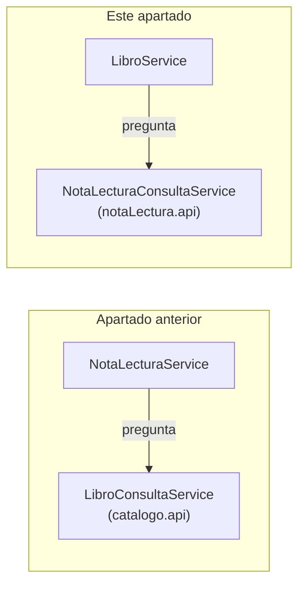
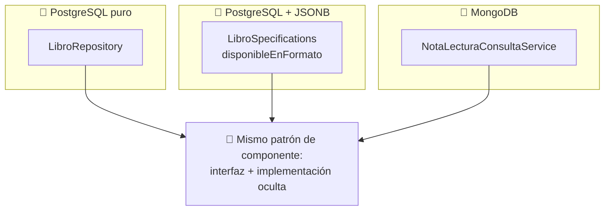

<a id="componentes-bd-objeto-doc"></a>

# 🧩 2. Componentes con BD objeto-relacional y documental

Ya has visto, en el apartado anterior, que tu `LibroRepository` con Specifications sobre JSONB (Tema 2) es también un componente objeto-relacional, sin que hayas tenido que construir nada nuevo para eso. Ahora construyes uno de verdad, nuevo — esta vez en la dirección contraria al que ya has construido con `LibroConsultaService`.

---

## 🍃 Un componente en la dirección contraria

En el apartado anterior has construido `LibroConsultaService`, para que el módulo de notas de lectura (MongoDB) pudiera preguntarle algo al catálogo (PostgreSQL) sin conocer sus detalles internos. Ahora se plantea el problema al revés: `LibroResponseDTO` quiere mostrar la puntuación media de las notas de lectura de cada libro — pero esa información vive en MongoDB, no en PostgreSQL, y `LibroService` no debería tener que saber que Mongo existe siquiera.

Imagina un cambio concreto, del mismo tipo que ya viste con el borrado lógico: mañana decides que las notas de lectura marcadas como spam (un campo `moderado` nuevo en `NotaLectura`) no deben contar en la media. Si `LibroService` inyectara `NotaLecturaRepository` directamente y calculara la media él mismo, tendría que enterarse de ese campo — un detalle de moderación interno de otro módulo, sobre un motor que ni siquiera es el suyo. Con el componente de por medio, ese cambio se queda contenido dentro de `NotaLecturaConsultaServiceImpl`: `LibroService` sigue llamando a `puntuacionMediaDe(libroId)` exactamente igual, sin enterarse de nada.

Se resuelve con exactamente el mismo molde, solo que ahora la interfaz vive en el módulo de notas de lectura:

```java
public interface NotaLecturaConsultaService {
    double puntuacionMediaDe(Long libroId);
}
```

```java
@Service
@RequiredArgsConstructor
class NotaLecturaConsultaServiceImpl implements NotaLecturaConsultaService {

    private final NotaLecturaRepository notaLecturaRepository;

    @Override
    public double puntuacionMediaDe(Long libroId) {
        return notaLecturaRepository.findByLibroId(libroId).stream()
                .mapToInt(NotaLectura::getPuntuacion)
                .average()
                .orElse(0.0);
    }
}
```

`LibroService` inyecta `NotaLecturaConsultaService` —la interfaz, nunca `NotaLecturaRepository` ni la clase que la implementa— para rellenar ese campo nuevo de `LibroResponseDTO`. El patrón es idéntico al del apartado anterior; lo único que cambia es qué motor hay detrás (MongoDB en vez de PostgreSQL) y en qué dirección va la consulta:



En el apartado anterior, quien pregunta es notas de lectura y quien responde es el catálogo; aquí es al revés. Ningún módulo es "el importante" al que los demás preguntan — cualquiera de los dos puede exponer un contrato hacia el otro, según quién necesite qué dato.

---

## 🪞 Cerrando el círculo: el mismo patrón, tres motores distintos



La idea de síntesis de este apartado: **da igual la tecnología de persistencia** —relacional puro, objeto-relacional con JSONB, documental con MongoDB— el patrón de "componente con interfaz clara + implementación oculta" es el mismo en los tres casos, y da igual en qué dirección se consulte. La interfaz nunca necesita saber qué motor hay por debajo. Vas a replicar este mismo componente sobre tu propio proyecto en la Actividad 4.2, con `ReviewsConsultaService`: expuesto desde `reviews` hacia `catalogo`, con la puntuación media de las reseñas de un videojuego.

---

## ✅ Ideas clave

??? tip "Abrir resumen"

    - El mismo patrón de componente (interfaz + implementación oculta) se aplica también en la dirección contraria: `NotaLecturaConsultaService` expone información de MongoDB hacia el catálogo, sin que este sepa que Mongo existe.
    - La dirección de la dependencia y el motor de persistencia por debajo son irrelevantes para el patrón de componente — esa independencia es exactamente la idea clave de este tema.
    - En tu proyecto real este mismo componente se llama `ReviewsConsultaService` (Actividad 4.2), expuesto desde `reviews` hacia `catalogo`.
