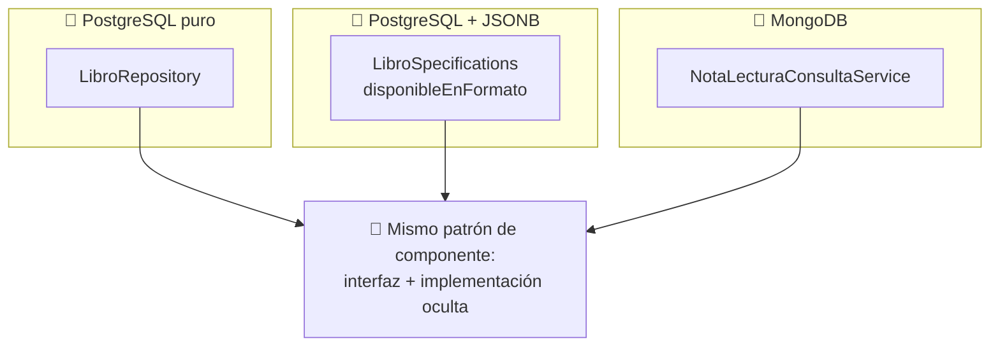

<a id="componentes-bd-objeto-doc"></a>

# 🧩 2. Componentes con BD objeto-relacional y documental

Revisitas JSONB (Tema 2) con la óptica de "componente" que acabas de conocer en el apartado anterior, y luego construyes un segundo componente — esta vez en la dirección contraria al que ya construiste con `LibroConsultaService`.

---

## 🐘 JSONB, visto como componente

```java
public interface LibroRepository extends JpaRepository<Libro, Long>, JpaSpecificationExecutor<Libro> {
}
```

`LibroRepository`, junto con `LibroSpecifications` (donde vive `disponibleEnFormato`, con su `jsonb_exists`), es un **componente que encapsula el acceso a una base de datos objeto-relacional**. Quien lo consume — `LibroService`, o cualquier otro service que pudiera necesitarlo — no tiene ni que saber que, por debajo de una de sus Specifications, hay una función nativa de PostgreSQL como `jsonb_exists`. Esa complejidad queda completamente contenida dentro del componente; fuera de él, es "una Specification más".

---

## 🍃 Un componente en la dirección contraria

En el apartado anterior construiste `LibroConsultaService`, para que el módulo de notas de lectura (MongoDB) pudiera preguntarle algo al catálogo (PostgreSQL) sin conocer sus detalles internos. Ahora se plantea el problema al revés: `LibroResponseDTO` quiere mostrar la puntuación media de las notas de lectura de cada libro — pero esa información vive en MongoDB, no en PostgreSQL, y `LibroService` no debería tener que saber que Mongo existe siquiera.

Se resuelve con exactamente el mismo molde, solo que ahora la interfaz vive en el módulo de notas de lectura:

```java
public interface NotaLecturaConsultaService {
    double puntuacionMediaDe(Long libroId);
}
```

```java
@Service
@RequiredArgsConstructor
class NotaLecturaConsultaServiceImpl implements NotaLecturaConsultaService {

    private final NotaLecturaRepository notaLecturaRepository;

    @Override
    public double puntuacionMediaDe(Long libroId) {
        return notaLecturaRepository.findByLibroId(libroId).stream()
                .mapToInt(NotaLectura::getPuntuacion)
                .average()
                .orElse(0.0);
    }
}
```

`LibroService` inyecta `NotaLecturaConsultaService` —la interfaz, nunca `NotaLecturaRepository` ni la clase que la implementa— para rellenar ese campo nuevo de `LibroResponseDTO`. El patrón es idéntico al del apartado anterior; lo único que cambia es qué motor hay detrás (MongoDB en vez de PostgreSQL) y en qué dirección va la consulta: del catálogo hacia las notas de lectura, no al revés.

---

## 🪞 Cerrando el círculo: el mismo patrón, tres motores distintos



La idea de síntesis de este apartado: **da igual la tecnología de persistencia** —relacional puro, objeto-relacional con JSONB, documental con MongoDB— el patrón de "componente con interfaz clara + implementación oculta" es el mismo en los tres casos, y da igual en qué dirección se consulte. La interfaz nunca necesita saber qué motor hay por debajo. Vas a replicar este mismo componente sobre tu propio proyecto en la Actividad 4.2, con `ReviewsConsultaService`: expuesto desde `reviews` hacia `catalogo`, con la puntuación media de las reseñas de un videojuego.

---

## ✅ Ideas clave

??? tip "Abrir resumen"

    - `LibroRepository`/`LibroSpecifications` es un componente que encapsula acceso objeto-relacional (JSONB) — su complejidad interna (`jsonb_exists`) queda oculta a quien lo usa.
    - El mismo patrón de componente (interfaz + implementación oculta) se aplica también en la dirección contraria: `NotaLecturaConsultaService` expone información de MongoDB hacia el catálogo, sin que este sepa que Mongo existe.
    - La dirección de la dependencia y el motor de persistencia por debajo son irrelevantes para el patrón de componente — esa independencia es exactamente la idea clave de este tema.
    - En tu proyecto real este mismo componente se llama `ReviewsConsultaService` (Actividad 4.2), expuesto desde `reviews` hacia `catalogo`.
