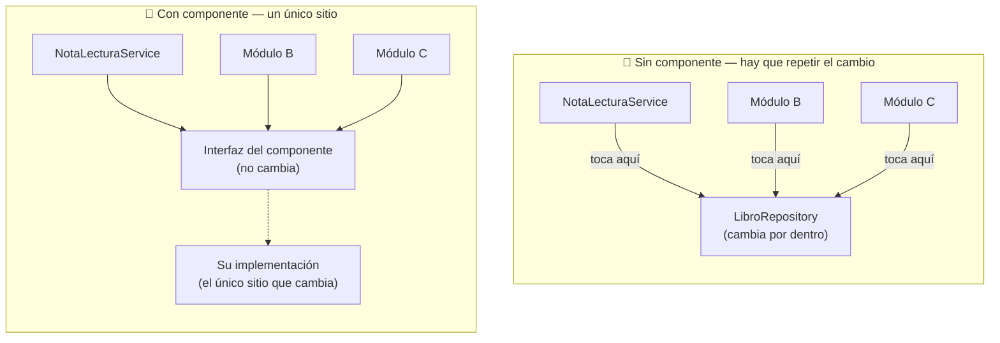
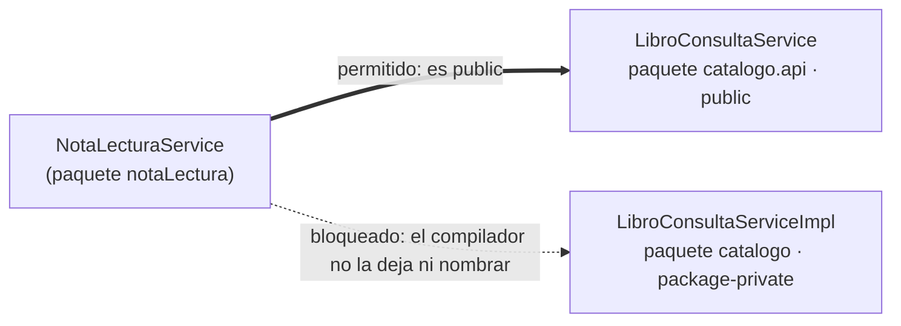

<a id="componentes-conectores-orm"></a>

# 🧩 1. Componentes

Último tema del módulo. Todo lo que has construido hasta ahora — repositorios, servicios, controladores — lo vas a mirar ahora bajo una óptica distinta: la de **componente**. Vas a identificar un problema que ya tienes en tu propio código desde el Tema 3, y resolverlo construyendo un componente con un contrato explícito — primero en una dirección, con PostgreSQL (Actividad 4.1), y después exactamente con el mismo molde en la dirección contraria, con MongoDB (Actividad 4.2).

---

## 🧩 Qué es la programación orientada a componentes

Piensa en el cargador de tu móvil. Lo enchufas a cualquier teléfono con el mismo conector y funciona: no necesitas saber qué circuitos tiene dentro, ni el teléfono necesita saber qué marca de cargador es. Si se estropea, compras otro con el mismo conector y todo sigue igual, sin tocar el teléfono para nada. Lo único que importa es el conector — la forma, el voltaje que da—; cómo convierte la electricidad por dentro es indiferente para quien lo usa.

!!! info "Idea clave"
    Un **componente** de software es la misma idea aplicada a código: una pieza autocontenida, con una responsabilidad concreta, que expone un **contrato público** — lo único que hace falta conocer para usarla — sin que quien la usa necesite saber cómo resuelve ese trabajo por dentro. Igual que el teléfono no sabe, ni le importa, qué hay dentro del cargador.

Ya usas componentes, sin haberlos llamado así todavía. Cada `@Service`, cada `@Repository` que has escrito en este módulo es uno: una pieza que hace una cosa concreta (gestionar libros, hablar con la base de datos...), que otras clases usan sin saber ni necesitar saber cómo está construida por dentro. Eso es, en esencia, la **programación orientada a componentes**: construir la aplicación ensamblando piezas autocontenidas y reutilizables, cada una con una responsabilidad clara y un **contrato público** — lo único que hace falta conocer para usarla, nunca cómo resuelve esa responsabilidad por dentro.

Ese contrato no siempre es una interfaz Java separada — depende de qué tipo de pieza sea:

| Pieza | ¿Interfaz separada de su implementación? | Cuál es el contrato |
|---|---|---|
| `@Service` normal (`LibroService`) | No | Sus propios métodos públicos — la clase concreta hace de contrato, nadie la va a sustituir por otra |
| `@Repository` (`LibroRepository`) | Sí, y la genera Spring por ti | La interfaz `JpaRepository` que extiendes (lo ves en detalle en "Nivel 1", más abajo) |
| El patrón que construyes hoy | Sí, la escribes tú a propósito | Una interfaz aparte, con la implementación oculta detrás |

A un componente se le asocian, además, varias características que vienen de una época anterior a Spring — la de los **JavaBeans** y los primeros entornos de desarrollo visuales, donde se construían programas arrastrando piezas ya hechas (un botón, una tabla) sobre un lienzo, sin escribir código para colocarlas, y ajustando su comportamiento desde un panel de opciones. No hace falta que hayas visto nada parecido — esas herramientas son anteriores a que empezaras a programar —, pero el vocabulario que dejaron sigue siendo el que se usa hoy, con su equivalente en Spring:

| Concepto (época JavaBeans) | Qué significa | Su equivalente hoy, en Spring Boot |
|---|---|---|
| **Propiedades** | Valores configurables del componente, ajustables sin tocar su código | Campos configurables de un bean — por ejemplo, el `corePoolSize` de un `TaskExecutor` |
| **Eventos** | Acciones que el componente dispara, a las que otros reaccionan sin que el primero los conozca | `ApplicationEventPublisher` + `@TransactionalEventListener`, que ya has construido en Programación de Servicios y Procesos |
| **Persistencia/serialización** | Guardar y recuperar el estado del propio componente | Poco relevante aquí: tus componentes (`@Service`) no suelen guardar estado propio, delegan en el repositorio |
| **Empaquetado** | Distribuir el componente para que otros lo usen sin ver su código fuente | Una dependencia añadida a tu `pom.xml` — un `.jar` que usas sin ver ni un archivo `.java` de dentro |

Lo único que cambia de verdad es quién ensambla las piezas: antes lo hacía el propio IDE, al arrastrarlas sobre el lienzo; ahora lo hace Spring, leyendo tus anotaciones (`@Service`, `@Autowired`...) y montando el objeto completo por ti.

### Ventajas e inconvenientes

Como cualquier decisión de diseño, programar por componentes trae ventajas claras, pero no es gratis:

| Ventajas | Inconvenientes |
|---|---|
| Reutilización — la misma pieza sirve en varios sitios | Más interfaces que mantener |
| Sustituibilidad — cambias la implementación sin tocar quien la usa | Más indirección — seguir el flujo de código cuesta un poco más |
| Pruebas aisladas — pruebas cada pieza por separado | |
| División del trabajo — cada componente, una responsabilidad | |

**Indirección** significa que, para ver qué hace de verdad un método, ya no basta con mirar una sola clase: primero encuentras la interfaz que se llama, y luego tienes que buscar por separado cuál es su implementación real — un salto más que si llamaras directamente a la clase concreta. Es el precio de la sustituibilidad: ganas poder cambiar la implementación sin tocar quien la usa, pero a cambio, seguir el rastro del código a mano cuesta un poco más.

---

## 📚 La progresión de "componente", con la librería

### Herramientas de desarrollo de componentes

Aquí no aplica una herramienta visual de arrastrar y soltar — no tiene sentido en un proyecto backend, sin interfaz gráfica. La "herramienta" en este contexto es **Spring** en sí mismo: vía `@Service`, `@Repository`, `@Component` y la inyección con `@RequiredArgsConstructor`, es Spring quien gestiona el ciclo de vida y el ensamblado de los componentes de tu aplicación.

### Nivel 1: un repositorio, ya es un componente

```java
public interface LibroRepository extends JpaRepository<Libro, Long> {
}
```

En su forma más básica, `LibroRepository` ya es un "componente con conector a base de datos": una interfaz que Spring implementa y gestiona por ti — se declara una vez (`private final LibroRepository libroRepository;`) y se reutiliza donde haga falta, sin que nadie que lo use necesite saber cómo genera Spring esa implementación por debajo.

### Nivel 2: cuando un repositorio no basta

Recuerda `NotaLecturaService`, del Tema 3: para comprobar que un libro existe antes de tocar Mongo, inyecta `LibroRepository` directamente. Fíjate en que el problema no es "inyectar un repositorio" en general — `NotaLecturaService` también inyecta `NotaLecturaRepository`, el suyo propio, y eso no tiene nada de malo. El problema es cruzar la frontera hacia el repositorio de **otro módulo**: `LibroRepository` pertenece al catálogo, no a notas de lectura.

```java
// NotaLecturaService, tal y como lo dejaste en el Tema 3
private final LibroRepository libroRepository;

public List<NotaLecturaResponseDTO> findByLibroId(Long libroId) {
    if (!libroRepository.existsById(libroId)) {
        throw new ResponseStatusException(HttpStatus.NOT_FOUND, "Libro no encontrado en el catálogo");
    }
    // ...
}
```

Funciona, pero acopla el módulo de notas de lectura a un detalle muy interno del módulo del catálogo: su repositorio JPA concreto. Imagina un cambio concreto, nada rebuscado: mañana el catálogo decide dejar de borrar libros de verdad, y pasa a marcarlos como `activo = false` (**borrado lógico**, para poder recuperarlos si alguien se equivoca al borrar).

| | Antes | Después del borrado lógico |
|---|---|---|
| Cómo se comprueba "el libro existe" | `libroRepository.existsById(libroId)` | `libroRepository.existsByIdAndActivoTrue(libroId)` |

Esa decisión es solo cosa del catálogo. Pero si `NotaLecturaService` inyecta `LibroRepository` directamente, alguien tiene que acordarse de ir también a ese módulo —que no tiene nada que ver con cómo el catálogo decide borrar sus libros— y cambiar la llamada ahí.

Multiplica eso por cada módulo que inyecte `LibroRepository` directamente, y un cambio interno del catálogo se convierte en un cambio que hay que repetir por toda la aplicación:



En "Sin componente", cada módulo apunta directamente a lo que cambia — tres sitios que tocar. En "Con componente", todos apuntan a una interfaz que no cambia nunca; el único que se entera del cambio es su implementación, oculta detrás. Este es exactamente el problema que resuelve un componente bien diseñado: exponer solo un contrato mínimo, sin decir cómo se decide por dentro, y esconder todo lo demás detrás. Así se construye uno, paso a paso:

### Construyendo el componente: interfaz + implementación oculta

La solución es una interfaz pequeña, pensada para que otros módulos la usen, con una implementación que sí conoce los detalles pero permanece oculta. Antes de ver el código, dos modificadores de Java que hacen todo el trabajo aquí:

| Modificador | ¿Quién puede ver y usar la clase? |
|---|---|
| `public` | Cualquier clase, de cualquier paquete, con solo importarla |
| *(sin modificador — package-private)* | Solo las clases que viven en su mismo paquete |

El contrato, en un paquete `api` — pensado para lo que otros módulos SÍ pueden ver — lleva `public`, a propósito: quieres que cualquier módulo lo importe y lo use.

```java
public interface LibroConsultaService {
    boolean existeLibro(Long libroId);
}
```

Su implementación, en cambio, va en el paquete del catálogo, no en `api` — y fíjate en que la clase **no lleva `public`**: es *package-private*, así que solo el propio paquete `catalogo` puede verla y usarla. Ningún otro módulo puede ni siquiera nombrarla.

```java
@Service
@RequiredArgsConstructor
class LibroConsultaServiceImpl implements LibroConsultaService {

    private final LibroRepository libroRepository;

    @Override
    public boolean existeLibro(Long libroId) {
        return libroRepository.existsById(libroId);
    }
}
```

Así queda repartida la visibilidad entre los tres paquetes implicados:



`NotaLecturaService`, desde su propio paquete, puede importar y usar `LibroConsultaService` sin ningún problema — es `public`, para eso está. Pero no tiene ninguna forma de escribir `LibroConsultaServiceImpl` en su código: el compilador ni se lo permite, porque esa clase no existe para nadie fuera de `catalogo`.

!!! warning "Un error fácil de cometer: la implementación dentro de `api`"
    Si `LibroConsultaServiceImpl` viviera en `catalogo.api`, junto a la interfaz, el `package-private` dejaría de proteger nada: cualquier módulo que ya importa ese paquete para usar la interfaz vería también la implementación, porque estaría en el mismo paquete. El `package-private` solo cumple su función si la implementación vive en el paquete "normal" (`catalogo`), separado de `api` — la interfaz es lo único que sale de ahí.

`NotaLecturaService` pasa a depender solo de la interfaz, nunca de `LibroRepository` ni de la clase que la implementa:

```java
// NotaLecturaService, ahora
private final LibroConsultaService libroConsultaService;

public List<NotaLecturaResponseDTO> findByLibroId(Long libroId) {
    if (!libroConsultaService.existeLibro(libroId)) {
        throw new ResponseStatusException(HttpStatus.NOT_FOUND, "Libro no encontrado en el catálogo");
    }
    // ...
}
```

### Probar el componente en aislamiento

Recuerda la ventaja de "pruebas aisladas" de la tabla del principio de este apartado: `LibroConsultaServiceImpl` depende de una única pieza, `LibroRepository`, inyectada por constructor, así que puedes probar su lógica sin arrancar Spring y sin ninguna base de datos real — basta con sustituir esa dependencia por un doble de prueba. **Mockito** es la librería que lo hace, con el mismo principio que ya conoces de `@MockitoBean` en tus tests de controller (Tema 1): sustituir una dependencia por un doble controlado, solo que aquí ni siquiera hace falta levantar el contexto de Spring — el objeto se construye a mano, en el propio test.

- `@ExtendWith(MockitoExtension.class)`: activa Mockito para esta clase de test, sin ningún contenedor de Spring de por medio — mucho más rápido que un `@SpringBootTest`.
- `@Mock`: crea el doble de prueba de `LibroRepository` — un objeto que se comporta como el repositorio real, pero cuya respuesta decides tú, línea a línea.
- `@InjectMocks`: crea la instancia real de `LibroConsultaServiceImpl` que quieres probar, e inyecta automáticamente los `@Mock` declarados por su constructor — el mismo mecanismo de inyección que usa Spring en producción, solo que aquí lo hace Mockito, a mano, solo para este test.

```java
@ExtendWith(MockitoExtension.class)
class LibroConsultaServiceImplTest {

    @Mock
    private LibroRepository libroRepository;

    @InjectMocks
    private LibroConsultaServiceImpl libroConsultaService;

    @Test
    void existeLibro_DebeDevolverTrue_CuandoExiste() {
        when(libroRepository.existsById(1L)).thenReturn(true);

        assertTrue(libroConsultaService.existeLibro(1L));
    }
}
```

`when(libroRepository.existsById(1L)).thenReturn(true)` es la parte que "programa" el doble de prueba: le dices exactamente qué debe devolver cuando alguien lo llame con ese argumento concreto, sin que haya ninguna base de datos real respondiendo por detrás.

### Sustituibilidad, hecha concreta

El escenario del borrado lógico de más arriba es la ventaja de **sustituibilidad** de la tabla de este apartado, hecha concreta: el módulo de notas de lectura nunca se entera de cómo cambia el catálogo por dentro, solo sigue llamando a la misma interfaz. Con `LibroConsultaService` ya construido, esto es lo que de verdad cambia el día que llegue ese borrado lógico:

| | Ficheros a tocar |
|---|---|
| **Con** el componente (`LibroConsultaService`) | Solo `LibroConsultaServiceImpl` |
| **Sin** el componente (cada módulo inyectando `LibroRepository` directo) | Cada módulo que inyecte `LibroRepository` — `NotaLecturaService`, y cualquier otro que hiciera lo mismo |

Vas a construir exactamente este mismo patrón sobre tu propio proyecto en la Actividad 4.1, con `Videojuego`/`Review` en lugar de `Libro`/`NotaLectura`.

---

## 🍃 El mismo patrón, en la otra dirección

Hasta ahora, quien pregunta es `notaLectura` y quien responde es el catálogo (`LibroConsultaService`). El problema también se plantea al revés: `LibroResponseDTO` quiere mostrar la puntuación media de las notas de lectura de cada libro — pero esa información vive en MongoDB, no en PostgreSQL, y `LibroService` no debería tener que saber que Mongo existe siquiera.

!!! example "Un cambio concreto, del mismo tipo que el borrado lógico"
    Mañana decides que las notas de lectura marcadas como spam (un campo `moderado` nuevo en `NotaLectura`) no deben contar en la media. Si `LibroService` inyectara `NotaLecturaRepository` directamente y calculara la media él mismo, tendría que enterarse de ese campo — un detalle de moderación interno de otro módulo, sobre un motor que ni siquiera es el suyo. Con el componente de por medio, ese cambio se queda contenido dentro de `NotaLecturaConsultaServiceImpl`: `LibroService` sigue llamando a `puntuacionMediaDe(libroId)` exactamente igual, sin enterarse de nada.

Se resuelve con exactamente el mismo molde, solo que ahora la interfaz vive en el módulo de notas de lectura:

```java
public interface NotaLecturaConsultaService {
    double puntuacionMediaDe(Long libroId);
}
```

```java
@Service
@RequiredArgsConstructor
class NotaLecturaConsultaServiceImpl implements NotaLecturaConsultaService {

    private final NotaLecturaRepository notaLecturaRepository;

    @Override
    public double puntuacionMediaDe(Long libroId) {
        return notaLecturaRepository.findByLibroId(libroId).stream()
                .mapToInt(NotaLectura::getPuntuacion)
                .average()
                .orElse(0.0);
    }
}
```

`LibroService` inyecta `NotaLecturaConsultaService` —la interfaz, nunca `NotaLecturaRepository` ni la clase que la implementa— para rellenar ese campo nuevo de `LibroResponseDTO`. Ningún módulo es "el importante" al que los demás preguntan: cualquiera de los dos puede exponer un contrato hacia el otro, según quién necesite qué dato — y da igual qué motor de persistencia haya detrás de cada uno, el molde es el mismo.

Se prueba en aislamiento exactamente igual que `LibroConsultaServiceImpl` más arriba: `@Mock` sobre `NotaLecturaRepository`, `@InjectMocks` sobre `NotaLecturaConsultaServiceImpl`, sin arrancar Spring ni tocar MongoDB para nada — mismo patrón de Mockito, solo cambian los nombres.

Vas a replicar este mismo componente sobre tu propio proyecto en la Actividad 4.2, con `ReviewsConsultaService`: expuesto desde `reviews` hacia `catalogo`, con la puntuación media de las reseñas de un videojuego.

---

## ✅ Ideas clave

??? tip "Abrir resumen"

    - Un **componente** es una pieza autocontenida y reutilizable, con una responsabilidad y un contrato público que oculta su implementación.
    - El origen histórico son los JavaBeans; en Spring Boot, el equivalente son los **beans gestionados por inyección de dependencias**.
    - Ventajas: reutilización, sustituibilidad, pruebas aisladas, división del trabajo. Inconveniente: más interfaces e indirección.
    - Spring (`@Service`/`@Repository`/`@Component` + inyección) ES la "herramienta de desarrollo de componentes" en este contexto — no hay paleta visual.
    - Un `JpaRepository` ya es un componente básico; una interfaz + implementación oculta (`LibroConsultaService`/`LibroConsultaServiceImpl`) es el siguiente nivel: contrato en `api`, implementación oculta, desacoplamiento real entre módulos.
    - El problema no es inyectar un repositorio — es inyectar el repositorio de **otro módulo**. Usar tu propio repositorio directamente (`NotaLecturaRepository` desde `NotaLecturaService`) nunca ha sido el problema.
    - La implementación tiene que vivir fuera de `api`, en el paquete "normal" — si estuviera dentro de `api` junto a la interfaz, el `package-private` no protegería nada.
    - Un componente con una única dependencia se presta a un test aislado con Mockito: `@Mock` sustituye esa dependencia por un doble de prueba, `@InjectMocks` construye la clase real inyectándoselo — sin arrancar Spring, mucho más rápido que un `@SpringBootTest`.
    - El mismo patrón funciona en cualquier dirección y con cualquier motor detrás: `NotaLecturaConsultaService` expone MongoDB hacia el catálogo, igual que `LibroConsultaService` expone PostgreSQL hacia notas de lectura — ningún módulo es "el importante" al que los demás preguntan.
