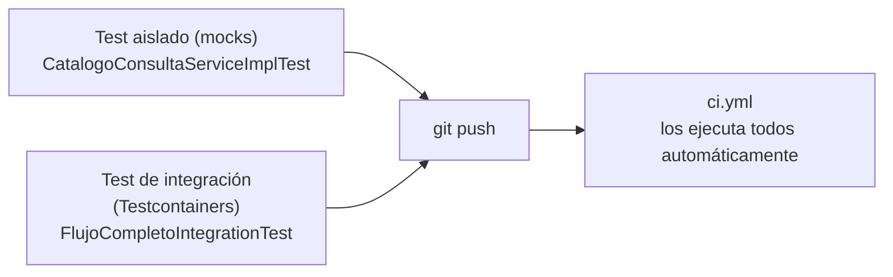

<a id="integracion-y-pruebas"></a>

# 🧩 3. Integración y pruebas

Último apartado del módulo. Responde a la pregunta que da sentido a todo lo anterior: ¿cómo sabes que tus componentes, diseñados por separado, funcionan bien **juntos**?

---

## 🧪 Probar un componente aislado — repaso

Ya has construido este tipo de test en la Actividad 4.1:

```java
@ExtendWith(MockitoExtension.class)
class CatalogoConsultaServiceImplTest {
    @Mock
    private VideojuegoRepository videojuegoRepository;

    @InjectMocks
    private CatalogoConsultaServiceImpl catalogoConsultaService;

    @Test
    void existeVideojuego_DebeDevolverTrue_CuandoExiste() {
        when(videojuegoRepository.existsById(1L)).thenReturn(true);
        assertTrue(catalogoConsultaService.existeVideojuego(1L));
    }
}
```

Un test aislado con mocks prueba la **lógica interna** de un componente, sin ninguna base de datos real de por medio — rapidísimo, perfecto para verificar el comportamiento de una pieza concreta.

---

## 🔗 Probar la integración de todo junto

Un mock no miente, pero sí puede estar equivocado: cuando escribes `when(videojuegoRepository.existsById(1L)).thenReturn(true)`, ese valor lo has puesto tú a mano — el test no ha comprobado que `VideojuegoRepository` se comporte así de verdad, solo que tu código reacciona bien *si* se comporta así.

Piensa en el borrado en cascada que construiste en la Actividad 3.2: al borrar un videojuego, `VideojuegoService` publica un evento, RabbitMQ lo transporta, y un listener asíncrono lo recoge para borrar la reseña correspondiente en MongoDB. Un test aislado de esa pieza, con mocks, podría comprobar "si me llega el evento, borro la reseña correctamente" — pero nunca demuestra que el evento **llega**. Si el listener no estuviera bien registrado, o la cola tuviera un nombre distinto al que espera quien publica, el mock ni se enteraría: no hay ningún RabbitMQ real de por medio con el que ese fallo pueda ocurrir. Para comprobar que la cadena completa —evento, cola, listener, borrado— funciona de verdad, hace falta un test que hable con un RabbitMQ real, no con una promesa sobre cómo se comporta.

El test de integración más completo no mockea nada — levanta **todos** los motores reales que usa la aplicación, simultáneamente, en contenedores Docker, solo para la duración del test. En tu GameVault, eso significa tres motores a la vez: PostgreSQL (catálogo), MongoDB (reseñas) y RabbitMQ (la cadena de eventos de arriba):

```java
@Testcontainers
class FlujoCompletoIntegrationTest {

    @Container
    @ServiceConnection
    static PostgreSQLContainer<?> postgres = new PostgreSQLContainer<>("postgres:16-alpine");

    @Container
    @ServiceConnection
    static MongoDBContainer mongodb = new MongoDBContainer("mongo:7");

    @Container
    @ServiceConnection
    static RabbitMQContainer rabbitmq = new RabbitMQContainer("rabbitmq:3-management");

    // ...
}
```

Los tres son los servicios reales de tu `docker-compose.yaml`, arrancados solo para este test (si mañana añadieras un motor más, se sumaría aquí igual, un `@Container` por servicio). Este es el ejemplo definitivo de "probar la integración de componentes reales, no mockeados": que el catálogo, las reseñas y el borrado en cascada — construidos por separado, en temas distintos — funcionen correctamente cuando se integran juntos, en la aplicación completa. Es exactamente el test que vas a construir en la Actividad 4.3.

### Cuándo conviene cada tipo de test

| | Test aislado (mocks) | Test de integración (Testcontainers) |
|---|---|---|
| Qué prueba | La lógica interna de un componente | Que varios componentes reales trabajan bien juntos |
| Velocidad | Muy rápido | Más lento (levanta contenedores reales) |
| Cuándo usarlo | Casos de la lógica de un componente concreto (validaciones, cálculos) | Flujos completos, entre módulos, entre motores distintos |

Ninguno sustituye al otro — un proyecto real necesita ambos niveles.

---

## 📝 "Documentar" un componente

Tienes los componentes construidos y las dos capas de test verificándolos. Queda una pregunta más: dentro de unos meses, o el día que otra persona se sume al proyecto, ¿cómo va a saber qué garantiza cada componente sin tener que leer la implementación entera?

Documentar un componente no es sobre todo escribir un documento externo aparte — es que el propio test, con nombres descriptivos (`existeVideojuego_DebeDevolverTrue_CuandoExiste`) y una estructura clara, deje constancia de qué comportamiento se espera y en qué condiciones. El test bien escrito **es** la documentación viva del componente — se actualiza sola cuando el comportamiento cambia (si no, el test falla y te avisa).

---

## 🔄 El círculo se cierra: CI

Tener los dos niveles de test escritos no basta si nadie los ejecuta en el momento justo — un test que solo corres cuando te acuerdas es, tarde o temprano, un test que no corres el día que más falta te hace (justo antes de un cambio que rompe algo). La solución no es disciplina personal, es automatización.

El concepto de integración continua lo viste al principio del módulo (Tema 0); el `.github/workflows/ci.yml` de tu propio GameVault lo construiste después, sobre el proyecto real, en la Actividad 1.3 de PSP. Ese workflow ejecuta tus tests automáticamente en cada `push` — sin que tengas que acordarte de lanzarlos tú a mano cada vez:



Ahora mismo ese workflow solo ejecuta los tests que terminan en `ControllerTest` — un filtro que tenía sentido cuando ese era el único tipo de test del proyecto, pero que se queda corto en cuanto construyes tests de otro tipo, como los aislados y de integración de este tema. Lo arreglas en la Actividad 4.3, cerrando el círculo del todo: que el CI ejecute, sin excepción, cualquier test que construyas de aquí en adelante.

---

## ✅ Ideas clave

??? tip "Abrir resumen"

    - Un test **aislado** (mocks) prueba la lógica interna de un componente; un test de **integración** (Testcontainers) prueba que varios componentes reales funcionan bien juntos.
    - Un test de integración completo levanta todos los motores reales de la aplicación (PostgreSQL, MongoDB, RabbitMQ...) simultáneamente en Docker, solo para el test.
    - Ninguno de los dos niveles de test sustituye al otro — un proyecto real necesita ambos.
    - "Documentar" un componente es, sobre todo, que el propio test (nombre + estructura) deje claro qué se espera de él.
    - El `ci.yml` de tu GameVault (construido en la Actividad 1.3 de PSP) ejecuta tus tests automáticamente en cada `push` — su filtro actual solo recoge los de controller, y lo amplías en la Actividad 4.3 para que cubra también los aislados y los de integración.
