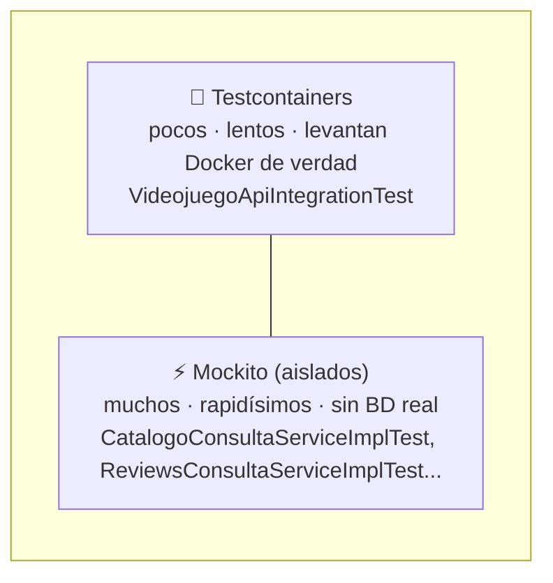

<a id="integracion-y-pruebas"></a>

# 🧩 2. Integración y pruebas

Último apartado del módulo. Responde a la pregunta que da sentido a todo lo anterior: ¿cómo sabes que tus componentes, diseñados por separado, funcionan bien **juntos**?

---

## 🧪 Probar un componente aislado — repaso

Ya has construido este tipo de test en la Actividad 4.1, con el mismo patrón que viste en la teoría de "Componentes":

```java
@ExtendWith(MockitoExtension.class)
class LibroConsultaServiceImplTest {
    @Mock
    private LibroRepository libroRepository;

    @InjectMocks
    private LibroConsultaServiceImpl libroConsultaService;

    @Test
    void existeLibro_DebeDevolverTrue_CuandoExiste() {
        when(libroRepository.existsById(1L)).thenReturn(true);
        assertTrue(libroConsultaService.existeLibro(1L));
    }
}
```

Un test aislado con mocks prueba la **lógica interna** de un componente, sin ninguna base de datos real de por medio — rapidísimo, perfecto para verificar el comportamiento de una pieza concreta.

---

## 🔗 Probar la integración de todo junto

Un mock no miente, pero sí puede estar equivocado: cuando escribes `when(libroRepository.existsById(1L)).thenReturn(true)`, ese valor lo has puesto tú a mano — el test no ha comprobado que `LibroRepository` se comporte así de verdad, solo que tu código reacciona bien *si* se comporta así.

Piensa en el borrado en cascada del apartado anterior: al borrar un `Libro`, alguien tiene que llamar a `deleteByLibroId` sobre `NotaLecturaRepository` en el momento justo — y ese "alguien" es un evento que viaja por RabbitMQ hasta un listener asíncrono. Un test aislado de ese listener, con mocks, podría comprobar "si me llega el evento, borro las notas correctamente" — pero nunca demuestra que el evento **llega**. Si el listener no estuviera bien registrado, o la cola tuviera un nombre distinto al que espera quien publica, el mock ni se enteraría: no hay ningún RabbitMQ real de por medio con el que ese fallo pueda ocurrir. Para comprobar que la cadena completa —evento, cola, listener, borrado— funciona de verdad, hace falta un test que hable con un RabbitMQ real, no con una promesa sobre cómo se comporta.

!!! question "Antes de seguir, predícelo"
    Tu proyecto tiene, sobre ese mismo exchange, **dos** colas independientes escuchando el borrado: la del registro de actividad (Programación de Servicios y Procesos, todas las `videojuego.*`) y la del borrado en cascada de reseñas (solo `videojuego.eliminado`). Imagina que un día, sin querer, dejas la segunda cola enlazada a la routing key equivocada — `videojuego.actualizado` en vez de `videojuego.eliminado`. ¿Lo detectaría un test aislado (con mocks) del listener de borrado? ¿Y un test de integración con RabbitMQ real? Razona tu respuesta antes de seguir leyendo.

    El test aislado **no** lo detectaría — sigue probando "si me llega el evento, borro bien", y eres tú quien decide a mano que le llega. El test de integración **sí**: publicas el evento de borrado de verdad, y el listener nunca se dispara, porque su binding real no coincide con la routing key que se publica. Es exactamente el tipo de error de configuración que solo un RabbitMQ real puede delatar.

El test de integración más completo no mockea nada — levanta **todos** los motores reales que usa la aplicación, simultáneamente, en contenedores Docker, solo para la duración del test. Sobre el ejemplo de `Libro`, eso significa tres motores a la vez: PostgreSQL (catálogo), MongoDB (notas de lectura) y RabbitMQ (la cadena de eventos de arriba):

```java
@Testcontainers
class LibroFlujoCompletoIntegrationTest {

    @Container
    @ServiceConnection
    static PostgreSQLContainer<?> postgres = new PostgreSQLContainer<>("postgres:16-alpine");

    @Container
    @ServiceConnection
    static MongoDBContainer mongodb = new MongoDBContainer("mongo:7");

    @Container
    @ServiceConnection
    static RabbitMQContainer rabbitmq = new RabbitMQContainer("rabbitmq:3-management");

    // ...
}
```

Los tres son los servicios reales del `docker-compose.yml` de este proyecto de ejemplo, arrancados solo para este test (si mañana añadieras un motor más, se sumaría aquí igual, un `@Container` por servicio). Este es el ejemplo definitivo de "probar la integración de componentes reales, no mockeados": que el catálogo, las notas de lectura y el borrado en cascada — construidos por separado, en temas distintos — funcionen correctamente cuando se integran juntos, en la aplicación completa.

!!! tip "En tu proyecto no partes de cero"
    No vas a crear una clase nueva desde cero en la Actividad 4.3: tu `VideojuegoApiIntegrationTest` (Actividad 2.3) ya levanta PostgreSQL desde el principio, y ya has ido añadiendo MongoDB y RabbitMQ a esa misma clase en actividades posteriores, a medida que `VideojuegoService` empezó a necesitarlos de verdad. Los tres motores reales ya están conectados ahí — en la 4.3 **amplías** ese test con el flujo que todavía falta (reseñas y borrado en cascada), no lo repites.

### La pirámide de tests

No es casualidad que tu proyecto tenga muchos tests aislados y solo un puñado de tests de integración — es la forma recomendada de repartirlos, y tiene un nombre: la **pirámide de tests**. Cuantos más motores reales levanta un test, más lento y más caro es de mantener, así que conviene tener pocos de esos y muchos del tipo barato y rápido:



Un proyecto sano se parece a esta pirámide: base ancha de tests aislados que revisan cada pieza suelta en milisegundos, y una punta estrecha de tests de integración que revisan, más despacio, que esas piezas encajan de verdad. Si lo hicieras al revés —todo con Testcontainers, nada con mocks— cada `push` tardaría minutos en verificarse y encontrar un fallo concreto sería más lento, porque un test de integración que falla no te dice **qué** pieza exacta ha fallado, solo que algo en la cadena no encaja.

### Cuándo conviene cada tipo de test

| | Test aislado (mocks) | Test de integración (Testcontainers) |
|---|---|---|
| Qué prueba | La lógica interna de un componente | Que varios componentes reales trabajan bien juntos |
| Velocidad | Muy rápido | Más lento (levanta contenedores reales) |
| Cuándo usarlo | Casos de la lógica de un componente concreto (validaciones, cálculos) | Flujos completos, entre módulos, entre motores distintos |
| Si falla, ¿qué te dice? | Exactamente qué pieza y qué caso concreto | Que algo en la cadena no encaja — toca investigar cuál |

Ninguno sustituye al otro — un proyecto real necesita ambos niveles, en esa proporción: muchos aislados, pocos de integración.

---

## 📝 "Documentar" un componente

Tienes los componentes construidos y las dos capas de test verificándolos. Queda una pregunta más: dentro de unos meses, o el día que otra persona se sume al proyecto, ¿cómo va a saber qué garantiza cada componente sin tener que leer la implementación entera?

Documentar un componente no es sobre todo escribir un documento externo aparte — es que el propio test, con nombres descriptivos (`existeLibro_DebeDevolverTrue_CuandoExiste`) y una estructura clara, deje constancia de qué comportamiento se espera y en qué condiciones. El test bien escrito **es** la documentación viva del componente — se actualiza sola cuando el comportamiento cambia (si no, el test falla y te avisa).

---

## 🔄 El círculo se cierra: CI

Tener los dos niveles de test escritos no basta si nadie los ejecuta en el momento justo — un test que solo corres cuando te acuerdas es, tarde o temprano, un test que no corres el día que más falta te hace (justo antes de un cambio que rompe algo). La solución no es disciplina personal, es automatización.

El concepto de integración continua lo viste al principio del módulo (Tema 0); el `.github/workflows/ci.yml` de tu propio GameVault lo construiste después, sobre el proyecto real, en la Actividad 1.3 de PSP. Ese workflow ejecuta tus tests automáticamente en cada `push` — sin que tengas que acordarte de lanzarlos tú a mano cada vez:


Ahora mismo ese workflow solo ejecuta los tests que terminan en `ControllerTest` — un filtro que tenía sentido cuando ese era el único tipo de test del proyecto, pero que se queda corto en cuanto construyes tests de otro tipo, como los aislados y de integración de este tema. Lo arreglas en la Actividad 4.3, cerrando el círculo del todo: que el CI ejecute, sin excepción, cualquier test que construyas de aquí en adelante.

---

## ✅ Ideas clave

??? tip "Abrir resumen"

    - Un test **aislado** (mocks) prueba la lógica interna de un componente; un test de **integración** (Testcontainers) prueba que varios componentes reales funcionan bien juntos.
    - Un test de integración completo levanta todos los motores reales de la aplicación (PostgreSQL, MongoDB, RabbitMQ...) simultáneamente en Docker, solo para el test.
    - La pirámide de tests: muchos aislados (rápidos, baratos) en la base, pocos de integración (lentos, más caros) en la punta — ninguno de los dos niveles sustituye al otro.
    - "Documentar" un componente es, sobre todo, que el propio test (nombre + estructura) deje claro qué se espera de él.
    - El `ci.yml` de tu GameVault (construido en la Actividad 1.3 de PSP) ejecuta tus tests automáticamente en cada `push` — su filtro actual solo recoge los de controller, y lo amplías en la Actividad 4.3 para que cubra también los aislados y los de integración.
