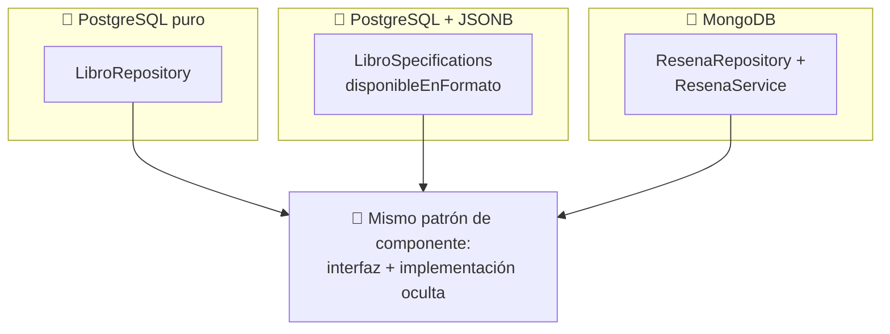

<a id="componentes-bd-objeto-doc"></a>

# 🧩 2. Componentes con BD objeto-relacional y documental

Este apartado no introduce ninguna tecnología nueva — es un repaso integrador. Revisitas JSONB (Tema 3) y MongoDB (Tema 4), esta vez con la óptica de "componente" que acabas de conocer en el apartado anterior.

---

## 🐘 JSONB, visto como componente

```java
public interface LibroRepository extends JpaRepository<Libro, Long>, JpaSpecificationExecutor<Libro> {
}
```

`LibroRepository`, junto con `LibroSpecifications` (donde vive `disponibleEnFormato`, con su `jsonb_exists`), es un **componente que encapsula el acceso a una base de datos objeto-relacional**. Quien lo consume — `LibroService`, o cualquier otro service que pudiera necesitarlo — no tiene ni que saber que, por debajo de una de sus Specifications, hay una función nativa de PostgreSQL como `jsonb_exists`. Esa complejidad queda completamente contenida dentro del componente; fuera de él, es "una Specification más".

---

## 🍃 MongoDB, visto como componente

```java
public ResenaResumenDTO getResumenByLibroId(Long libroId) {
    List<Resena> resenas = resenaRepository.findByLibroId(libroId);
    long totalResenas = resenas.size();
    double puntuacionMedia = resenas.stream().mapToInt(Resena::getPuntuacion).average().orElse(0.0);
    return new ResenaResumenDTO(libroId, totalResenas, puntuacionMedia);
}
```

`ResenaRepository` + `ResenaService` es, bajo esta misma óptica, un "componente que gestiona información almacenada en una base de datos documental nativa". `getResumenByLibroId` es un buen ejemplo de lógica que vive **dentro** del componente — la agregación en memoria (contar, calcular la media) — sin que el controlador que lo llama necesite saber cómo se ha calculado ese resumen, ni que por debajo hay documentos de MongoDB en vez de filas de una tabla.

---

## 🪞 Cerrando el círculo: el mismo patrón, tres motores distintos

Ya conoces `CatalogoConsultaService` del apartado anterior (y lo construirás en la Actividad 5.1) — interfaz en un paquete `api`, implementación oculta. Ese mismo patrón se puede aplicar, exactamente igual, para exponer desde el módulo de reseñas hacia otros módulos un componente análogo — por ejemplo, `ResenasConsultaService`, con algo como "cuántas reseñas tiene un libro". Es justo lo que vas a construir en la Actividad 5.2.



La idea de síntesis de este apartado: **da igual la tecnología de persistencia** — relacional puro, objeto-relacional con JSONB, documental con MongoDB — el patrón de "componente con interfaz clara + implementación oculta" es el mismo en los tres casos. La interfaz nunca necesita saber qué motor hay por debajo. Eso, precisamente, es el objetivo de este tema: no una tecnología concreta, sino una forma de diseñar que funciona igual de bien sobre cualquiera de ellas.

---

## ✅ Ideas clave

??? tip "Abrir resumen"

    - `LibroRepository`/`LibroSpecifications` es un componente que encapsula acceso objeto-relacional (JSONB) — su complejidad interna (`jsonb_exists`) queda oculta a quien lo usa.
    - `ResenaRepository`/`ResenaService` es un componente que encapsula acceso documental (MongoDB) — su lógica de agregación vive dentro, no en el controlador.
    - El mismo patrón (interfaz + implementación oculta) de `CatalogoConsultaService` se puede replicar sobre cualquier motor — es lo que vas a hacer con `ResenasConsultaService`.
    - La tecnología de persistencia por debajo es irrelevante para el patrón de componente — esa independencia es exactamente la idea clave de este tema.
